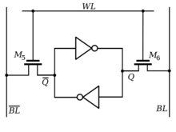
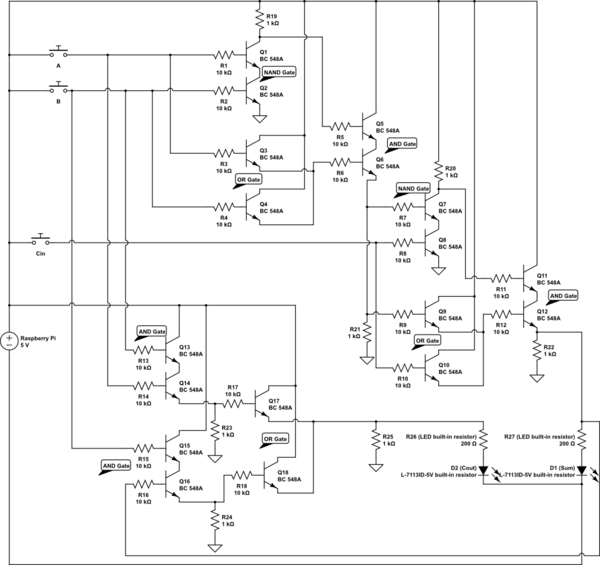

# 인간 뇌의 뉴런 갯수가 300억개 CPU 트랜지스터 갯수가 300억개.

다음 그림은 신호의 상태를 유지하는 플립플롭으로 최소 4개의 트랜지스터를 필요로 한다. 1비트 정보를 유지하려면 4개의 트랜지스터가 필요하다는 얘기가 되겠다.

우리 뇌는 정보만 유지하는 것이 아니라 생각도 해야 한다. 더하는 것을 가산기라고 한다. 1비트 전가산기는 14개의 트랜지스터를 필요로 한다. 1비트 + 1비트를 더하는데 최소 14개의 트랜지스터를 필요로 한다.

