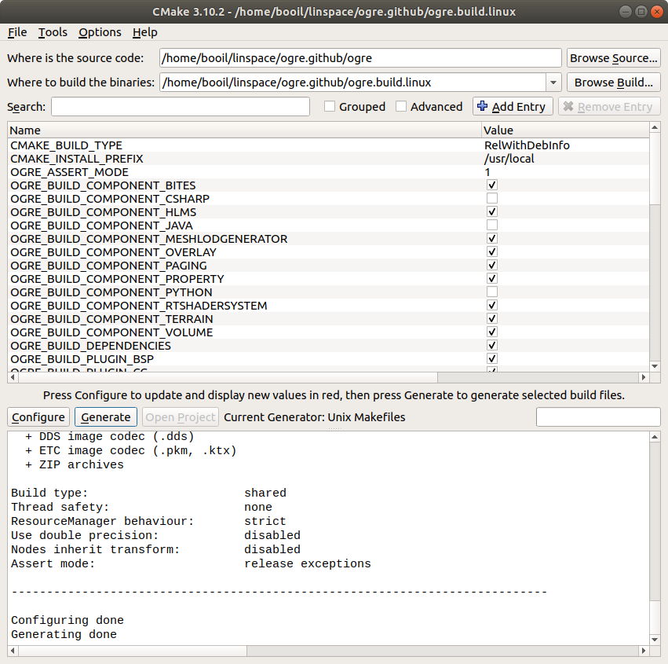

# Installation of Ogre on Ubuntu 18.04 LTS

*2019년 3월 5일*

## 준비

### CMake

CMake를 설치 합니다.

```sh
sudo apt update
sudo apt install cmake cmake-gui
```

의존 패키지를 설치 합니다.

```sh
sudo apt install libgles2-mesa-dev libxt-dev libxaw7-dev
sudo apt install nvidia-cg-toolkit libsdl2-dev doxygen
sudo apt install zlib1g-dev
sudo apt install zziplib-bin
sudo apt install libsdl2-dev
sudo apt install doxygen
```

**Freetype 2 설치**

[Freetype Development](https://www.freetype.org/developer.html)

```sh
git clone git://git.sv.nongnu.org/freetype/freetype2.git
```

빌드 방법은 `freetype2/docs/INSTALL.UNIX` 참조.

## 구성

`cmake-gui`를 실행하여 소스 경로와 빌드 경로를 지정합니다. 그리고 "Configure" 버튼을 눌러서 구성하고, 변수를 변경한 다음, "Generate" 버튼을 눌러서 타겟 파일을 생성합니다.



Makefile이 생성되면 터미널에서 해당 폴더로 이동하여 빌드 합니다.

```sh
make
```

설치합니다.

```sh
sudo make install
```

## 참조

- [Ogre Official documentation](https://ogrecave.github.io/ogre/api/latest/building-ogre.html)

  

  