# Stero 3D reconstruction with opencv

## Camera calibration

### Basic

오늘날 저렴한 pinhole camera는 이미지에 많은 왜곡을 일으킵니다. 두 가지 주요 distortion은 radial distortion과 tangential distortion입니다.

radial distortion때문에 직선이 곡선으로 보입니다. 그 효과는 이미지 중심에서 멀어 질수록 더 커집니다. 예를 들어 체스보드의 두 가장자리가 빨간색 선으로 표시되어 있는 한 이미지가 아래에 나와 있습니다. 그러나 경계가 직선이 아니고 빨간색 선과 일치하지 않는 것을 볼 수 있습니다. 예상되는 모든 직선이 돌출되어 있습니다. 자세한 내용은 distortion (optics)을 방문하십시오.


이 distortion은 다음과 같이 표현됩니다.
$$
\begin{aligned}
x_\text{distorted} &= x(1 + k_1r^2 k_2r^4 + k_3r^6) \\
y_\text{distorted} &= y(1 + k_1r^2 k_2r^4 + k_3r^6)
\end{aligned}
$$
마찬가지로, 또 다른 distortion은 이미지 촬영 렌즈가 image plane과 완벽하게 평행하게 정렬되지 않기 때문에 발생하는 tangential distortion입니다. 따라서 이미지의 일부 영역이 예상보다 가깝게 보일 수 있습니다. 그것은 다음과 같이 표현됩니다 :
$$
\begin{aligned}
x_\text{distorted} &= x + [2p_1xy + p_2 (r^2 + 2x^2)] \\
y_\text{distorted} &= y + [p_1(r^2 + 2y^2) + 2p_2 xy] \\
\end{aligned}
$$
즉, distortion coefficients로 알려진 5 개의 파라미터를 찾아야 합니다.
$$
\begin{aligned}
\text{distortion coefficients} = 
\begin{pmatrix}
k_1 & k_2 & p_1 & p_2 & k_3
\end{pmatrix}
\end{aligned}
$$
이 외에도 카메라의 내장 및 외장 매개변수와 같은 몇 가지 정보를 더 찾아야합니다. 내장 매개 변수는 카메라에만 적용됩니다. focal length $(f_x, f_y)$, optical center $(c_x, c_y)$ 등과 같은 정보가 포함됩니다. Camera matrix라고도합니다. 그것은 카메라에만 의존하기 때문에 일단 계산되면 미래의 목적을 위해 저장 될 수 있습니다. 그것은 $3\times3$ 매트릭스로 표현됩니다 :
$$
\begin{aligned}
\text{camera matrix} =
\begin{bmatrix}
f_x & 0 & c_x \\
0 & f_y & c_y \\
0 & 0 & 1 \\
\end{bmatrix}
\end{aligned}
$$
Extrinsic parameters는 3D상의 점의 좌표를 좌표계로 변환하는 rotation 및 translation vector에 해당합니다.

스테레오 어플리케이션의 경우 이러한 distortion을 먼저 수정해야 합니다. 이러한 모든 매개변수를 찾으려면 잘 정의 된 패턴 (예 : 체스보드)의 샘플 이미지를 제공해야합니다. 우리는 그것에 몇 가지 구체적인 점(체스보드의 사각형 모서리)을 발견합니다. 우리는 실세계 공간에서의 그것의 좌표를 알고 있고 우리는 그것의 좌표를 알고 있습니다. 이 데이터를 사용하면 배경에서 일부 수학적 문제를 해결하여 왜곡 계수를 얻을 수 있습니다. 그것이 전체 이야기의 요약입니다. 더 나은 결과를 얻으려면 최소한 10 가지 테스트 패턴이 필요합니다.

### Code

위에서 언급했듯이 카메라 교정을 위해 최소한 10 가지 테스트 패턴이 필요합니다. OpenCV에는 체스보드 이미지 (`samples/cpp/left01.jpg ~ left14.jpg` 참조)가 제공되므로 활용할 것입니다. 이해를 위해서 체스보드의 한 이미지만 고려하십시오. camera calibration에 필요한 중요한 입력 데이터는 3D real world point set와 해당 2D image point set입니다. 2D image point는 이미지에서 쉽게 찾을 수 있습니다. (이 image point는 두 개의 검정색 사각형이 체스보드에서 서로 닿는 위치 입니다).

real world space에서 3D point은 어떻습니까? 이러한 이미지는 static camera에서 가져오고 체스보드는 다른 위치와 방향에 배치됩니다. 그래서 $(X, Y, Z)$ 값을 알아야 합니다. 그러나 간단히 말하면, 체스보드는 이 $XY$ 평면에 고정되어 있다고 말할 수 있습니다 (따라서 항상 $Z = 0$). 따라서 카메라는 그에 따라 이동되었습니다. 이 고려 사항은 $X, Y$ 값만 찾을 수있게 해줍니다. 이제 $X, Y$ 값에 대해 포인트를 $(0,0), (1,0), (2,0), \dots$으로 전달하면 포인트의 위치를 나타낼 수 있습니다. 이 경우 우리가 얻는 결과는 체스보드 정사각형 크기의 척도가 됩니다. 그러나 사각형 크기 $(30mm)$를 알고 $(0,0), (30,0), (60,0), \dots$과 같은 값을 전달할 수 있습니다. 결과는 $mm$단위 입니다. (이 경우 이미지를 찍지 않았으므로 정사각형 크기를 알지 못하므로 정사각형 크기로 전달합니다.)

3D points를 object points이라고하고 2D image point을 image points라고 합니다.

### Setup

따라서 체스보드에서 패턴을 찾으려면 `cv2.findChessboardCorners()` 함수를 사용합니다. $8\times8$ 그리드, $5\times5$ 그리드 등 어떤 패턴의 패턴을 전달할 필요가 있습니다.이 예에서는 $7\times6$ 그리드를 사용합니다. (일반적으로 체스보드는 $8\times8 $ 사각형과 $7\times7$ 내부 코너를가집니다.) 패턴을 얻으면 `True`가 될 모서리 점과 `retval`을 반환합니다. 이 코너는 순서대로 배치됩니다 (왼쪽에서 오른쪽, 위에서 아래로)

> ### See also
>
> 이 기능은 모든 이미지에서 필요한 패턴을 찾지 못할 수도 있습니다. 따라서 좋은 옵션은 코드를 작성하여 카메라를 시작하고 각 프레임에서 필요한 패턴을 확인하는 것입니다. 패턴을 얻은 다음 모서리를 찾아 목록에 저장하십시오. 또한 다음 프레임을 읽기 전에 일정 간격을 두어 체스보드를 다른 방향으로 조정할 수 있습니다. 필요한 수의 좋은 패턴이 얻어 질 때까지 이 과정을 계속하십시오. 여기에 제공된 예에서도 14 개의 이미지가 제공되는지, 얼마나 많은 이미지가 좋은지는 확실하지 않습니다. 그래서 우리는 모든 이미지를 읽고 좋은 것을 가져갑니다.
>
> 체스보드 대신에 원형 그리드를 사용할 수 있지만, 패턴을 찾으려면 `cv2.findCirclesGrid()` 함수를 사용하십시오. 원형 그리드를 사용할 때 이미지 수가 적다는 것이 알려져 있습니다.

```python
import numpy as np
import cv2
import glob

# termination criteria
criteria = (cv2.TERM_CRITERIA_EPS + cv2.TERM_CRITERIA_MAX_ITER, 30, 0.001)

# prepare object points, like (0,0,0), (1,0,0), (2,0,0) ....,(6,5,0)
objp = np.zeros((6*7,3), np.float32)
objp[:,:2] = np.mgrid[0:7,0:6].T.reshape(-1,2)

# Arrays to store object points and image points from all the images.
objpoints = [] # 3d point in real world space
imgpoints = [] # 2d points in image plane.

images = glob.glob('*.jpg')
for fname in images:
	img = cv2.imread(fname)
    gray = cv2.cvtColor(img,cv2.COLOR_BGR2GRAY)

    # Find the chess board corners
    ret, corners = cv2.findChessboardCorners(gray, (7,6),None)

    # If found, add object points, image points (after refining them)
    if ret == True:
        objpoints.append(objp)

        cv2.cornerSubPix(gray,corners,(11,11),(-1,-1),criteria)
        imgpoints.append(corners)

        # Draw and display the corners
        cv2.drawChessboardCorners(img, (7,6), corners2,ret)
        cv2.imshow('img',img)
        cv2.waitKey(500)

cv2.destroyAllWindows()
```

그 위에 그려진 패턴을 가진 하나의 이미지가 아래에 나와 있습니다 :


### Calibration

이제 우리는 물체 점과 우리가 교정 할 준비가 된 이미지 점을 가지고 있습니다. 이를 위해 `cv2.calibrateCamera()` 함수를 사용합니다. camera matrix, distortion coefficient, rotation 및 translation vector 등을 반환합니다.

```python
ret, mtx, dist, rvecs, tvecs = cv2.calibrateCamera(objpoints, imgpoints, gray.shape[::-1],None,None)
```

### Undistortion

우리는 우리가 시도한 것을 가지고 있 습니다. 이제 우리는 이미지를 가져 와서 그것을 distortion 시킬 수 있습니다. OpenCV는 두 가지 방법으로 제공됩니다. 그러나 그 전에는 `cv2.getOptimalNewCameraMatrix()`를 사용하여 free scaling parameter를 기반으로 camera matrix을 수정할 수 있습니다. scale parameter `alpha = 0`의 경우, 불필요한 최소의 픽셀을 가지는 distortion이 없는 이미지를 돌려줍니다. 따라서 image corner에서 일부 픽셀을 제거 할 수도 있습니다. `alpha = 1`이면 모든 픽셀이 검정색 이미지가 약간 남습니다. 또한 결과를 자르기 위해 사용할 수있는 이미지 ROI를 반환합니다.

이제, 우리는 새로운 이미지를 찍습니다 (이 경우 `left12.jpg`이게이 장의 첫 번째 이미지입니다).

```python
img = cv2.imread('left12.jpg')
h, w = img.shape[:2]
newcameramtx, roi = cv2.getOptimalNewCameraMatrix(mtx,dist,(w,h),1,(w,h))
```

#### 1. Using `cv2.undistort()`

이것은 shortest path입니다. 함수를 호출하고 위에서 얻은 ROI를 사용하여 결과를 자릅니다.

```python
# undistort
dst = cv2.undistort(img, mtx, dist, None, newcameramtx)

# crop the image
x,y,w,h = roi
dst = dst[y:y+h, x:x+w]
cv2.imwrite('calibresult.png',dst)
```

#### 2. Using remapping

이것은 curved path입니다. 먼저 왜곡 된 이미지에서 왜곡되지 않은 이미지까지 매핑 기능을 찾습니다. 그런 다음 다시 매핑 기능을 사용합니다.

```python
# undistort
mapx,mapy = cv2.initUndistortRectifyMap(mtx,dist,None,newcameramtx,(w,h),5)
dst = cv2.remap(img,mapx,mapy,cv2.INTER_LINEAR)

# crop the image
x,y,w,h = roi
dst = dst[y:y+h, x:x+w]
cv2.imwrite('calibresult.png',dst)
```

두 방법 모두 동일한 결과를 제공합니다. 아래 결과를보십시오 :


결과에서 모든 가장자리가 직선임을 알 수 있습니다.

이제는 `Numpy` (`np.savez, np.savetxt` 등)의 쓰기 함수를 사용하여 camera matrix 및  distortion coefficients를 저장하여 향후 사용할 수 있습니다.

### Re-projection error

Re-projection error는 발견된 매개변수가 얼마나 정확한지에 대한 좋은 예측을 제공합니다. 가능한 한 `0`에 가까워야 합니다. instrinsic, distortion, rotation 및 translation 행렬이 주어지면 먼저 `cv2.projectPoints()`를 사용하여 object points을 impage points 으로 변환합니다. 그런 다음 우리가 transformation과 corner finding algorithm 사이의 absolute norm을 계산합니다. average error를 찾기 위해 모든 calibration images에 대해 errors의 arithmetical mean을 계산합니다.

```
mean_error = 0
for i in xrange(len(objpoints)):
    imgpoints2, _ = cv2.projectPoints(objpoints[i], rvecs[i], tvecs[i], mtx, dist)
    error = cv2.norm(imgpoints[i],imgpoints2, cv2.NORM_L2)/len(imgpoints2)
    tot_error += error

print "total error: ", mean_error/len(objpoints)
```

## Pose Estimation

### Basic

Camera calibration에 대한 마지막 세션에서 camera matrix, distortion coefficient  등을 찾았습니다. 패턴 이미지가 주어지면 위의 정보를 활용하여 pose를 계산하거나 회전하는 방법과 같이 공간에 객체가 있는 방법을 계산할 수 있습니다. planar object의 경우 $Z = 0$이라고 가정하면 문제는 카메라가 공간에 배치되어 패턴 이미지를 볼 수 있게 됩니다. 따라서 우리가 물체가 어떻게 공간에 있는지 알게 되면 3D 효과를 시뮬레이트 하기 위해 2D diagram을 그려 볼 수 있습니다. 그것을 하는 방법을 보겠습니다.

우리의 문제는 체스보드의 첫 번째 구석에 3D 좌표축 ($X, Y, Z$ 축)을 그려야 한다는 것입니다. $X$ 축은 파란색, $Y$ 축은 녹색, $Z$ 축은 빨간색으로 표시됩니다. 결과적으로 $Z$ 축은 체스보드 평면에 수직인 것처럼 느껴져야 합니다.

먼저, 이전 보정 결과에서 camera matrix 및 coefficient를 로드 합니다.

```python
import cv2
import numpy as np
import glob

# Load previously saved data
with np.load('B.npz') as X:
    mtx, dist, _, _ = [X[i] for i in ('mtx','dist','rvecs','tvecs')]
```

이제 체스보드 (`cv2.findChessboardCorners()`를 사용하여 얻음)의 코너와 3D 축을 그리는 axis points을 사용하는 `draw` 함수를 작성해 보겠습니다.

```python
def draw(img, corners, imgpts):
    corner = tuple(corners[0].ravel())
    img = cv2.line(img, corner, tuple(imgpts[0].ravel()), (255,0,0), 5)
    img = cv2.line(img, corner, tuple(imgpts[1].ravel()), (0,255,0), 5)
    img = cv2.line(img, corner, tuple(imgpts[2].ravel()), (0,0,255), 5)
    return img
```

그런 다음 앞의 경우처럼 termination criteria, object points (체스보드의 코너 3D 점) 및 axis points 만듭니다. axis points은 축을 그리기 위한 3D space point입니다. 우리는 길이 3의 축을 그립니다 (단위는 그 크기에 따라 조정 한 이후로 체스의 정사각형 크기를 기준으로 합니다). 따라서 우리의 $X$ 축은 (0,0,0)에서 (3,0,0)까지 그려지고 $Y$ 축에 대해서도 마찬가지입니다. $Z$ 축의 경우 $(0,0,0)$에서 $(0,0, -3)$까지 그려집니다. 여기서 음수는 카메라쪽으로 그려짐을 나타냅니다.

```python
criteria = (cv2.TERM_CRITERIA_EPS + cv2.TERM_CRITERIA_MAX_ITER, 30, 0.001)
objp = np.zeros((6*7,3), np.float32)
objp[:,:2] = np.mgrid[0:7,0:6].T.reshape(-1,2)

axis = np.float32([[3,0,0], [0,3,0], [0,0,-3]]).reshape(-1,3)
```

이제 평상시처럼 각 이미지를 로드합니다. $7\times 6$ 그리드 검색을 하고 발견되면 하위 픽셀로 수정합니다. 그런 다음 rotation 및 translation을 계산하기 위해 `cv2.solvePnPRansac()` 함수를 사용합니다. 일단 우리가 이러한 transformation matrix을 사용하면 우리는 그것들을 사용하여 axis points를 image plane에 투영합니다. 간단히 말하면, 3D 공간에서 $(3,0,0), (0,3,0), (0,0,3)$ 각각에 해당하는 image plane상의 점을 찾습니다. 일단 우리가 그것들을 얻으면 우리는 `draw ()` 함수를 사용하여 첫 번째 모서리에서부터이 점들 각각으로 선을 그립니다. 완료되었습니다!

```python
for fname in glob.glob('left*.jpg'):
    img = cv2.imread(fname)
    gray = cv2.cvtColor(img,cv2.COLOR_BGR2GRAY)
    ret, corners = cv2.findChessboardCorners(gray, (7,6),None)

    if ret == True:
        corners2 = cv2.cornerSubPix(gray,corners,(11,11),(-1,-1),criteria)

        # Find the rotation and translation vectors.
        rvecs, tvecs, inliers = cv2.solvePnPRansac(objp, corners2, mtx, dist)

        # project 3D points to image plane
        imgpts, jac = cv2.projectPoints(axis, rvecs, tvecs, mtx, dist)

        img = draw(img,corners2,imgpts)
        cv2.imshow('img',img)
        k = cv2.waitKey(0) & 0xff
        if k == 's':
            cv2.imwrite(fname[:6]+'.png', img)

cv2.destroyAllWindows()
```

아래에서 몇 가지 결과를보십시오. 각 축은 3 개의 사각형입니다.


#### Render a cube

당신이 큐브를 그리기를 원한다면, 다음과 같이 `draw()` 함수와 `axis points`를 수정하십시오.

수정 된 `draw ()` 함수 :

```python
def draw(img, corners, imgpts):
    imgpts = np.int32(imgpts).reshape(-1,2)

    # draw ground floor in green
        img = cv2.drawContours(img, [imgpts[:4]],-1,(0,255,0),-3)

    # draw pillars in blue color
    for i,j in zip(range(4),range(4,8)):
        img = cv2.line(img, tuple(imgpts[i]), tuple(imgpts[j]),(255),3)

    # draw top layer in red color
    img = cv2.drawContours(img, [imgpts[4:]],-1,(0,0,255),3)

    return img
```

수정된 축 포인트. 그들은 3D 공간에서 큐브의 8개 코너입니다.

```python
axis = np.float32([[0,0,0], [0,3,0], [3,3,0], [3,0,0],
                   [0,0,-3],[0,3,-3],[3,3,-3],[3,0,-3] ])
```

그리고 아래의 결과를 보십시오 :


그래픽, 증강 현실 등에 관심이 있으시면 OpenGL을 사용하여 더 복잡한 그림을 렌더링 할 수 있습니다.

## Epipolar geometry

### Basic Concepts

pinhole camera를 사용하여 이미지를 찍을 때 중요한 정보, 즉 이미지의 깊이가 느슨합니다. 또는 3D에서 2D 로의 변환이기 때문에 카메라에서 이미지의 각 점까지의 거리가 어느 정도입니까? 따라서 이러한 카메라를 사용하여 깊이 정보를 찾을 수 있는지 여부는 중요한 질문입니다. 그리고 대답은 하나 이상의 카메라를 사용하는 것입니다. 우리의 눈은 스테레오 비전이라고하는 두 개의 카메라 (두 눈)를 사용하는 것과 비슷한 방식으로 작동합니다. 그럼이 분야에서 OpenCV가 제공하는 것을 살펴 봅시다. 

Depth image로 이동하기 전에 먼저 다중 뷰 형상의 몇 가지 기본 개념을 이해해 봅시다. 이 섹션에서는 epipolar geometry에 대해 다룰 것입니다. 동일한 장면의 이미지를 촬영하는 두 대의 카메라로 기본 설정을 보여주는 아래 이미지를 참조하십시오.


왼쪽 카메라 만 사용하는 경우 $\overline{OX}$ 의 모든 점이 이미지면의 동일한 점에 투영되므로 이미지에서 점 $x$에 해당하는 3D 점을 찾을 수 없습니다. 그러나 오른쪽 이미지도 고려하십시오. 이제 라인 $\overline{OX}$상의 다른 점들은 오른쪽 평면에서 다른 점 $x '$으로 투영됩니다. 따라서 이 두 이미지를 사용하여 정확한 3D 점을 삼각형화할 수 있습니다. 이것은 전체적인 생각입니다.

$\overline{OX}$에서 다른 점을 투영하면 오른쪽면에 선이 그려집니다 (선 $l'$). 점 $x$에 해당하는 epiline이라고합니다. 즉, 오른쪽 이미지에서 포인트 $x$를 찾으려면이 epilin을 따라 검색하십시오. 이 선상의 어딘가에 있어야합니다 (다른 이미지에서 일치하는 지점을 찾으려면 이 방법을 생각하면 전체 이미지를 검색 할 필요가 없고 에필린을 따라 검색하면되므로 더 나은 성능과 정확도를 얻을 수 있습니다). 이것을 epipolar contrant 라고합니다. 마찬가지로 모든 점에는 다른 이미지에 해당하는 epiline이 있습니다. $XOO'$평면을 Epipolar Plane이라고 합니다.

$O$와 $O'$는 카메라 중심입니다. 위의 설정에서 오른쪽 카메라 $O'$의 투영이 해당 지점의 왼쪽 이미지에 표시되는 것을 볼 수 있습니다. 그것은 epipole이라고합니다. epipole은 카메라 중심과 이미지 평면을 통한 선 교점입니다. 마찬가지로 $e'$는 왼쪽 카메라의 epipole입니다. 경우에 따라 이미지에서 epipole을 찾을 수 없거나 이미지 외부에 epipole을 배치 할 수 있습니다 (즉, 한 카메라는 다른 카메라를 보지 못합니다).

모든 epilines는 epipole을 통과합니다. 그래서 epipole의 위치를 찾기 위해 많은 epilines을 발견하고 교점을 찾을 수 있습니다.

그래서이 세션에서는 epipolar line과 epipole을 찾는 데 중점을 둡니다. 그러나 그것들을 찾으려면 Fundamental Matrix (F)와 Essential Matrix (E) 두 가지 성분이 더 필요합니다. 필수 매트릭스에는 변환 및 회전에 대한 정보가 포함되어 있습니다.이 정보는 전역 좌표계에서 첫 번째 카메라를 기준으로 두 번째 카메라의 위치를 나타냅니다. 아래 이미지를 참조하십시오.


그러나 우리는 픽셀 좌표로 수행되는 측정을 선호합니다. 기본 행렬에는 두 카메라의 내장 함수에 대한 정보 이외에 essential matrix와 동일한 정보가 포함되어 있으므로 두 카메라를 픽셀 좌표로 연결할 수 있습니다. (우리가 rectified images를 사용하고 초점 길이로 나눔으로써 포인트를 정규화한다면, $\mathbf F = \mathbf E$). 간단히 말하면, fundamental Matrix $\mathbf F$는 한 이미지의 한 점을 다른 이미지의 한 선 epiline에 매핑합니다. 이 값은 두 이미지의 일치 지점에서 계산됩니다. fundamental (8 점 알고리즘을 사용하는 동안)를 찾으려면 최소 8 점이 필요합니다. RANSAC을 사용하면 더 많은 포인트를 얻고 더 강력한 결과를 얻을 수 있습니다.

### Code

먼저 fundamental matrix를 찾기 위해 두 이미지 사이에 가능한 많은 일치를 찾아야합니다. 이를 위해 FLANN 기반 matcher 및 ratio test 와 함께 SIFT 기술자를 사용합니다.

```python
import cv2
import numpy as np
from matplotlib import pyplot as plt

img1 = cv2.imread('myleft.jpg',0)  #queryimage # left image
img2 = cv2.imread('myright.jpg',0) #trainimage # right image

sift = cv2.SIFT()

# find the keypoints and descriptors with SIFT
kp1, des1 = sift.detectAndCompute(img1, None)
kp2, des2 = sift.detectAndCompute(img2, None)

# FLANN parameters
FLANN_INDEX_KDTREE = 0
index_params = dict(algorithm = FLANN_INDEX_KDTREE, trees = 5)
search_params = dict(checks=50)

flann = cv2.FlannBasedMatcher(index_params, search_params)
matches = flann.knnMatch(des1, des2, k=2)

good = []
pts1 = []
pts2 = []

# ratio test as per Lowe's paper
for i, (m, n) in enumerate(matches):
    if m.distance < 0.8 * n.distance:
        good.append(m)
        pts2.append(kp2[m.trainIdx].pt)
        pts1.append(kp1[m.queryIdx].pt)
```

이제 우리는 두 이미지 모두에서 최상의 일치 목록을 얻었습니다. 기본 매트릭스를 찾아 보겠습니다.

```python
pts1 = np.int32(pts1)
pts2 = np.int32(pts2)
F, mask = cv2.findFundamentalMat(pts1,pts2,cv2.FM_LMEDS)

# We select only inlier points
pts1 = pts1[mask.ravel()==1]
pts2 = pts2[mask.ravel()==1]
```

다음으로 우리는 epiline을 찾는다. 첫 번째 이미지의 점에 해당하는 epiline이 두 번째 이미지에 그려집니다. 올바른 이미지를 언급하는 것이 중요합니다. 우리는 일련의 선을 얻습니다. 그래서 우리는 이 선들을 이미지 위에 그리는 새로운 함수를 정의합니다.

```python
def drawlines(img1,img2,lines,pts1,pts2):
''' img1 - image on which we draw the epilines for the points in img2
        lines - corresponding epilines '''
    r,c = img1.shape
    img1 = cv2.cvtColor(img1,cv2.COLOR_GRAY2BGR)
    img2 = cv2.cvtColor(img2,cv2.COLOR_GRAY2BGR)
    for r,pt1,pt2 in zip(lines,pts1,pts2):
        color = tuple(np.random.randint(0,255,3).tolist())
        x0,y0 = map(int, [0, -r[2]/r[1] ])
        x1,y1 = map(int, [c, -(r[2]+r[0]*c)/r[1] ])
        img1 = cv2.line(img1, (x0,y0), (x1,y1), color,1)
        img1 = cv2.circle(img1,tuple(pt1),5,color,-1)
        img2 = cv2.circle(img2,tuple(pt2),5,color,-1)
    return img1,img2
```

이제 우리는 두 이미지 모두에서 epiline을 찾고 그려 줍니다.

```python
# Find epilines corresponding to points in right image (second image) and
# drawing its lines on left image
lines1 = cv2.computeCorrespondEpilines(pts2.reshape(-1,1,2), 2,F)
lines1 = lines1.reshape(-1,3)
img5,img6 = drawlines(img1,img2,lines1,pts1,pts2)

# Find epilines corresponding to points in left image (first image) and
# drawing its lines on right image
lines2 = cv2.computeCorrespondEpilines(pts1.reshape(-1,1,2), 1,F)
lines2 = lines2.reshape(-1,3)
img3,img4 = drawlines(img2,img1,lines2,pts2,pts1)

plt.subplot(121),plt.imshow(img5)
plt.subplot(122),plt.imshow(img3)
plt.show()
```


왼쪽 이미지에서 모든 epilines이 이미지 외부의 한 지점에 수렴한다는 것을 알 수 있습니다. 그 모임 지점은 epipole입니다.

더 나은 결과를 얻으려면 해상도가 좋고 비평면이 많은 이미지를 사용해야합니다.

## Depth map from stereo image

마지막 세션에서 우리는 epipolar contraint 및 기타 관련 용어와 같은 기본 개념을 보았습니다. 우리는 또한 동일한 장면의 두 개의 이미지가있는 경우 직관적인 방식으로 심도있는 정보를 얻을 수 있음을 알았습니다. 아래는 직감을 증명하는 이미지와 몇 가지 간단한 수학 공식입니다.


(출처: opencv.org)

위 다이어그램에는 equivalent triangles이 포함되어 있습니다. equivalent equations을 작성하면 다음과 같은 결과가 나타납니다.
$$
\text{disparity} = x - x' = \frac{Bf}{Z}
$$
$x$ 및 $x'$는 3차원 장면의 점에 대응하는 이미지 평면 내의 점들과 그들의 카메라 중심간의 거리입니다. $B$는 우리가 알고있는 두 카메라 사이의 거리이고, $f$는 이미 알려진 카메라의 초점 거리입니다. 즉, 위의 식은 장면의 점 깊이가 해당 이미지 점과 카메라 중심점의 거리의 차이에 반비례한다고 말합니다. 따라서이 정보를 사용하여 이미지의 모든 픽셀의 깊이를 도출 할 수 있습니다.

따라서 두 이미지간에 일치하는 항목을 찾습니다. epiline constrant가 어떻게 이 작업을보다 빠르고 정확하게 수행하는지 보았습니다. 일단 그것이 일치를 발견하면, 그것은 불일치를 찾습니다. 우리가 OpenCV로 어떻게 할 수 있는지 보겠습니다.

### opencv Python code

```python
import numpy as np
import cv2
from matplotlib import pyplot as plt

imgL = cv2.imread('tsukuba_l.png',0)
imgR = cv2.imread('tsukuba_r.png',0)

stereo = cv2.StereoBM_create(numDisparities=16, blockSize=15)
disparity = stereo.compute(imgL,imgR)
plt.imshow(disparity,'gray')
plt.show()
```

## Epipolar Geometry

Epipolar geometry는 streo vision을 위한 geometry입니다. 3차원 공간에서 서로 다른 위치에 있는 한 쌍의 카메라가 3차원 공간의 한 점을 카메라의 센서에 투영하여 한 쌍의 이미지를 획득 하였을때, 이 한 쌍의 이미지 사이에는 여러가지 기하학적 관계가 있습니다. 이 기하학적 관계는 카메라가 pin-hole camera model에 의해 근사 될 수 있다는 가정에 기초하여 유도 됩니다.


[Epipolar geometry 사용 사례] 한 쌍의 카메라가 서로 다른 시점에서 동일한 장면을 찍고, epipolar geometry를 통해 한 쌍의 뷰사이의 관계를 설명할 수 있습니다. (그림출처: wikipedia.org)

아래 그림은 3차원 공간의 한 점 $\mathbf p$를 바라 보는 두 개의 pinhole camera를 나타냅니다.

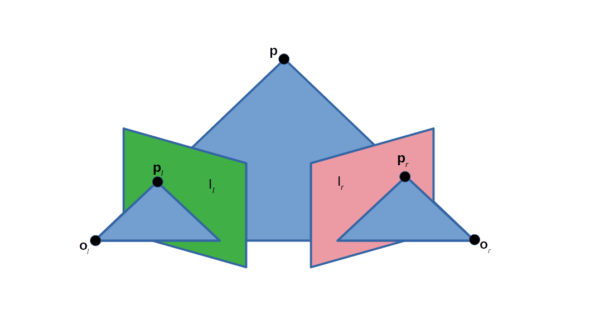

각 카메라는 3차원 공간에서 2차원 이미지를 캡처합니다. 이 3차원에서 2차원으로의 변환은 원근 투영 (perspective projection)이라고 하며 pin-hole camera model로 설명됩니다. 이 투영 작업은 초점 중심 $\mathbf o_l $과 $\mathbf o_r $을 통과하여 카메라에서 나오는 광선으로 모델링하는 것이 일반적입니다.

 (실제 카메라에서는 이미지 평면이 실제로 촛점 중심 바로 뒤에 있으며 렌즈의 초점 중심에 대해 대칭인 이미지를 생성합니다. 이 글에서는 대칭에 의해 변형되지 않는 이미지를 생성하기 위해 초점 이미지의 중심, 즉 각 카메라 렌즈의 광학 중심 앞에 가상 이미지 평면을 배치하여 단순화 합니다.)

 $\mathbf o_l$과 $\mathbf o_r$은 한 쌍의 카메라 렌즈의 중심을 나타냅니다. $\mathbf p$는 한 쌍의 카메라가 관심을 가지는 3차원 공간 상의 점을 나타냅니다. 점 $\mathbf p_l$과 $\mathbf p_r$은 점 $\mathbf p$의 이미지 평면 $I_l$과 $I_r$로의 투영입니다.

## Epipole (epipolar point)

카메라 렌즈의 optical center가 뚜렷하기 때문에 각 중심은 다른 카메라의 image plane으로 구별되는 점으로 투영됩니다. $\mathbf e_l$ 및 $\mathbf e_r$로 표시되는 이 한 쌍의 이미지 상의 점들을 epipole 또는 epipolar point 라고합니다.


## Base line

 각각의 image plane에서 epipole들 $\mathbf e_l$과 $\mathbf e_r$과 두 optical center $\mathbf o_l$과 $\mathbf o_r$모두 단일 3차원 라인에 있습니다. 3차원 공간상의 점 $\mathbf p$ 가 다른 위치 $\mathbf q$로 변경되더라도, 이 base line은 변경되지 않습니다.

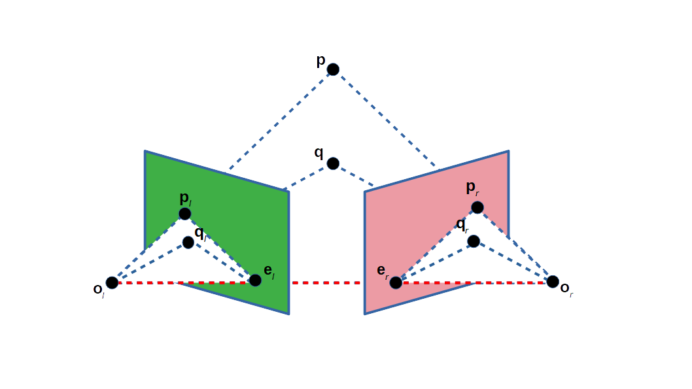

## Epiline (Epipolar line)

$\mathbf o_l - \mathbf p$ 라인은 카메라의 렌즈 optical center와 일직선 상에 있기 때문에 왼쪽 카메라에서 점 $\mathbf p_l$으로 보입니다. 그러나 오른쪽 카메라는 이 선을 image plane 위의 선으로 간주 됩니다. 오른쪽 카메라의 해당 선 $L_r$을 epiline 또는 epipoloar line이라고합니다. 대칭적으로, 오른쪽 카메라에 의해 점으로 보인 $\mathbf o_r - \mathbf p$ 라인은 왼쪽 카메라에 의해 epiline $L_l$로 보여집니다.

Epiline은 3차원 공간에서 점 $\mathbf p $의 위치의 함수이며, 즉 $\mathbf p $가 변하면 두 이미지 모두에서 epiline 세트가 생성됩니다. 3차원에서의 라인 $ \mathbf o_l - \mathbf p$ 가 렌즈 $\mathbf o_l $의 optical center을 통과하기 때문에, 우측 이미지의 대응하는 epiline은 epipole $\mathbf e_r $을 통과해야 합니다. (그리고 대응하여 좌측 이미지의 epline들에 대응 합니다). 한 이미지의 모든 epiline은 그 이미지의 epipole을 포함합니다. 사실, epipole을 포함하는 모든 선은 3차원 점 $\mathbf p $에서 파생 될 수 있기 때문에 epiline입니다.


## Epipolar plane

대안적인 시각화로서, epipoloar plane이라 불리는 평면을 형성하는 $\mathbf p $, $\mathbf o_l $ 및 $\mathbf o_r $ 점을 고려해 보겠습니다. Epipolar plane은 각 카메라의 image plane과 교차하는 선인 epiline을 교차합니다. 모든 epipolar plane과 epiline은 $\mathbf p$의 위치에 상관없이 epipole과 교차합니다.


## Epipolar constraint 와 triangulation

두 카메라의 상대적 위치를 알고 있다면 두 가지 중요한 관찰을 하게 됩니다.

- 투영 지점 $\mathbf p_l $이 알려지고, epiline $L_r $이 알려지고 점 $ \mathbf p $가 이 특정 epiline상에 있어야 하는 점 $\mathbf p_r $에서 오른쪽 이미지로 투영된다고 가정합니다. 이것은 한 이미지에서 관찰된 각 점에 대해 알려진 점의 다른 이미지에서 동일한 점이 관찰되어야 한다는 것을 의미합니다. 이것은 epipolar constraint를 제공합니다: 오른쪽 카메라 평면 $\mathbf p_r $의 $\mathbf p $의 투영은 $L_r $ epiline에 포함되어야 합니다. 또한 모든 점 $\mathbf p $는 $\mathbf o_l - \mathbf p_l $ 라인의 $\mathbf p_1, \mathbf p_2, \mathbf p_3$은 해당 제약 조건을 확인합니다. 즉, 두 점이 동일한 3차원 점에 해당하는지 테스트 할 수 있습니다. epipolar constraint는 essential matrix 또는 두 카메라 간의 fundamental matrix도 기술 할 수 있습니다.
- $\mathbf p_l$ 및 $\mathbf p_r$ 점이 알려지면 그 projection line도 알 수 있습니다. 두 이미지 점이 동일한 3차원 점 $\mathbf p$에 해당하면 투영선이 $\mathbf p$에서 정확히 교차해야 합니다. 즉, $\mathbf p$는 두 이미지 점의 좌표에서 계산할 수 있습니다. 이 과정을 triangulation이라고 합니다.


## 기초

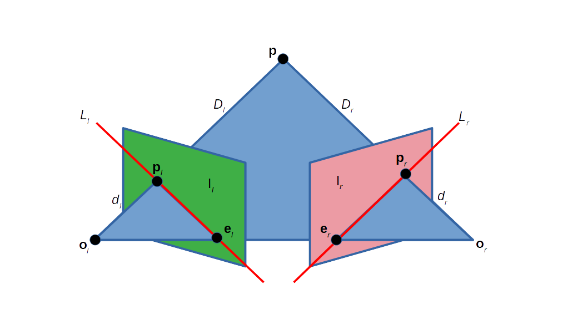

$\mathbf o_l$과 $\mathbf o_r$은 이동벡터 $\mathbf t=(\mathbf o_r - \mathbf o_l)$과 회전행렬 $\mathbf R$ 의 관계가 있습니다. $\mathbf p$가 두 이미지 평면 $I_l$과 $I_r$에 투영되는 각각의 점 $\mathbf p_l$과 $\mathbf p_r$의 관계는 다음에 의해 주어집니다.
$$
\begin{aligned}
\mathbf p_r = \mathbf R (\mathbf p_l - \mathbf t)
\end{aligned}
$$
원근투영의 일반적인 식은 3차원상의 점과 그 점의 투영 사이의 관계를 정의합니다.
$$
\begin{aligned}
\mathbf P_l = \frac{f_l}{Z_l} \mathbf p_l, &&
\mathbf P_r = \frac{f_r}{Z_r} \mathbf p_r\\
\end{aligned}
$$


## Essential matrix $\mathbf E$

epipolar plane의 식은 다음과 같은 동일 평면(conplane)상 조건에 의해 주어집니다 (월드 좌표계가 왼쪽 카메라와 정렬되었다고 가정).

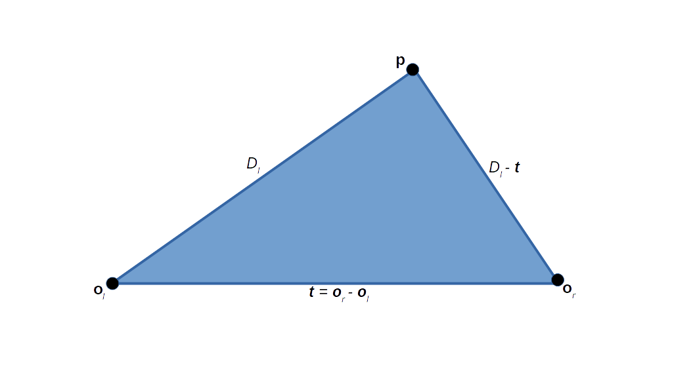
$$
\begin{aligned}
(D_l - \mathbf t)^\top (\mathbf t \times D_l) = 0
\end{aligned}
$$
이미 알고 있는 $D_r = \mathbf R(D_l - \mathbf t)$를 대입하면:
$$
\begin{aligned}
(\mathbf R^\top D_r)^\top \mathbf t \times D_l = 0
\end{aligned}
$$
이것을 행렬곱셈으로 표현하면:
$$
\begin{aligned}
(\mathbf R D_r)^\top \mathbf S D_l = 0
\end{aligned}
$$
또는
$$
\begin{aligned}
D_r^\top \mathbf R \mathbf S P_l = 0
\end{aligned}
$$
여기서 $\mathbf S$는 
$$
\begin{aligned}
\mathbf S =
\begin{bmatrix}
0 & -\mathbf t_z & \mathbf t_y \\
\mathbf t_z & 0 & - \mathbf t_x \\
-\mathbf t_y & \mathbf t_x & 0 \\
\end{bmatrix}
\end{aligned}
$$
 행렬 $\mathbf S$는 항상 rank deficient 한다. 예를 들어 $\text{rank}(\mathbf S) = 2$.

위 식은 다시 다음처럼 쓸수 있습니다.
$$
\begin{aligned}
D_r^\top \mathbf E D_l = 0
\end{aligned}
$$
또는
$$
\begin{aligned}
d_r^\top \mathbf E d_l = 0
\end{aligned}
$$
여기서 $\mathbf E = \mathbf R \mathbf S$를 essential matrix라고 합니다.

식 $ d_r^\top \mathbf E d_l = 0 $은 점과 epiline의 매핑을 정의 합니다.

## Structured

### The geometry of passive stereo

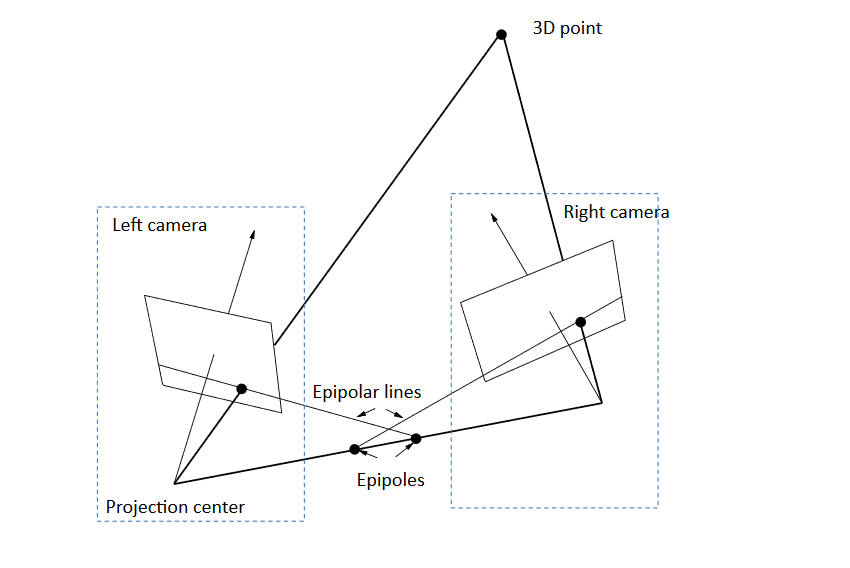

### The geometry of active streo

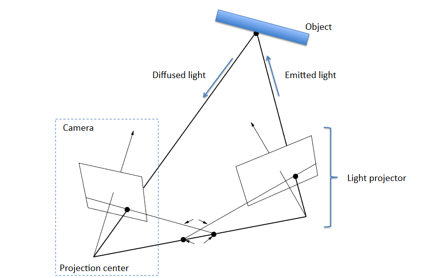

#### Foreshortening

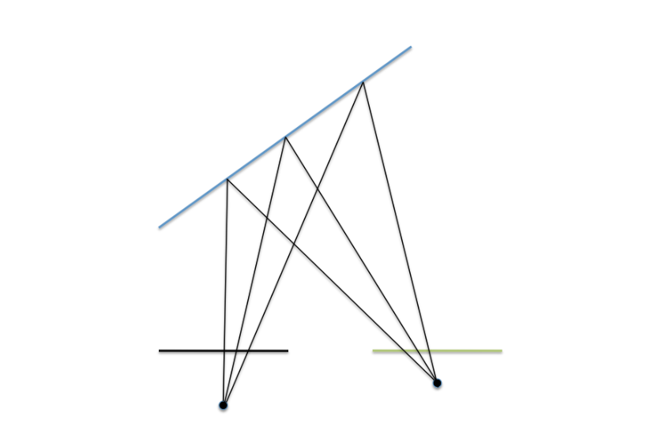

#### Discontinuties

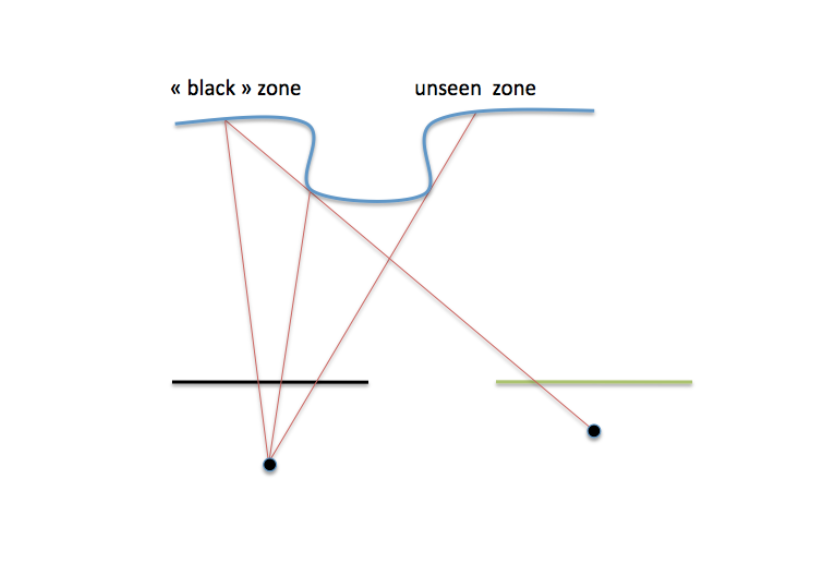

#### Clutter

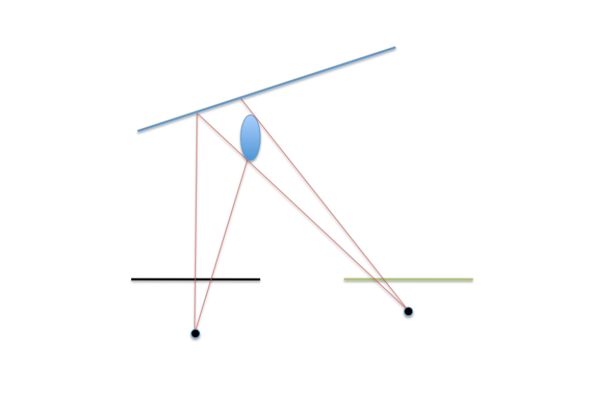

#### Refletivity

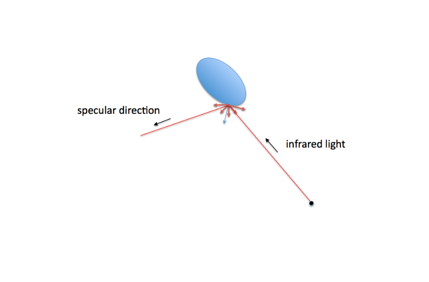

#### IR-camera and projector geometry and calibration

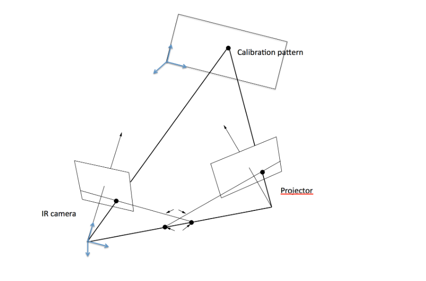

#### Geometry of Kinect (Rectified)

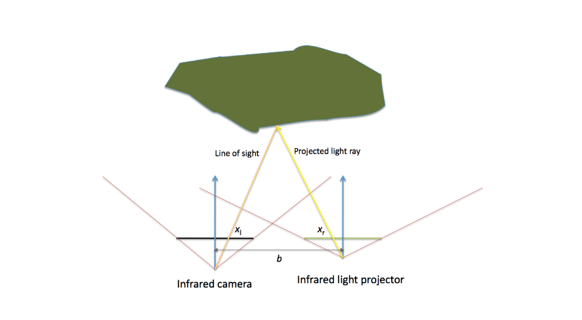

#### Geometry of a TOF camera

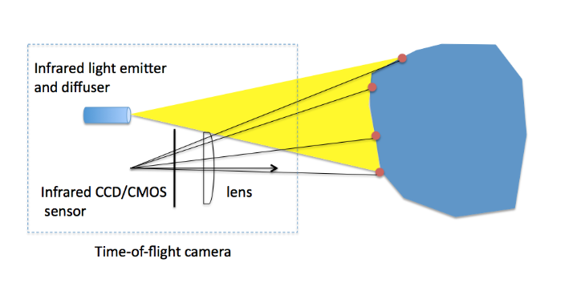

#### 깊이 추정

거리는 다음 식으로 계산 된다.
$$
\begin{aligned}
d = \frac{1}{2}c\tau
\end{aligned}
$$
실제로 $\tau$는 직접 측정 될 수 없다. 연속파 변조 : 송수신 신호 간의 위상차가 측정됩니다. 변조 주파수는 10 ~ 100 MHz 범위입니다. 위상 편이와 비행 시간 간의 관계 ($f$는 변조 주파수 임) :
$$
\begin{aligned}
\phi = 2 \pi f \tau
\end{aligned}
$$

송신된 신호 :
$$
\begin{aligned}
s(t) = a \cos (2\pi f t)
\end{aligned}
$$

수신된 신호:
$$
\begin{aligned}
r(t) = A \cos(2\pi f (t-\tau)) + B
\end{aligned}
$$

송신된 신호와 수신 신호의 상관 관계 :
$$
\begin{aligned}
C(x) =
\lim_{T\rarr\infty}
\frac{1}{T}
\int_{-\frac{T}{2}}^{\frac{T}{2}}
r(t)s(t+x) \mathrm dt
\end{aligned}
$$

해는:
$$
\begin{aligned}
C(x) &= \frac{aA}{2} \cos (2\pi f\tau + 2\pi f x) + B \\
&= \frac{aA}{2} \cos (\phi + \psi) + B
\end{aligned}
$$

$\phi$는 위상이며 $$2\pi$$까지 정의됩니다. 이것을 phase wrapping이라고합니다.

$A$는 수신한 신호의 amplitude이며, 물체의 reflectivity과 sensor's sensitivity에 따라 달라집니다. amplitude은 주로 light spreading으로 인해 $\frac{1}{d_2}$로 감소합니다.

$B$는 ambient illumination으로 인한 offset coefficient 이다.

#### The 4-Bucket Method

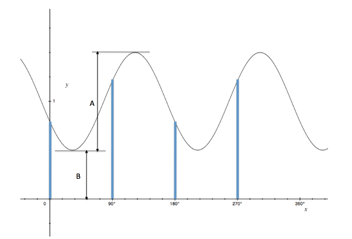

$C(x)$의 4개의 값은 다음 위치에서 추정 됩니다.
$$
\begin{aligned}
\psi_0 &= 0^\circ,\\
\psi_1 &= 90^\circ,\\
\psi_2 &= 180^\circ,\\
\psi_3 &= 270^\circ\\
\end{aligned}
$$

#### Phase, amplitude and offset

cross-correlation signal 의 이 네 가지 값으로부터 우리는 phase, amplitude 및 offset에 대한 다음 솔루션을 얻습니다.
$$
\begin{aligned}
\phi &=
2\pi f\tau =
\arctan \left( \frac{C(x_3)-C(x_1)}{C(x_0)-C(x_1)} \right)
\\
A &= \frac{1}{2a} \sqrt{(C(x_3)-C(x_1))^2 + (C(x_0)-C(x_1))^2}
\\
B &= \frac{1}{4}(C(x_0) + C(x_1) + (C(x_2) + C(x_3))
\end{aligned}
$$

위 식은 신뢰성이 떨어진다. 검토 할것.

CCD (charge-coupled device)는 다음과 같은 여러가지 역할을 한다.

- 데이터 수집 또는 판독 동작 : 입력 광자는 전자 전하로 전환 된다.
- 클럭킹.
- 신호 처리 (복조).


$$
\begin{aligned}


\end{aligned}
$$

$$
\begin{aligned}
\end{aligned}
$$

$$
\begin{aligned}
\end{aligned}
$$

$$
\begin{aligned}
\end{aligned}
$$

$$
\begin{aligned}
\end{aligned}
$$

$$
\begin{aligned}
\end{aligned}
$$

$$
\begin{aligned}
\end{aligned}
$$

$$
\begin{aligned}
\end{aligned}
$$

$$
\begin{aligned}
\end{aligned}
$$

$$
\begin{aligned}
\end{aligned}
$$

$$
\begin{aligned}
\end{aligned}
$$

$$
\begin{aligned}
\end{aligned}
$$


## 참조

- wikipedia.org
- opencv.org
- [Horaud](http://perception.inrialpes.fr/~Horaud/Courses/pdf/Horaud_3Dcameras_tutorial.pdf)
- 