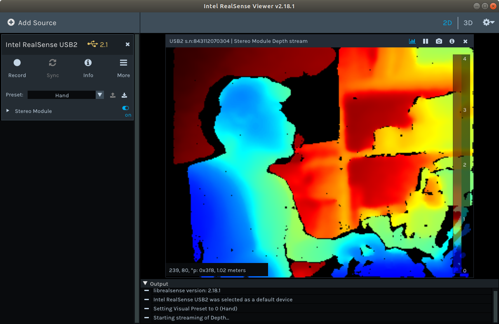

[Up](./index.md)

# Build librealsense on Ubuntun 18.04 LTS

## Ubuntu 18.04 LTS

2019년 3월 2일.

Ubuntu 16.04 LTS에서 librealsense를 빌드하는데 실패하였습니다. 오류 메시지는 <bits/semaphore.h>를 제대로 찾지 못하고 있는 것 같습니다. 아무래도 우분투 빌드 환경이 꼬인 것 같습니다. 새로 설치하는 김에 Ubuntu 18.04 LTS를 설치하기로 했습니다.

### 리얼센스2 툴 및 라이브러리 설치

realsense 패키지 저장소 서버 퍼블릭키를 등록합니다.

```sh
sudo apt-key adv --keyserver keys.gnupg.net --recv-key C8B3A55A6F3EFCDE || sudo apt-key adv --keyserver hkp://keyserver.ubuntu.com:80 --recv-key C8B3A55A6F3EFCDE
```

만일 퍼블릭키를 얻을 수 없으면 프록시를 점검합니다. `export http_proxy="http://<proxy>:<port>"`

realsense 패키지 저장소를 등록 합니다.

``` sh
sudo add-apt-repository "deb http://realsense-hw-public.s3.amazonaws.com/Debian/apt-repo bionic main" -u
```

패키지 관리자를 업데이트 합니다.

```sh
sudo apt update
```

realsense 라이브러리를 설치 합니다.

```sh
sudo apt install librealsense2-dkms librealsense2-utils
```

선택적으로 개발자나 디버그를 위한 패키지를 설치 합니다.

```sh
sudo apt install librealsense2-dev librealsense2-dbg
```

이제 `g++ -std=c++11 filename.cpp -lrealsense2`과 같은 빌드 명령을 통해 관련 코드를 빌드 할 수 있습니다.

realsense 장치를 연결하고 realsense-viewer를 실행해 봅니다.

```sh
realsense-viewer
```



### 빌드 도구 준비

```sh
sudo apt update
sudo apt install git cmake cmake-gui build-essential
```

### 개발 라이브러리 설치

```sh
sudo apt install libusb-1.0-0-dev libglu1-mesa-dev freeglut3-dev mesa-common-dev
```

### 소스 다운로드

적당한 폴더를 만들고 [github 저장소의 소스 코드](https://github.com/IntelRealSense/librealsense)를 클론 합니다.

```sh
git clone https://github.com/IntelRealSense/librealsense.git
```

### 빌드

`build` 폴더를 만듭니다. 일반적으로 `librealsense/build`로 만듭니다. 저는 빌드 파일이 소스파일과 섞이는게 싫어서 `librealsense`가 있는 폴더에 빌드 폴더를 만듭니다. 

```sh
mkdir realsense.build
cd realsense.build
```

`cmake`를 먼저 구성합니다. 이 글은 `cmake`나 `cmake-gui`의 사용법을 설명하지는 않습니다.

```sh
cmake ../librealsense
```

`cmake` 구성이 100% 끝나면 `Makefile`이 생성되어 있습니다. 빌드를 합니다.

```sh
make
```

오류 없이 빌드 되었으면 성공한 것입니다. 빌드가 되지 않는다면... 문제를 찾아야 겠죠...

## 참조

- [IntelRealSense/librealsense/Linux Distribution](https://github.com/IntelRealSense/librealsense/blob/master/doc/distribution_linux.md)
- [How to Install OpenGL on Ubuntu Linux](http://www.codebind.com/linux-tutorials/install-opengl-ubuntu-linux/)