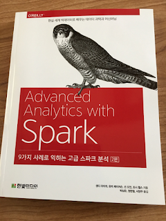

[Up](index.md)

# 아홉가지 사례로 익히는 스파크 분석 (원제: Advanced Analytics with Spark, 2nd Edition)

요즘 실리콘밸리는 "속도"죠. 빠르게 변화하는 트렌드를 쫒기 위한 목적도 있지만, 개발자나 데이터 과학자의 높은 급여를 이유로 높은 장비 운영 비용이 들더라도, 빠르게 결과를 낼 수 있는 도구를 선호합니다. Python, Golang, Scala, JavaScript, Swift, Kotlin 같은 언어들이 선호되는 이유기도 합니다.

스파크도 속도 트렌드를 충족하는 도구 입니다. 스파크 이전에 엔지니어들은 여러가지 도구 사이를 헤집고 다니며 작업 도구를 스위칭 해야 했습니다. 스파크는 도구 스위칭을 줄이고, 빠르게 데이터를 분석할 수 있도록 개발 되었습니다.

저는 자바 언어는 알지만 자바 전문 개발자가 아니며, Scala라는 언어를 모르는 상태였습니다. 스파크라는 빅데이터 분석 도구를 사용하는데 Scala가 적합한 언어라 시간이 걸리더라도 이번 기회를 핑계로 삼아 익혀야 겠다고 생각했습니다. Scala라는 새로운 언어를 배우는데 오랜 시간이 걸릴거라는 것은 기우 였습니다. 이미 Python, JavaScript에 익숙하기 때문에 Scala라 언어 레퍼런스는 몇시간만에 읽고, 스파크를 연습하는데 충분 했습니다. 물론 스파크는 Python, Java, R 언어도 지원하지만 Scala를 익힐 기회를 놓칠 수 없었기 때문입니다.

이 책은 프로그래밍 언어 레퍼런스가 아니었습니다. Scala는 익히기 쉬운 언어이므로 개발자라면 몇시간이면 언어 스펙을 읽고 코딩 할 수 있습니다. 물론 Scala로 응용 프로그램을 개발하자면 API에 익숙해져야 하죠. 하지만, 스파크를 다루는 목적이라면 Scala에 빨리 적응 할 수 있었습니다.

이 책의 초반에 이 책은 머신러닝 이론서가 아니라고 설명 하고 있었는데, 아닙니다. 머신러닝 이론과 스파크를 통한 실무 예제를 연결하여 추천 알고리즘 개발, 네트워크 이상 탐지, 의미 분석, 네트워크 분석, 교통 분석, 금융 리스크 추정, 유전체 분석, 신경 영상 분석 과업을 해결하는 과정을 다루고 있습니다. 사용된 알고리즘들은 자주 사용되는 대부분의 알고리즘을 커버 하며, 이미 머신러닝 알고리즘들은 알고 있기 때문인지, 스파크를 통한 데이터 분석 예제를 어려움 없이 수행 할 수 있었습니다.

빅데이터 분석에 스파크는 훌륭한 도구이자 안내자 입니다.

## 참조

- [스파크의 소개와 우분투 16.04 LTS에 설치](introduction_apache_spark_install_on_ubuntu1604.md)
- [Sandy Ryza, Uri Laserson, Josh Wills, Sean Owen 2017 Advanced Analystic with Spark Second Edition, O’Reilly Media](http://shop.oreilly.com/product/0636920056591.do)
- [박상은, 권한철, 서양주 2018 아홉가지 사례로 익히는 고급 스파크 분석 제2판, 한빛 미디어](http://www.hanbit.co.kr/media/books/book_view.html?p_code=B2901427500)

