[Up](index.md)

# VSCode로 CMake로 빌드 하고 디버깅 하기

*2019년 3월 3일 작성*

첫 C 프로그램은 아마도 Turbo-C 2.0 으로 작성하였습니다. 이후 쏠라리스에서 vi를 사용하여 MUD를 개발하거나, 임베디드 개발을 위해 Makefile을 사용하여 크로스컴파일을 하거나, 윈도우용 또는 임베디드 시뮬레이터 개발을 위해 Visual C/C++을 사용하거나, 리눅스 환경에서 Eclipse에 C/C++ Development ToolKit (CDT)를 설치하여 개발하거나, 맥에서 XCode로 개발해 왔습니다. Eclipse CDT가 임베디드, 리눅스 환경에서 크로스 컴파일하여 개발하기에 적절하였지만, 시간이 지나며 무겁고 느리지니 점차 사용하지 않게 되었습니다.

최근 C#, Unity, 파이썬 개발을 Visual Studio, VSCode에서 해오다가, 요즘 C/C++을 사용 기회가 증가하여, C/C++도 VSCode로 해보자는 생각으로, 인터넷을 검색하여 블로그를 찾아 4가지 방법을 실험하였고, 주로 사용중인 빌드 툴인 CMake와 조합이 잘 맞고, VSCode에서 편집하고, CLI에서 CMake로 빌드 한 후 실행해도 되지만, IDE의 디버거를 활용할 수 있는 잇점때문에, VSCode Extension을 사용하고자 하였고,  이 과정을 기록으로 남깁니다. 이 글의 내용은 2019년 3월 3일 현재 동작합니다.

- CMake는 오래된 역사만큼이나 기능이 많아 러닝 커브가 깊습니다만, Makefile과 달리 자동화 할 수 있는 부분들이 많습니다.
- 이 글은 CMake 안내서가 아닙니다. 짧게 CMake를 훑어 보고 싶다면 [CMake 간단한 안내서와 참조](simple_cmake_introduction.md)를 읽어 보세요.

## 구성 환경

- Ubuntu 18.04 LTS

  ```sh
  Linux version 4.18.0-15-generic (buildd@lcy01-amd64-029) (gcc version 7.3.0 (Ubuntu 7.3.0-16ubuntu3)) #16~18.04.1-Ubuntu SMP Thu Feb 7 14:06:04 UTC 2019
  ```

- Visual Studio Code 1.31.1

  ```sh
  Version: 1.31.1
  Commit: 1b8e8302e405050205e69b59abb3559592bb9e60
  Date: 2019-02-12T02:19:29.629Z
  Electron: 3.1.2
  Chrome: 66.0.3359.181
  Node.js: 10.2.0
  V8: 6.6.346.32
  OS: Linux x64 4.18.0-15-generic
  ```

## Visual Studio Code 설치

먼저 [여기](https://code.visualstudio.com/Download)에서 Visual Stdio Code 설치 파일을 다운로드 받습니다.

**Unbuntu 18.04 LTS:**

데비안 패키지`.deb` 파일을 받아야 합니다. 다운로드가 완료 되면 설치 합니다.

```sh
sudo dpkg -i code_1.??.?-?????????_amd64.deb
```

`여기서 ?`는 VSCode의 버전에 따라 다릅니다.

## 예제 프로젝트

이 과정을 진행하기 위해 `hello`라는 작은 프로젝트를 만들겠습니다. `hello`라는 폴더를 만듭니다.

```sh
makedir hello
cd hello
```

Visual Studio Code를 실행하여 `hello` 폴더를 엽니다.

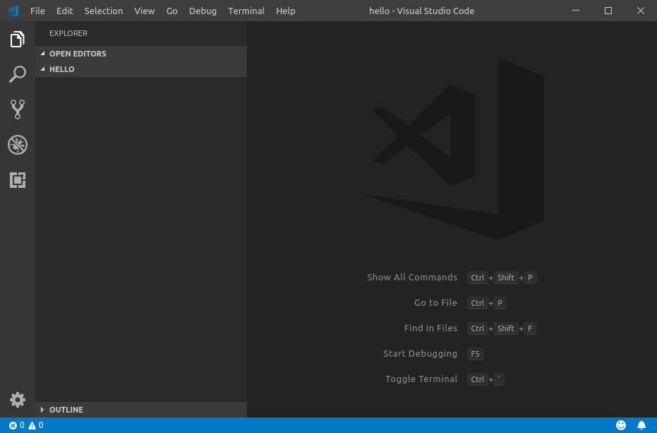

이 과정을 진행하기 위해 `hello.cpp`라는 짧은 코드를 만들도록 하겠습니다.

```c++
#include <iostream>

int main(int argc, const char * argv[])
{
    std::cout << "Hello!" << std::endl; 
    return 0;
}
```

그리고 빌드를 수행할 `CMakeLists.txt` 파일을 작성합니다.

```cmake
cmake_minimum_required(VERSION 3.0)

project(hello)

set(SOURCE hello.cpp)

add_executable(${PROJECT_NAME} ${SOURCE})
```

이 두개 파일을 생성하면 다음 그림과 같습니다.

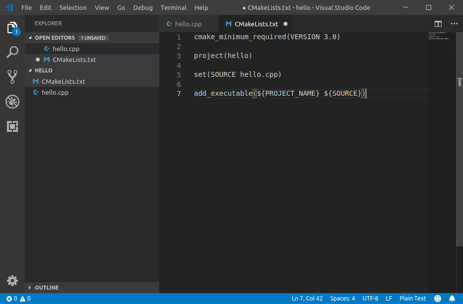

## Visual Studio Code Extensions

다음 3가지 Visual Studio Code Extention을 설치합니다.

- [C/C++ for Visual Studio Code](https://marketplace.visualstudio.com/items?itemName=ms-vscode.cpptools)

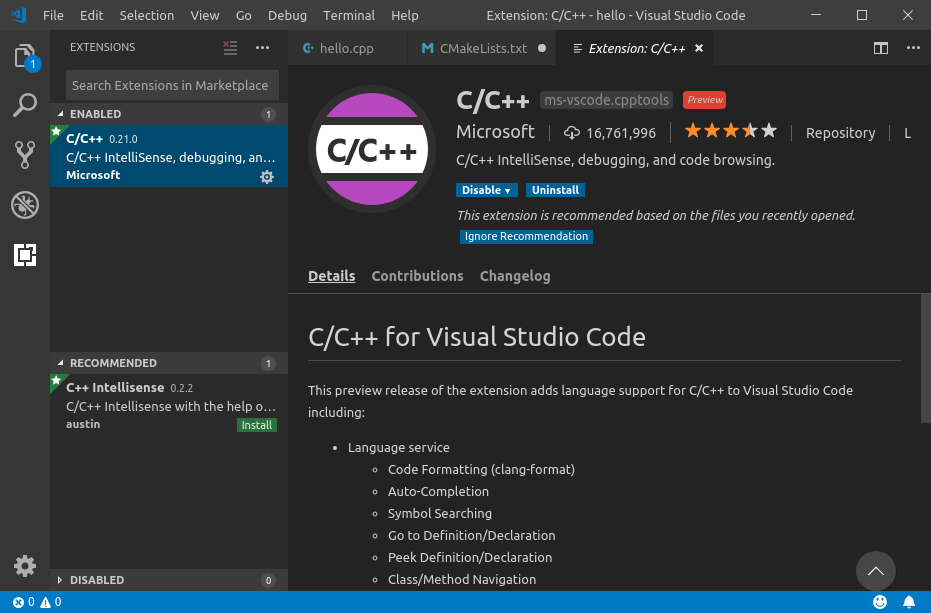

- [CMake For VisualStudio Code](https://marketplace.visualstudio.com/items?itemName=twxs.cmake)

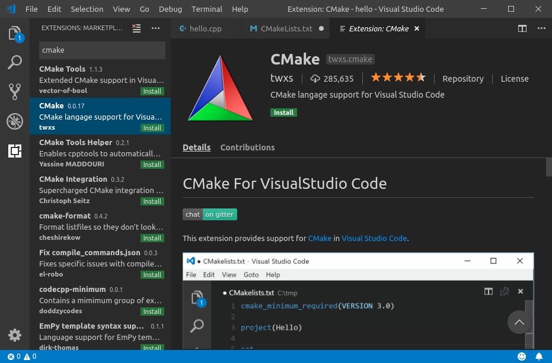

- [CMake Toos (for Visual Studio Code)](https://marketplace.visualstudio.com/items?itemName=vector-of-bool.cmake-tools)

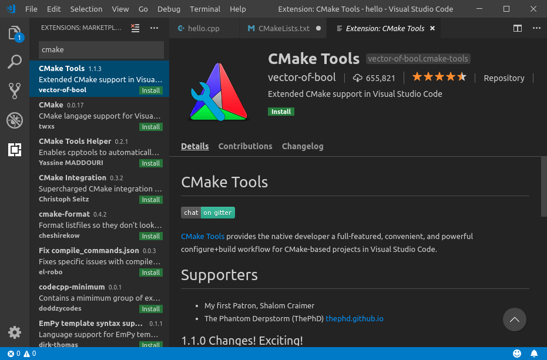

Extensions들이 설치가 되면 `Shift+Ctrl+P`를 눌러 명령 팔레트(Comand Palette)를 호출합니다.

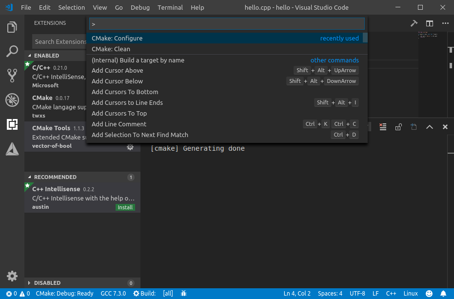

명령 팔레트에서 `CMake: Configure`를 선택합니다. 그러면 컴파일러를 선택하는 팔레트가 나타납니다. 사용하고자 하는 컴파일러를 선택합니다.

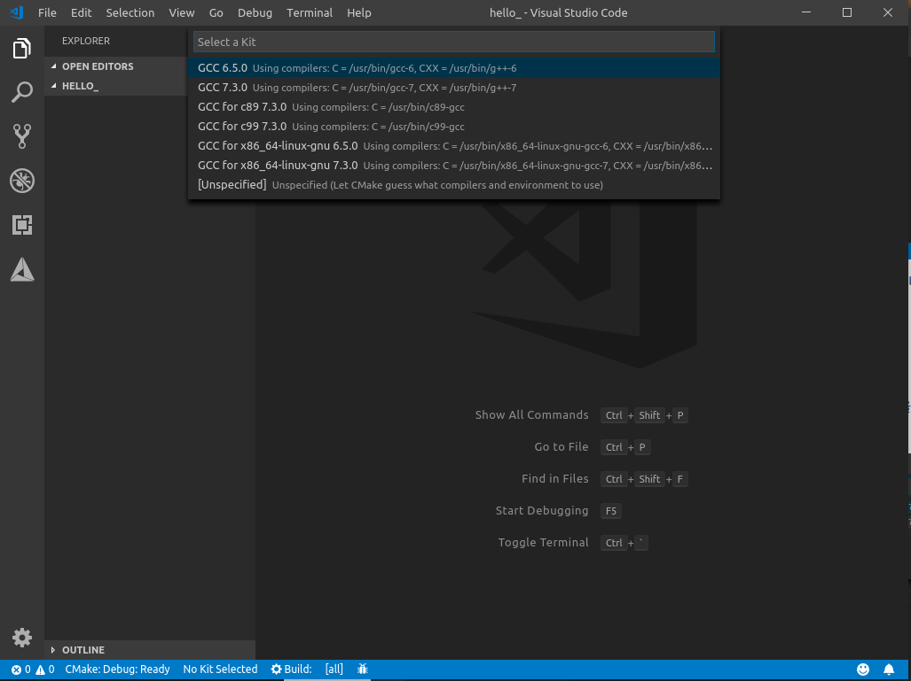

이제, CMake가 프로젝트 폴더에 `build`폴더가 생성하고 빌드 구성을 할것입니다.

다음 다시 명령 팔레트에서 `CMake: build`를 호출하여 빌드를 합니다. 명령 팔레트 오른쪽을 보면 `F7`이라는 문자열이 있습니다. `F7`단축키를 눌러서 빌드 할 수 있습니다.

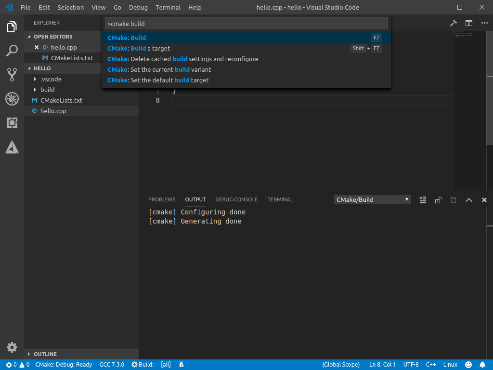

빌드에 성공하면 `OUTPUT` Pane에 `Build finished ...`가 표시 됩니다.

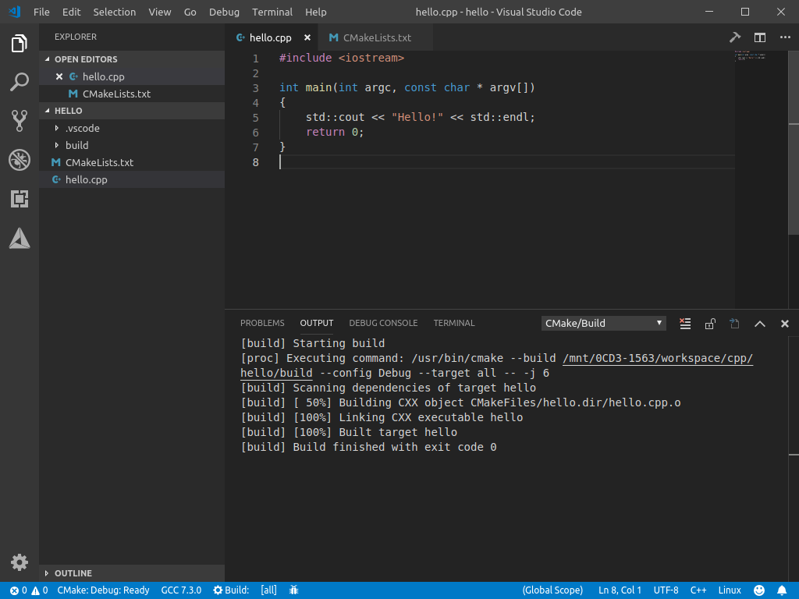

디버그를 사용하려면 명령 팔레트에서 `CMake: Debug target`을 선택합니다.

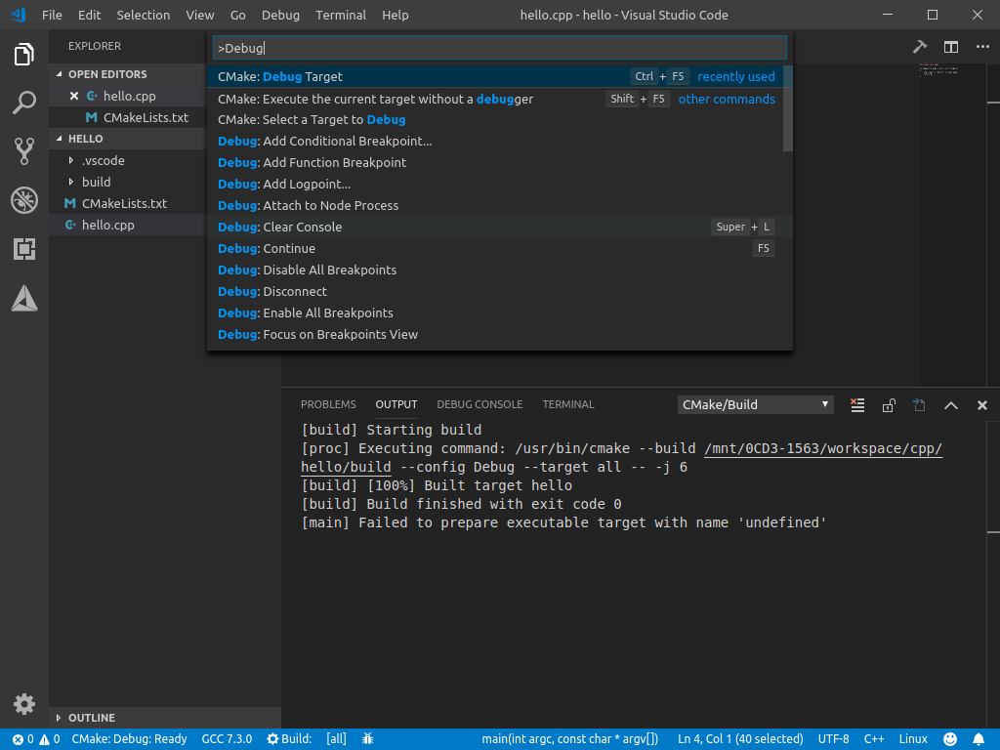

실행파일을 선택하고 디버그를 할 수 있습니다.

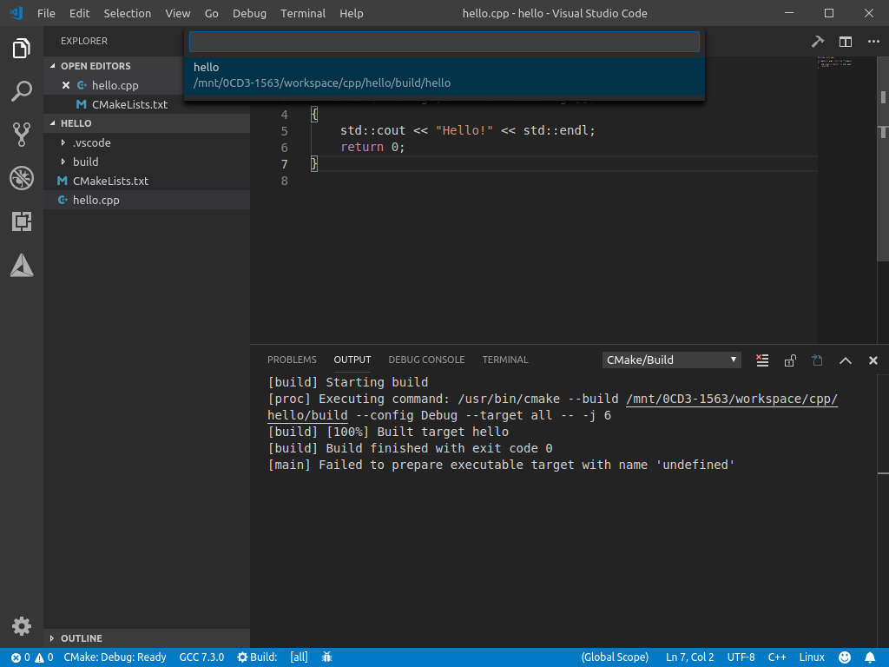

아래 그림처럼 브레이크 포인트를 걸고 디버깅을 할 수 있습니다.

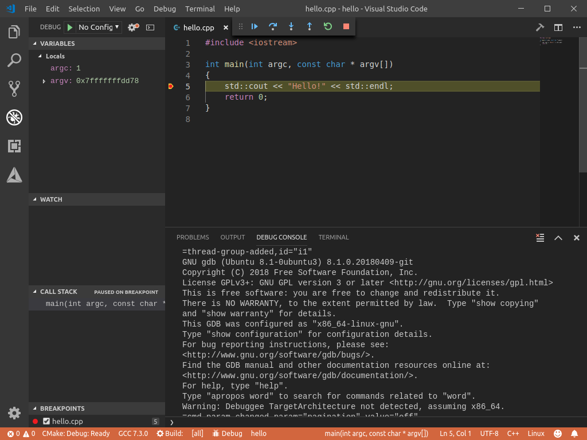

- 명령 팔레트에서 `CMake: Clean`을 호출하면 `build` 폴더를 정리할 수 있습니다.

- 명령 팔레트에서 `CMake: Run tests`를 호출하면 Unit test를 할 수 있습니다.
- `CMakeLists.txt`파일이 변경되면 명령 팔레트에서 `CMake: Configure`를 선택하여 다시 빌드를 구성합니다.
- CMake는 VSCode와 별개이므로 배포시 각 개발자들이 스스로 선택하여 사용할 수 있습니다.

예제에서 사용된 코드는 [이곳 github](https://github.com/booiljung/hello-vscode)에 올려 두었습니다.

## 빌드 디렉토리 변경

*2019년 3월 4일 추가*

기본적으로 빌드 디렉토리는 `${workspaceRoot}/build` 입니다. 이를 변경하려면 `${workspaceRoot}/.vscode/settings.json`을 열어서 다음 라인을 추가 합니다.

```json
{
    ...
	"cmake.buildDirectory" : "build_directory"
    ...
}
```

예를 들어 프로젝트 폴더가 위치한 폴더에 빌드 디렉토리를 만들려면

```cmake
{
	"cmake.buildDirectory" : "${workspaceRoot}/../my_project.build"
}
```

를 추가해 줍니다.

## VSCode CMake Tools로 Windows 용 빌드

*2019년 3월 6일 추가*

전통적으로 Visual Studio를 사용하지 않고 윈도우에서 빌드를 하려면 `msc`, `nmake`를 통해 Makefile을 빌드 하였습니다. 아직도 이런 방법으로 하는 것으로 추정하고, `msc`와 `nmake`로 빌드하는 방법을 찾았지만 찾을 수 없었습니다.

윈도우용을 빌드할때는 Makefile을 사용하지 않고, Visual Studio Solution 파일을 커맨드 라인에서 빌드 할 수 있습니다. (정확하지 않지만 `MSBuild.exe`를 사용하는 것으로 추정 됩니다.). 

VSCode에서 윈도우용을 빌드할때는 `.vscode/settings.json`에 다음을 지정합니다.

```json
{
    ...
	"cmake.generator": "Visual Studio 15 2017 Win64",
    "cmake.preferredGenerators": [
        "Visual Studio 15 2017 Win64"        
    ],
    ...
}
```

이 설정을 지시하면, VSCode 명령 팰럿에서 `CMake: Configurate`, `CMake: build`를 호출하여 빌드를 완료 할 수 있습니다.

## 디버그

*2019년 3월 6일 추가*

디버그를 옵션을 위해 `.vscode/launch.json`을 작성 할 수 있습니다.

```json
{
    "version": "0.2.0",
    "configurations": [
        {
            "name": "이 디버그 구성의 이름",
            "type": "cppvsdbg",
            "request": "launch",
            "program": "${workspaceRoot}/.../실행 파일 바이너리",
            "args": [],
            "stopAtEntry": false,
            "cwd": "${workspaceRoot}/.../실행 할 경로",
            "environment": [], // 환경변수
            "externalConsole": true
        },
    ]
}
```

## 변수 설정

*2019년 3월 6일 추가*

`"cmake.configureSettings"` 항목을 추가하여 cmake 변수의 값을 설정 할 수 있습니다. 다음은 `librealsense2` cmake를 설정하는 예제입니다.

```json
{
    ...
	"cmake.configureSettings": {
        "BUILD_CSHARP_BINDINGS" : true,
        "BUILD_CV_EXAMPLES" : false,
        "BUILD_CV_KINFU_EXAMPLE" : false,
        "BUILD_EXAMPLES" : true,
        "BUILD_GRAPHICAL_EXAMPLES" : true,
        "BUILD_UNITY_BINDINGS" : true,
        "BUILD_EASYLOGGINGPP" : true,
        "BUILD_WITH_TM2" : false,
        "DOTNET_VERSION_EXAMPLES" : "4.5",
        "DOTNET_VERSION_LIBRARY" : "4.5",
        "GLFW_BUILD_DOCS" : true,
        "GLFW_BUILD_EXAMPLES" : true,
        "GLFW_BUILD_TESTS" : true,
        "GLFW_INSTALL" : true,
        "GLFW_USE_HYBRID_HPG" : true,
        "GLFW_VULKAN_STATIC" : false,
        "OpenCV_DIR" : "C:/usr/opencv.4.1.debug",
        "UNITY_PATH" : "C:/Program Files/Unity/Editor/Unity.exe",
        "USE_MSVC_RUNTIME_LIBRARY_DLL" : true,
    },
    ...
}
```

## 참조

- [Quick Start to Use Visual Studio Code for C++ Programmers in Linux](https://www.codeproject.com/Articles/1184735/Quick-Start-to-Use-Visual-Studio-Code-for-Cplusplu)

