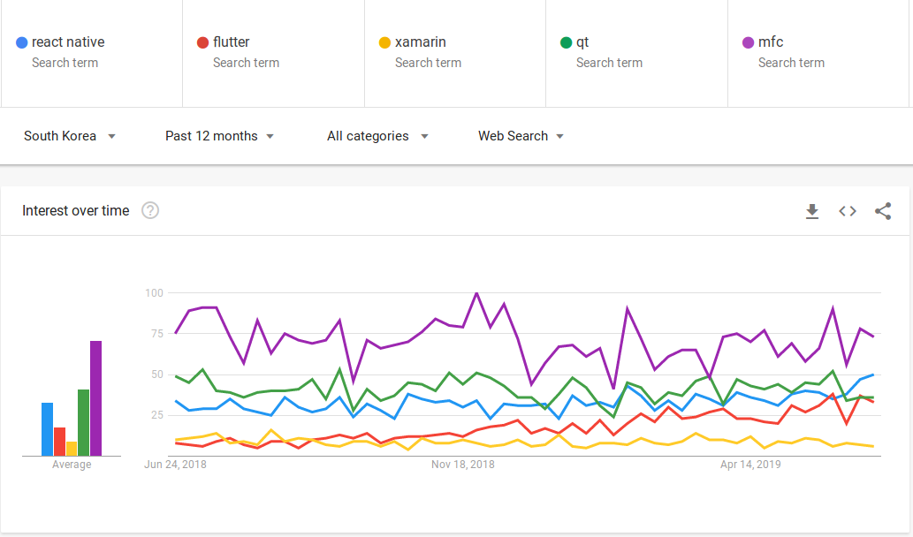
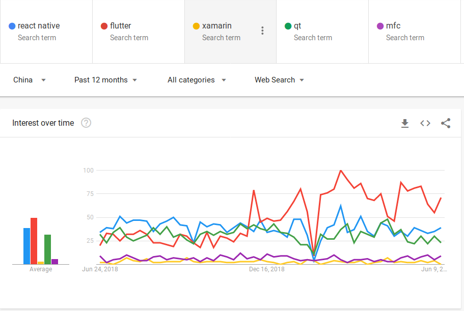
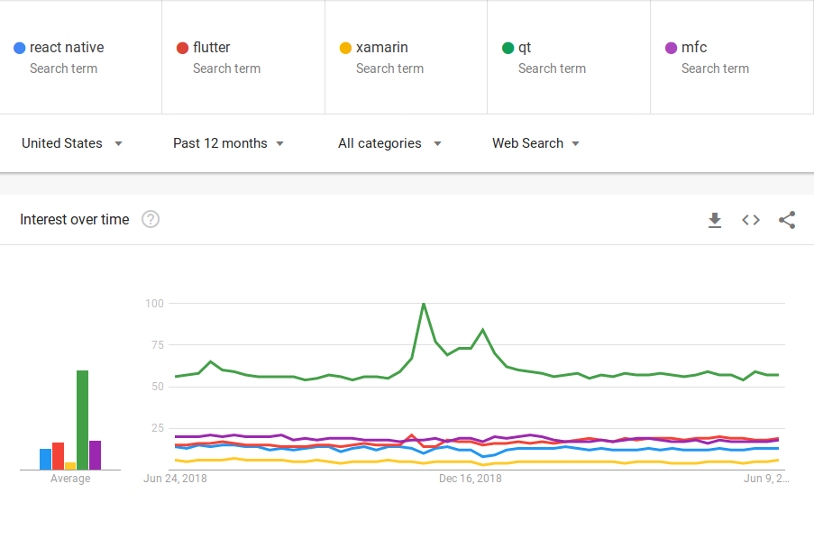
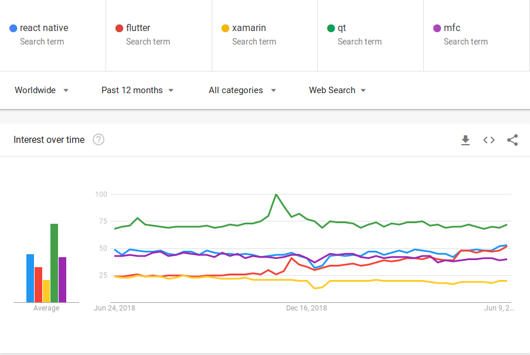

# UI 프레임워크 라이브러리 구글 트렌드 검색

2019년 6월 22일.

UI 프레임워크 라이브러리에 대해 구글 트렌드를 검색 해봤습니다. 기술의 트렌드를 읽어가는데 구글 트렌드만큼 쉬운 방법도 없습니다.

비교 대상은

- React Native (페이스북)
- Flutter (구글)
- Xamarin (마이크로소프트)
- Qt (Qt 컴퍼니)
- MFC (마이크로소프트)

이며, 괄호 안은 설립 회사입니다.

이중 Qt와 MFC는 데스크탑용이라 위 세가지와 성격이 다른데 5개를 채워서 함께 비교해 봤습니다.

비교 기간은 2018년 6월 23일부터 1년이며, 구글 트렌드는 많이 사용하는 기준이 아니라 많이 검색하는 기준입니다. 개발자들이 배우거나 난이에 따라 높게 나올 수 있다고 추정합니다.

### 한국

데스크탑 UI 프레임워크 MFC가 압도적입니다. SI 라는 특이한 시장이 원인으로 보입니다. MFC는 Visual C를 구매하면 포함되어 있고, Qt는 별도로 구매해야 하는 점이 있어 SI 시장에서 MFC가 우선 선택 되지 않았나 생각 됩니다. 저는 2005년에 마지막으로 MFC를 사용하였고, 이후 데스크탑용 UI 프레임워크는 닷넷의 WinForm을 사용하고 있습니다. C로 개발하는 경우 Qt를 사용하고 있습니다.

모바일 UI 프레임워크는 아직 React Native가 강세입니다. Flutter가 서서히 올라오고 있습니다. 한국에서 Xamarin의 존재감은 낮습니다.

### 중국

한국과 달리 중국에서 MFC는 데스크탑 UI 프레임워크의 영향력이 낮습니다. MFC는 2000년 이전에 WIN32를 객체지향 패러다임을 적용하고 나왔고, Visual C++을 구매하면 무료로 사용할 수 있어서, 볼랜드의 OWL을 누르고 인기를 끌었습니다. 중국의 컴퓨터 공학이 Qt 등장 이후에 발전하였기 때문에 MFC 영향력이 낮은게 아닐까 생각 하고 있습니다.

모바일 UI 프레임워크는 Flutter가 작년 가을 이후 강세를 보이고 있습니다. 올해 초에 모든 키워드가 0에 수렴하는데 아마도 명절이겠죠?

중국에서 마이크로소프트의 제품인 Xamarin이나 MFC의 영향력이 낮아 보입니다.

### 미국

미국의 데스크탑 UI 프레임워크는 Qt가 강자입니다. 소프트웨어 구매 비용보다 개발자 급여가 높다 보니, 비싸더라도 시간을 절약해 주는 도구를 선호하지 않을까 생각이 듭니다. 사실, Qt 자체만으로도 웬만한 개발이 가능할 정도로 많은 OpenGL, 네트워크등 라이브러리들을 지원하고 있고, 애니메이션이나 레이아웃도 자동으로 빠르게 잡을 수 있습니다. 임베디드, 맥, 리눅스, 윈도우 등 다양한 운영체제를 지원하며, 많은 언어들이 Qt를 지원하고 있기도 합니다.

모바일 UI 프레임워크는 Flutter가 React Native를 앞질렀습니다.

### 세계

전세계 기준은 미국과 유사합니다. Qt가 데스크탑 UI 프레임워크에서 우위를 점하고 있으며, React Native와  Flutter가 유사한 수준입니다. 

### 결론

결론이 있을리가요. Flutter가 1년간 성장률이 100%인데, 앞으로 1년간 어떻게 될지 궁금하기도 합니다.

