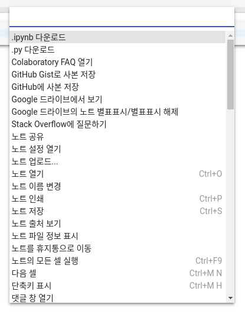

[Up](index.md)

# Colab Environments

#### 명령 팔레트

CTRL + SHIFT + P



#### HTML 쎌

```html
%%html
<marquee style='width: 30%; color: blue;'><b>Whee!</b></marquee>
```

#### 현재 사용중인 파이썬 버전 확인

```python
import sys
sys.version_info
```

#### 운영체제 버전 확인

```python
import platform
platform.platform()
```

####  파이썬 패키지 설치

```shell
!pip install <package>
```

#### 파이썬 패키지 확인

```shell
!pip list
```

#### 텐서플로우 버전 확인

```python
import tensorflow as tf
print(tf.__version__)
```

