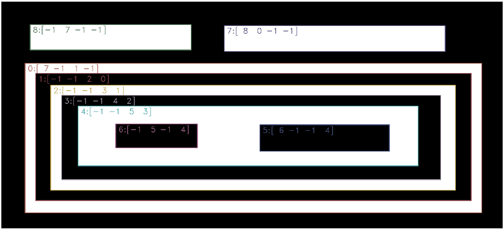
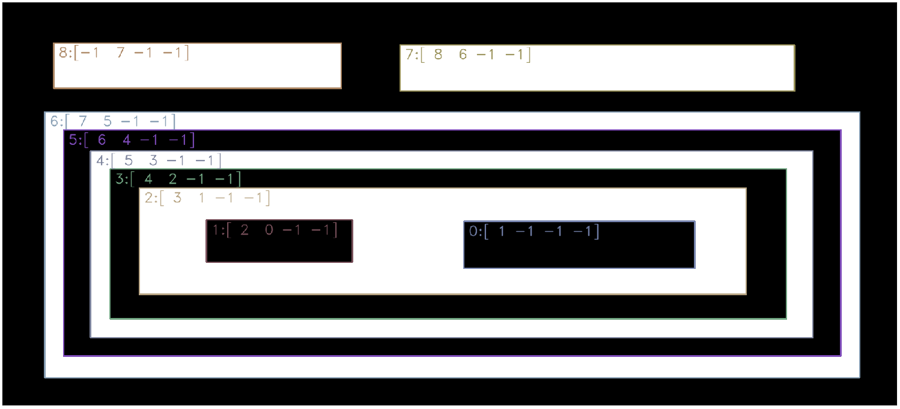
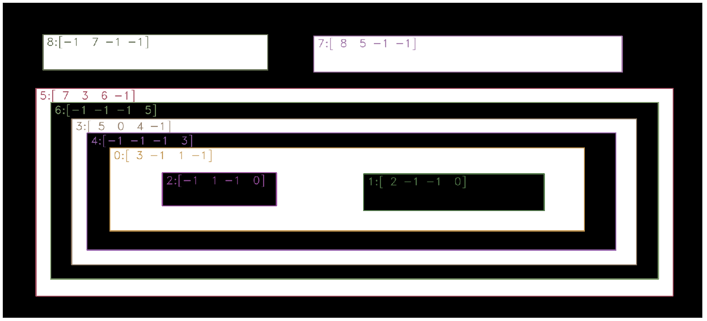

[Up](index.md)

# OpenCV: findContours

## 사용된 이미지:


## 소스 코드: 

```python
import cv2
from matplotlib import pyplot as plt
import numpy as np
import random

font = cv2.FONT_HERSHEY_DUPLEX 

im = cv2.imread('../images/image_hierarchy.png')

imgray = cv2.cvtColor(im,cv2.COLOR_BGR2GRAY)
ret, thresh = cv2.threshold(imgray,125,255,0)

image, contours, hierarchy = cv2.findContours(thresh, cv2.RETR_TREE, cv2.CHAIN_APPROX_SIMPLE)

for i in range(len(contours)):
    color = (random.randrange(64,192), random.randrange(64,192), random.randrange(64,192))
    contour = contours[i]
    im = cv2.drawContours(im, [contour], -1,color, 2)
    print(contour)
    label = str(i) + ":" + str(hierarchy[0][i])
    print(label)
    cv2.putText(im, label, (contour[0][0][0]+10, contour[0][0][1]+30), font, 1, color, 1, cv2.LINE_AA)

titles = ['result']
images = [im]

for i in range(1):
    plt.subplot(1,1,i+1), plt.title(titles[i]), plt.imshow(images[i])
    plt.xticks([]), plt.yticks([])

plt.show()

```

결과는 아래와 같습니다.

## RETR_TREE:

모든  contour들이 계층관계를 이룹니다. `[next_sibling, prev_sibling, first_child, parent]`입니다.



```python
[next_sibling, prev_sibling, first_child, parent]
```

## RETR_LIST:

모든 contour가 동일한 레벨로 계층 관계가 아닙니다. 따라서 `first_child`와 `parent` 항목은 사용되지 않습니다.



```python
[next_sibling, prev_sibling, -1, -1]
```

## RETR_CCOMP:

내부 contour는 tree와 동일한 계층관계를 구성하지만, 외부 contour는 `parent`만 가리킵니다.



```python
[next_sibling, prev_sibling, first_child, parent]
```


