[

Up](index.md)

# 데이터셋

컴퓨터 비전용 데이터셋를 찾아보며 정리하였습니다. 나중에 찾기 쉽게 분류하고, 샘플 이미지를 첨부하였습니다. 사진에 저작권에 침해 문제가 있다고 말씀하시면 삭제 하도록 하겠습니다.

## Contents

[TOC]

## Face

##### [Flickr-Faces-HQ Dataset (FFHQ)](https://github.com/NVlabs/ffhq-dataset)

### Face Detection

##### [WIDER FACE: A Face Detection Benchmark](http://mmlab.ie.cuhk.edu.hk/projects/WIDERFace/index.html)

얼굴 검출 데이터셋입으로 32,203개의 이미지에 393,703의 레이블이 있습니다 PASCAL VOC 데이터셋과  동일한 평가 기준을 채택했습니다. MALF 및 Caltech 데이터셋과 마찬가지로 테스트 이미지에 대한 bound box truth 를 공개하지 않습니다.

사진출처: 사이트 페이지

##### [MALF](http://www.cbsr.ia.ac.cn/faceevaluation/)

Fine-grained Evaluation on Face Detection in the Wild. 인터넷에서 수집한 11,931 개의 주석이 달린 얼굴이있는 5,250 개의 이미지가 포함되어 있습니다.

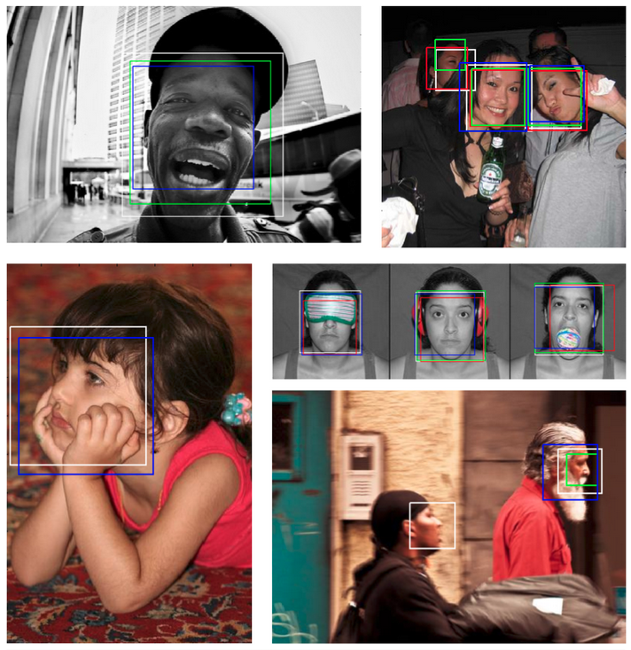

사진출처: 사이트 페이지

##### [FDDB]()

얼굴 검출을 위한 데이터셋으로 Faces in the Wild 데이터셋에서 가져온 2,845 개의 이미지 세트에 있는 5,171 개의 얼굴에 대한 주석이 들어 있습니다.

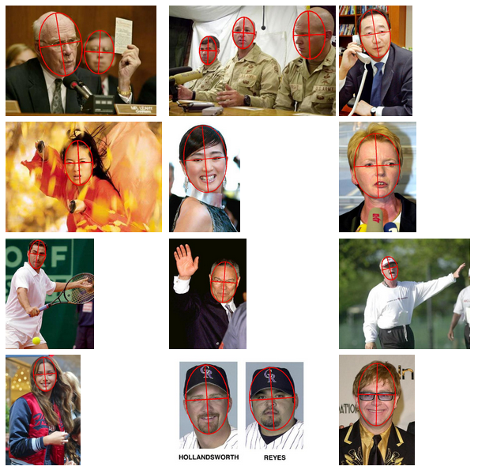

사진출처: 사이트 페이지

### Face Classification

##### [LAG: Large Age Gap](http://www.ivl.disco.unimib.it/activities/large-age-gap-face-verification/):

어린이, 성인, 노인에 이르기까지 다양한 이미지와 함께 다양한 연령대가 포함된 데이터셋입니다. 이 데이터 세트에는 1,028명의 유명인 3,828 개의 이미지가 포함되어 있습니다. 각 신원에 대해 하나 이상의 아동, 성인, 노인 이미지가 있습니다.

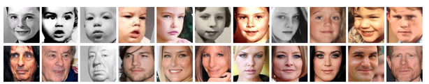

사진출처: 사이트 페이지

### Facial Recognition

##### [CelebFaces](http://mmlab.ie.cuhk.edu.hk/projects/CelebA.html):

200,000 가지가 넘는 유명인 이미지가있는 얼굴 데이터 세트로 각각 40개의 속성 주석이 있습니다.

사진출처: 사이트 페이지

다운로드: [Kaggle](https://www.kaggle.com/jessicali9530/celeba-dataset)

##### [VGG Face Dataset](http://www.robots.ox.ac.uk/~vgg/data/vgg_face/)

데이터셋은 2,622개의 신원으로 구성되며, 각 신원에는 이미지 URL과 당 얼굴 탐지를 위한 텍스트 파일이 있습니다.

##### [VGG Face Dataset 2](http://www.robots.ox.ac.uk/~vgg/data/vgg_face2/)

데이터셋은 9,000개 이상의 신원으로 구성되며 3,000,000개의 얼굴이 포함되어 있습니다. 각 주제마다 362개 이상의 샘플이 있습니다.

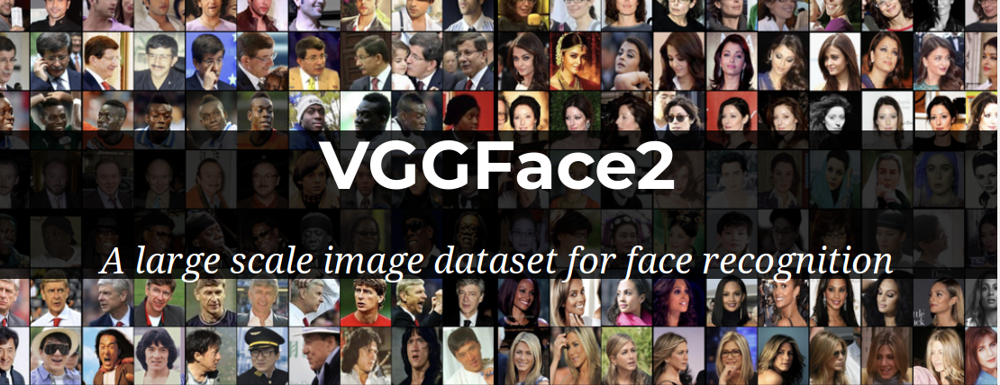

사진출처: 사이트페이지

##### [Labelled Faces in the Wild](http://vis-www.cs.umass.edu/lfw/):

얼굴 인식을 포함하는 응용 프로그램을 개발할 때 사용하기 위해 인간 얼굴의 13,000 개의 라벨링된 이미지입니다.

사진출처: 사이트 페이지

### Facial Depth

##### [FLORENCE 3D/2D](https://www.micc.unifi.it/resources/datasets/florence-3d-faces/)

이 데이터 세트는 2D, 외형 기반 인식 기술 및 완전 3D 접근법 간의 차이를 줄이는 기술에 대한 연구를 지원하기 위해 특별히 제작되었습니다. 현실적인 감시 조건을 제어 된 방식으로 시뮬레이션하고 실제 시나리오에서 3D 모델을 효과적으로 활용할 수 있도록 설계 되었습니다.

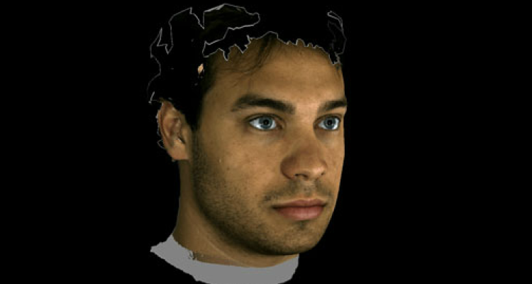

사진출처: 사이트 페이지

[Florence Superface dataset](https://www.micc.unifi.it/resources/datasets/florence-superface/)는 저해상도 및 고해상도 3D 스캔으로 구성되어 있으며, 서로 다른 해상도로 스캔을 사용하는 혁신적인 3D 얼굴 인식 솔루션을 연구합니다. 현재 20 개의 피험자가 데이터 집합에 포함되어 있지만 등록은 계속 진행 중입니다.

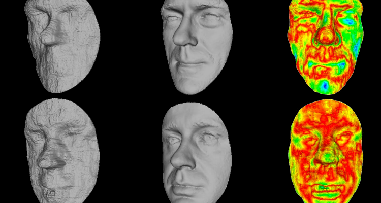

사진출처: 사이트 페이지

##### [3D Mask Attack Database (3DMAD)](https://www.idiap.ch/dataset/3dmad)

3D MAD (3D Mask Attack Database)는 생체 인식 (얼굴) 스푸핑 데이터베이스입니다. 현재 실제 액세스 및 스푸핑 공격에 대해 Kinect를 사용하여 기록 된 17 명의 76,500 프레임이 포함되어 있습니다. 각 프레임은 깊이 이미지, RGB 이미지, 눈 위치로 구성됩니다.

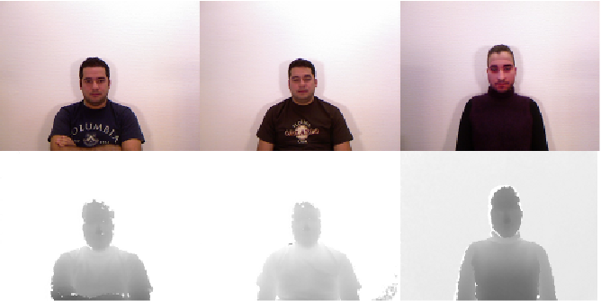

사진출처: 사이트 페이지

[파이썬 패키지: maskattack.lbp](https://pypi.org/project/maskattack.lbp/)

##### [DMCSv1 Database: Multimodal Biometric Database of 3D Face and Hand Scans](http://biometrics.dmcs.pl/en/databases/dmcsv1)

DMCS는 Department of Microelectronics and Computer Science의 약자입니다. 데이터베이스는 3D 얼굴 및 손 스캔이 포함되어 있습니다.

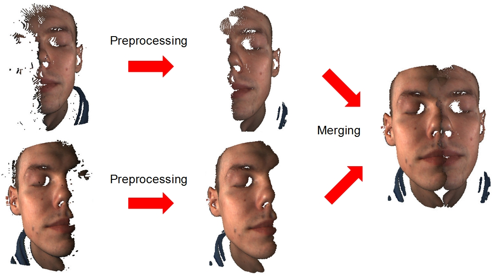

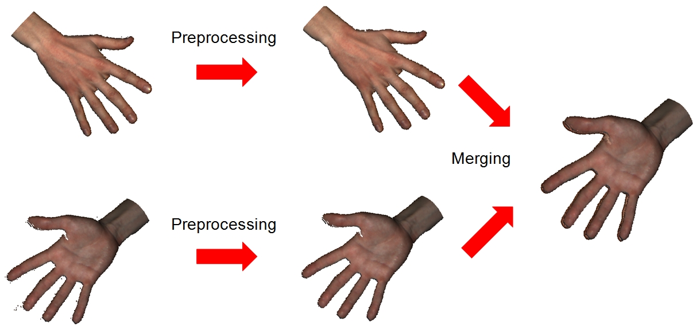

사진출처: 사이트 페이지

##### [EURECOM Kinect Face Dataset (EURECOM KFD)](http://rgb-d.eurecom.fr/)

Kinect에서 얻은 여성 14 명, 남성 38 명에서 얻은 이미지로 구성됩니다. 데이터는 서로 다른 시간대 (약 30 개월)에 발생한 두 세션에서 캡처됩니다. 각 세션에서 데이터 세트는 서로 다른 얼굴 표정, 다른 조명 및 교합 상태 (중립, 미소, 열린 입, 왼쪽 프로필, 오른쪽 프로필, 눈 가림, 입 가림, 종이 가림) 로 각 개인의 얼굴 이미지를 제공합니다. 모든 이미지는 RGB 컬러 이미지, 깊이 맵 및 3D의 세 가지 정보 소스로 제공됩니다. 또한, 데이터 세트는 얼굴에 6 가지 위치의 수동 표식 (왼쪽 눈, 오른쪽 눈, 코 끝, 입의 왼쪽, 입 오른쪽 및 턱)을 제공합니다. 성별, 생년월일, 안경, 각 세션의 캡처 시간 등의 다른 정보도 사용할 수 있습니다.

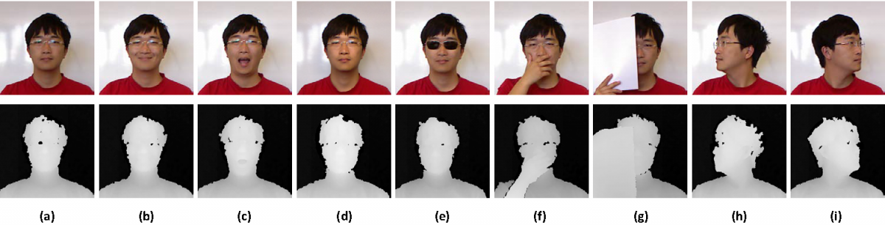

사진출처: 사이트 페이지

#####  [UMB-DB](http://www.ivl.disco.unimib.it/minisites/umbdb//description.html): The University of Milano Bicocca 3D Face Database

143개의 대상이 있습니다. 98명의 남자, 45명의 여자, 아기와 남자도 포함되어 있습니다. 1,473개의 인수가 있습니다. 중립, 웃음, 지루함, 배고픔 4가지 표정이 있습니다. 883개의 가리지 않는 사진이 있습니다. 590개의 가린 사진이 있습니다. 눈, 코, 입에 대한 주석이 있습니다.

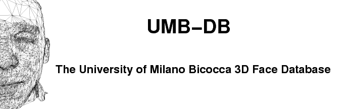

사진출처: 사이트 페이지

##### [Texas 3D Face Recognition Database (Texas 3DFRD)](http://live.ece.utexas.edu/research/texas3dfr/)

1149 개의 2D 및 3D 얼굴 이미지로 구성되었습니다.

##### [3D Basel Face Model (BFM)](https://faces.dmi.unibas.ch/bfm/index.php?nav=1-0&id=basel_face_model)

Morphable Model은 100 명의 남성과 100 명의 여성 얼굴의 등록 된 3D 스캔으로부터 계산됩니다. 학술 연구 및 교육에 응용 및 실험을 위해 BFM과 추가 데이터를 배포합니다.

- [Paper: A 3D Face Model for Pose and Illumination Invariant FaceRecognition](https://gravis.dmi.unibas.ch/publications/2009/BFModel09.pdf)

##### [3D Face Scans & Renderings](https://faces.dmi.unibas.ch/bfm/index.php?nav=1-1-1&id=scans)

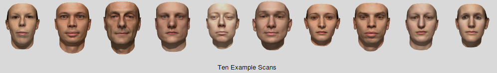

##### [Basel Face Model](https://faces.dmi.unibas.ch/bfm/index.php?nav=1-1-0&id=details)

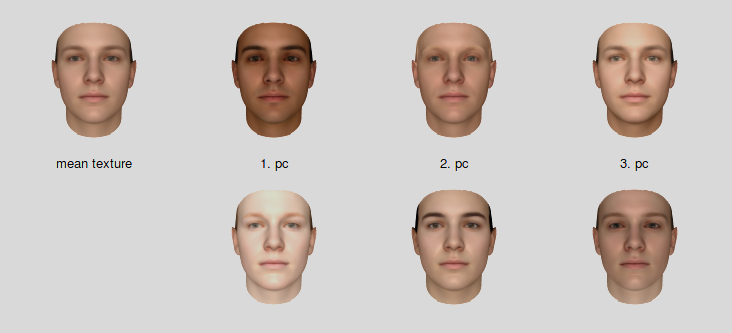

[Coefficients for Face Recognition Experiments](https://faces.dmi.unibas.ch/bfm/index.php?nav=1-1-2&id=experiments)

##### [Probabilistic Morphable Models (PMMs)](http://gravis.dmi.unibas.ch/PMM/)

PMM은 "합성에 의한 분석"접근법을 사용하는 모델 기반 이미지 분석을 위한 확률론적 프레임워크입니다. 프레임워크는 통계 객체 모델링을 위한 구성 요소와 새로운 데이터에 그러한 모델을 적용하기위한 구성 요소로 나뉩니다. 새로운 데이터 분석은 MCMC 최적화를 사용하여 통계 객체 모델을 데이터에 적용하여 수행됩니다.

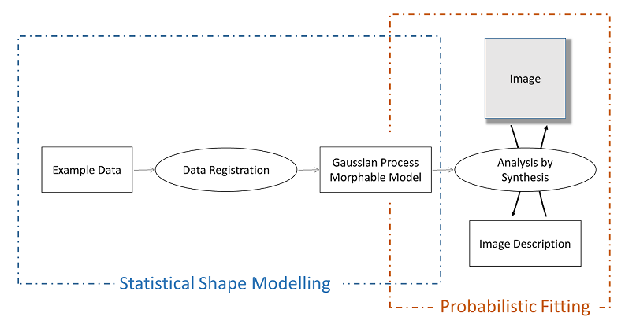

##### [BJUT 3D Face](http://www.escience.cn/people/huyongli/3Dface.html)

500 명의 중국인, 250 명의 여성 및 250 명의 남성의 3D 얼굴 데이터를 포함합니다. 3D 얼굴 데이터는 CyberWare 3D 스캐너로 수집 되었습니다.

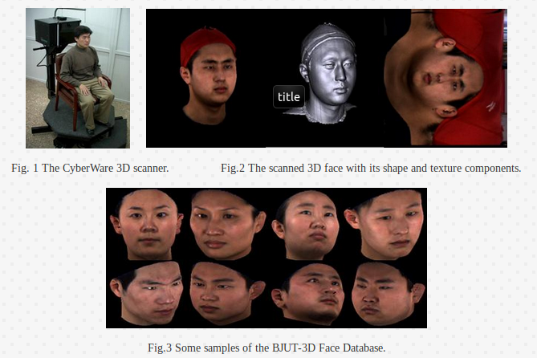

### Facial Pose (Expression)

##### [VT-KFER: A Kinect-based RGBD+Time Dataset for Spontaneous and Non-Spontaneous Facial Expression Recognition](http://sufficiency.ece.vt.edu/VT-KFER/)

T-KFER 데이터 세트는 스크립팅 (행동) 시나리오와 스크립트되지 않은 (자발적) 시나리오에서 Kinect 1.0 센서를 사용하여 수집 한 RGBD + 시간 표정 인식 데이터 세트입니다. 이 완전히 주석이 달린 데이터 세트는 10 세에서 30 세까지 다른 피부 색조를 가진 32 명의 피험자 (남성과 여성)에 대한 7 가지 표현 (행복, 슬픔, 놀람, 혐오, 두려움, 분노 및 중립)을 포함합니다. 

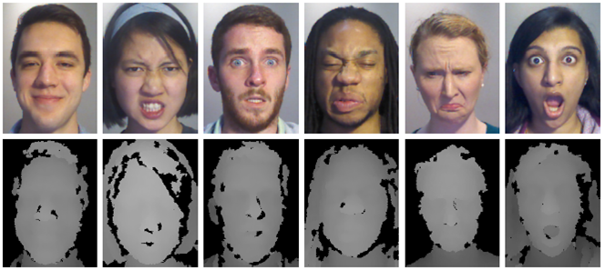

사진출처: 사이트 페이지

##### [Biwi 3D Audiovisual Corpus of Affective Communication](http://www.vision.ee.ethz.ch/datasets/b3dac2.en.html)

코퍼스는 14 명의 원어민 화자 (남성 6 명, 여성 8 명)가 총 1109 개의 문장으로 구성됩니다. 실시간 3D 스캐너와 전문 마이크를 사용하여 얼굴 움직임과 스피커의 음성을 캡처했습니다.

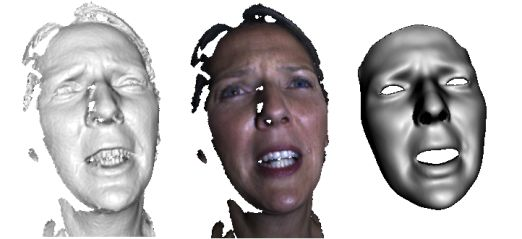

사진출처: 사이트 페이지

##### [Facial Expression Research Group Database (FERG-DB)](http://grail.cs.washington.edu/projects/deepexpr/ferg-db.html)

FERG-DB는 표정 주석이 붙은 캐릭터 데이터베이스입니다. 데이터베이스에는 6개의 양식화 된 문자로 구성된 여러 얼굴 이미지가 들어 있습니다. 캐릭터는 MAYA소프트웨어를 사용하여 모델링되었고 2D로 렌더링되어 이미지를 만들었습니다. 데이터베이스에는 6 개의 양식 된 문자의 표정 이미지가 포함되어 있습니다. 각 캐릭터의 이미지는 분노, 혐오감, 두려움, 기쁨, 중립, 슬픔 및 놀라움의 7 가지 유형으로 그룹화됩니다.

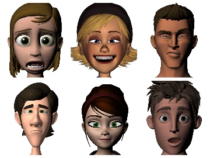

사진출처: 사이트 페이지

##### [i-bug: 300 Faces In-the-Wild Challenge (300-W), ICCV 2013](https://ibug.doc.ic.ac.uk/resources/300-W/)

사진 출처: 사이트 페이지

##### [300 Videos in the Wild (300-VW) Challenge & Workshop (ICCV 2015)](https://ibug.doc.ic.ac.uk/resources/300-VW/)

Wild (300-VW) 데이터 세트의 300 개 비디오에는 얼굴 표식 추적을 위한 비디오가 포함되어 있습니다. 특히,이 데이터 세트에는 114 개의 비디오가 포함되어 있으며 68 개의 마크 업 랜드 마크 포인트가 주석으로 표시됩니다.

사진출처: 사이트 페이지

##### [Helen Dataset](http://www.ifp.illinois.edu/~vuongle2/helen/)

2000개의 훈련 데이터와 330개의 테스트 데이터를 포함하고 있습니다. 

사진출처: [Helen Dataset](http://www.ifp.illinois.edu/~vuongle2/helen/)

##### [1st 3D Face Tracking in-the-wild Competition](https://ibug.doc.ic.ac.uk/resources)

<iframe width="640" height="480" src="https://www.youtube.com/embed/HkwkLnPhzic" frameborder="0" allow="accelerometer; autoplay; encrypted-media; gyroscope; picture-in-picture" allowfullscreen></iframe>

영상출처: 사이트페이지, 유튜브

##### [LS3D=W](https://www.adrianbulat.com/face-alignment)

<iframe width="640" height="480" src="https://www.youtube.com/embed/8FdSHl4oNIM" frameborder="0" allow="accelerometer; autoplay; encrypted-media; gyroscope; picture-in-picture" allowfullscreen></iframe>

영상출처: 사이트 페이지, 유튜브

### Image Pose

##### [Berkeley MHAD](http://tele-immersion.citris-uc.org/berkeley_mhad)

버클리의 MHAD (Multimodal Human Action Database)는 23 세에서 30세 사이의 남성 7명과 여성 5명이 수행하는 11가지 행동을 포함합니다. 모든 피실험자는 각 동작을 5회 반복하여 약 660 회의 동작 시퀀스를 산출했으며 총 녹화 시간은 약 82 분에 해당합니다. 또한, 각 피험자에 대한 T- 포즈가 기록되어 있으며, 이는 골격 추출에 사용될 수 있습니다.

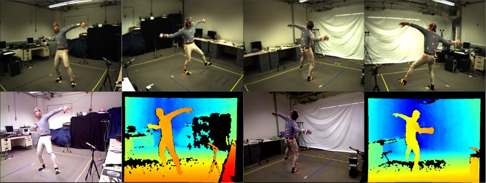

##### [Two-persion Interaction Detection Using Body-Pose Features and Multiple Instance Learing](https://www3.cs.stonybrook.edu/~kyun/research/kinect_interaction/index.html)

인간 활동 인식을 연구하기 위한 데이터셋으로 깊이 센서와 컬러 센서로 녹화된 영상입니다.

사진출처: [Two-person Interaction Detection Using Body-Pose Features and Multiple Instance Learning]()

### Image Classification

##### [Stanford Dogs Dataset: ](http://vision.stanford.edu/aditya86/ImageNetDogs/)

20,580 개의 이미지와 120 개의 다른 개 유형을 포함합니다.

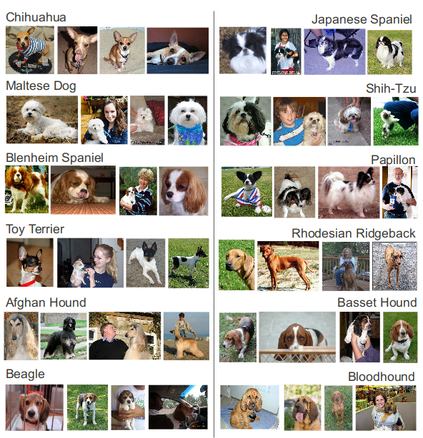

사진출처: 사이트 페이지 [페이퍼](http://vision.stanford.edu/aditya86/ImageNetDogs/)

##### [CIFAR-10](https://www.cs.toronto.edu/~kriz/cifar.html):

10 클래스로 60,000개의 32 × 32 컬러 이미지를 포함합니다.

##### [Places](http://places.csail.mit.edu/index.html):

205 개의 장면 범주와 250 만 개의 범주 레이블이있는 장면 중심 데이터베이스입니다.

### Image Segmentation

##### [DAVIS: Densely Annotated VIdeo Segmentation](https://davischallenge.org/)

DAVIS (Densely Annotated VIdeo Segmentation)는 오클루전, 모션 블러 및 모양 변경과 같은 공통 비디오 객체 세분화 문제가 여러 번 발생하는 50개의 고품질 풀 HD 비디오 시퀀스로 구성됩니다. 각 비디오는 조밀한 주석을 달고, 픽셀 단위로 정확한 프레임 단위의 Ground truth 분할을 가지고 있습니다.

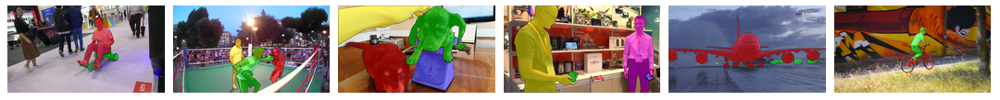

##### [Labelme](http://labelme.csail.mit.edu/Release3.0/index.php?message=1):

MIT Computer Science and Artificial  Intelligence Laboratory (CSAIL) 에 의해 제작되었고, 187,240개의 이미지와 62,197 주석된 이미지, 658,992개의 라벨링된 개체로 구성되었습니다.

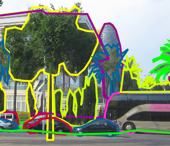

사진출처: [사이트 페이지](http://labelme.csail.mit.edu/Release3.0/index.php?message=1)

##### [BSDS300](https://www2.eecs.berkeley.edu/Research/Projects/CS/vision/bsds/)

이미지 여역을 검출합니다.

##### [BSDS500](https://www2.eecs.berkeley.edu/Research/Projects/CS/vision/grouping/resources.html)

이미지 외곽선을 검출합니다.

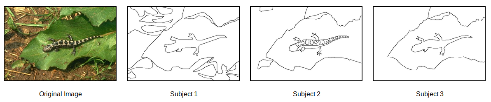

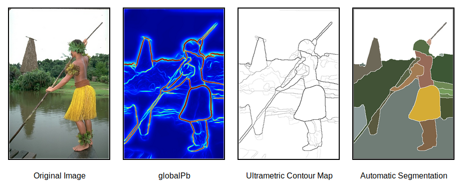

### Image Detection (Classification + Localization)

##### [FIRE: Fundus Image Registration Dataset](https://www.ics.forth.gr/cvrl/fire/)

이 데이터셋은 134 개의 이미지 쌍을 형성하는 129 개의 망막 이미지로 구성 되어 있습니다. 특성에 따라 3 가지 카테고리로 나뉩니다. 이미지는 Nidek AFC-210 안저 카메라로 촬영되었으며,이 카메라는 x와 y 차원에서 2912x2912 픽셀의 해상도와 45°의 FOV 해상도로 이미지를 수집합니다.

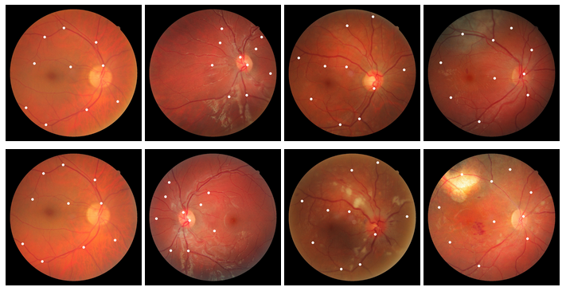

##### [NIH Clinical Center releases dataset of 32,000 CT images ](https://www.nih.gov/news-events/news-releases/nih-clinical-center-releases-dataset-32000-ct-images)

NIH 보건 센터는 과학계가 병변의 탐지 정확도를 높이는 데 도움이되는 공개적으로 이용 가능한 CT 이미지의 대규모 데이터 세트를 만들었습니다.  DeepLesion이라는이 데이터 세트는 CT 영상에서 확인 된 32,000개가 넘는 병변을 가지고 있습니다.

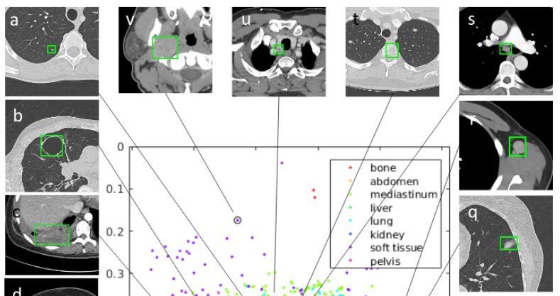

- [Download](https://nihcc.app.box.com/v/DeepLesion)

##### [GSTRB: The German Traffic Sign Recognition Benchmark](http://benchmark.ini.rub.de/?section=gtsrb&subsection=news)

독일 교통 표지판 벤치마크 데이터 입니다. 단일 이미지 또는 다중 클래스 분류 문제로 40개의 클래스가 있으며, 50,000개 이상의 이미지가 포함되어 있습니다. 

### Machine Understanding

##### [LSUN](https://www.yf.io/p/lsun):

많은 부수적인 태스크 (공간 레이아웃 추정, 돌출 성 예측 등)를 이해하기 위한 씬 이미지들입니다. [Paper](https://arxiv.org/abs/1506.03365)

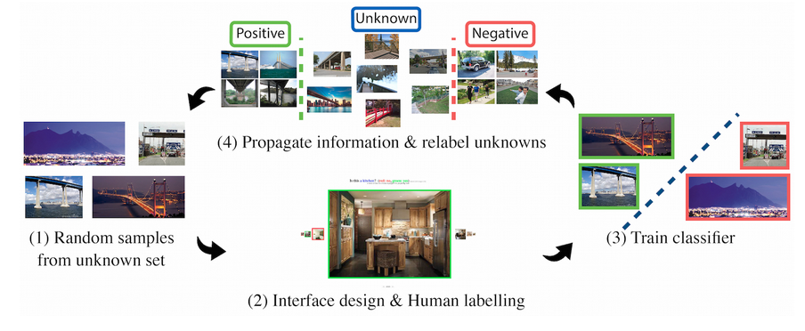

출처: https://www.yf.io/p/lsun

##### [Visual Genome](http://visualgenome.org/):

캡션이 달린 매우 상세한 시각적 지식 베이스를 위한 100,000개의 이미지들 입니다.

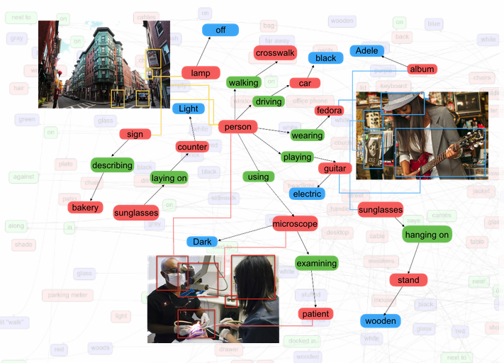

##### [Google’s Open Images](https://research.googleblog.com/2016/09/introducing-open-images-dataset.html):

크리에이티브 커먼즈 (Creative Commons)의 "6,000 개가 넘는 레이블에 주석이 달린" 이미지에 9 백만 개의 URL 모음입니다.

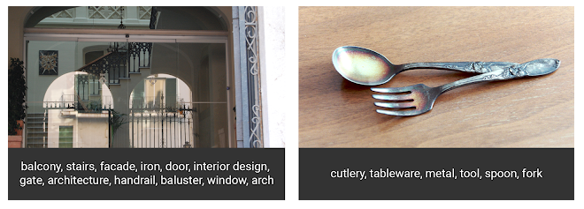

##### [Home Objects](http://www.vision.caltech.edu/pmoreels/Datasets/Home_Objects_06/):

주로 부엌, 욕실 및 거실에서 가져온 집안의 임의의 개체가 포함 이미지 데이터셋입니다.

### Image Features

##### [CompCars](http://mmlab.ie.cuhk.edu.hk/datasets/comp_cars/index.html):

최대 속도, 변위, 문 개수, 좌석 수 및 차량 유형을 포함하여 각 자동차 모델에 1,716 개의 자동차 모델이 포함 된 163 종의 자동차가 포함 되어 있습니다.

##### [Plant Image Analysis](https://www.plant-image-analysis.org/dataset):

1백만개의 식물 이미지 데이터셋으로 11종의 식물 중에서 선택할 수 있습니다.

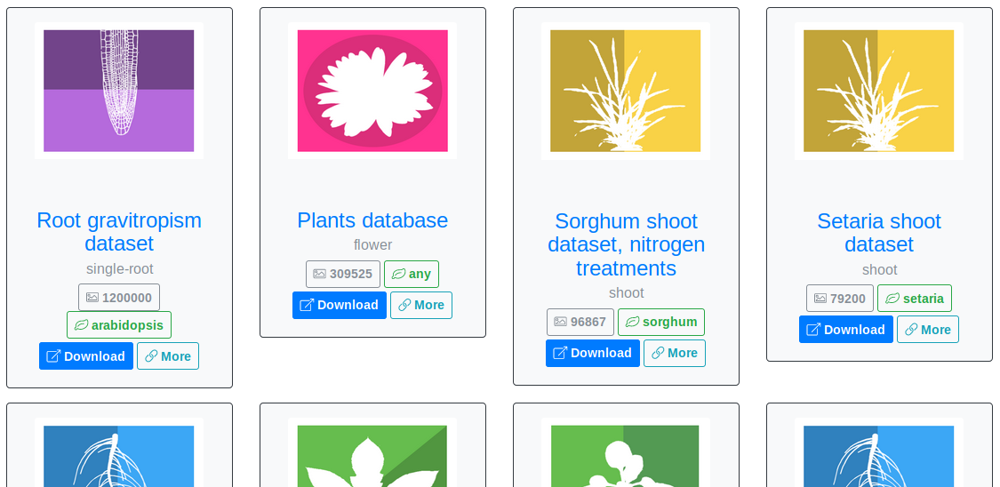

### [Flowers](http://www.robots.ox.ac.uk/~vgg/data/flowers/102/index.html):

영국에서 흔히 볼 수있는 꽃의 이미지 데이터셋으로 102 가지 카테고리로 구성됩니다.

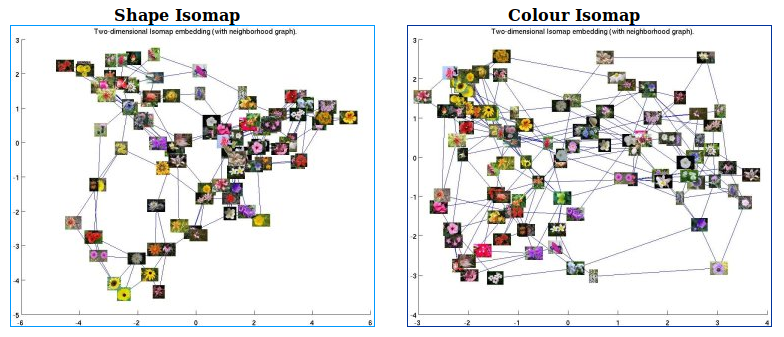

### Image Recognition

##### [Indoor Scene Recognition](http://web.mit.edu/torralba/www/indoor.html):

67개의 실내 카테고리와 총 15,620 개의 이미지가 포함되어 있습니다.

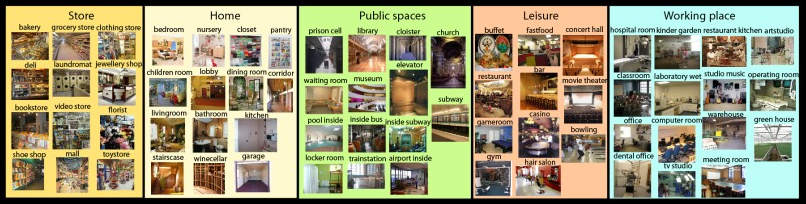

### Image Captionning

##### [VisualQA](http://www.visualqa.org/):

VQA는 265,016 개의 이미지에 대한 자유로운 질문을 포함하는 데이터셋으로 질문 할 때 시각과 언어에 대한 이해가 필요합니다.

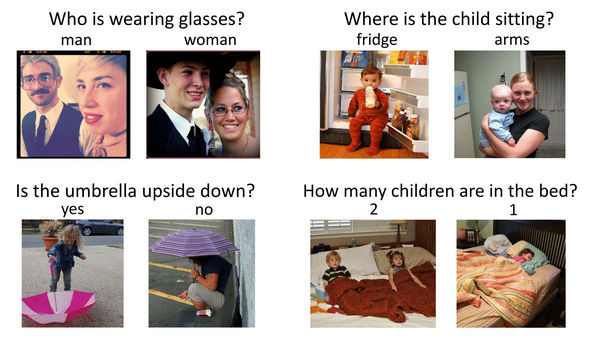

### Image Change

Change Detection 데이터베이스는 옵티컬 플로 및 스테레오 비전을 위한 Middlebury 데이터 세트와 마찬가지로 변경 및 동작 감지를위한 기존 및 새로운 알고리즘을 테스트하고 순위를 매기기 위해 엄격하고 포괄적인 학업 벤치 마킹 노력을 캡슐화합니다. 새로운 데이터 세트는 2012 년 봄 CVPR 2012 변경 감지 워크샵 과제의 일부로 개발되었으며 학계 및 업계의 피드백을 기반으로 정기적으로 개정되고 확장 될 예정입니다. 이 웹 사이트는 앞으로 수년 동안 포괄적 인 방법 순위를 유지합니다.

[Change Detection Database](http://www.changedetection.net/)

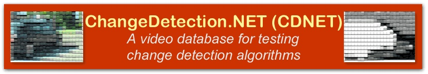

### 3D

##### [The Stanford 3D Scanning Repository](http://www.graphics.stanford.edu/data/3Dscanrep/)

##### [Lego Bricks (Kaggle)](https://www.kaggle.com/joosthazelzet/lego-brick-images):

폴더별로 분류 된 16 가지 레고 블록과 블렌더를 사용하여 렌더링 한 컴퓨터의 6400 이미지가 포함되어 있습니다.

##### [COIL100 ](http://www1.cs.columbia.edu/CAVE/software/softlib/coil-100.php):

360도 회전으로 모든 각도에서 100 개의 다른 물체를 촬영했습니다. [Paper](http://citeseerx.ist.psu.edu/viewdoc/download?doi=10.1.1.360.6420&rep=rep1&type=pdf)

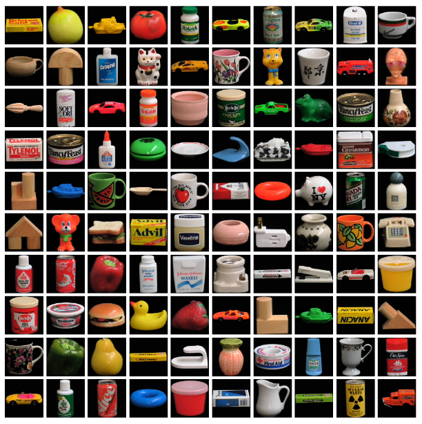

##### [NYU Depth Dataset V2](https://cs.nyu.edu/~silberman/datasets/nyu_depth_v2.html)

주어진 2차원 영상과 깊이 영상으로 엣지를 검출합니다.

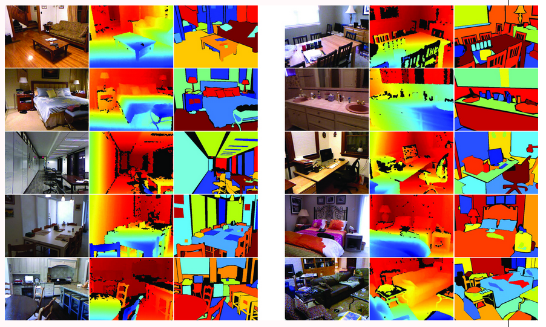

### Total Datasets

##### [MS COCO](http://mscoco.org/):

COCO는 대규모 개체 인식, 세그먼테이션 및 자막 데이터 집합입니다. 개체 세그먼테이션, 문맥 인식, 수퍼픽셀 세그먼테이션으로 330,000개의 이미지, 200,000개의 레이블, 1,500,000개의 개체 인스턴스, 80개의 개체 카테고리, 91개의 stuff 카테고리, 이미지당 5개의 캡션을, 250,000명의 사람과 키포인트를 가지고 있습니다. [Paper](https://arxiv.org/abs/1405.0312), [Python API](https://github.com/cocodataset/cocoapi/blob/master/PythonAPI/pycocotools/coco.py)

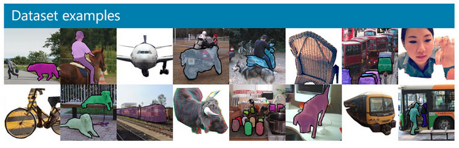

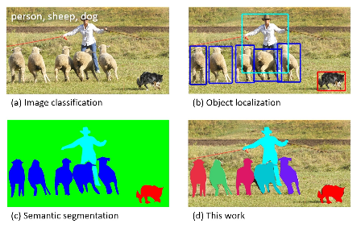

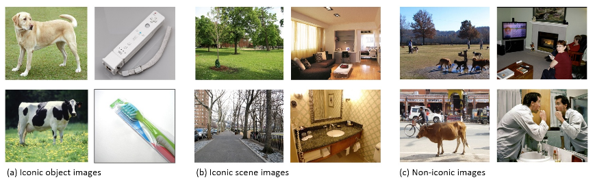

##### [ImageNet](http://image-net.org/):

새로운 알고리즘을 위한 de-facto 이미지 데이터셋. 계층 구조의 각 노드가 수백, 수천 개의 이미지로 표시되는 WordNet 계층 구조에 따라 구성되어 있습니다.

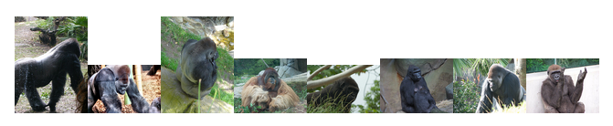

##### [Youtube-8M](https://research.google.com/youtube8m/index.html):

수백 개의 YouTube 동영상 ID와 3,800 개가 넘는 시각적 개체로 구성된 대규모 라벨 데이터 세트입니다.

##### [The PASCAL Visual Object Classes Homepage](http://host.robots.ox.ac.uk/pascal/VOC/)

객체 클래스 인식을 위한 표준화 된 이미지 데이터 세트를 제공합니다.

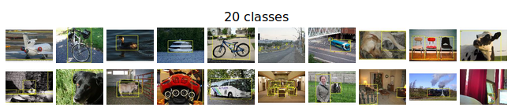

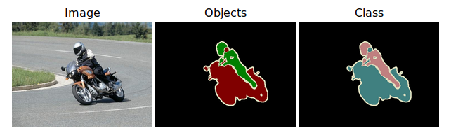

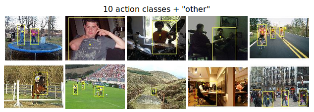

[사진출처](http://host.robots.ox.ac.uk/pascal/VOC/voc2012/index.html)

## 참조

- [Computer Vision Online](https://computervisiononline.com/datasets)
- [20 Free Image Datasets for Computer Vision](https://gengo.ai/datasets/20-best-image-datasets-for-computer-vision/)
- [CV Datasets on the Web](http://www.cvpapers.com/datasets.html)
- [Search Engine for Computer Vision Datasets](https://www.visualdata.io/)
- [CVonline: Image Databases](CVonline: Image Databases)
- [Computer Vision Datasets](http://www.cs.utexas.edu/~grauman/courses/spring2008/datasets.htm)

## 기타

- [CVLab@StonyBrook](https://www3.cs.stonybrook.edu/~cvl/dataset.html)
  - [Graph Based Deformable Registration](https://www3.cs.stonybrook.edu/~cvl/expressionModeling.html)