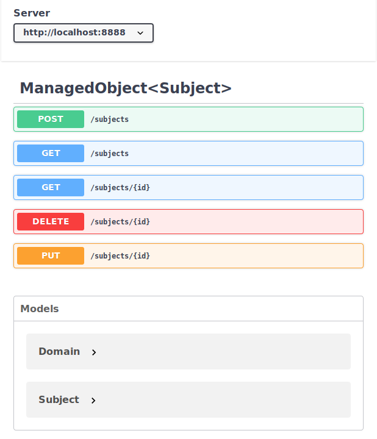

# Dart로 서비스 개발하기

이 문서는 Dart 언어로 서비스를 개발하는 과정을 설명하며 사용되는 기술은 아래와 같습니다.

###### Ubuntu 18.04 LTS

###### Dart

Dart는 구글이 웹 프론트엔드 언어로 개발하였으며, 웹 프론트엔드, 서버(웹 백엔드), 모바일 네이티브, 데스크탑 네이티브, 임베디드 애플리케이션을 개발 할 수 있습니다. 풀스택 언어라고 할 수 있으며, JavaScript와 달리 강력한 정적 타이핑 언어이며, 자바나 C# 등을 사용하는 개발자가 혼란없이 사용하기에 적당합니다. 

###### Aqueduct

Aqueduct는 .NET의 LINQ와 유사한 ORM을 지원하는 웹 백엔드 프레임워크이며 Dart 언어로 작성되었습니다. 기본적으로 MVC 패턴을 지원합니다.

###### PostgreSQL

PostgreSQL은 오래된 RDBMS임에도 불구하고 사용층은 적습니다. 트위터가 초기에 PostgreSQL로 만들어졌습니다. Active/Active 이중화를 지원하지 않아, Replica를 해야 합니다.

###### Flutter

구글이 내부 프로젝트로 진행하다가 2018년 4월에 발표한 모바일 프레임워크입니다. Reactive Native와 달리 웹 기반이 아닌 네이티브로 빌드 됩니다. Flutter를 데스크탑과 웹으로 이식한 프레임워크도 있습니다.

## 필수

- OS: Ubuntu 18.04 LTS (시스템 구성이 엄격하여 리소스 관리에 대한 기본 커뮤니케이션이 쉽습니다.)
- RAM: 8G 이상.
- CPU: i3 이상.

## 준비

### PostgreSQL 설치

#### 서버 설치 확인

```sh
$ aptitude show postgresql | grep State
```

설치되지 않았다면

```
State: not installed
```

입니다.

##### 모두 설치

개인 개발 환경에 설치하면 모두 설치해야 합니다.

```sh
$ sudo apt install postgresql postgresql-contrib
```

##### 클라이언트만 설치

팀 개발 환경이나 프러덕션은 별도의 서버가 있으므로 클라이언트만 설치합니다.

```sh
$ sudo apt install postgresql-client
```

##### 서버 설치 확인

```sh
$ dpkg -l | grep postgres
```

```
ii  postgresql                                 10+190                                       all          object-relational SQL database (supported version)
ii  postgresql-10                              10.8-0ubuntu0.18.04.1                        amd64        object-relational SQL database, version 10 server
ii  postgresql-client-10                       10.8-0ubuntu0.18.04.1                        amd64        front-end programs for PostgreSQL 10
ii  postgresql-client-common                   190                                          all          manager for multiple PostgreSQL client versions
ii  postgresql-common                          190                                          all          PostgreSQL database-cluster manager
```

##### postgres 계정 확인

PostgreSQL 관리자 계정은 `postgres`입니다. 계정을 확인합니다.

```sh
$ cat /etc/passwd | grep postgres
```

`/etc/passwd`의 가장 마지막에 추가 되었을 것입니다.

```
postgres:x:127:135:PostgreSQL administrator,,,:/var/lib/postgresql:/bin/bash
```

##### 서버 상태 확인

```sh
$ /etc/init.d/postgresql status
```

```
- postgresql.service - PostgreSQL RDBMS
   Loaded: loaded (/lib/systemd/system/postgresql.service; enabled; vendor preset: enabled)
   Active: active (exited) since Thu 2019-06-06 20:42:21 KST; 1min 38s ago
 Main PID: 9441 (code=exited, status=0/SUCCESS)
    Tasks: 0 (limit: 4915)
   CGroup: /system.slice/postgresql.service

 6월 06 20:42:21 booil1804 systemd[1]: Starting PostgreSQL RDBMS...
 6월 06 20:42:21 booil1804 systemd[1]: Started PostgreSQL RDBMS.
```

##### 네트워크 확인

```sh
$ sudo netstat -tnlp | grep postgres
```

```
tcp        0      0 127.0.0.1:5432          0.0.0.0:*               LISTEN      11354/postgres
```

##### 서버가 사용하는 디렉토리 확인

```sh
$ ps auxw |  grep postgres | grep -- -D
```

```
postgres   925  0.0  0.2 327968 27428 ?        S    09:12   0:00 /usr/lib/postgresql/10/bin/postgres -D /var/lib/postgresql/10/main -c config_file=/etc/postgresql/10/main/postgresql.conf
```

여기서

- `/usr/lib/postgresql/10/bin/postgres` 실행파일이나 셸스크립트 파일들입니다.
- `/var/lib/postgresql/10/main` 데이터베이스 파일들입니다.
- `/etc/postgresql/10/main/postgresql.conf` 구성 파일입니다.

##### psql 확인

```sh
$ psql -V
```

```
psql (PostgreSQL) 10.8 (Ubuntu 10.8-0ubuntu0.18.04.1)
```

##### psql 접속

postgresql을 설치하면, 최고 관리 계정인 postgres 계정이 생성 됩니다. 이 계정에 접속하려면 `postgres` 유저로 로그인하고:

```sh
$ sudo -i -u postgres
```

psql에 접속을 합니다.

```sh
$ psql
```

이 두  단계의 psq 접속 과정은 하나로 할 수도 있습니다.

```sh
$ sudo -u postgres psql
```

##### 패스워드 변경

관리자의 패스워드를 변경합니다.

```
postgres=# alter user postgres with password '새패스워드';
```

##### 로그아웃

```
postgres=# \q
```

#### 다른 유저 로그인

GUI 등으로 로그인하기 위해서는 현재 사용자 계정으로 접속 할 수 있어야 합니다. 새 사용자를 만들어 보겠습니다.

##### 유저 목록 조회

```
postgres=# \du
```

##### 유저 생성

```
postgres=# CREATE USER 유저이름 with PASSWORD '패스워드' SUPERUSER LOGIN;
```

### Dart 설치

먼저 apt 저장소 키를 등록 합니다.

```sh
$ sudo sh -c 'curl https://dl-ssl.google.com/linux/linux_signing_key.pub | apt-key add -'
$ sudo sh -c 'curl https://storage.googleapis.com/download.dartlang.org/linux/debian/dart_stable.list > /etc/apt/sources.list.d/dart_stable.list'
```

설치를 합니다.

```sh
$ sudo apt-get update
$ sudo apt-get install dart
```

`~/.profile` 파일을 수정하여 경로를 추가합니다.

```sh
# dart
export PATH="$PATH:/usr/lib/dart/bin/"
```

변경사항을 로드 합니다.

```sh
$ source ~/.profile
```

### Aqueduct 설치

##### Dart 설치 확인

```sh
$ dart --version
```

##### Aqueduct 설치

```sh
$ pub global activate aqueduct
```

### 프로젝트 생성

ORM은 Object Relational Mapping으로 .NET의 LINQ에 해당합니다. ORM으로 개발하면 SQL 질의문 작성과 데이터 파싱 과정에서 발생하는 오류를 줄일 수 있습니다.

#### ORM 없이 프로젝트 생성

```sh
$ aqueduct create 프로젝트이름
```

#### ORM으로 프로젝트 생성

```sh
$ aqueduct create -t db 프로젝트이름
```

여기서 `-t`는 복사해올 탬플릿 프로젝트를 의미하며 실행시 다음과 같습니다.

```
-- Aqueduct CLI Version: 3.2.1
    Template source is: /home/유저이름/.pub-cache/hosted/pub.dartlang.org/aqueduct-3.2.1/templates/db/
    See more templates with 'aqueduct create list-templates'
-- Copying template files to new project directory (/media/ntdata/workspace/프로젝트폴더)...
    Copying contents of /home/booil/.pub-cache/hosted/pub.dartlang.org/aqueduct-3.2.1/templates/db/test
    Copying contents of /home/booil/.pub-cache/hosted/pub.dartlang.org/aqueduct-3.2.1/templates/db/.travis.yml
    Copying contents of /home/booil/.pub-cache/hosted/pub.dartlang.org/aqueduct-3.2.1/templates/db/README.md
    Copying contents of /home/booil/.pub-cache/hosted/pub.dartlang.org/aqueduct-3.2.1/templates/db/web
    Copying contents of /home/booil/.pub-cache/hosted/pub.dartlang.org/aqueduct-3.2.1/templates/db/bin
    Copying contents of /home/booil/.pub-cache/hosted/pub.dartlang.org/aqueduct-3.2.1/templates/db/analysis_options.yaml
    Copying contents of /home/booil/.pub-cache/hosted/pub.dartlang.org/aqueduct-3.2.1/templates/db/config.src.yaml
    Copying contents of /home/booil/.pub-cache/hosted/pub.dartlang.org/aqueduct-3.2.1/templates/db/.gitignore
    Copying contents of /home/booil/.pub-cache/hosted/pub.dartlang.org/aqueduct-3.2.1/templates/db/pubspec.yaml
    Copying contents of /home/booil/.pub-cache/hosted/pub.dartlang.org/aqueduct-3.2.1/templates/db/lib
    Generating config.yaml from config.src.yaml.
-- Fetching project dependencies (pub get --no-packages-dir )...
-- Please wait...
The --packages-dir flag is no longer used and does nothing.
Resolving dependencies...
+ analyzer 0.35.4 (0.36.3 available)
+ aqueduct 3.2.1
+ aqueduct_test 1.0.1
+ args 1.5.2
+ async 2.2.0
+ boolean_selector 1.0.4
+ charcode 1.1.2
+ codable 1.0.0
+ collection 1.14.11
+ convert 2.1.1
+ crypto 2.0.6
+ front_end 0.1.14 (0.1.18 available)
+ glob 1.1.7
+ http 0.12.0+2
+ http_multi_server 2.1.0
+ http_parser 3.1.3
+ io 0.3.3
+ isolate_executor 2.0.2+3
+ js 0.6.1+1
+ json_rpc_2 2.1.0
+ kernel 0.3.14 (0.3.18 available)
+ logging 0.11.3+2
+ matcher 0.12.5
+ meta 1.1.7
+ mime 0.9.6+3
+ multi_server_socket 1.0.2
+ node_preamble 1.4.4
+ open_api 2.0.1
+ package_config 1.0.5
+ package_resolver 1.0.10
+ password_hash 2.0.0
+ path 1.6.2
+ pedantic 1.7.0
+ pool 1.4.0
+ postgres 1.0.2
+ pub_cache 0.2.3
+ pub_semver 1.4.2
+ safe_config 2.0.2
+ shelf 0.7.5
+ shelf_packages_handler 1.0.4
+ shelf_static 0.2.8
+ shelf_web_socket 0.2.3
+ source_map_stack_trace 1.1.5
+ source_maps 0.10.8
+ source_span 1.5.5
+ stack_trace 1.9.3
+ stream_channel 2.0.0
+ string_scanner 1.0.4
+ term_glyph 1.1.0
+ test 1.6.3 (1.6.4 available)
+ test_api 0.2.5 (0.2.6 available)
+ test_core 0.2.5 (0.2.6 available)
+ typed_data 1.1.6
+ vm_service_client 0.2.6+2
+ watcher 0.9.7+10
+ web_socket_channel 1.0.13
+ yaml 2.1.15
Changed 57 dependencies!
Precompiling executables...
Precompiled test:test.
Precompiled aqueduct:aqueduct.
    Success.
-- New project '프로젝트이름' successfully created.
    Project is located at /media/ntdata/workspace/프로젝트폴더
    Open this directory in IntelliJ IDEA, Atom or VS Code.
    See /media/ntdata/workspace/프로젝트폴더/README.md for more information.
```


### 데이터베이스

Aquduct ORM은 PostgreSQL만을 지원합니다.

#### 테이블스페이스가 사용할 폴더 생성

리눅스에서 데이터베이스나 로그 파일들은 `/var/lib/` 폴더에 생성되고 저장됩니다. Oracle과 PostgreSQL에서 테이블스페이스는 독립된 데이터 저장을 위한 파일 그룹입니다. Oracle은 데이터베이스나 스키마 개념이 없이 테이블스페이스가 있지만, PostgreSQL은 테이블스페이스, 데이터베이스, 스키마를 각각 지정해 주어야 합니다.

Ubuntun 18.04 LTS 상에서 PostgreSQL 테이블스페이스를 위한 폴더를 `/var/lib/`폴더에 생성합니다.  수퍼유저 권한으로 생성하여 소유권을 `postgres`  계정에 넘깁니다.

```sh
sudo mkdir /var/lib/폴더이름/
sudo chown -R postgres /var/lib/폴더이름/

sudo mkdir /var/lib/폴더이름/서브폴더이름/
sudo chown -R postgres /var/lib/폴더이름/서브폴더이름/

# 기타 로그 폴더 등도 생성.
```

#### 테이블스페이스를 사용할 유저 생성

```Sql
CREATE USER 유저이름 WITH createdb login;
ALTER USER 유저이름 WITH password '패스워드';
```

#### 테이블스페이스 생성

```
CREATE TABLESPACE 테이블스페이스이름 OWNER 유저이름 LOCATION '/var/lib/폴더이름/서브폴더이름/';
```

#### 데이터베이스 생성

```sql
GRANT all ON DATABASE 데이터베이스이름 TO 유저이름;
CREATE DATABASE 데이터베이스이름;
```

#### PostgreSQL에서 SCHEME

일반적으로 DBMS에서 스키마는 테이블 이름이라던지 컬럼 구성이라던지, 컬럼과 컬럼의 관계라던지 데이터베이스를 구성하는 일종의 메타 정보를 말합니다. PostgreSQL에서 `SCHEME`는 프로그래밍 언어의 네임스페이스에 해당합니다. Oracle에서는 `TABLESPACE`가 `DATABASE`와 `SCHEME` 에 해당하고, MySQL, MS SQL Server에서는 `DATABASE`가 `TABLESPACE`와 `SCHEME`에 에 해당합니다. 다른 DBMS는 테이블스페이스나 데이터베이스 하나로 퉁치는데, PostgreSQL은 테이블스페이스, 데이터베이스, 스키마를 따로 지정한다고 보시면 됩니다. 별도로 데이터베이스에 스키마를 생성하지 않더라도 기본적으로  `public` 스키마가 사용됩니다.

##### 스키마 생성

```sql
CREATE SCHEME 스키마이름 TABLESPACE 테이블스페이스;
```

매뉴얼에 이렇게 한다고 나오는데 해보면 되지 않습니다. 다만, DBeaver에서 생성은 되었습니다. 중요한 것은 Aqueduct의 ORM이 스키마를 지원하지 않는 것으로 보입니다. 소스 코드까지 읽어 봤지만 스키마를 지정하는 방법을 현재 찾지 못했습니다. 현재 기본적으로 `public` 스키마를 사용해야 하는 것으로 보입니다.


#### Aueduct 데이터베이스 구성 파일

Aqueduct가 생성한 프로젝트에서 데이터베이스 구성 파일은 프로젝트 폴더의 `config.yaml` 이며 내용은:

```yaml
database:
 username: 데이터베이스유저이름 (기본값 dart)
 password: 데이터베이스유저의패스워드 (기본값 dart)
 host: 데이터베이스호스트이름 (기본값 localhost)
 port: 데이터베이스포트 (기본값 5432)
 databaseName: 데이터베이스이름 (기본값 dart_test)
```

입니다.


### 프로젝트 테스트

#### 단위 테스트

```sh
$ pub run test
```

이것을 `utest.sh` 셸스크립트로 만들어 두고 사용합니다.


### 프로젝트 실행

서버를 구동 합니니다.

```sh
$ aqueduct serve
```

또는

```sh
$ dart bin/main.dart
```

```
-- Aqueduct CLI Version: 3.2.1
-- Aqueduct project version: 3.2.1
-- Preparing...
-- Starting application '프로젝트이름/실행파일이름'
    Channel: PoomoapisChannel
    Config: /프로젝트경로/config.yaml
    Port: 8888
[INFO] aqueduct: Server aqueduct/1 started.  
[INFO] aqueduct: Server aqueduct/2 started. 
```

웹 브라우저에서 `localhost:8888/models`로 접속해 봅니다.

aqueduct 서버를 중단하려면 `ctrl+c`를 누릅니다.


### ORM

#### 기본 클래스 구성

`lib/model/model.dart` 파일에 두개의 클래스:

```dart
$ pub run testclass Model extends ManagedObject<_Model> implement _Model {}
class _Model { ... }
```

가 있으며, 이것을 db에 upgrade하면 `_model`이라는 테이블이 만들어지며 이 테이블 이름은 관습에서 벗어납니다. 

#### 테이블 이름 커스터마이징

테이블 이름을 변경하려면 템플릿 클래스에 `@Table(name:테이블이름)`을 지정합니다. 예를 들어 `_Model`이라는 클래스의 테이블 이름은 복수형으로 `models`라고 주는 것이 관습입니다.

```dart
class Model extends ManagedObject<_Model> implement _Model {}
@Table(name:'models')
class _Model { ... }
```

PostgreSQL의  스키마를 지원하려면 `스키마.테이블이름`을 지정해야 할것 같은데, 현재 스키마를 지원하지 않거나, 방법을 모르며, `public` 스키마에 테이블이 생성됩니다.

#### 컬럼 커스터마이징

컬럼에 대한 커스터마이징은 `@Column(...)`으로 지정합니다.

```dart
class Model extends ManagedObject<_Model> implement _Model {}
@Table(name:'models')
class _Model {
	@Column(...)
	int name;
}
```

`@Column()` 메타 클래스의 파라미터는 다음과 같습니다.

| 파라미터        | 파리미터 타입         | 기본값             | 설명                                                         |
| --------------- | --------------------- | ------------------ | ------------------------------------------------------------ |
| `primaryKey`    | `bool`                | `false`            | 기본키를 지정. `nullable=false`, `indexed=true`, `autoincrement=true`속성 |
| `databaseType`  | `ManagedPropertyType` | Dart 타입에서 유추 | 데이터 타입                                                  |
| `nullable`      | `bool`                | `false`            | 값에 null을 지정할 수 있는지 여부                            |
| `defaultValue`  | `String`              | `null`             | 기본값                                                       |
| `unique`        | `bool`                | `false`            | 전체 열에 대해 유일값                                        |
| `indexed`       | `bool`                | `false`            | 고속 검색을 색인 생성, 단 삽입이나 삭제시 색인이 업데이트 되므로 느려진다. |
| `omitByDefault` | `bool`                | `false`            | 이 열을 기본적으로 생략해야 하는지 여부                      |
| `autoincrement` | `bool`                | `false`            | 시퀀스로부터 자동 증가                                       |
| `validators`    | `List<Validate>`      | `const[]`          |                                                              |

`databaseType` 파라미터에서 선택할 수 있는 인자들은 아래와 같습니다.

| enum              | Dart 데이터 타입 | 설명                         | PostgreSQL 컬럼 타입 |
| ----------------- | ---------------- | ---------------------------- | -------------------- |
| `integer`         | `int`            | 정수                         | `INT` 또는 `SERIAL`  |
| `bigInteger`      | `int`            | 정수                         | `INT` 또는 `SERIAL`  |
| `doublePrecision` | `double`         | 부동소수점수                 | `DOUBLE PRECISION`   |
| `string`          | `String`         | 텍스트                       | `TEXT`               |
| `datetime`        | `DateTime`       | 타임스탬프                   | `TIMESTAMP`          |
| `boolean`         | `bool`           | 부울                         | `BOOLEAN`            |
| `document`        | `Document`       | JSON 객체 또는 배열          | `JSONB`              |
|                   | `enum`           | `enum case`로 제한된 텍스트. | `TEXT`               |
| `map`             | `Map`            |                              |                      |
| `list`            | `List`           |                              |                      |

이 `ManagedObject<>` 파일들은 `lib/channel.dart`에서 `import`가 되어야 마이그레이션이 됩니다.

##### @primaryKey

프로퍼티에 `@primaryKey`를 지정하면:

```dart
@Column(primaryKey: true,
	databaseType: ManagedPropertyType.bigInteger,
	autoincrement: true,
	validators: [Validate.constant()])
```

가 지정한 것과 같습니다. 예를들면:

```dart
class Model extends ManagedObject<_Model> implement _Model {}
class _Model {
	@primaryKey
	int id;
}
```

##### @Relation 

`@Relation`은 테이블간의 관계를 구성하며 파라미터는 다음과 같습니다.

| 파라미터              | Dart 데이터 타입 | 설명                                           |
| --------------------- | ---------------- | ---------------------------------------------- |
| `inversePropertyName` | `Symbol`         | 관계되는 [`ManagedObject`]의 속성에 대한 심볼. |
| `onDelete`            | `DeleteRule`     | 관련 인스턴스가 삭제 될 때 사용할 삭제 규칙.   |
| `isRequired`          | `bool`           | 이 관계가 필요한지 여부.                       |


#### 데이터베이스 마이그레이션 생성

```sh
aqueduct db generate
```

이것을 `dbgen.sh` 셸 스크립트로 만들어 두고 사용합니다.

데이터베이스 마이그래이션은 `migrations/` 폴더에 생성되며 버전 번호가 부여 됩니다.

처음 실행시

```
-- Aqueduct CLI Version: 3.2.1
-- Aqueduct project version: 3.2.1
-- The following ManagedObject<T> subclasses were found:
    마이그레이션 대상 테이블 이름들...
    
    * If you were expecting more declarations, ensure the files are visible in the application library file.
    
    마이그레이션 내용들...
    ...
    
-- Created new migration file (version 2).
    New file is located at /프로젝트디렉토리/dart_test/migrations/00000001_initial.migration.dart
```

를 표시하고, 첫 버전 마이그레이션 파일은 `00000001_initial.migration.dart` 이름으로 생성됩니다.

ORM 소스 파일을 추가하고, 2회 이상 실행시

```
-- Aqueduct CLI Version: 3.2.1
-- Aqueduct project version: 3.2.1
    Replaying versions: 1...
-- The following ManagedObject<T> subclasses were found:
    마이그레이션 대상 테이블 이름들...
    
    * If you were expecting more declarations, ensure the files are visible in the application library file.
    
    마이그레이션 내용들...
    ...
    
-- Created new migration file (version 2).
    New file is located at /프로젝트디렉토리/migrations/????????_??????.migration.dart
```

두번째 버전 이상의 마이그레이션 파일은`????????_????????.migration.dart` 이름으로 생성되며 여기서 `?`은 버전번호와 파일명입니다.

##### 데이터베이스 마이그레이션 생성을 취소

취소하는 방법은 없습니다. 마지막 생성된 마이그레이션 파일을 삭제하는 방법이 있습니다.

#### 데이터베이스 마이그레이션을 데이터베이스에 업그레이드

업그레이들 하면 생성된 마이그레이션 소스코드를 실행하여 데이터베이스에 반영합니다.

```sh
aqueduct db upgrade --connect postgres://유저이름:비밀번호@호스트:포트/데이터베이스이름
```

이것을 `dbup.sh` 셸 스크립트로 만들어 두고 사용합니다. 실행하면

```
-- Aqueduct CLI Version: 3.2.1
-- Aqueduct project version: 3.2.1
-- Updating to version 버전번호 on new database...
    PostgreSQL connecting, dart@localhost:5432/dart_test.
    Initializating database...
    	CREATE TABLE _aqueduct_version_pgsql (versionNumber INT NOT NULL UNIQUE,dateOfUpgrade TIMESTAMP NOT NULL)
    Applying migration version 1...
    	SQL 명령어...
    	...
    Seeding data from migration version 1...
    Applied schema version 1 successfully.
```

됩니다.

#### SwaggerUI 클라이언트 생성

SwaggerUI는 자동 생성되는 API 문서 파일입니다.

```sh
aqueduct document client
```

이것을 `docc.sh` 셸 스크립트로 만들어 두고 사용합니다. 이것을 실행하면

```
-- Aqueduct CLI Version: 3.2.1
-- Aqueduct project version: 3.2.1
-- OpenAPI client for application 'dart_test' successfully created.
    Configured to connect to 'http://localhost:8888'.
    Open '/프로젝트디렉토리/client.html' in your browser.
```

됩니다.

프로젝트 디렉토리에서 `client.html`파일을 보면



내용을 가지고 있습니다.

#### DB 처음부터 다시 구성

연습 중에 DB를 모두 삭제하고 재구성할 필요가 있는 경우도 있습니다.

이 경우 다음 순서로 합니다. (PostgreSQL 기준)

1. 인덱스들을 삭제 합니다.
2. 시퀀스들을 삭제 합니다.
3. 테이블들을 삭제 합니다.
4. 프로젝트의 `migrations/` 폴더를 삭제 합니다.

이 과정을 거치지 않고

4. 테이블만 삭제하고, 사용하는 도구에서 cascade deletion 옵션을 선택할 수 있으면 모두 삭제가 되기도 하지만, 경우에 따라 삭제되지 않을 수 있으니 점검을 해야 합니다. 

**데이터베이스가 프러덕션이라면 삭제에 주의해야 하며 마이그레이션을 해야 합니다.**

#### ORM 단위 테스트

`Model`에 대한 ORM 단위테스트 예제는 다음과 같습니다.

```dart
import 'package:프로젝트이름/model/model.dart';

import 'harness/app.dart';

Future main() async {
  final harness = Harness()..install();

  tearDown(() async {
    await harness.resetData();
  });

  test("GET /model returns 2000 OK", () async {
   	// insertion test
    final query = Query<Model>(harness.application.channel.context)
      ..values.name = "Bob";
    await query.insert();

    // selection test
    final response = await harness.agent.get("/model");
    expectResponse(response, 200,
      body: allOf([
        hasLength(greaterThan(0)),
        everyElement({
          "id": greaterThan(0),
          "name": isString,
        })
      ]));
  });
}
```

이것은

```sh
$ pub run test
```

하거나

```
$ dart 테스트파일명.dart
```

로 테스트 할 수 있습니다.

#### HTTP 단위테스트

`Model`에 대한 HTTP 단위테스트는 아래와 같습니다.

```dart
import 'harness/app.dart';

Future main() async {
  final harness = Harness()..install();

  tearDown(() async {
    await harness.resetData();
  });

  test("POST /model", () async {
    final response = await harness.agent.post("/model", body: {"name": "Bob"});
    expect(response, hasResponse(200, body: {"id": isNotNull, "name": "Bob", "createdAt": isTimestamp}));
  });

  test("GET /model/:id returns previously created object", () async {
    var response = await harness.agent.post("/model", body: {"name": "Bob"});

    final createdObject = response.body.as();
    response = await harness.agent.request("/model/${createdObject["id"]}").get();
    expect(
        response,
        hasResponse(200,
            body: {"id": createdObject["id"], "name": createdObject["name"], "createdAt": createdObject["createdAt"]}));
  });
}
```

