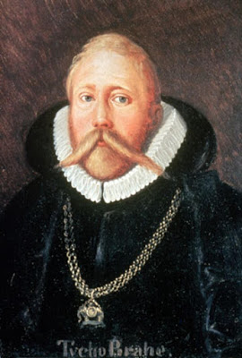
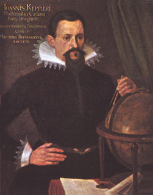

[Up](index.md)

# 데이터의 중요성

튀코 오테센 브라헤(Tyge Ottesen Brahe, 1546년 12월 14일 ~ 1601년 10월 24일)는 정확하게 천문 관측을 한 덴마크의 천문 학자 였죠. 그가 세운 모델은 천동설에 기반을 둔 것이었고, 그가 수집한 데이터 중 일부는 모델에 잘 맞았지만 일부는 모델에 들어 맞지 않았습니다.

독일 출신 요하네스 케플러(Johannes Kepler, 1571년 12월 27일 - 1630년 11월 15일)는 브라헤의 제자입니다. 케플러는 천동설을 버리고 지동설 모델을 선택하여 케플러의 제1, 제2, 제3법칙을 발표 합니다. 브라헤는 케플러에게 데이터를 제공하지 않으려고 했고, 브라헤 사후에 브라헤 가족과 데이터 소유권을 두고 분쟁과 불화를 겪었다고 합니다. 400여년 전에도 가설에 대한 모델을 세우고 법칙을 발견하는데 데이터는 중요 했습니다.

**참조**

- 사진 출처: wikipedia.org