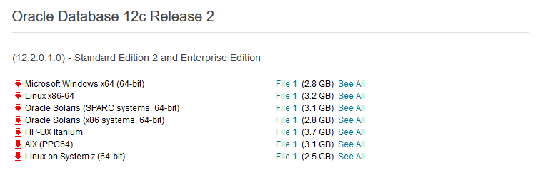

[Up](./index.md)

# Installation of Oracle Database 12c r1 on Ubuntu 16.04

## 다운로드

[Oracle Database Software](https://www.oracle.com/technetwork/database/enterprise-edition/downloads/index.htm)에서 Linux x86-64 의 File 1을 다운로드 받습니다.



## 그룹과 유저 추가

오라클 데이터베이스 그룹과 유저를 추가합니다.

```sh
sudo groupadd -g 502 oinstall
sudo groupadd -g 503 dba
sudo groupadd -g 504 oper
sudo groupadd -g 505 asmadmin
sudo useradd -u 502 -g oinstall -G dba,asmadmin,oper -s /bin/bash -m oracle
sudo passwd oracle
sudo usermod -aG sudo oracle
```

## Oracle - .bash_profile


## 의존 패키지 설치

```
sudo apt install alien autoconf automake autotools-dev binutils doxygen
sudo apt install elfutils expat gawk gcc gcc-multilib g++-multilib libstdc++6 ksh less libtiff5 # 원문은 libtiff4였는데 없음.
sudo apt install libtiff5-dev lib32z1 libaio1 libaio-dev libc6-dev libc6-dev-i386 libc6-i386 # 원문은 libtiff4-dev 였는데 없음.
sudo apt install libelf-dev libltdl-dev libmotif4 libodbcinstq4-1 libodbcinstq4-1
sudo apt install libpthread-stubs0 libpth-dev libstdc++5 lsb-cxx make 
sudo apt install pdksh openssh-server rlwrap rpm sysstat unixodbc unixodbc-dev x11-utils
sudo apt install zlibc unity-control-center libglu1-mesa libqt4-opengl
sudo apt install libpthread-workqueue0 libpthread-workqueue-dev libzthread-2.3-2 libzthread-dev
sudo apt install libegl1-mesa libegl1-mesa-drivers libgl1-mesa-dri
sudo apt install libglapi-mesa libpthread-stubs0-dev libaio-dev
```


---

- [Install Oracle 12c R2 on Ubuntu 16.04]([https://gist.github.com/1242035/3d9936cd70be0e10e2f74feb6a64b64d)
- [우분투(Ubuntu) 14.04에 오라클(Oracle) 데이타베이스 12C 설치하기](http://html5around.com/wordpress/tutorials/ubuntu-oracle-12c-install/)