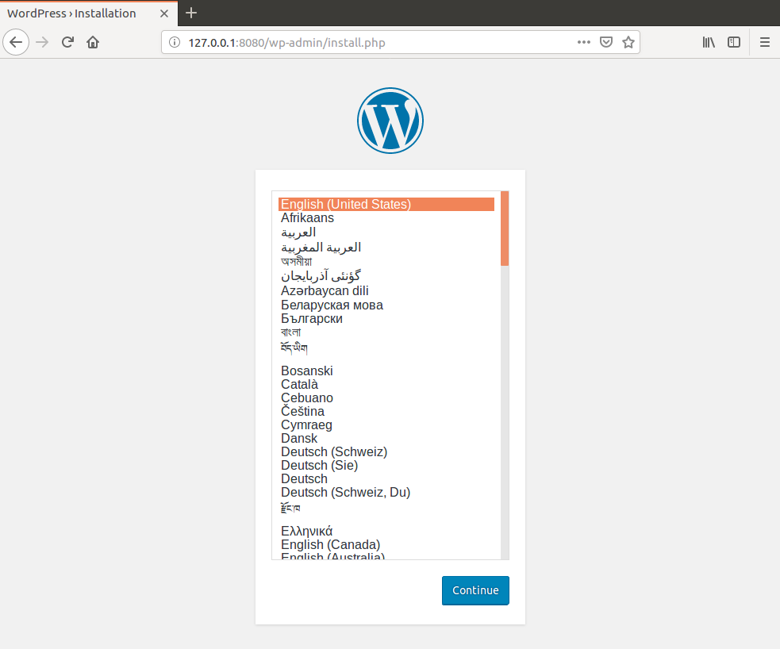

# Docker 빠른 찾아보기

개발용 도커를 빠르게 구성하기 위한 목적으로 노트 합니다. 도커의 정의나 원리 역사 등은 기술하지 않습니다.

## Docker Container

도커 컨테이너는 다음 명령으로 시작합니다.

```sh
sudo docker container <options>
```

## Docker Image

도커 이미지는 다음 명령으로 시작합니다.

```sh
sudo docker image <options>
```

### Dockerfile

도커 이미지를 만들기 위해 Dockerfile이라는 자체 Domain-Sepecific Language를 사용하여 이미지 생성 과정을 적습니다.

### Union File System

도커는 베이스 이미지에서 바뀐 부분만 이미지로 생성합니다. 컨테이너로 실행할때는 베이스 이미지와 바뀐 부분을 합쳐서 실행합니다. Docker Hub 및 개인 저장소에서 이미지를 공유할때 바뀐 부분만 주고 받습니다. 이미지는 의존관계를 형성합니다.

## Ubuntu 16.04에 도커 설치

먼저 데비안 패키지 목록을 최신으로 갱신하고 업그레이드 합니다.

```sh
sudo apt update
sudo apt upgrade # 선택
```

도커에 필요한 필수 패키지들을 설치합니다.

```sh
sudo apt install -y apt-transport-https ca-certificates curl software-properties-common
```

데비안 리파지토리에서 직접 설치할 수 도 있지만, 이 경우 구버전의 도커가 설치됩니다. 최신 버전을 설치하기 위해서는 도커 공식 리파지토리를 추가합니다. 먼저, 도커의 공식 GPG 키를 추가 합니다.

```
booil@booil-linux:~$ curl -fsSL https://download.docker.com/linux/ubuntu/gpg | sudo apt-key add -
```

성공하면 `OK`가 표시됩니다.

```
OK
```

GPG 키를 확인합니다.

```sh
sudo apt-key fingerprint 0EBFCD88
```

성공하면 다음이 표시됩니다.

```
pub   4096R/0EBFCD88 2017-02-22
      Key fingerprint = 9DC8 5822 9FC7 DD38 854A  E2D8 8D81 803C 0EBF CD88
uid                  Docker Release (CE deb) <docker@docker.com>
sub   4096R/F273FCD8 2017-02-22
```

다음을 도커의 리파지토리를 추가 합니다.

```sh
sudo add-apt-repository "deb [arch=amd64] https://download.docker.com/linux/ubuntu $(lsb_release -cs) stable"
```

다시 데비안 패키지 목록을 최신으로 갱신합니다.

```sh
sudo apt-get update
```

도커 리파지토리가 추가 되었으므로 출력 목록에서 다음 유사한 내용을 확인할 수 있습니다.

```
Get:O https://download.docker.com/linux/ubuntu xenial InRelease [66.2 kB]       
Get:O https://download.docker.com/linux/ubuntu xenial/stable amd64 Packages [5,491 B]
- 중략 -
Reading package lists... Done
```

다음은 도커 커뮤니티 에디션을 추가 합니다.

```sh
 sudo apt install docker-ce
```

#### Docker 서비스 실행:

오류

```
docker: Cannot connect to the Docker daemon at unix:///var/run/docker.sock. Is the docker daemon running?.
```

가 발생하면 도커 서비스가 정지되었을 가능성이 있습니다. 아래를 참조하여 도커를 시작하면 됩니다.

도커 서비스 중단:

```sh
sudo service docker stop
```

도커 서비스 재시작:

```sh
sudo service docker restart
```

도커 서비스 시작:

```sh
sudo service docker start
```

부팅했을때 Docker 서비스를 자동으로 실행:

```sh
sudo chkconfig docker on
```

### 도커 설치 확인

버전을 확인해 봅니다.

```sh
sudo docker version
```

```
Client:
 Version:           18.09.0
 API version:       1.39
 Go version:        go1.10.4
 Git commit:        4d60db4
 Built:             Wed Nov  7 00:48:57 2018
 OS/Arch:           linux/amd64
 Experimental:      false

Server: Docker Engine - Community
 Engine:
  Version:          18.09.0
  API version:      1.39 (minimum version 1.12)
  Go version:       go1.10.4
  Git commit:       4d60db4
  Built:            Wed Nov  7 00:16:44 2018
  OS/Arch:          linux/amd64
  Experimental:     false
```

도커는 클라이언트와 서버가 있으므로 두가지 버전을 표시 합니다.

`hello-world` 이미지를 실행해 봅니다.

```sh
sudo docker container run hello-world
```

```
Unable to find image 'hello-world:latest' locally
latest: Pulling from library/hello-world
d1725b59e92d: Pull complete 
Digest: sha256:0add3ace90ecb4adbf7777e9aacf18357296e799f81cabc9fde470971e499788
Status: Downloaded newer image for hello-world:latest

Hello from Docker!
This message shows that your installation appears to be working correctly.

To generate this message, Docker took the following steps:
 1. The Docker client contacted the Docker daemon.
 2. The Docker daemon pulled the "hello-world" image from the Docker Hub.
    (amd64)
 3. The Docker daemon created a new container from that image which runs the
    executable that produces the output you are currently reading.
 4. The Docker daemon streamed that output to the Docker client, which sent it
    to your terminal.

To try something more ambitious, you can run an Ubuntu container with:
 $ docker run -it ubuntu bash

Share images, automate workflows, and more with a free Docker ID:
 https://hub.docker.com/

For more examples and ideas, visit:
 https://docs.docker.com/get-started/
```

`hello-world` 이미지가 없으므로 `pull`하여 실행합니다.

다음은 실행중인 컨테이너를 표시합니다.

```sh
 sudo docker container ps -a
```

**(주의)** 다음은 모든 컨테이너를 제거합니다:

```
sudo docker image rm 'sudo docker image ps -aq'
```

다음은 `hello-world` 이미지로부터 실행된 컨테이터만을 조회합니다.

```
sudo docker image ps --filter ancestor=hello-world -a
```

```
CONTAINER ID        IMAGE               COMMAND             CREATED             STATUS                      PORTS               NAMES
855ca7a5acf5        hello-world         "/hello"            37 seconds ago      Exited (0) 36 seconds ago                       brave_mccarthy
```

다음은 해당 container id를 제거합니다. 이 예제에서는 `855ca7a5acf5`입니다.

```
sudo docker container rm <container_id>
```

다음은 `hello-world`이미지까지 제거합니다.

```
sudo docker image rm hello-world
```

만일 컨테이너가 있다면 다음 오류가 발생할 것입니다. 먼저 이미지에 의존하는 컨테이너를 제거해야 합니다.

```
Error response from daemon: conflict: unable to remove repository reference "hello-world" (must force) - container <container_id> is using its referenced image <image_id>
```

### Docker Compose 설치

OSX나 Windows는 Docker를 설치할때 함께 설치 됩니다. 리눅스의 경우 아래처럼 설치합니다.

```sh
sudo curl -L "https://github.com/docker/compose/releases/download/1.23.1/docker-compose-$(uname -s)-$(uname -m)" -o /usr/local/bin/docker-compose
sudo chmod +x /usr/local/bin/docker-compose
docker-compose version
```

```
docker-compose version 1.23.1, build 1719ceb
```

Docker compose의 사용법을 이해하려면 먼저 Docker를 이해해야 하므로 아래에서  설명합니다. 일단 설치해 둡니다.

도커를 실행하려면 `DOCKER_HOST`변수를 설정해야 합니다.

```sh
export DOCKER_HOST=tcp://192.168.59.103:2375
```

## 도커의 실행

이 내용은 [초보를 위한 도커 안내서 - 설치하고 컨테이너 실행하기](https://subicura.com/2017/01/19/docker-guide-for-beginners-2.html)를 참고하여 실험하고 수정하였습니다.

```sh
sudo docker container run [OPTIONS] IMAGE[:TAG|@DIGEST] [COMMAND] [ARGS...]
```

### 도커 실행 OPTIONS

|  옵션   | 설명                                                     |
| :-----: | -------------------------------------------------------- |
|  `-d`   | detached mode. 백그라운드 모드.                          |
|  `-p`   | 호스트와 컨테이너의 소켓 포트를 연결 (포트 포워딩)       |
|  `-v`   | 호스트와 컨테이너의 디렉토리를 연결 (데이터 볼륨 마운트) |
|  `-e`   | 컨테이너 내에서 사용할 환경변수 설정                     |
| `-name` | 컨테이너 이름 설정                                       |
|  `-rm`  | 프로세스 종료시 컨테이너 자동 제거                       |
|  `-it`  | `-i`와 `-t` 동시 지정으로 키보드 사용 가능               |
| `-link` | 컨테이너 연결 [컨테이너명:별칭]                          |

도커의 기본 네트워크모드는 Bridge 모드로 약간의 성능 손실이 있습니다. 성능이 중요한 프로그램에 주는 옵션

```sh
--net = host
```

을 지정합니다.

### 도커 실행 예제

아래는 우분투 16.04 컨테이너를 실행 합니다.

```sh
sudo docker container run ubuntu:16.04
```

`run` 커맨드를 사용하여 이미지가 없으면 자동으로 `pull`을 사용하여 다운로드하고 컨테이너를 `create` 생성하고 `start` 합니다. 컨테이너는 프로세스 이기때문에 실행중인 프로세스가 없으면 컨테이너는 종료 합니다.

 `/bin/bash` 명령어를 실행하며 컨테이너를 실행 합니다.

```sh
sudo docker container run --rm -it ubuntu:16.04 /bin/bash
# 컨테이너 실행
$ ls
bin  dev home lib64 mnt proc run  srv tmp var
boot etc lib  media opt root sbin sys usr
```

컨테이너 내부에 들어가기 위해 `bash`를 실행하고, 키보드를 사용하기 위해 `-it` 옵션을 주었습니다.

### redis 컨테이너 실행 예제

```sh
sudo docker container run -d -p 1234:6379 redis
```

`-d` 옵션을 주어서 백그라운드로 돌리고 셸로 돌아 옵니다. `-p` 옵션을 주어 호스트의 `123`포트를 컨테이너 `6379`포트로 포워딩 하였으므로 localhost의 `1234`포트로 접속하면 redis를 사용 할 수 있습니다.

redis가 실행되면

```
# redis 실행 (컨테이너 ID)
$ telnet localhost 1234
set mykey hello
+OK
get mykey
$5
hello
```

입니다.

### MySQL 5.7 컨테이너 실행 예제

```sh
sudo docker run -d -p 3306:3306 -e MYSQL_ALLOW_EMPTY_PASSWORD=true --name mysql mysql:5.7
```

`-e` 옵션을 주어 환경변수를 지정하고, `-name` 옵션을 주어 컨테이너 이름을 부여 합니다. 사용자가 컨테이너 이름을 부여하지 않으면 도커가 유명한 과학자나 해커의  이름과 수식을 조합하여 랜덤으로 이름을 생성합니다.

패스워드 없이 root 계정을 만들기 위해 `MYSQL_ALLOW_EMPTY_PASSWORD`환경변수를 설정합니다. 컨테이너 이름은 `mysql`로 지정하고, `-d` 옵션을 지정하여 백그라운드로 실행합니다. 호스트 포트 `3306`을 컨테이너 포트 `3306`으로 그대로 지정합니다. ([참고원문](https://subicura.com/2017/01/19/docker-guide-for-beginners-2.html)에서는 오류가 발생하여 변경하였습니다.)

MySQL 컨테이너의 데몬이 올라오는데 시간이 걸리기때문에 기다리지 않고 명령을 보내면 오류가 발생할 수도 있습니다.

```
Unable to find image 'mysql:5.7' locally
5.7: Pulling from library/mysql
a5a6f2f73cd8: Pull complete 
936836019e67: Pull complete 
283fa4c95fb4: Pull complete 
1f212fb371f9: Pull complete 
e2ae0d063e89: Pull complete 
5ed0ae805b65: Pull complete 
0283dc49ef4e: Pull complete 
a7905d9fbbea: Pull complete 
cd2a65837235: Pull complete 
5f906b8da5fe: Pull complete 
e81e51815567: Pull complete 
Digest: sha256:c23e9bfe66eeffc990cf6bce4bb0e9c5c85eb908170f3b3dde3e9a12c5a91689
Status: Downloaded newer image for mysql:5.7
91b043b3096c4bda61f44b1c65fa192b3d062ef4af5075423ee815adc8c27384

```

MySQL 클라이언트로 접속합니다.

```sh
$ mysql -h127.0.0.1 -uroot
mysql> shoqdatabases;
+--------------------+
| Database           |
+--------------------+
| information_schema |
| mysql              |
| performance_schema |
| sys                |
+--------------------+
4 rows in set (0.00 sec)
mysql> quit
```

```
mysql> show databases;
+--------------------+
| Database           |
+--------------------+
| information_schema |
| mysql              |
| performance_schema |
| sys                |
+--------------------+
4 rows in set (0.00 sec)
mysql> quit
```

참고: MySQL이 실행되지 않고 오류가 발생하면 `-d` 옵션을 제외하면 로그를 보고 오류를 확인 할 수 있습니다.

### Wordpress + MySQL  컨테이너 예제

```sh
$ mysql -h127.0.0.1 -uroot
create database wp CHARACTER SET utf8;
grant all privileges on wp.* to wp@'%' identified by 'wp';
flush privileges;
quit
```

워드프레스용 데이터베이스와 유저를 생성하였으면 워드프레스 컨테이너를 실행합니다.

```sh
sudo docker run -d -p 8080:80 --link mysql:mysql \
  -e WORDPRESS_DB_HOST=mysql \
  -e WORDPRESS_DB_NAME=wp \
  -e WORDPRESS_DB_USER=wp \
  -e WORDPRESS_DB_PASSWORD=wp \
  wordpress
```

```sh
Unable to find image 'wordpress:latest' locally
latest: Pulling from library/wordpress
a5a6f2f73cd8: Already exists 
633e0d1cd2a3: Pull complete 
fcdfdf7118ba: Pull complete 
4e7dc76b1769: Pull complete 
c425447c8835: Pull complete 
033380e6e095: Pull complete 
13cbf79d7810: Pull complete 
3b3aab261548: Pull complete 
3a7622312067: Pull complete 
6b070aefa7b0: Pull complete 
85e781f15c7b: Pull complete 
29f66381a68b: Pull complete 
447650cf1bc0: Pull complete 
4b4044f879ea: Pull complete 
769f3190a4a0: Pull complete 
9dd60f975192: Pull complete 
5c0f87802f63: Pull complete 
0fc0f7f7070c: Pull complete 
8bfebd3b393c: Pull complete 
3460b7ca1d8b: Pull complete 
Digest: sha256:d8386c593c04b5c657a524925c0090a4706e78af5079302c7daf2df3d453c1b8
Status: Downloaded newer image for wordpress:latest
25a5a1cd9c8356aa94a43e0cb29fc80399c86faed027e8c819b1899c95892d6a
```

워드프레스는 데이터베이스를 필요로 하며, MySQL을 사용하고 싶다면 `--link`  옵션을 지정하여 MySQL 컨테이너를 연결합니다. `--link` 옵션은 deprecated 되었다고 합니다.

인터넷 브라우저를 실해하여 주소창에 `127.0.0.1:8080`을 입력하고 엔터를 눌러 봅니다.



워드프레스 어드민 페이지에서 언어를 선택하면 성공입니다.

### Tensorflow 컨테이너 예제

```sh
sudo docker run -d -p 8888:8888 -p 6006:6006 teamlab/pydata-tensorflow:0.1
```

## Docker 기본 명령

### `ps`: 실행중이거나 실행했던 컨테이너 목록 확인

```sh
sudo docker ps [OPTIONS]
```

### `stop`:  실행중인 컨테이너를 종료.

```sh
sudo docker stop [OPTIONS] CONTAINER [CONTAINER...]
```

다음은 모든 컨테이너 목록을 확인하고 중지하는 예제입니다.

```
sudo docker ps -a
sudo docker stop <container_id>
```

도커 ID 전체 길이는 64자리이지만, 겹치지 않는다면 앞자리 일부만 지정해도 됩니다. 예를들어 container_id가 `abcdefghijklm`이고 겹치지 않는다면 `abcd`만 지정해도 됩니다.

### `rm`: 종료된 컨테이너 제거하기

종료된 컨테이너를 완전히 제거 합니다.

```sh
sudo docker rm [OPTIONS] CONTAINER [CONTAINER...]
```

컨테이너 제거 예제

```sh
sudo docker ps -a
sudo docker rm <container_id> <container_id> ...
sudo docker ps -a
```

중지된 컨테이너 모두 제거

```sh
sudo docker rm -v $(docker ps -a -q -f status=exited)
```

### `images`: 이미지 목록 확인

docker가 다운로드한 이미지를 학인 합니다.

```sh
sudo docker images [OPTIONS] [REPOSITORY[:TAG]]
```

간단하게 docker 이미지 목록만 확인

```sh
sudo docker images
```

### `pull`:  이미지 다운로드

`run` 을 실행할때 이미지가 없으면 자동으로 다운로드 받아 `pull`을 사용할 경우가 없지만, 업데이트된 새로운 이미지를 다운로드 할때 `pull`을 사용하여 다운로드 합니다.

```
sudo docker pull [OPTIONS] NAME[:TAG|@DIGEST]
```

`ubuntu:14.04`를 다운로드

```sh
sudo docker pull ubuntu:14.04
```

### `rm`: 이미지 삭제

```sh
sudo docker image rm [OPTIONS] IMAGE [IMAGE...]
```

`rmi` 삭제 예제

```sh
sudo docker image ls
sudo docker image rm <이미지 ID>
```

이미지는 여러개의 레이어로 구성되기 때문에 다수의 레이어가 삭제 됩니다.

```sh
sudo docker image rm a5
```

```
Untagged: ubuntu:16.04
Untagged: ubuntu@sha256:e547ecaba7d078800c358082088e6cc710c3affd1b975601792ec701c80cdd39
Deleted: sha256:a51debf7e1eb2018400cef1e4b01f2e9f591f6c739de7b5d6c142f954f3715a7
Deleted: sha256:ad38d0b8ff5e07d6875cb39931e2c79fb90cf142584ea813437b013d3639678f
Deleted: sha256:8ae3e0d35735ff77e9ef2a15816747b01316225829ece78dbc41bc50eddb7dfe
Deleted: sha256:a6a57518ff0cc0e30c0e5c964abc052038413f57cd570bd89ab4e4493741a5b3
Deleted: sha256:41c002c8a6fd36397892dc6dc36813aaa1be3298be4de93e4fe1f40b9c358d99
```

### `logs`: 컨테이너 로그 조회

```sh
sudo docker container logs [OPTIONS] CONTAINER
```

```sh
sudo docker container logs <container_id>
```

를 실행하면 전체 로그가 보입니다. `--tail 숫자`를 지정하여 마지막 로그 일부만 볼 수도 있습니다.

```sh
sudo docker container logs --tail 10 <container_id>
```

최근의 10개의 로그만 표시합니다.

#### `-f`: 실시간 로그

`-f` 옵션을 지정하여 실시간 로그 조회를 합니다.

```sh
sudo docker container logs -f <컨테이너 ID>
```

실시간 로그를 중지하려면 `ctrl + c`를 입력합니다.

docker는 컨테이너의 프로그램이 `stdout`, `stderror`로 출력하는 스트림을 수집하여 로그로 스트림 하므로, 컨테이너에서 실행하는 프로그램의 로그는 표준 출력으로 구성해야 합니다.

컨테이너 로그 파일은 json 형식으로 저장됩니다. 로그가 많으면 파일의 용량이 커지므로 주의해야 합니다. docker는 플러그인을 통해 json이 아닌 특정 로그 서비스에 스트림으로 로그를 전달 할 수 있습니다. 규모가 커지면 로그 서비스 이용을 고려 해야 합니다.

### `exec`: 컨테이너 명령 실행

컨테이너 명령 실행시 `SSH`로도 가능하지만 바른 방법이 아니며 권장하지 않습니다. `exec` 명령을 통해 컨테이너의 명령을 실행해야 합니다.

```sh
sudo docker container exec [OPTIONS] CONTAINER COMMAND [ARG...]
```

먼저 MySQL을 실행합니다.

```sh
sudo docker container run -d -p 3306:3306 -e MYSQL_ALLOW_EMPTY_PASSWORD=true --name mysql mysql:5.7
```

여기서, MySQL 이미지가 없으면 `pull`하고 나서 실행을 할 것입니다.

MySQL에 접속해 보겠습니다.

```sh
sudo docker container exec -it mysql /bin/bash
ls
```

여기서, `mysql` 클라이언트를 실행하므로 `-it` 옵션을 지정하여 키보드를 사용하고, `-bash` 옵션을 지정하여 bash 셸로 접속하였습니다.

```
bin  boot  dev	docker-entrypoint-initdb.d  entrypoint.sh  etc	home  lib  lib64  media  mnt  opt  proc  root  run  sbin  srv  sys  tmp  usr  var
```

다음은 셸을 통하지 않고 직접 `mysql` 을 실행할 수도 있습니다.

```sh
sudo docker container exec -it mysql mysql -uroot
```

여기서, 첫번째 `mysql` 은 컨테이너 ID이고, 두번째 `mysql`은 MySQL 클라이언트를 실행하는 명령 입니다.

```sql
Welcome to the MySQL monitor.  Commands end with ; or \g.
Your MySQL connection id is 2
Server version: 5.7.24 MySQL Community Server (GPL)

Copyright (c) 2000, 2018, Oracle and/or its affiliates. All rights reserved.

Oracle is a registered trademark of Oracle Corporation and/or its
affiliates. Other names may be trademarks of their respective
owners.

Type 'help;' or '\h' for help. Type '\c' to clear the current input statement.

mysql> show databases;
+--------------------+
| Database           |
+--------------------+
| information_schema |
| mysql              |
| performance_schema |
| sys                |
+--------------------+
4 rows in set (0.00 sec)

mysql> 
```

## Docker volume

컨테이너를 업데이트 한다는 것은, 기존 컨테이너를 `stop`, `rm` 하고, 새 이미지를 `pull`하여, 새 컨테이너를 `run` 하면 되는데, 기존 컨테이너를 `rm` 하면 컨테이너가 생성한 컨테이너 내부의 파일이 모두 잃게 됩니다.

그래서 컨테이너가 삭제되어도 유지되어야 할 파일들은 반드시 컨테이너 밖에 저장해야 합니다. 클라우드 서비스를 사용중이 아니라면 '데이터 볼륨'을 컨테이너에 추가해서 사용합니다. 데이터 볼륨을 사용하면 해당 폴더는 컨테이너와 별도로 저장되고 컨테이너를 삭제해도 볼륨에 저장한 데이터는 남아 있습니다.

다음은 볼륨을 생성합니다.

```sh
sudo docker volume create <volume_name>
```

다음은 볼륨 목록을 봅니다.

```sh
sudo docker volume ls
```

다음은 볼륨을 들여다 봅니다.

```sh
sudo docker inspect <volume_name>
```

다음 볼륨을 삭제 합니다.

```sh
sudo docker volume rm <volume_name>
```

의존을 받지 않는 모든 볼륨을 삭제 합니다.

```sh
sudo docker volume prune
```

의존성에 관계 없이 모든 볼륨을 제거하려면 `-f` 옵션을 줍니다. 이때 지워지는 볼륨에 의존하는 컨테이너가 실행중이면 오류가 발생 할 수 있습니다. 볼륨을 제거하는 것은 도커 서비스에서 제거할 뿐 실제 호스트 디렉토리가 제거 되는 것은 아닙니다.

다음은, 컨테이너 생성시 생성된 볼륨을 `-v`옵션으로  컨테이너에 연결합니다.

```sh
sudo docker run -d --name <container_name> -v <volume_name>:<container_mount_name> <image_name>:<tag>
```

`-v` 옵션은 `--volume`로 지정할 수도 있습니다.

다음은, 컨테이너 생성시 생성된 볼륨을 `--mount`옵션으로  컨테이너에 연결합니다.

```sh
sudo docker run -d --name <container_name> --mount source=<volume_name>,target=<container_mount_name> <image_name>:<tag>
```

다음은 볼륨으로 서비스를 시작합니다.

```sh
sudo docker service create -d --replicas=4 --name <service_name> --mount source=<volume_name>,target=<container_mount_name> <image_name>:<tag:
```

볼륨으로 시작한 서비스의 상태를 확인합니다.

```sh
sudo docker service ps <service_name>
```

###  컨테이너 실행시 호스트의 디렉토리를 직접 마운트

다음은 데이터 볼륨을 위해 호스트의 `/my/own/datadir` 디렉터리를  컨테이너의 `/var/lib/mysql`디렉터리로 마운트 합니다.

```sh
sudo docker container run -d -p 3306:3306 -e MYSQL_ALLOW_EMPTY_PASSWORD=true --name mysql -v /home/booil/mysqldata:/var/lib/mysql mysql:5.7
```

이와 같이 볼륨을 지정하고 마운트 할 수 있습니다. 여기서

```
-v /home/booil/mysqldata:/var/lib/mysql
```

이 직접 볼륨을 마운트하는 옵션입니다.

다음은, 컨테이너가 사용중인 볼륨을 확인하려면

```sh
sudo docker container inspect -f "{{ .Mounts }}" <container_id>
```

하면

```
[{bind  /home/booil/mysqldata /var/lib/mysql   true rprivate}]
```

로 확인 할 수 있습니다. 그런데, 이 방법은 호스트의 어느 폴더가 볼륨으로 지정되었는지 컨테이너를  통해 확인해야 하며, 컨테이너들이 사용하는 볼륨만을 따로 관리하기 어렵다는 문제가 있습니다.

### Docker volume 보기

```
sudo docker volume ls
```

하면 아래처럼 Docker Volume의 일부 정보만 표시 합니다.

```
DRIVER              VOLUME NAME
local               0c2303d24b333a50b5d5f7c6917468ca6d5f224961100e873a72b8cc4af20b63
local               5d270fcf5b0cdd98434bd8aff431336157785be555e7b66ad1db9df3aff3b642
local               6d608766eeaf5c03f4d277ce25fef7dac77b3b6933258c369135f3b153d5c6ec
local               7a0972e4cd814211a188e42e07aa3f924a80999c97e37173f9e5153abd51c122
local               9db83f5978b2b9fc2c283b91ba14e0ea77de759d93d56623228965698f0c3f53
local               13ff5daac2e5c3031b4c8a49886787b6d573f231ddc5f7c64f59a1cc076bcd4b
local               042f3b05cbaa2d40d58712fdab51e0d75f77f1b195ffdbed61171b107383722f
local               88bf81afcf5ff42809fc6d64a216852bc6f739ab294df6380ddc1be0e77f3649
local               586cc9a2a0d510d204edb7beec62246954ff2843cd54442b865e1dd483af41aa
local               638d5106047b6f25ca85bc8e85ecae8af28da818f792bc922f913ac96fdfb1f0
local               957d6dedde26a07ca778b51f42aa8f98822e1a1e2cf0d3289d8ba0cedcf0517f
local               1594acd196251765ffb937b415eadc2478e4c8d13e58c1ae6654c4357193eafd
local               6294b6abfbbb2ee516dc0b93fbe296b6a6128506e36b3f0f12942fe2d7d48d9f
local               74157ebfe5134921bb571f3674661acc15c423edc34a261b79ca549cd6e4d1da
local               766877807d0cba0ad61c80074526bf39d6eed9abdcb97de931cb6349df1a4d02
local               8593122843ea5f3331fc6609b7633f7145d80651b6ab5105bdb083af79880fbc
local               a1c5bc91e4193976148d41c30449aea2729f96baf7710dc5111ac58080002a13
local               ac594be362f22502b119153c1bd22221a0752a8c55079b73ac5db6665182ecf7
local               ca8c607f6a595409bc91e9a185c0e83d690da55e6d974b774028495c83df162e
local               cc567982e8286f5057a2c9bd15d0364b4f516ae7708aa8156887ede700fff6bd
local               ed06df8d2843eb32dc7e00c837155d7189e169a351c42e745d5276b8265ace2f
local               ef19240965afeb9f034ea5c49c4ab9de62d4839b40f631860cba176056fda8ce
local               f0a2b2199afe0bd5d151ed29584658354d4bf0bb1cd5abf6a1ecd22cabbeb242
local               fcc9e79bf5a12658d706e2150375fb55de3dda380113a7bacc16a304d687e767
```

### 볼륨의 관리

Docker Volume에 이름을 주고 다른 컨테이너들이 서로 공유하며, 별도의 볼륨들을 관리 할 수 도 있습니다.

먼저, 볼륨을 만들어 보겠습니다.

```
sudo docker create volume <volume_name>
sudo docker run -d -p 3306:3306 -e MYSQL_ALLOW_EMPTY_PASSWORD=true --name mysql -v <volume_name>:/var/lib/mysql mysql:5.7
```

볼륨에 이름을 줄 수 있다면 해시값 보다 다루거나 이해하기 쉽고,  `volume ls`로 확인하기도 쉽습니다.


### Dockerfile에서 volume

```dockerfile
FROM ubuntu:lastest

volume ["/volume/path"]
```

이것은 이미지가 실행되어 컨테이너로 올라갈때 지정한 경로를 자동으로 host에 연결합니다. 그 경로는 `/var/lib/docker/volumes/{volume_name}`에 만들어 집니다. 이 방법은 컨테어너가 삭제되었을때 데이터의 위치를 파악하기 어려운 문제가 있어 좋은 방법은 아닙니다.

도커를 실행할때 -v 옵션으로 `host`에 매핑 할 수 있습니다.

```
sudo docker run -itd -v /host/some/where:/container/some/where ubuntu
```

이것은 직관적이며 Dockerfile에 정의된 volume 경로를 오버라이드 합니다. 나쁜점은 `docker volume ls`로 추적할 수 없다는 것입니다.

Volume container를 통해 volume을 연결 할 수 있습니다.

```
sudo docker run --name volume_container -itd \
	-v $HOME/host-volume1:/container-volume1 \
	-v $HOME/host-volume2:/container-volume2 \
	-v $HOME/host-volume3:/container-volume3 \
	ubuntu
```

이렇게 volume이 잡한 Docker Container를 하나 `run`하고 

```
sudo docker run --name target_container --volume-from volume_container -itd ubuntu
```

컨테이너째로 volume을 붙이는 방법입니다. 같은 볼륨을 가진 여러개의 컨테이너가 참조할때 유리합니다.

## Docker Compose

컨테이너 조합이 많아지고 설정이 추가되면 명령어가 복잡해집니다. 이를 간단하게 하기 위해 Docker Compose라는 도구를 사용합니다.

### Docker Compose 설치

OSX나 Windows는 Docker를 설치할때 함께 설치 됩니다. 리눅스의 경우 아래처럼 설치합니다.

```sh
sudo curl -L "https://github.com/docker/compose/releases/download/1.9.0/docker-compose-$(uname -s)-$(uname -m)" -o /usr/local/bin/docker-compose
sudo chmod +x /usr/local/bin/docker-compose
docker-compose version
```

#### Docker Compose를 사용하여 Wordpress 만들기

먼저 빈 폴더를 하나 생성하고 `docker-compose.yml` 파일을 만들어 아래처럼 구성합니다.

```yaml
version: '2'

services:
	db:
		image: mysql:5.7
		volumes:
			- db_data:/var/lib/mysql
		restart: always
		envrionment:
			MYSQL_ROOT_PASSWORD: wordpress
			MYSQL_DATABASE: wordpress
			MYSQL_USER: wordpress
			MYSQL_PASSWORD: wordpress
	
	wordpress:
    	depends_on:
    		-db
    	image: wordpress:latest
    	volumes:
    		- wp_data:/var/www/html
    	port:
    		-"8000:80"
    	restart: always
    	environment:
    		WORDPRESS_DB_HOST: db:3306
    		WORDPRESS_DB_PASSWORD: wordpress
    volume:
    	db_data:
    	wp_data:    		
```

아래처럼 실행 합니다.

```sh
docker-compose up
```

명령어를 설정 파일로 바꾸었고, 가독성이 상승하고 재활용이 가능해졌습니다.


------

## 참조

- [초보를 위한 도커 안내서 - 도커란 무엇인가?](https://subicura.com/2017/01/19/docker-guide-for-beginners-1.html)
- [초보를 위한 도커 안내서 - 설치하고 컨테이너 실행하기](https://subicura.com/2017/01/19/docker-guide-for-beginners-2.html)
- [초보를 위한 도커 안내서 - 이미지 만들고 배포하기](https://subicura.com/2017/02/10/docker-guide-for-beginners-create-image-and-deploy.html)
- [도커와 도커 컨테이너의 이해](http://www.itworld.co.kr/news/110748)
- [도커 무작정 따라하기](https://www.slideshare.net/pyrasis/docker-fordummies-44424016)
- [Docker Container로 SFTP 사용](https://m.blog.naver.com/PostView.nhn?blogId=alice_k106&logNo=220650722592&proxyReferer=https%3A%2F%2Fwww.google.com%2F)
- [Docker volume의 사용법과 차이점](https://darkrasid.github.io/docker/container/volume/2017/05/10/docker-volumes.html)

- [Install Docker Compose](https://docs.docker.com/compose/install/#install-compose)