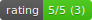
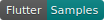

[Up](./index.md)

# Bloc Extension for VSCode

원문: [Bloc / Tools / Extensions / VSCode](https://felangel.github.io/bloc/#/blocvscodeextension)

  

       

------

## 소개

Bloc은 [Bloc](https://felangel.github.io/bloc) 라이브러리를 지원하는 [VSCode](https://code.visualstudio.com/)에 확장되어 [Flutter](https://flutter.io/)와 [AngularDart](https://webdev.dartlang.org)를 효율적으로 생성 할 수 있는 도구를 제공합니다.

## 설치

Bloc 은 [VSCode Marketplace](https://marketplace.visualstudio.com/items?itemName=FelixAngelov.bloc) 나  [searching within VSCode](https://code.visualstudio.com/docs/editor/extension-gallery#_search-for-an-extension) 에서 설치할 수 있습니다.

## 새 블록 만들기 명령 사용법

새로운 Bloc 명령은 Bloc과 이벤트/상태를 생성 할 수 있도록 남겨둔 나머지 모든 것들이 `mapEventToState`에 로직을 구현합니다.

Command Palette (View -> Command Palette)를 실행하고 `Bloc: New Bloc`을 실행하여 명령을 활성화 할 수 있습니다.

또는 Bloc을 작성할 디렉토리를 마우스 오른쪽 단추로 클릭하고 컨텍스트 메뉴에서 `Bloc: New Bloc`명령을 선택할 수 있습니다.

## 스니펫 사용법

### Bloc

`.dart` 파일에서 `bloc`을 입력하고 엔터를 쳐서 스니펫을 활성화 하세요. 그런 다음 bloc 클래스의 이름을 지정하고 탭으로 시그니쳐 및 구현 세부 사항을 채울 수 있습니다.

### BlocEvent

`.dart` 파일에서 `blocevent`를 타이핑하고 엔터를 치면 스니펫이 활성화됩니다. 그런 다음 이벤트 클래스의 이름을 지정하고 탭으로 시그니쳐 및 구현 세부 사항을 채울 수 있습니다.

### BlocState

`.dart` 파일에서 `blocstate`를 입력하고 엔터를 치면 스니펫이 활성화 됩니다. 그런 다음 상태 클래스의 이름을 지정하고 탭으로 시그니쳐 및 구현 세부 사항을 채울 수 있습니다.

## BlocBuilder

`.dart` 파일에서 `blocbuilder`를 타이핑하고 엔터를 치면 스니펫이 활성화됩니다. 그런 다음 탭으로 구현 세부 사항을 채울 수 있습니다.

### BlocListener

`.dart` 파일에서 `bloclistener`를 입력하고 엔터를 치면 스니펫을 활성화 할 수 있습니다. 그런 다음 탭으로 구현 세부 사항을 채울 수 있습니다.

### BlocProvider

`.dart` 파일에서 `blocprovider`를 입력하고 엔터를 치면 스니펫이 활성화됩니다. 그런 다음 탭으로 구현 세부 사항을 채울 수 있습니다.

### BlocProviderTree

`.dart` 파일에서 `blocprovidertree`를 입력하고 엔터를 치면 스니펫이 활성화됩니다. 그런 다음 탭으로 구현 세부 사항을 채울 수 있습니다.

### BlocDelegate

`.dart` 파일에서 `blocdelegate`를 입력하고 엔터를 치면 스니펫이 활성화됩니다. 그런 다음 탭으로 구현 세부 사항을 채울 수 있습니다.

          

---

이전: [IntelliJ](tools_extensions_intellij.md) (번역중...)

다음: [VSCode](tools_extensions_vscode.md)
