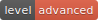

[Up](./index.md)

# Flutter Todos Tutorials

원문: [Bloc / Tutorial / Todos](https://felangel.github.io/bloc/#/fluttertodostutorial)



> 다음 튜토리얼에서는 Bloc 라이브러리를 사용하여 Flutter에서 Todos App을 빌드 할 것입니다.


<p id="setup"/>

## 준비 (Setup)

우리는 새로운 Flutter 프로젝트를 만드는 것으로 시작합니다.

```bash
flutter create flutter_todos
```

그런 다음 `pubspec.yaml`의 내용을 변경합니다.

```yaml
name: flutter_todos
description: A new Flutter project.

environment:
  sdk: ">=2.0.0 <3.0.0"

dependencies:
  meta: ">=1.1.0 <2.0.0"
  equatable: ^0.2.0
  flutter_bloc: ^0.13.0
  flutter:
    sdk: flutter

dependency_overrides:
  todos_app_core:
    git:
      url: https://github.com/felangel/flutter_architecture_samples
      path: todos_app_core
      ref: expose-repositories
  todos_repository_core:
    git:
      url: https://github.com/felangel/flutter_architecture_samples
      path: todos_repository_core
      ref: expose-repositories
  todos_repository_simple:
    git:
      url: https://github.com/felangel/flutter_architecture_samples
      path: todos_repository_simple
      ref: expose-repositories
flutter:
  uses-material-design: true
```

그리고, 모든 종석성을 설치합니다.

```bash
flutter packages get
```

**Note:** 우리는 [Brian Egan's Flutter Architecture Samples](https://github.com/brianegan/flutter_architecture_samples)에서 재사용 할 것이므로 일부 의존성을 무시하고 있습니다.

<p id = "TodosRespository"/>

## TodosRepository

이 튜토리얼에서는 [Brian Egan](https://github.com/brianegan)에 의해 구현 되었고  [Todo Architecture Samples](https://github.com/brianegan/flutter_architecture_samples)에서 공유 되었기 때문에 `TodosRepository`의 구현 세부 사항을 다루지는 않습니다. 높은 수준에서 `TodosRepository`는 메소드를`loadTodos`와 `saveTodos`에 노출시킵니다. 우리가 알아야 할 거의 모든 것이 이 튜토리얼의 나머지 부분에서 Bloc과 프리젠테이션 레이어에 집중할 것입니다.

<p id="TodosBloc"/>

## TodosBloc

> 우리의 `TodosBloc`는 `TodosEvents`를 `TodosStates`로 변환 할 책임이 있으며 할일 목록을 관리 할 것입니다.

<p id="model"/>

### 모델 (Model)

우리가 해야 할 첫 번째 일은 `Todo` 모델을 정의하는 것입니다. 각 `Todo`에는 `id`, `task`, 선택적 `note` 및 선택적 `complete` 플래그가 있어야 합니다.

`models` 디렉토리를 만들고`todo.dart`를 만듭니다.

```dart
import 'package:todos_app_core/todos_app_core.dart';
import 'package:meta/meta.dart';
import 'package:equatable/equatable.dart';
import 'package:todos_repository_core/todos_repository_core.dart';

@immutable
class Todo extends Equatable {
  final bool complete;
  final String id;
  final String note;
  final String task;

  Todo(this.task, {this.complete = false, String note = '', String id})
      : this.note = note ?? '',
        this.id = id ?? Uuid().generateV4(),
        super([complete, id, note, task]);

  Todo copyWith({bool complete, String id, String note, String task}) {
    return Todo(
      task ?? this.task,
      complete: complete ?? this.complete,
      id: id ?? this.id,
      note: note ?? this.note,
    );
  }

  @override
  String toString() {
    return 'Todo { complete: $complete, task: $task, note: $note, id: $id }';
  }

  TodoEntity toEntity() {
    return TodoEntity(task, id, note, complete);
  }

  static Todo fromEntity(TodoEntity entity) {
    return Todo(
      entity.task,
      complete: entity.complete ?? false,
      note: entity.note,
      id: entity.id ?? Uuid().generateV4(),
    );
  }
}
```

**Note:** 우리는 [`Equatable`](https://pub.dartlang.org/packages/equatable) 패키지를 사용하여 `==`와 `hashCode`를 수동으로 오버라이드 할 필요 없이 `Todos`의 인스턴스를 비교할 수 있습니다.

다음은 프리젠테이션 레이어가 받을 `TodosState`를 생성해야 합니다.

<p id="states"/>

### 상태들 (States)

`blocs/todos/todos_state.dart`를 만들고 취급해야 할 여러 상태를 정의 하겠습니다.

우리가 구현할 3 가지 상태는 다음과 같습니다:

- `TodosLoading` - 우리의 애플리케이션이 저장소에서 todos를 가져 오는 동안의 상태
- `TodosLoaded` - todos가 성공적으로 로드 된 후 우리 애플리케이션의 상태.
- `TodosNotLoaded` - todos가 성공적으로 로드되지 않은 경우 애플리케이션의 상태.

```dart
import 'package:equatable/equatable.dart';
import 'package:meta/meta.dart';
import 'package:flutter_todos/models/models.dart';

@immutable
abstract class TodosState extends Equatable {
  TodosState([List props = const []]) : super(props);
}

class TodosLoading extends TodosState {
  @override
  String toString() => 'TodosLoading';
}

class TodosLoaded extends TodosState {
  final List<Todo> todos;

  TodosLoaded([this.todos = const []]) : super([todos]);

  @override
  String toString() => 'TodosLoaded { todos: $todos }';
}

class TodosNotLoaded extends TodosState {
  @override
  String toString() => 'TodosNotLoaded';
}
```

**Note:**  우리는 `TodosState`에 [immutable](https://docs.flutter.io/flutter/meta/immutable-constant.html) 데코레이터를 추가하여 모든 `TodosState`를 변경할 수 없음을 나타낼 수 있습니다.

다음으로 우리가 처리해야 할 이벤트를 구현해 보겠습니다.

<p id = "events"/>

### Events

`TodosBloc`에서 처리해야 할 이벤트는 다음과 같습니다.

- `LoadTodos` - `TodosRepository`에서 todos를 로드해야 한다고 bloc에게 알립니다.
- `AddTodo` - todos 목록에 새로운 할 일 목록을 추가해야 한다고 bloc에게 알려줍니다.
- `UpdateTodo` - 기존의 todos을 업데이트 해야 한다고 bloc에 알립니다.
- `DeleteTodo` - 기존의 todos을 제거해야 한다고 bloc에 알립니다.
- `ClearCompleted` - 모든 완료된 todos을 제거해야한다고 bloc에게 알립니다.
- `ToggleAll` - 모든 todos의 `complated` 상태를 토글해야 한다는 것을 bloc에 알립니다.

`blocs/todos/todos_event.dart` 파일을 만들고 위에서 설명한 이벤트를 구현해 보겠습니다.

```dart
import 'package:equatable/equatable.dart';
import 'package:meta/meta.dart';
import 'package:flutter_todos/models/models.dart';

@immutable
abstract class TodosEvent extends Equatable {
  TodosEvent([List props = const []]) : super(props);
}

class LoadTodos extends TodosEvent {
  @override
  String toString() => 'LoadTodos';
}

class AddTodo extends TodosEvent {
  final Todo todo;

  AddTodo(this.todo) : super([todo]);

  @override
  String toString() => 'AddTodo { todo: $todo }';
}

class UpdateTodo extends TodosEvent {
  final Todo updatedTodo;

  UpdateTodo(this.updatedTodo) : super([updatedTodo]);

  @override
  String toString() => 'UpdateTodo { updatedTodo: $updatedTodo }';
}

class DeleteTodo extends TodosEvent {
  final Todo todo;

  DeleteTodo(this.todo) : super([todo]);

  @override
  String toString() => 'DeleteTodo { todo: $todo }';
}

class ClearCompleted extends TodosEvent {
  @override
  String toString() => 'ClearCompleted';
}

class ToggleAll extends TodosEvent {
  @override
  String toString() => 'ToggleAll';
}
```

이제 `TodosStates`와 `TodosEvents`가 구현되었으므로 `TodosBloc`을 구현할 수 있습니다.

<p id="todosbloc"/>

### TodosBloc

`blocs/todos/todos_bloc.dart` 파일을 만들고 시작해 보겠습니다. 우리는 `initialState`와`mapEventToState`를 구현 하기만하면 됩니다.

```dart
import 'dart:async';
import 'package:bloc/bloc.dart';
import 'package:meta/meta.dart';
import 'package:flutter_todos/blocs/todos/todos.dart';
import 'package:flutter_todos/models/models.dart';
import 'package:todos_repository_simple/todos_repository_simple.dart';

class TodosBloc extends Bloc<TodosEvent, TodosState> {
  final TodosRepositoryFlutter todosRepository;

  TodosBloc({@required this.todosRepository});

  @override
  TodosState get initialState => TodosLoading();

  @override
  Stream<TodosState> mapEventToState(TodosEvent event) async* {
    if (event is LoadTodos) {
      yield* _mapLoadTodosToState();
    } else if (event is AddTodo) {
      yield* _mapAddTodoToState(event);
    } else if (event is UpdateTodo) {
      yield* _mapUpdateTodoToState(event);
    } else if (event is DeleteTodo) {
      yield* _mapDeleteTodoToState(event);
    } else if (event is ToggleAll) {
      yield* _mapToggleAllToState();
    } else if (event is ClearCompleted) {
      yield* _mapClearCompletedToState();
    }
  }

  Stream<TodosState> _mapLoadTodosToState() async* {
    try {
      final todos = await this.todosRepository.loadTodos();
      yield TodosLoaded(
        todos.map(Todo.fromEntity).toList(),
      );
    } catch (_) {
      yield TodosNotLoaded();
    }
  }

  Stream<TodosState> _mapAddTodoToState(AddTodo event) async* {
    if (currentState is TodosLoaded) {
      final List<Todo> updatedTodos =
          List.from((currentState as TodosLoaded).todos)..add(event.todo);
      yield TodosLoaded(updatedTodos);
      _saveTodos(updatedTodos);
    }
  }

  Stream<TodosState> _mapUpdateTodoToState(UpdateTodo event) async* {
    if (currentState is TodosLoaded) {
      final List<Todo> updatedTodos =
          (currentState as TodosLoaded).todos.map((todo) {
        return todo.id == event.updatedTodo.id ? event.updatedTodo : todo;
      }).toList();
      yield TodosLoaded(updatedTodos);
      _saveTodos(updatedTodos);
    }
  }

  Stream<TodosState> _mapDeleteTodoToState(DeleteTodo event) async* {
    if (currentState is TodosLoaded) {
      final updatedTodos = (currentState as TodosLoaded)
          .todos
          .where((todo) => todo.id != event.todo.id)
          .toList();
      yield TodosLoaded(updatedTodos);
      _saveTodos(updatedTodos);
    }
  }

  Stream<TodosState> _mapToggleAllToState() async* {
    if (currentState is TodosLoaded) {
      final allComplete =
          (currentState as TodosLoaded).todos.every((todo) => todo.complete);
      final List<Todo> updatedTodos = (currentState as TodosLoaded)
          .todos
          .map((todo) => todo.copyWith(complete: !allComplete))
          .toList();
      yield TodosLoaded(updatedTodos);
      _saveTodos(updatedTodos);
    }
  }

  Stream<TodosState> _mapClearCompletedToState() async* {
    if (currentState is TodosLoaded) {
      final List<Todo> updatedTodos = (currentState as TodosLoaded)
          .todos
          .where((todo) => !todo.complete)
          .toList();
      yield TodosLoaded(updatedTodos);
      _saveTodos(updatedTodos);
    }
  }

  Future _saveTodos(List<Todo> todos) {
    return todosRepository.saveTodos(
      todos.map((todo) => todo.toEntity()).toList(),
    );
  }
}
```

private `mapEventToState` 핸들러에서 상태를 생성 할 때, 우리는 항상 `currentState`를 변경하는 대신에 새로운 상태를 만듭니다. 왜냐하면 우리가 `yield` 할 때마다 bloc은 `currentState`와 `nextState`를 비교할 것이고 두 상태가 같지 않다면 상태 변화(`transition`)를 일으킬 것이기 때문입니다. 우리가 `mutate`하여 같은 상태의 상태를 `yield`한다면, `currentState == nextState`는 `true`으로 평가 될 것이고 상태 변화는 일어나지 않을 것입니다.

우리의 `TodosBloc`은 `TodosRepository`에 의존하여 todos를 로드하고 저장할 수 있습니다. 그것은`TodosLoading`의 초기 상태를 가지며 각각의 이벤트에 대한 private 핸들러를 정의합니다. `TodosBloc`가 todos의 목록을 변경할 때마다, 모든 것을 로컬에 유지하기 위해 `TodosRepository`에서 `saveTodos` 메소드를 호출합니다.

<p id="barrel-file"/>

### 배럴 파일 (Barrel File)

이제 우리는 `TodosBloc`을 다 마쳤으므로 모든 bloc 파일을 export하여 나중에 import 할 수 있도록 배럴 파일을 만들 수 있습니다.

`blocs/todos/todos.dart` 파일을 만들고 bloc, 이벤트 및 상태를 export 합니다.

```dart
export './todos_bloc.dart';
export './todos_event.dart';
export './todos_state.dart';
```

<p id="filteredtodosbloc"/>

## FilteredTodosBloc

> `FilteredTodosBloc`은 방금 생성한 `TodosBloc`의 상태 변화에 대응할 책임이 있으며 우리 애플리케이션에서 필터링 된 todos의 상태를 유지(maintain)할 것입니다.

### Model

`TodosStates`를 정의하고 구현하기 전에 `FilteredTodosState`가 포함 할 todos를 결정하는 `VisibilityFilter` 모델을 구현해야합니다. 이 경우 세 가지 필터가 있습니다.

- `all` - 모든 Todos 표시 (기본값)
- `active` - 완료되지 않은 Todos 만 보여줍니다.
- `completed` - 완료된 Todos 만 보여줍니다.

우리는 `models/visibility_filter.dart`를 만들고 필터를 `enum`으로 정의 할 수 있습니다 :

```dart
enum VisibilityFilter { all, active, completed }
```

### States

`TodosBloc`을 사용한 것처럼 우리는 `FilteredTodosBloc`에 대해 여러 상태를 정의해야 합니다.

이 경우에는 두 가지 상태 만 있습니다.

- `FilteredTodosLoading` - 우리가 todos를 가져 오는 동안의 상태.
- `FilteredTodosLoaded` - 우리가 더 이상 todos를 가져 오지 않을 때의 상태.

`blocs/filtered_todos/filtered_todos_state.dart` 파일을 만들고 두 상태를 구현해 봅시다.

```dart
import 'package:equatable/equatable.dart';
import 'package:meta/meta.dart';
import 'package:flutter_todos/models/models.dart';

@immutable
abstract class FilteredTodosState extends Equatable {
  FilteredTodosState([List props = const []]) : super(props);
}

class FilteredTodosLoading extends FilteredTodosState {
  @override
  String toString() => 'FilteredTodosLoading';
}

class FilteredTodosLoaded extends FilteredTodosState {
  final List<Todo> filteredTodos;
  final VisibilityFilter activeFilter;

  FilteredTodosLoaded(this.filteredTodos, this.activeFilter)
      : super([filteredTodos, activeFilter]);

  @override
  String toString() {
    return 'FilteredTodosLoaded { filteredTodos: $filteredTodos, activeFilter: $activeFilter }';
  }
}
```

**Note:** The `FilteredTodosLoaded` state contains the list of filtered todos as well as the active visibility filter.

`FilteredTodosLoaded` 상태는 `List<Todo> filteredTodos`의  `VisibilityFilter activeFilter`를 포함합니다.

### Events

`FilteredTodosBloc`에 대해 두 가지 이벤트를 구현할 것입니다:

- `UpdateFilter` - `VisibilityFilter`가 변경되었음을 bloc에 알립니다.
- `UpdateTodos` - todos 목록이 변경되었음을 bloc에 알립니다.

`blocs/filtered_todos/filtered_todos_event.dart`를 만들고 두 이벤트를 구현해 봅시다.

```dart
import 'package:equatable/equatable.dart';
import 'package:meta/meta.dart';
import 'package:flutter_todos/models/models.dart';

@immutable
abstract class FilteredTodosEvent extends Equatable {
  FilteredTodosEvent([List props = const []]) : super(props);
}

class UpdateFilter extends FilteredTodosEvent {
  final VisibilityFilter filter;

  UpdateFilter(this.filter) : super([filter]);

  @override
  String toString() => 'UpdateFilter { filter: $filter }';
}

class UpdateTodos extends FilteredTodosEvent {
  final List<Todo> todos;

  UpdateTodos(this.todos) : super([todos]);

  @override
  String toString() => 'UpdateTodos { todos: $todos }';
}
```

우리는 다음에 `FilteredTodosBloc`을 구현할 준비가 되었습니다!

<p id = "filteredtodosbloc"/>

### FilteredTodosBloc

우리의 `FilteredTodosBloc`은 우리의 `TodosBloc`과 유사 할 것입니다; 그러나, `TodosRepository`에 의존하는 대신 `TodosBloc` 자체에 의존 할 것입니다. 이렇게 하면 `FilteredTodosBloc`가 `TodosBloc`의 상태 변화에 응답하여 상태를 갱신 할 수 있습니다.

`blocs/filtered_todos/filtered_todos_bloc.dart` 파일을 만들고 시작해 봅시다.

```dart
import 'dart:async';
import 'package:bloc/bloc.dart';
import 'package:meta/meta.dart';
import 'package:flutter_todos/blocs/filtered_todos/filtered_todos.dart';
import 'package:flutter_todos/blocs/todos/todos.dart';
import 'package:flutter_todos/models/models.dart';

class FilteredTodosBloc extends Bloc<FilteredTodosEvent, FilteredTodosState> {
  final TodosBloc todosBloc;
  StreamSubscription todosSubscription;

  FilteredTodosBloc({@required this.todosBloc}) {
    todosSubscription = todosBloc.state.listen((state) {
      if (state is TodosLoaded) {
        dispatch(UpdateTodos((todosBloc.currentState as TodosLoaded).todos));
      }
    });
  }

  @override
  FilteredTodosState get initialState {
    return todosBloc.currentState is TodosLoaded
        ? FilteredTodosLoaded(
            (todosBloc.currentState as TodosLoaded).todos,
            VisibilityFilter.all,
          )
        : FilteredTodosLoading();
  }

  @override
  Stream<FilteredTodosState> mapEventToState(FilteredTodosEvent event) async* {
    if (event is UpdateFilter) {
      yield* _mapUpdateFilterToState(event);
    } else if (event is UpdateTodos) {
      yield* _mapTodosUpdatedToState(event);
    }
  }

  Stream<FilteredTodosState> _mapUpdateFilterToState(
    UpdateFilter event,
  ) async* {
    if (todosBloc.currentState is TodosLoaded) {
      yield FilteredTodosLoaded(
        _mapTodosToFilteredTodos(
          (todosBloc.currentState as TodosLoaded).todos,
          event.filter,
        ),
        event.filter,
      );
    }
  }

  Stream<FilteredTodosState> _mapTodosUpdatedToState(
    UpdateTodos event,
  ) async* {
    final visibilityFilter = currentState is FilteredTodosLoaded
        ? (currentState as FilteredTodosLoaded).activeFilter
        : VisibilityFilter.all;
    yield FilteredTodosLoaded(
      _mapTodosToFilteredTodos(
        (todosBloc.currentState as TodosLoaded).todos,
        visibilityFilter,
      ),
      visibilityFilter,
    );
  }

  List<Todo> _mapTodosToFilteredTodos(
      List<Todo> todos, VisibilityFilter filter) {
    return todos.where((todo) {
      if (filter == VisibilityFilter.all) {
        return true;
      } else if (filter == VisibilityFilter.active) {
        return !todo.complete;
      } else if (filter == VisibilityFilter.completed) {
        return todo.complete;
      }
    }).toList();
  }

  @override
  void dispose() {
    todosSubscription.cancel();
    super.dispose();
  }
}
```

`TodosBloc`에서 상태 변화를 수신할 수 있도록 `TodosStates` 스트림을 위한 `StreamSubscription`을 만듭니다. 우리는 bloc의 `dispose` 메소드를 재정의 하여, 구독을 취소한 후에 bloc을 폐기(dispose) 합니다.

### 배럴 파일 (Barrel File)

이전과 마찬가지로 다양한 filtered todos 클래스를 가져 오는 것이 편리하도록 배럴 파일을 만들 수 있습니다.

`blocs/filtered_todos/filtered_todos.dart`를 만들고 세 파일을 export 하세요:

```dart
export './filtered_todos_bloc.dart';
export './filtered_todos_event.dart';
export './filtered_todos_state.dart';
```

Next, we're going to implement the `StatsBloc`.

<p id = "stats-bloc"/>

## Stats Bloc

> `StatsBloc`은 활성 todos 수와 완성 된 todos 수에 대한 통계를 관리합니다. 비슷하게, `FilteredTodosBloc`에 대해서 `TodosBloc` 상태에 대한 변화에 반응 할 수 있도록 `TodosBloc` 자체에 의존성을 갖습니다.

### State

우리의 `StatsBloc`은 다음과 같은 두 가지 상태를 가질 것입니다 :

- `StatsLoading` - 통계가 아직 계산되지 않은 상태.
- `StatsLoaded` - 통계가 계산 된 상태.

`blocs/stats/stats_state.dart` 파일을 만들고 `StatsState`를 구현해 봅시다.

```dart
import 'package:equatable/equatable.dart';
import 'package:meta/meta.dart';

@immutable
abstract class StatsState extends Equatable {
  StatsState([List props = const []]) : super(props);
}

class StatsLoading extends StatsState {
  @override
  String toString() => 'StatsLoading';
}

class StatsLoaded extends StatsState {
  final int numActive;
  final int numCompleted;

  StatsLoaded(this.numActive, this.numCompleted)
      : super([numActive, numCompleted]);

  @override
  String toString() {
    return 'StatsLoaded { numActive: $numActive, numCompleted: $numCompleted }';
  }
}
```

다음으로 `StatsEvents`를 정의하고 구현해 보겠습니다.

<p id="events"/>

### Events

우리의 `StatsBloc`이 응답 할 이벤트가 하나 `UpdateStats`가 있습니다. 이 이벤트는 `TodosBloc` 상태가 바뀌어 우리의 `StatsBloc`이 새로운 통계를 다시 계산할 수 있을 때마다 전달됩니다.

`blocs/stats/states_event.dart` 파일을 만들고 구현해 봅시다.

```dart
import 'package:equatable/equatable.dart';
import 'package:meta/meta.dart';
import 'package:flutter_todos/models/models.dart';

@immutable
abstract class StatsEvent extends Equatable {
  StatsEvent([List props = const []]) : super(props);
}

class UpdateStats extends StatsEvent {
  final List<Todo> todos;

  UpdateStats(this.todos) : super([todos]);

  @override
  String toString() => 'UpdateStats { todos: $todos }';
}
```

이제 `FilteredTodosBloc`과 매우 비슷한 `StatsBloc`을 구현할 준비가 되었습니다.

<p id="bloc"/>

### Bloc

우리의 `StatsBloc`은 `TodosBloc`에 대한 의존성을 가지게 될 것이며 `TodosBloc`의 상태 변화에 대응하여 상태를 갱신 할 수있게 될 것입니다.

`blocs/stats/stats_bloc.dart` 파일을 만들고 시작합니다.

```dart
import 'dart:async';
import 'package:meta/meta.dart';
import 'package:bloc/bloc.dart';
import 'package:flutter_todos/blocs/blocs.dart';

class StatsBloc extends Bloc<StatsEvent, StatsState> {
  final TodosBloc todosBloc;
  StreamSubscription todosSubscription;

  StatsBloc({@required this.todosBloc}) {
    todosSubscription = todosBloc.state.listen((state) {
      if (state is TodosLoaded) {
        dispatch(UpdateStats(state.todos));
      }
    });
  }

  @override
  StatsState get initialState => StatsLoading();

  @override
  Stream<StatsState> mapEventToState(StatsEvent event) async* {
    if (event is UpdateStats) {
      int numActive =
          event.todos.where((todo) => !todo.complete).toList().length;
      int numCompleted =
          event.todos.where((todo) => todo.complete).toList().length;
      yield StatsLoaded(numActive, numCompleted);
    }
  }

  @override
  void dispose() {
    todosSubscription.cancel();
    super.dispose();
  }
}
```

그게 전부입니다! 우리의 `StatsBloc`은 우리의 `TodosBloc`의 각 상태 변경에 대한 활성된 todos의 개수와 완료된 토드의 개수를 포함하는 상태를 다시 계산합니다.

`StatsBloc`으로 끝났으니 구현할 마지막 블록이 하나 `TabBloc`이 있습니다.

<p id="tabbloc"/>

## TabBloc

> `TabBloc`은 우리 애플리케이션에서 탭의 상태를 유지할 책임이 있습니다. `TabEvents`를 입력 받아`AppTabs`를 출력합니다.

<p id = "tabbloc"/>

### Model/State

우리는 `AppStab` 모델을 정의 할 필요가 있습니다. 우리는 이것을 사용하여 `TabState`를 표현할 것입니다. `AppTab`은 애플리케이션의 활성 탭을 나타내는 `enum`입니다. 우리가 만들고 있는 앱에는 todos와 stats라는 두 개의 탭만 있으므로 두 개의 값만 있으면 됩니다.

`models/app_tab.dart`를 만드세요.

```dart
enum AppTab { todos, stats }
```

<p id="event"/>

### Event

우리의 `TabBloc`은 하나의 `TabEvent`만을 처리 할 책임이 있습니다 :

- `UpdateTab` - 활성 탭이 업데이트 되었음을 블록에 알립니다.

`blocs/tab/tab_event.dart` 파일을 만듭니다.

```dart
import 'package:equatable/equatable.dart';
import 'package:meta/meta.dart';
import 'package:flutter_todos/models/models.dart';

@immutable
abstract class TabEvent extends Equatable {
  TabEvent([List props = const []]) : super(props);
}

class UpdateTab extends TabEvent {
  final AppTab tab;

  UpdateTab(this.tab) : super([tab]);

  @override
  String toString() => 'UpdateTab { tab: $tab }';
}
```

<p id = "tabbloc"/>

### TabBloc

우리의 `TabBloc` 구현은 매우 간단 합니다. 항상 그렇듯이, 우리는 `initialState`와 `mapEventToState`를 구현할 필요가 있습니다.

`blocs/tab/tab_bloc.dart` 파일을 만들고 신속하게 구현해 봅시다.

```dart
import 'dart:async';
import 'package:bloc/bloc.dart';
import 'package:flutter_todos/blocs/tab/tab.dart';
import 'package:flutter_todos/models/models.dart';

class TabBloc extends Bloc<TabEvent, AppTab> {
  @override
  AppTab get initialState => AppTab.todos;

  @override
  Stream<AppTab> mapEventToState(TabEvent event) async* {
    if (event is UpdateTab) {
      yield event.tab;
    }
  }
}
```

나는 그것이 간단 할 것이라고 얘기 했습니다. `TabBloc`이 하는 일은 todos 탭에 초기 상태를 설정하고 새로운`AppTab` 인스턴스를 생성하여 `UpdateTab` 이벤트를 처리하는 것입니다.

<p id="tab-barrel-file"/>

### Barrel File

마지막으로, 우리는 `TabBloc` 수출을 위한 또 다른 배럴 파일을 만들 것입니다. `blocs/tab/tab.dart` 파일을 만들고 두 파일을 내 보냅니다.

```dart
export './tab_bloc.dart';
export './tab_event.dart';
```

<p id = "blocdelegate"/>

## BlocDelegate

프리젠테이션 레이어로 넘어 가기 전에, 우리는 우리 자신의 `BlocDelegate`를 구현할 것입니다. 이것은 우리가 모든 상태 변경과 에러를 한 곳에서 처리 할 수 있게 합니다. 개발자 로그 또는 분석과 같은 경우에 유용합니다.

`blocs/simple_bloc_delegate.dart` 파일을 만들고 시작하겠습니다.

```dart
import 'package:bloc/bloc.dart';

class SimpleBlocDelegate extends BlocDelegate {
  @override
  void onEvent(Bloc bloc, Object event) {
    super.onEvent(bloc, event);
    print(event);
  }

  @override
  void onTransition(Bloc bloc, Transition transition) {
    super.onTransition(bloc, transition);
    print(transition);
  }

  @override
  void onError(Bloc bloc, Object error, StackTrace stacktrace) {
    super.onError(bloc, error, stacktrace);
    print(error);
  }
}
```

이 경우 우리가 하는 모든 일은 우리가 앱을 실행할 때 어떤 일이 벌어지는지를 알 수 있도록 모든 상태 변화 (`transition`)와 오류를 콘솔에 출력하는 것뿐입니다. `BlocDelegate`를 google analytics, sentry, crashlytics 등에 연결할 수 있습니다.

<p id="blocs-barrels"/>

## Blocks Barrel

Now that we have all of our blocs implemented we can create a barrel file. Create `blocs/blocs.dart` and export all of our blocs so that we can conveniently import any bloc code with a single import.

이제 모든 bloc을 구현 했으므로 배럴 파일을 만들 수 있습니다. `blocs/blocs.dart` 파일을 만들고 모든 bloc을 export하여 하나의 bloc 코드를 편리하게 임포트 할 수 있습니다.

```dart
export './filtered_todos/filtered_todos.dart';
export './stats/stats.dart';
export './tab/tab.dart';
export './todos/todos.dart';
export './simple_bloc_delegate.dart';
```

다음으로, 우리는 Todos 애플리케이션의 주요 화면 구현에 중점을 둘 것입니다.

<p id="screens"/>

## Screens

<p id="home-screen"/>

### Home Screen

우리의 `HomeScreen`은 우리 애플리케이션의 `Scaffold`를 생성 할 책임이 있습니다. `AppBar`, `BottomNavigationBar`, (활성 탭에 따라) `Stats` /`FilteredTodos` 위젯 을 유지(maintain)합니다.

`screens`라는 새로운 디렉토리를 만들어서 새로운 스크린 위젯을 모두 넣은 다음 `screens/home_screen.dart`를 만듭니다.

우리의 `HomeScreen`은 `TabBloc`, `FilteredTodosBloc`, `StatsBloc`을 만들고 처리해야 하기 때문에`StatefulWidget`이 될 것입니다.

```dart
import 'package:flutter/material.dart';
import 'package:todos_app_core/todos_app_core.dart';
import 'package:flutter_bloc/flutter_bloc.dart';
import 'package:flutter_todos/blocs/blocs.dart';
import 'package:flutter_todos/widgets/widgets.dart';
import 'package:flutter_todos/localization.dart';
import 'package:flutter_todos/models/models.dart';

class HomeScreen extends StatefulWidget {
  final void Function() onInit;

  HomeScreen({@required this.onInit}) : super(key: ArchSampleKeys.homeScreen);

  @override
  _HomeScreenState createState() => _HomeScreenState();
}

class _HomeScreenState extends State<HomeScreen> {
  final TabBloc _tabBloc = TabBloc();
  FilteredTodosBloc _filteredTodosBloc;
  StatsBloc _statsBloc;

  @override
  void initState() {
    widget.onInit();
    _filteredTodosBloc = FilteredTodosBloc(
      todosBloc: BlocProvider.of<TodosBloc>(context),
    );
    _statsBloc = StatsBloc(
      todosBloc: BlocProvider.of<TodosBloc>(context),
    );
    super.initState();
  }

  @override
  Widget build(BuildContext context) {
    return BlocBuilder(
      bloc: _tabBloc,
      builder: (BuildContext context, AppTab activeTab) {
        return BlocProviderTree(
          blocProviders: [
            BlocProvider<TabBloc>(bloc: _tabBloc),
            BlocProvider<FilteredTodosBloc>(bloc: _filteredTodosBloc),
            BlocProvider<StatsBloc>(bloc: _statsBloc),
          ],
          child: Scaffold(
            appBar: AppBar(
              title: Text(FlutterBlocLocalizations.of(context).appTitle),
              actions: [
                FilterButton(visible: activeTab == AppTab.todos),
                ExtraActions(),
              ],
            ),
            body: activeTab == AppTab.todos ? FilteredTodos() : Stats(),
            floatingActionButton: FloatingActionButton(
              key: ArchSampleKeys.addTodoFab,
              onPressed: () {
                Navigator.pushNamed(context, ArchSampleRoutes.addTodo);
              },
              child: Icon(Icons.add),
              tooltip: ArchSampleLocalizations.of(context).addTodo,
            ),
            bottomNavigationBar: TabSelector(
              activeTab: activeTab,
              onTabSelected: (tab) => _tabBloc.dispatch(UpdateTab(tab)),
            ),
          ),
        );
      },
    );
  }

  @override
  void dispose() {
    _statsBloc.dispose();
    _filteredTodosBloc.dispose();
    _tabBloc.dispose();
    super.dispose();
  }
}
```

`HomeScreen`은 상태의 일부로 `TabBloc`, `FilteredTodosBloc` 및 `StatsBloc`을 만듭니다. 우리의 루트`TodosApp` 위젯에서 사용할 수 있는 `TodosBloc`에 접근하기 위해 `BlocProvider.of<TodosBloc>(context)`를 사용합니다 (이 튜토리얼의 뒷부분에서 설명 할 것입니다).

`HomeScreen`은 `TodosBloc` 상태의 변화에 반응 할 필요가 있기 때문에 현재의 `TodosState`를 기반으로 올바른 위젯을 만들기 위해`BlocBuilder`를 사용합니다.

`HomeScreen`은 [flutter_bloc](`https://pub.dartlang.org/packages/flutter_bloc ')의`BlocProviderTree` 위젯을 사용하여 `TabBloc`, `FilteredTodosBloc`, `StatsBloc`을 서브 트리의 위젯이 사용할 수 있도록 합니다

```dart
BlocProviderTree(
  blocProviders: [
    BlocProvider<TabBloc>(bloc: _tabBloc),
    BlocProvider<FilteredTodosBloc>(bloc: _filteredTodosBloc),
    BlocProvider<StatsBloc>(bloc: _statsBloc),
  ],
  child: Scaffold(...),
);
```

이 코드는 아래와 동일합니다.

```dart
BlocProvider<TabBloc>(
  bloc: _tabBloc,
  child: BlocProvider<FilteredTodosBloc>(
    bloc: _filteredTodosBloc,
    child: BlocProvider<StatsBloc>(
      bloc: _statsBloc,
      child: Scaffold(...),
    ),
  ),
);
```

`BlocProviderTree`를 사용하여 중첩 수준을 줄이고 코드를 보다 쉽게 읽고 유지관리하는 방법을 알았습니다.

다음으로, 우리는 `DetailsScreen`을 구현할 것입니다.

<p id = "detail-screen"/>

### Detail Screen

> `DetailsScreen`은 선택된 todo의 모든 세부 사항을 표시하고 사용자가 todo를 편집하거나 삭제할 수 있게합니다.

`screens/details_screen.dart` 파일을 만들고 그것을 빌드 합니다.

```dart
import 'package:flutter/foundation.dart';
import 'package:flutter/material.dart';
import 'package:flutter_bloc/flutter_bloc.dart';
import 'package:todos_app_core/todos_app_core.dart';
import 'package:flutter_todos/blocs/todos/todos.dart';
import 'package:flutter_todos/screens/screens.dart';
import 'package:flutter_todos/flutter_todos_keys.dart';

class DetailsScreen extends StatelessWidget {
  final String id;

  DetailsScreen({Key key, @required this.id})
      : super(key: key ?? ArchSampleKeys.todoDetailsScreen);

  @override
  Widget build(BuildContext context) {
    final todosBloc = BlocProvider.of<TodosBloc>(context);
    return BlocBuilder(
      bloc: todosBloc,
      builder: (BuildContext context, TodosState state) {
        final todo = (state as TodosLoaded)
            .todos
            .firstWhere((todo) => todo.id == id, orElse: () => null);
        final localizations = ArchSampleLocalizations.of(context);
        return Scaffold(
          appBar: AppBar(
            title: Text(localizations.todoDetails),
            actions: [
              IconButton(
                tooltip: localizations.deleteTodo,
                key: ArchSampleKeys.deleteTodoButton,
                icon: Icon(Icons.delete),
                onPressed: () {
                  todosBloc.dispatch(DeleteTodo(todo));
                  Navigator.pop(context, todo);
                },
              )
            ],
          ),
          body: todo == null
              ? Container(key: FlutterTodosKeys.emptyDetailsContainer)
              : Padding(
                  padding: EdgeInsets.all(16.0),
                  child: ListView(
                    children: [
                      Row(
                        crossAxisAlignment: CrossAxisAlignment.start,
                        children: [
                          Padding(
                            padding: EdgeInsets.only(right: 8.0),
                            child: Checkbox(
                                key: FlutterTodosKeys.detailsScreenCheckBox,
                                value: todo.complete,
                                onChanged: (_) {
                                  todosBloc.dispatch(
                                    UpdateTodo(
                                      todo.copyWith(complete: !todo.complete),
                                    ),
                                  );
                                }),
                          ),
                          Expanded(
                            child: Column(
                              crossAxisAlignment: CrossAxisAlignment.start,
                              children: [
                                Hero(
                                  tag: '${todo.id}__heroTag',
                                  child: Container(
                                    width: MediaQuery.of(context).size.width,
                                    padding: EdgeInsets.only(
                                      top: 8.0,
                                      bottom: 16.0,
                                    ),
                                    child: Text(
                                      todo.task,
                                      key: ArchSampleKeys.detailsTodoItemTask,
                                      style:
                                          Theme.of(context).textTheme.headline,
                                    ),
                                  ),
                                ),
                                Text(
                                  todo.note,
                                  key: ArchSampleKeys.detailsTodoItemNote,
                                  style: Theme.of(context).textTheme.subhead,
                                ),
                              ],
                            ),
                          ),
                        ],
                      ),
                    ],
                  ),
                ),
          floatingActionButton: FloatingActionButton(
            key: ArchSampleKeys.editTodoFab,
            tooltip: localizations.editTodo,
            child: Icon(Icons.edit),
            onPressed: todo == null
                ? null
                : () {
                    Navigator.of(context).push(
                      MaterialPageRoute(
                        builder: (context) {
                          return AddEditScreen(
                            key: ArchSampleKeys.editTodoScreen,
                            onSave: (task, note) {
                              todosBloc.dispatch(
                                UpdateTodo(
                                  todo.copyWith(task: task, note: note),
                                ),
                              );
                            },
                            isEditing: true,
                            todo: todo,
                          );
                        },
                      ),
                    );
                  },
          ),
        );
      },
    );
  }
}
```

**Note:** `DetailsScreen`은 todo id를 필요로 하기 때문에 `TodosBloc`에서 todo 세부 사항을 가져올 수 있으며, todo의 세부 사항이 변경 될 때마다 업데이트 할 수 있습니다 (todo의 id는 변경할 수 없습니다).

주목할 주요한 사항은 `DeleteTodo` 이벤트를 전달하는 `IconButton`과 `UpdateTodo` 이벤트를 가져오는 체크 박스입니다.

`isEditing`을 `true`로 설정하여 `AddEditScreen`으로 사용자를 이동시키는 또 다른`FloatingActionButton`도 있습니다. 우리는 다음에 `AddEditScreen`을 살펴볼 것입니다.

<p id="add-edit-screen"/>

### Add/Edit Screen

> AddEditScreen 위젯은 사용자가 생성자를 통해 전달 된 isEditing` 플래그에 기반하여 새로운 todo를 만들거나 기존 todo를 업데이트 할 수 있게 합니다.

`screens/add_edit_screen.dart` 파일을 만들고 구현을 살펴 봅시다.

```dart
import 'package:flutter/foundation.dart';
import 'package:flutter/material.dart';
import 'package:todos_app_core/todos_app_core.dart';
import 'package:flutter_todos/models/models.dart';

typedef OnSaveCallback = Function(String task, String note);

class AddEditScreen extends StatefulWidget {
  final bool isEditing;
  final OnSaveCallback onSave;
  final Todo todo;

  AddEditScreen({
    Key key,
    @required this.onSave,
    @required this.isEditing,
    this.todo,
  }) : super(key: key ?? ArchSampleKeys.addTodoScreen);

  @override
  _AddEditScreenState createState() => _AddEditScreenState();
}

class _AddEditScreenState extends State<AddEditScreen> {
  static final GlobalKey<FormState> _formKey = GlobalKey<FormState>();

  String _task;
  String _note;

  bool get isEditing => widget.isEditing;

  @override
  Widget build(BuildContext context) {
    final localizations = ArchSampleLocalizations.of(context);
    final textTheme = Theme.of(context).textTheme;

    return Scaffold(
      appBar: AppBar(
        title: Text(
          isEditing ? localizations.editTodo : localizations.addTodo,
        ),
      ),
      body: Padding(
        padding: EdgeInsets.all(16.0),
        child: Form(
          key: _formKey,
          child: ListView(
            children: [
              TextFormField(
                initialValue: isEditing ? widget.todo.task : '',
                key: ArchSampleKeys.taskField,
                autofocus: !isEditing,
                style: textTheme.headline,
                decoration: InputDecoration(
                  hintText: localizations.newTodoHint,
                ),
                validator: (val) {
                  return val.trim().isEmpty
                      ? localizations.emptyTodoError
                      : null;
                },
                onSaved: (value) => _task = value,
              ),
              TextFormField(
                initialValue: isEditing ? widget.todo.note : '',
                key: ArchSampleKeys.noteField,
                maxLines: 10,
                style: textTheme.subhead,
                decoration: InputDecoration(
                  hintText: localizations.notesHint,
                ),
                onSaved: (value) => _note = value,
              )
            ],
          ),
        ),
      ),
      floatingActionButton: FloatingActionButton(
        key:
            isEditing ? ArchSampleKeys.saveTodoFab : ArchSampleKeys.saveNewTodo,
        tooltip: isEditing ? localizations.saveChanges : localizations.addTodo,
        child: Icon(isEditing ? Icons.check : Icons.add),
        onPressed: () {
          if (_formKey.currentState.validate()) {
            _formKey.currentState.save();
            widget.onSave(_task, _note);
            Navigator.pop(context);
          }
        },
      ),
    );
  }
}
```

이 위젯에는 bloc-지정이 없습니다. 단순히 양식을 제시하고 다음을 수행합니다.

- `isEditing`이 `true`이면 폼에 기존 할 일의 세부 정보가 채워집니다.
- 그렇지 않으면 입력이 비어 있어 사용자가 새로운 할 일을 만들 수 있습니다.

업데이트 된 또는 새로 생성 된 할 일을 부모에게 알리기 위해 `onSave` 콜백 함수를 사용합니다.

그것이 우리가 잊기 전에 애플리케이션의 화면을 위한 것입니다. 그래서 그들을 export할 배럴 파일을 만듭니다.

<p id = "screen-barrel"/>

### Screens Barrel

`screens/screens.dart` 파일을 만들고 세 파일을 모두 내 보냅니다.

```dart
export './add_edit_screen.dart';
export './details_screen.dart';
export './home_screen.dart';
```

다음으로 모든 "위젯"(화면이 아닌 모든 것)을 구현해 보겠습니다.

<p id="widgets"/>

## Widgets

<p id="filter-button"/>

### Filter Button

> `FilterButton` 위젯은 필터 옵션 목록을 사용자에게 제공 할 책임이 있으며, 새로운 필터가 선택되었을 때`FilteredTodosBloc`을 통지 할 것입니다.

`widgets`라는 새로운 디렉토리를 만들고 `FilterButton` 구현을 `widgets/filter_button.dart`에 넣으세요.

```dart
import 'package:flutter/material.dart';
import 'package:flutter_bloc/flutter_bloc.dart';
import 'package:todos_app_core/todos_app_core.dart';
import 'package:flutter_todos/blocs/filtered_todos/filtered_todos.dart';
import 'package:flutter_todos/models/models.dart';

class FilterButton extends StatelessWidget {
  final bool visible;

  FilterButton({this.visible, Key key}) : super(key: key);

  @override
  Widget build(BuildContext context) {
    final defaultStyle = Theme.of(context).textTheme.body1;
    final activeStyle = Theme.of(context)
        .textTheme
        .body1
        .copyWith(color: Theme.of(context).accentColor);
    final FilteredTodosBloc filteredTodosBloc =
        BlocProvider.of<FilteredTodosBloc>(context);
    return BlocBuilder(
        bloc: filteredTodosBloc,
        builder: (BuildContext context, FilteredTodosState state) {
          final button = _Button(
            onSelected: (filter) {
              filteredTodosBloc.dispatch(UpdateFilter(filter));
            },
            activeFilter: state is FilteredTodosLoaded
                ? state.activeFilter
                : VisibilityFilter.all,
            activeStyle: activeStyle,
            defaultStyle: defaultStyle,
          );
          return AnimatedOpacity(
            opacity: visible ? 1.0 : 0.0,
            duration: Duration(milliseconds: 150),
            child: visible ? button : IgnorePointer(child: button),
          );
        });
  }
}

class _Button extends StatelessWidget {
  const _Button({
    Key key,
    @required this.onSelected,
    @required this.activeFilter,
    @required this.activeStyle,
    @required this.defaultStyle,
  }) : super(key: key);

  final PopupMenuItemSelected<VisibilityFilter> onSelected;
  final VisibilityFilter activeFilter;
  final TextStyle activeStyle;
  final TextStyle defaultStyle;

  @override
  Widget build(BuildContext context) {
    return PopupMenuButton<VisibilityFilter>(
      key: ArchSampleKeys.filterButton,
      tooltip: ArchSampleLocalizations.of(context).filterTodos,
      onSelected: onSelected,
      itemBuilder: (BuildContext context) => <PopupMenuItem<VisibilityFilter>>[
            PopupMenuItem<VisibilityFilter>(
              key: ArchSampleKeys.allFilter,
              value: VisibilityFilter.all,
              child: Text(
                ArchSampleLocalizations.of(context).showAll,
                style: activeFilter == VisibilityFilter.all
                    ? activeStyle
                    : defaultStyle,
              ),
            ),
            PopupMenuItem<VisibilityFilter>(
              key: ArchSampleKeys.activeFilter,
              value: VisibilityFilter.active,
              child: Text(
                ArchSampleLocalizations.of(context).showActive,
                style: activeFilter == VisibilityFilter.active
                    ? activeStyle
                    : defaultStyle,
              ),
            ),
            PopupMenuItem<VisibilityFilter>(
              key: ArchSampleKeys.completedFilter,
              value: VisibilityFilter.completed,
              child: Text(
                ArchSampleLocalizations.of(context).showCompleted,
                style: activeFilter == VisibilityFilter.completed
                    ? activeStyle
                    : defaultStyle,
              ),
            ),
          ],
      icon: Icon(Icons.filter_list),
    );
  }
}
```

`FilterButton`은 `FilteredTodosBloc`의 상태 변화에 응답해야 하므로 `BuildContext`에서`FilteredTodosBloc`에 접근하기 위해 `BlocProvider`를 사용합니다. 그런 다음 `FilteredTodosBloc` 상태가 바뀔 때마다 `BlocBuilder`를 사용하여 다시 렌더링합니다.

구현의 나머지 부분은 순수한 Flutter이며 많은 일이 발생하지 않으므로 `ExtraActions` 위젯으로 진행 할 수 있습니다.

<p id="extra-actions"/>

### Extra Actions

> `FilterButton`과 마찬가지로, `ExtraActions` 위젯은 사용자에게 추가 옵션 목록을 제공합니다: Todo 토글과 완료된 Todo 지우기.

이 위젯은 필터를 신경 쓰지 않기 때문에 `FilteredTodosBloc` 대신 `TodosBloc`과 상호 작용할 것입니다.

`widgets/extra_actions.dart` 파일을 만들고 구현해 보겠습니다.

```dart
import 'package:flutter/material.dart';
import 'package:flutter/foundation.dart';
import 'package:flutter/widgets.dart';
import 'package:flutter_bloc/flutter_bloc.dart';
import 'package:todos_app_core/todos_app_core.dart';
import 'package:flutter_todos/blocs/todos/todos.dart';
import 'package:flutter_todos/models/models.dart';
import 'package:flutter_todos/flutter_todos_keys.dart';

class ExtraActions extends StatelessWidget {
  ExtraActions({Key key}) : super(key: ArchSampleKeys.extraActionsButton);

  @override
  Widget build(BuildContext context) {
    final todosBloc = BlocProvider.of<TodosBloc>(context);
    return BlocBuilder(
      bloc: todosBloc,
      builder: (BuildContext context, TodosState state) {
        if (state is TodosLoaded) {
          bool allComplete = (todosBloc.currentState as TodosLoaded)
              .todos
              .every((todo) => todo.complete);
          return PopupMenuButton<ExtraAction>(
            key: FlutterTodosKeys.extraActionsPopupMenuButton,
            onSelected: (action) {
              switch (action) {
                case ExtraAction.clearCompleted:
                  todosBloc.dispatch(ClearCompleted());
                  break;
                case ExtraAction.toggleAllComplete:
                  todosBloc.dispatch(ToggleAll());
                  break;
              }
            },
            itemBuilder: (BuildContext context) => <PopupMenuItem<ExtraAction>>[
                  PopupMenuItem<ExtraAction>(
                    key: ArchSampleKeys.toggleAll,
                    value: ExtraAction.toggleAllComplete,
                    child: Text(
                      allComplete
                          ? ArchSampleLocalizations.of(context)
                              .markAllIncomplete
                          : ArchSampleLocalizations.of(context).markAllComplete,
                    ),
                  ),
                  PopupMenuItem<ExtraAction>(
                    key: ArchSampleKeys.clearCompleted,
                    value: ExtraAction.clearCompleted,
                    child: Text(
                      ArchSampleLocalizations.of(context).clearCompleted,
                    ),
                  ),
                ],
          );
        }
        return Container(key: FlutterTodosKeys.extraActionsEmptyContainer);
      },
    );
  }
}
```

`FilterButton`과 마찬가지로, 우리는 `BuildContext`에서 `TodosBloc`에 접근하기 위해 `BlocProvider`를 사용하고 `TodosBloc`에서 상태 변화에 응답하기 위해 `BlocBuilder`를 사용합니다.

Based on the action selected, the widget dispatches an event to the `TodosBloc` to either `ToggleAll` todos' completion states or `ClearCompleted` todos.

다음으로 우리는`TabSelector` 위젯을 살펴볼 것입니다.

<p id = "tabselector"/>

### TabSelector

> `TabSelector` 위젯은 탭을 `BottomNavigationBar`에 표시하고 사용자 입력을 처리합니다.

`widgets/tab_selector.dart`를 만들고 구현해 보겠습니다.

```dart
import 'package:flutter/cupertino.dart';
import 'package:flutter/foundation.dart';
import 'package:flutter/material.dart';
import 'package:todos_app_core/todos_app_core.dart';
import 'package:flutter_todos/models/models.dart';

class TabSelector extends StatelessWidget {
  final AppTab activeTab;
  final Function(AppTab) onTabSelected;

  TabSelector({
    Key key,
    @required this.activeTab,
    @required this.onTabSelected,
  }) : super(key: key);

  @override
  Widget build(BuildContext context) {
    return BottomNavigationBar(
      key: ArchSampleKeys.tabs,
      currentIndex: AppTab.values.indexOf(activeTab),
      onTap: (index) => onTabSelected(AppTab.values[index]),
      items: AppTab.values.map((tab) {
        return BottomNavigationBarItem(
          icon: Icon(
            tab == AppTab.todos ? Icons.list : Icons.show_chart,
            key: tab == AppTab.todos
                ? ArchSampleKeys.todoTab
                : ArchSampleKeys.statsTab,
          ),
          title: Text(tab == AppTab.stats
              ? ArchSampleLocalizations.of(context).stats
              : ArchSampleLocalizations.of(context).todos),
        );
      }).toList(),
    );
  }
}
```

이 위젯에는 블럭에 대한 의존성이 없다는 것을 알 수 있습니다. 탭이 선택되었을 때 `onTabSelected`를 호출 할뿐 아니라 현재 선택된 탭이 무엇인지 알 수 있도록 `activeTab`을 입력으로 받습니다.

다음으로 `FilteredTodos` 위젯을 살펴 보겠습니다.

<p id = "filteredtodos"/>

### FilteredTodos

> `FilteredTodos` 위젯은 현재 활성화 된 필터에 기반한 todos 리스트를 보여줍니다.

`widgets/filtered_todos.dart` 파일을 만들고 구현해 볼까요?

```dart
import 'package:flutter/material.dart';
import 'package:flutter/foundation.dart';
import 'package:flutter/widgets.dart';
import 'package:flutter_bloc/flutter_bloc.dart';
import 'package:todos_app_core/todos_app_core.dart';
import 'package:flutter_todos/blocs/blocs.dart';
import 'package:flutter_todos/widgets/widgets.dart';
import 'package:flutter_todos/screens/screens.dart';
import 'package:flutter_todos/flutter_todos_keys.dart';

class FilteredTodos extends StatelessWidget {
  FilteredTodos({Key key}) : super(key: key);

  @override
  Widget build(BuildContext context) {
    final todosBloc = BlocProvider.of<TodosBloc>(context);
    final filteredTodosBloc = BlocProvider.of<FilteredTodosBloc>(context);
    final localizations = ArchSampleLocalizations.of(context);

    return BlocBuilder(
      bloc: filteredTodosBloc,
      builder: (
        BuildContext context,
        FilteredTodosState state,
      ) {
        if (state is FilteredTodosLoading) {
          return LoadingIndicator(key: ArchSampleKeys.todosLoading);
        } else if (state is FilteredTodosLoaded) {
          final todos = state.filteredTodos;
          return ListView.builder(
            key: ArchSampleKeys.todoList,
            itemCount: todos.length,
            itemBuilder: (BuildContext context, int index) {
              final todo = todos[index];
              return TodoItem(
                todo: todo,
                onDismissed: (direction) {
                  todosBloc.dispatch(DeleteTodo(todo));
                  Scaffold.of(context).showSnackBar(DeleteTodoSnackBar(
                    key: ArchSampleKeys.snackbar,
                    todo: todo,
                    onUndo: () => todosBloc.dispatch(AddTodo(todo)),
                    localizations: localizations,
                  ));
                },
                onTap: () async {
                  final removedTodo = await Navigator.of(context).push(
                    MaterialPageRoute(builder: (_) {
                      return DetailsScreen(id: todo.id);
                    }),
                  );
                  if (removedTodo != null) {
                    Scaffold.of(context).showSnackBar(DeleteTodoSnackBar(
                      key: ArchSampleKeys.snackbar,
                      todo: todo,
                      onUndo: () => todosBloc.dispatch(AddTodo(todo)),
                      localizations: localizations,
                    ));
                  }
                },
                onCheckboxChanged: (_) {
                  todosBloc.dispatch(
                    UpdateTodo(todo.copyWith(complete: !todo.complete)),
                  );
                },
              );
            },
          );
        } else {
          return Container(key: FlutterTodosKeys.filteredTodosEmptyContainer);
        }
      },
    );
  }
}
```

앞서 작성한 위젯과 마찬가지로 `FilteredTodos` 위젯은 블럭에 접근하기 위해 `BlocProvider`를 사용합니다 (이 경우`FilteredTodosBloc`과 `TodosBloc` 둘 다 필요합니다).

`FilteredTodosBloc`은 현재 필터를 기반으로 올바른 할일을 렌더링하는 데 필요합니다.

`TodosBloc`은 각각의 todos 위에서 스와이프 같은 사용자 상호 작용에 대한 응답으로 todos를 추가 / 삭제할 수있게하는 데 필요합니다.

`FilteredTodos` 위젯에서, 사용자는 선택된 todos를 편집하거나 삭제할 수 있는 `DetailsScreen`으로 이동할 수 있습니다.  우리의 `FilteredTodos` 위젯은 `TodoItem` 위젯들의 목록을 렌더링하기 때문에, 다음에 그것들을 살펴 보겠습니다.

<p id="todoitem"/>

### TodoItem

> `TodoItem`은 하나의 todo를 렌더링하고 사용자 상호 작용 (탭 / 스 와이프)을 처리하는 책임이 있는 `StatelessWidget` 입니다.

`widgets/todo_item.dart`를 만들고 그것을 빌드 하겠습니다.

```dart
import 'package:flutter/foundation.dart';
import 'package:flutter/material.dart';
import 'package:todos_app_core/todos_app_core.dart';
import 'package:flutter_todos/models/models.dart';

class TodoItem extends StatelessWidget {
  final DismissDirectionCallback onDismissed;
  final GestureTapCallback onTap;
  final ValueChanged<bool> onCheckboxChanged;
  final Todo todo;

  TodoItem({
    Key key,
    @required this.onDismissed,
    @required this.onTap,
    @required this.onCheckboxChanged,
    @required this.todo,
  }) : super(key: key);

  @override
  Widget build(BuildContext context) {
    return Dismissible(
      key: ArchSampleKeys.todoItem(todo.id),
      onDismissed: onDismissed,
      child: ListTile(
        onTap: onTap,
        leading: Checkbox(
          key: ArchSampleKeys.todoItemCheckbox(todo.id),
          value: todo.complete,
          onChanged: onCheckboxChanged,
        ),
        title: Hero(
          tag: '${todo.id}__heroTag',
          child: Container(
            width: MediaQuery.of(context).size.width,
            child: Text(
              todo.task,
              key: ArchSampleKeys.todoItemTask(todo.id),
              style: Theme.of(context).textTheme.title,
            ),
          ),
        ),
        subtitle: todo.note.isNotEmpty
            ? Text(
                todo.note,
                key: ArchSampleKeys.todoItemNote(todo.id),
                maxLines: 1,
                overflow: TextOverflow.ellipsis,
                style: Theme.of(context).textTheme.subhead,
              )
            : null,
      ),
    );
  }
}
```

다시 말하지만, `TodoItem`에는 Bloc 전용 코드가 없습니다. 단순히 생성자를 통해 전달되는 todo을 기반으로 렌더링하고 사용자가 todo을 수행 할 때마다 삽입 된 콜백 함수를 호출합니다.

다음은 `DeleteTodoSnackBar`입니다.

<p id = "deletetodosnackbar"/>

### DeleteTodoSnackBar

> `DeleteTodoSnackBar`는 todo가 삭제되었다는 것을 사용자에게 알려주고 사용자가 그/그녀의 행동을 취소(undo) 할 수 있게 합니다.

`widgets/delete_todo_snack_bar.dart`를 만들고 그것을 구현 합니다.

```dart
import 'package:flutter/material.dart';
import 'package:todos_app_core/todos_app_core.dart';
import 'package:flutter_todos/models/models.dart';

class DeleteTodoSnackBar extends SnackBar {
  final ArchSampleLocalizations localizations;

  DeleteTodoSnackBar({
    Key key,
    @required Todo todo,
    @required VoidCallback onUndo,
    @required this.localizations,
  }) : super(
          key: key,
          content: Text(
            localizations.todoDeleted(todo.task),
            maxLines: 1,
            overflow: TextOverflow.ellipsis,
          ),
          duration: Duration(seconds: 2),
          action: SnackBarAction(
            label: localizations.undo,
            onPressed: onUndo,
          ),
        );
}
```

지금까지 패턴을 알아 차렸을 것입니다. 이 위젯에는 bloc 전용 코드가 없습니다. 사용자가 작업 취소 버튼을 누르면 작업을 렌더링하고 수행 할 콜백 함수 인 `onUndo`를 호출하기만 하면 됩니다.

거의 완료되었습니다. 이제 두가지 위젯이 남았습니다!

<p id="loadingindicator"/>

### LoadingIndicator

> `LoadingIndicator` 위젯은 무언가 진행 중임을 사용자에게 알리는 책임이 있는 `StatelessWidgets`입니다.

`widgets/loading_indicator.dart`를 만들고 그것을 작성하겠습니다.

```dart
import 'package:flutter/material.dart';

class LoadingIndicator extends StatelessWidget {
  LoadingIndicator({Key key}) : super(key: key);

  @override
  Widget build(BuildContext context) {
    return Center(
      child: CircularProgressIndicator(),
    );
  }
}
```

여기서 다룰 부분이 많지 않습니다. 우리는 단지 `Center` 위젯에 싸여 있는 `CircularProgressIndicator`를 사용하고 있습니다 (역시 Bloc 전용 코드가 없습니다).

마지막으로`Stats` 위젯을 만들어야 합니다.

<p id="stats"/>

### Stats

> `Stats` 위젯은 얼마나 많은 todos가 활성화 또는 완료되었는지를 사용자에게 보여줍니다.

`widgets/stats.dart` 파일을 생성하고 다음을 구현하겠습니다.

```dart
import 'package:flutter/material.dart';
import 'package:flutter/foundation.dart';
import 'package:flutter/widgets.dart';
import 'package:flutter_bloc/flutter_bloc.dart';
import 'package:todos_app_core/todos_app_core.dart';
import 'package:flutter_todos/blocs/stats/stats.dart';
import 'package:flutter_todos/widgets/widgets.dart';
import 'package:flutter_todos/flutter_todos_keys.dart';

class Stats extends StatelessWidget {
  Stats({Key key}) : super(key: key);

  @override
  Widget build(BuildContext context) {
    final StatsBloc statsBloc = BlocProvider.of<StatsBloc>(context);
    return BlocBuilder(
      bloc: statsBloc,
      builder: (BuildContext context, StatsState state) {
        if (state is StatsLoading) {
          return LoadingIndicator(key: FlutterTodosKeys.statsLoadingIndicator);
        } else if (state is StatsLoaded) {
          return Center(
            child: Column(
              mainAxisAlignment: MainAxisAlignment.center,
              children: [
                Padding(
                  padding: EdgeInsets.only(bottom: 8.0),
                  child: Text(
                    ArchSampleLocalizations.of(context).completedTodos,
                    style: Theme.of(context).textTheme.title,
                  ),
                ),
                Padding(
                  padding: EdgeInsets.only(bottom: 24.0),
                  child: Text(
                    '${state.numCompleted}',
                    key: ArchSampleKeys.statsNumCompleted,
                    style: Theme.of(context).textTheme.subhead,
                  ),
                ),
                Padding(
                  padding: EdgeInsets.only(bottom: 8.0),
                  child: Text(
                    ArchSampleLocalizations.of(context).activeTodos,
                    style: Theme.of(context).textTheme.title,
                  ),
                ),
                Padding(
                  padding: EdgeInsets.only(bottom: 24.0),
                  child: Text(
                    "${state.numActive}",
                    key: ArchSampleKeys.statsNumActive,
                    style: Theme.of(context).textTheme.subhead,
                  ),
                )
              ],
            ),
          );
        } else {
          return Container(key: FlutterTodosKeys.emptyStatsContainer);
        }
      },
    );
  }
}
```

우리는 `BlocProvider`을 사용하여 `StatsBloc`을 액세스하고,  `StatsBloc` 상태에 대한 응답으로 `BlocBuilder`를 사용하여 다시 빌드합니다.

<p id="putting-it-all-together"/>

## Putting it all together

`main.dart`와 `TodosApp` 위젯을 만들어 봅시다. 우리는 `main` 함수를 만들고 `TodosApp`를 실행할 필요가 있습니다.

```dart
void main() {
  BlocSupervisor().delegate = SimpleBlocDelegate();
  runApp(TodosApp());
}
```

**Note:** `BlocSupervisor`의 델리게이트를 이전에 작성한 `SimpleBlocDelegate`에 설정하여 모든 전환 및 오류를 연결할 수 있도록 했습니다.

다음으로`TodosApp` 위젯을 구현해 보겠습니다.

```dart
class TodosApp extends StatelessWidget {
  final todosBloc = TodosBloc(
    todosRepository: const TodosRepositoryFlutter(
      fileStorage: const FileStorage(
        '__flutter_bloc_app__',
        getApplicationDocumentsDirectory,
      ),
    ),
  );

  @override
  Widget build(BuildContext context) {
    return BlocProvider(
      bloc: todosBloc,
      child: MaterialApp(
        title: FlutterBlocLocalizations().appTitle,
        theme: ArchSampleTheme.theme,
        localizationsDelegates: [
          ArchSampleLocalizationsDelegate(),
          FlutterBlocLocalizationsDelegate(),
        ],
        routes: {
          ArchSampleRoutes.home: (context) {
            return HomeScreen(
              onInit: () => todosBloc.dispatch(LoadTodos()),
            );
          },
          ArchSampleRoutes.addTodo: (context) {
            return AddEditScreen(
              key: ArchSampleKeys.addTodoScreen,
              onSave: (task, note) {
                todosBloc.dispatch(
                  AddTodo(Todo(task, note: note)),
                );
              },
              isEditing: false,
            );
          },
        },
      ),
    );
  }
}
```

우리의 `TodosApp`는 `TodosBloc`을 생성하고 [flutter_bloc](https://pub.dartlang.org/packages/flutter_bloc)의 `BlocProvider` 위젯을 사용하여 전체 애플리케이션을 통해 사용할 수 있게 해주는 `StatelessWidget`입니다.

`TodosApp` 은 두개의 루트를 가지고 있습니다.

- `Home` - `HomeScreen`을 렌더링 합니다.
- `AddTodo` - `isEditing`이 `false` 가되면 `AddEditScreen`을 렌더링 합니다.

`main.dart` 아래와 같아야 합니다:

```dart
import 'package:flutter/material.dart';
import 'package:bloc/bloc.dart';
import 'package:path_provider/path_provider.dart';
import 'package:flutter_bloc/flutter_bloc.dart';
import 'package:todos_repository_simple/todos_repository_simple.dart';
import 'package:todos_app_core/todos_app_core.dart';
import 'package:flutter_todos/localization.dart';
import 'package:flutter_todos/blocs/blocs.dart';
import 'package:flutter_todos/models/models.dart';
import 'package:flutter_todos/screens/screens.dart';

void main() {
  BlocSupervisor().delegate = SimpleBlocDelegate();
  runApp(TodosApp());
}

class TodosApp extends StatelessWidget {
  final todosBloc = TodosBloc(
    todosRepository: const TodosRepositoryFlutter(
      fileStorage: const FileStorage(
        '__flutter_bloc_app__',
        getApplicationDocumentsDirectory,
      ),
    ),
  );

  @override
  Widget build(BuildContext context) {
    return BlocProvider(
      bloc: todosBloc,
      child: MaterialApp(
        title: FlutterBlocLocalizations().appTitle,
        theme: ArchSampleTheme.theme,
        localizationsDelegates: [
          ArchSampleLocalizationsDelegate(),
          FlutterBlocLocalizationsDelegate(),
        ],
        routes: {
          ArchSampleRoutes.home: (context) {
            return HomeScreen(
              onInit: () => todosBloc.dispatch(LoadTodos()),
            );
          },
          ArchSampleRoutes.addTodo: (context) {
            return AddEditScreen(
              key: ArchSampleKeys.addTodoScreen,
              onSave: (task, note) {
                todosBloc.dispatch(
                  AddTodo(Todo(task, note: note)),
                );
              },
              isEditing: false,
            );
          },
        },
      ),
    );
  }
}
```

그게 전부입니다! 우리는 이제 [bloc](https://pub.dartlang.org/packages/bloc) 및 [flutter_bloc](https://pub.dartlang.org/packages/flutter_bloc)을 사용하여 Flutter 로 todos 앱을 성공적으로 구현했습니다. 우리는 프레젠테이션 레이어와 비지니스 로직 레이어를 성공적으로 분리했습니다.

이 예제의 전체 소스는 [여기](https://github.com/felangel/Bloc/tree/master/examples/flutter_todos)에 있습니다.

---

이전: [날씨 (Weather)](tutorials_flutter_weather.md)

다음: [파이어 베이스 로그인 (Firebase Login)](tutorials_flutter_firebase_login.md)
