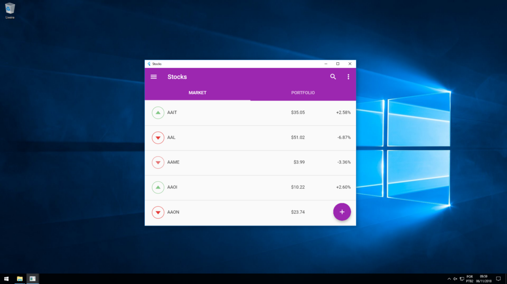
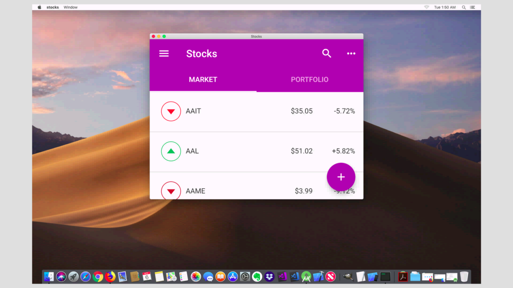
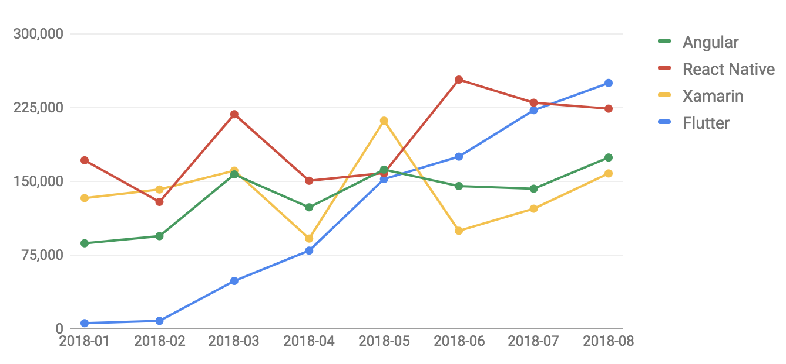

[Up](./index.md)

## 일주일간의 플러터 경험 (Experience of Flutter for a week)

*일주일간 Flutter를 하며 감상을 적습니다.*

## 특징

Google의 오픈소스입니다.

Dart 언어를 사용합니다. (어떤 비공식 데스크탑용 프레임워크는 Go 기반입니다.) 

Google Material 디자인과 디자인 애셋들이 제공 됩니다: 시각 디자이너의 역할이 축소 될 수 있습니다.

풍부한 단일 디자인의 [위젯](https://www.youtube.com/playlist?list=PLOU2XLYxmsIL0pH0zWe_ZOHgGhZ7UasUE) 지식으로 Android, iOS, Web, Windows, macOS, Linux GUI를 구성할 수 있습니다.

Flutter Wedget of a Week: Hero

<iframe width="560" height="315" src="https://www.youtube.com/embed/Be9UH1kXFDw" frameborder="0" allow="accelerometer; autoplay; encrypted-media; gyroscope; picture-in-picture" allowfullscreen></iframe>


[이미지 출처: What’s Revolutionary about Flutter](https://medium.com/@dan_kim/%EB%B2%88%EC%97%AD-flutter%EB%8A%94-%EC%99%9C-%ED%98%81%EB%AA%85%EC%A0%81%EC%9D%B8%EA%B0%80-967c1dfcc5a9)


운영체제에 따라 운영체제 네이티브 컨트롤이 제공되고 자동으로 구성 됩니다.

좌측 iOS, 우측 안드로이드. [이미지 출처](https://medium.com/flutter-io/google-maps-and-flutter-cfb330f9a245)


좌측 아이폰 X, 우측 넥서스 6 [이미지 출처](https://startflutter.com/themes/flutter-chat-app/)


유니티 같이 뛰어난 게임 엔진에서 볼 수 있는 간결하고 사용하기 편한 애니메이션 컴포넌트들을 제공합니다.


Dart 언어만으로 Android/iOS용 **네이티브 앱**을 개발 할 수 있습니다. (다트가 AOT를 지원하기 때문이며, 각 운영체제에 의존하는 기능은 `AndroidMenifest.xml` 또는 `AppDelegate.m` 및 프로젝트 파일을 편집하거나 애니메이션되는 런처를 위해 xib 파일을 해야 할 수도 있습니다.) 


다른 웹 프레임워크들이 프론트엔드를 위해 HTML과 자바스크립트를 편집해야 하는데 비해, Dart 만으로 웹 프론트엔드 앱을 개발 할 수 있습니다: 플러터가 DOM을 조작하여 HTML과 자바스크립트를 삽입합니다. 디자인과 비지니스 로직을 분리하려면 아키텍처로 구성 할 수 있습니다. 다른 웹 피처를 삽입하기 위해 `index.html`을 편집 할 수도 있습니다. 

좌측 파이어폭스 브라우저, 우측 크롬 브라우저.

<iframe width="560" height="315" src="https://www.youtube.com/embed/YjDmjvV0I8s" frameborder="0" allow="accelerometer; autoplay; encrypted-media; gyroscope; picture-in-picture" allowfullscreen></iframe>


다트 언어의 특징인데, 자바스크립트, 자바, C언어, 파이썬(루비), CSS, Objective-C, Swift에서 가져온 특징들이 있으며, 매개 변수를 생략하거나, HTML이나 CSS로 코딩하는 느낌을 주기도 하여 가독성이 좋습니다. 자바스크립트에 있는 문제점은 제거되어 더 안전합니다.

```dart
Center(
  child: Column(
    children: [
      Text('Hello, World!')),
      Icon(Icons.star, color: Colors.green)
    ]
  ) // Column
) // Center (이 코멘트는 IDE에 자동으로 렌더링 됩니다)
```

[이미지 출처: What’s Revolutionary about Flutter](https://medium.com/@dan_kim/%EB%B2%88%EC%97%AD-flutter%EB%8A%94-%EC%99%9C-%ED%98%81%EB%AA%85%EC%A0%81%EC%9D%B8%EA%B0%80-967c1dfcc5a9)


[이미지 출처: What’s Revolutionary about Flutter](https://medium.com/@dan_kim/%EB%B2%88%EC%97%AD-flutter%EB%8A%94-%EC%99%9C-%ED%98%81%EB%AA%85%EC%A0%81%EC%9D%B8%EA%B0%80-967c1dfcc5a9)


[이미지 출처: What’s Revolutionary about Flutter](https://medium.com/@dan_kim/%EB%B2%88%EC%97%AD-flutter%EB%8A%94-%EC%99%9C-%ED%98%81%EB%AA%85%EC%A0%81%EC%9D%B8%EA%B0%80-967c1dfcc5a9)


Windows, macOS, Linux 데스크탑 앱을 개발할 수 있습니다: 아직 구글의 공식 지원은 없으며 시간이 더 필요해 보입니다.

윈도우 10에서 데스크탑 앱. [출처](https://medium.com/flutter-community/flutter-from-mobile-to-desktop-93635e8de64e)




맥오에스 모하비에서 데스크탑 앱. [출처](https://medium.com/flutter-community/flutter-from-mobile-to-desktop-93635e8de64e)




우분투 18.04 LTS에서 데스크탑 앱. [출처](https://medium.com/flutter-community/flutter-from-mobile-to-desktop-93635e8de64e)


핫 스테이트 리로드를 지원합니다. 코드를 수정하고 파일을 저장하면 1초 이내에 자동으로 업데이트 됩니다.


프로젝트에서 패키지를 관리 합니다: 다른 프레임워크 라이브러리들은 프레임워크가 패키지 저장소를 컨트롤 하지 못합니다. 어느 IDE들은 소스 코드의 import 구문을 해석하고 자동으로 패키지들을 구성해주기도 합니다. 플러터에서는 `pubspec.yaml`에 패키지 이름, 버전과 프레임워크의 버전을 명시하면 자동 또는 수동으로 일괄 업데이트 되며, 이 파일 자체가 의존 패키지에 대한 문서가 됩니다. 프로젝트가 사용할 패키지의 버전을 명시하므로 따로 여러개의 환경 저장소를 유지할 필요가 없습니다.

```yaml
name: flutter_web.examples.gallery

environment:
  sdk: ">=2.2.0 <3.0.0"

dependencies:
  flutter_web: any
  flutter_web_ui: any
  intl: ^0.15.7

dev_dependencies:
  build_runner: any
  build_web_compilers: any
  flutter_web_test: any
  test: ^1.0.0

# flutter_web packages are not published to pub.dartlang.org
# These overrides tell the package tools to get them from GitHub
dependency_overrides:
  flutter_web:
    git:
      url: https://github.com/flutter/flutter_web
      path: packages/flutter_web
  flutter_web_test:
    git:
      url: https://github.com/flutter/flutter_web
      path: packages/flutter_web_test
  flutter_web_ui:
    git:
      url: https://github.com/flutter/flutter_web
      path: packages/flutter_web_ui
```


## 단점

- 다트나 플러터를 사용하는 개발자는 많지 않습니다.
- 새로 배워야 합니다.

## 주의

- 모바일 개발시 단일 플랫폼을 사용한다고 하여 개발 작업량이 반으로 줄어 들지는 않습니다. 각각 플랫폼으로 빌드 및 배포 환경을 구성해야 하므로 40%정도 줄어 들 것입니다.
- 웹을 개발할 경우 서버는 RESTful 하게 만들어야 합니다. 이것은 모바일 앱 개발 구성과 유사 합니다.

## 결론

- 인력 자원이 부족하여 짧은 시간에 웹, 모바일에 대응 해야 하는 스타트업에 적합합니다.
- 개발 비용 절감 압박을 받는 SI 업체에 적합할 수 있습니다.
- 플러터 개발자가 희소함에서 발생하는 팀 빌딩에 리스크도 있습니다.
- 다른 경쟁 프레임워크가 등장하지 않는다면 주류 기술이 될 가능성이 높다고 개인적으로 예상합니다.
- 아래 이미지: 스택오버플로우 프레임워크 그로쓰 [이미지 출처](https://www.altexsoft.com/blog/engineering/pros-and-cons-of-flutter-app-development/)



## 참조

- [이미지 출처: What’s Revolutionary about Flutter](https://medium.com/@dan_kim/%EB%B2%88%EC%97%AD-flutter%EB%8A%94-%EC%99%9C-%ED%98%81%EB%AA%85%EC%A0%81%EC%9D%B8%EA%B0%80-967c1dfcc5a9)
- [이미지 출처: Flutter: from Mobile to Desktop](https://medium.com/flutter-community/flutter-from-mobile-to-desktop-93635e8de64e)
- [이미지 출처: Adding Google Maps to Flutter](https://medium.com/flutter-io/google-maps-and-flutter-cfb330f9a245)
- [이미지 출처: Flutter Chat App](https://startflutter.com/themes/flutter-chat-app/)
- [이미지 출처: The Good and the Bad of Flutter App Development](https://www.altexsoft.com/blog/engineering/pros-and-cons-of-flutter-app-development/)

## 문서 이력

- 2019년 5월 18일 작성.
