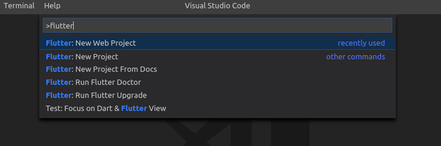
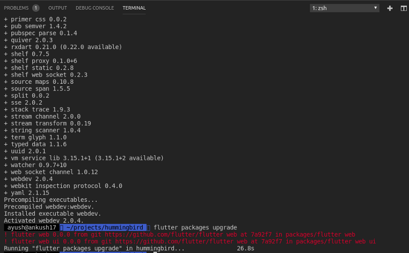
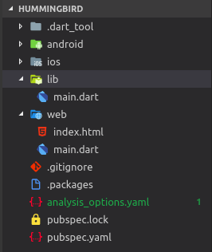
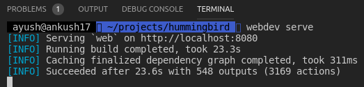
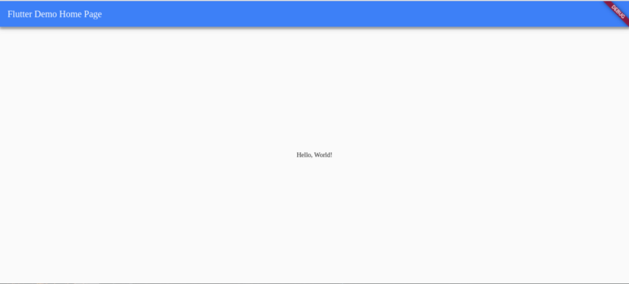
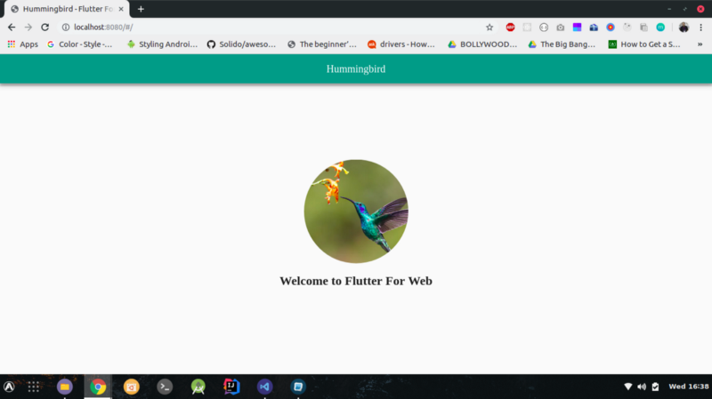
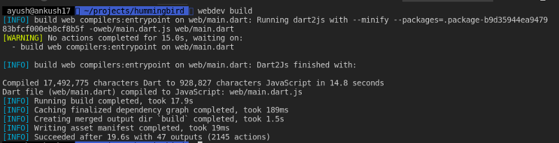
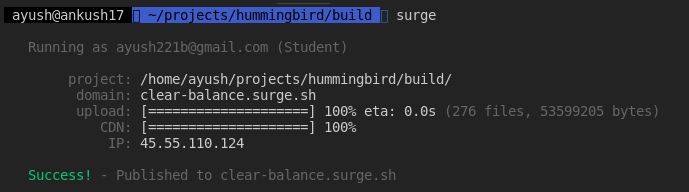

# 웹을 위한 플러터: 웹사이트를 밑바닥부터 만들고 배포하기

[원문: Flutter For Web: Create and Deploy a Website From Scratch](https://medium.com/flutter-community/flutter-create-and-deploy-a-website-from-scratch-4a026ebd6c)

코드명이 벌새(Hummingbird)인 프로젝트는 구글이 [Flutter for Web](https://flutter.dev/web)의 첫 번째 테크니컬 프리뷰를 발표하면서 드디어 그 날의 빛을 보게 되었습니다. 이 놀라운 구현은 Flutter 응용 프로그램을 컴파일하고 몇 가지 명령만 사용하여 표준 웹 프로젝트로 빌드 할 수 있게 해 주었습니다. 이 글에서는 밑바닥부터 Flutter on the Web의 구현을 살펴 보겠습니다.

시작하기 전에 먼저 플러터를 최신 버전으로 업그레이드 하겠습니다.  터미널에서 다음을 실행하세요:

```sh
flutter upgrade
```

마칠때까지 기다렸다가 다 되면 다음 단계로 진행합니다.

## SDK를 PATH에 추가하기

flutter_web을 실행하게 하려면 별도의 다트 SDK를 설치할 필요는 없습니다. 플러터와 함께 제공되는 기존 Dart SDK를 `PATH` 환경 변수에 추가하면 됩니다.

설치된 경로는 아래와 같을 것입니다:

```sh
<플러터가 설치된 경로>/bin/cache/dart-sdk/bin
```

`PATH` 환경변수를 우분투/리눅스/맥오에스에서 변경하려면 [이 문서](https://stackoverflow.com/questions/14637979/how-to-permanently-set-path-on-linux-unix)를 참조하시고, 윈도우에서는 [이 문서](http://www.oxfordmathcenter.com/drupal7/node/13)  참조하세요.

이제 플러터와 함께 가보도록 하겠습니다.

## 새 플러터 웹 프로젝트를 생성하고 구성하기

우선 우리는 새로운 플러터를 프로젝트를 생성할 것입니다. 이름을 hummingbird로 지정합니다. 터미널에서 수동으로 프로젝트를 생성 할 수 있지만, IDE를 사용하면 더 쉽게 프로젝트를 수행 할 수 있으므로, Flutter for Web을 통해 설치를 통해 할 필요가 없습니다.

VS Code를 열고, `Ctrl+Shift+P`를 누르고,  `flutter`를 입력 하면, 플러터를 위한 액션 목록을 표시됩니다. 그중에 `Flutter: New Web Project`가 있습니다.



그 옵션을 누르고 엔터를 누르세요. VS Code가 몇가지 필요한 확장을 설치하라고 나타낼 수 있습니다. 동의하면 설치하고 계속 진행 합니다.

다음 화면에서 프로젝트 이름을 `hummingbird`라고 입력합니다.

완료하면 VS Code는 자동으로 플러터 웹 프로젝트를 생성할 것입니다. hummingbird 폴더에서 다음을 실행하세요:

```sh
flutter packages pub global activate webdev
flutter packages upgrade
```

이렇게 하면 Flutter for Web을 빌드하는 데 필요한 [webdev](https://pub.dev/packages/webdev)가 전역으로 설치되고 필요한 종속성이 있게 됩니다. 출력은 다음과 같습니다.



마지막으로 터미널에서 webdev 명령을 실행할 수 있는지 확인합니다. 이를 위해 `PATH`에 다음 폴더를 추가해야합니다.

```sh
<사용자홈>/.pub-cache/bin
```

이것이 확인되면, 이제 Flutter for the Web을 실행할 준비가 되었습니다.

실행하기 전에 새 프로젝트 구조를 확인해 봅시다. `web` 이라는 새로운 폴더가 있음을 알 수 있습니다. 이 폴더에는 `index.html`  `main.dart`라는 두 개의 파일이 있습니다.



플러터로 만들려는 웹 사이트는 단일 페이지 응용 프로그램(Single Page Application Program; SPA)입니다. 그래서 기본적으로 우리가 작성한 모든 다트 코드는 자바스크립트로 컴파일되어 `index.html` 파일에 포함될 때 DOM(Document Object Model)을 조작하여 코드를 화면에 렌더링 합니다. `index.html` 파일의 `head` 태그를 편집하여 SEO 목적을 위해 메타 태그를 제공 할 수도 있습니다. 우리는 앞으로 이 아티클에서 플러터를 사용하여 구축 된 웹 사이트에 대해 SEO에 대해 더 깊이 파고들 것입니다.

이제, 그만 닥치고 시작해 보겠습니다.

### 브라우저에서 플러터 프로젝트 실행하기

위에서 언급 한 모든 단계를 제대로 진행했다면, 플러터 웹 프로젝트 디렉토리에서 다음 명령을 실행하는 것은 간단할 것입니다.

```sh
webdev serve
```

터미널에서 다음과 같은 출력을 얻을 것 입니다.



성공한 메시지를 보게 되면, 심호흡을 한번하고, 브라우저를 열어 미래의 크로스 플랫폼 개발을 볼 수 있습니다. `localhost:8080` 으로 접속하면 눈앞에서 마법이 펼쳐집니다.

성공적으로 실행되면 아래 화면을 볼 수 있습니다.



현재 방법을 사용하면, 웹 사이트의 실시간 코드 변경에 대해, 바뀌지 않으므로, 이를 위해 다음을 해야 합니다. 터미널로 이동하여 `Ctrl+C`를 눌러 현재 태스크를 취소하고, 다음을 실행하세요:

```
webdev serve --auto restart
```

`localhost:8080`을 한 번 실행하는 브라우저 탭을 새로 고침하세요. 이제 `lib`디렉토리 내부의 소스 코드에, 플러터 앱과 tada에서 하는 것처럼, 원하는  코드를 경하면, 브라우저에서 모든 변경 사항을 실시간으로 볼 수 있게 됩니다.

이것을 stateless hot-reload라고 합니다.

플러터 웹 사이트에 글쓰기를 할 때마다 번쩍 번쩍 번쩍 거리는 약간의 변경을 가하고 릴리즈하기 전에 빌드 한 다음 배포하겠습니다.

`lib/main.dart`파일에 아래 코드를 덮어 쓰세요:

```dart
import 'package:flutter_web/material.dart';

void main() => runApp(Hummingbird());

class Hummingbird extends StatelessWidget {
  @override
  Widget build(BuildContext context) {
    return MaterialApp(
      title: 'Hummingbird - Flutter For Web',
      debugShowCheckedModeBanner: false,
      theme: ThemeData(
        primarySwatch: Colors.teal,
      ),
      home: MyWebsite(),
    );
  }
}

class MyWebsite extends StatelessWidget {
  @override
  Widget build(BuildContext context) {
    return Scaffold(
      appBar: AppBar(
        title: Text('Hummingbird'),
        centerTitle: true,
      ),
      body: Center(
        child: Column(
          mainAxisAlignment: MainAxisAlignment.center,
          children: <Widget>[
            Container(
                width: 200.0,
                height: 200.0,
                decoration: BoxDecoration(
                    shape: BoxShape.circle,
                    image: DecorationImage(
                        fit: BoxFit.cover,
                        image: new NetworkImage(
                          "https://images.unsplash.com/photo-1520638023360-6def43369781?ixlib=rb-1.2.1&ixid=eyJhcHBfaWQiOjEyMDd9&auto=format&fit=crop&w=500&q=60",
                        )))),
            Padding(
              padding: const EdgeInsets.all(20.0),
              child: Text(
                'Welcome to Flutter For Web',
                style: TextStyle(fontSize: 24.0, fontWeight: FontWeight.bold),
              ),
            ),
          ],
        ),
      ),
    );
  }
}
```

그러면, `web/indexl.html` 파일은 다음처럼 바뀔 것입니다:

```html
<!DOCTYPE html>
<html lang="en">
<head>
  <meta charset="UTF-8">
  <meta name="description" content="A simple implementation of Flutter for Web.">
  <meta name="keywords" content="Flutter, Hummingbird">
  <meta name="author" content="Ayush Shekhar">
  <meta name="viewport" content="width=device-width, initial-scale=1.0">
  <title>Hummingbird - Flutter For Web</title>
  <script defer src="main.dart.js" type="application/javascript"></script>
</head>
<body>
</body>
</html>
```

잊지말고 `Ayush shekhar`를 독자의 이름으로 변경하세요. 그러면, 아래와 같은 웹사이트를 보게 될 것입니다.



우리는 이미 사랑에 빠졌습니다. 심호흡을 한번 더 하시구요.

### 릴리즈와 배포를 위해 빌드하기

이 부분은 빠르게 할 수 있습니다. 터미널에서 프로젝트 폴더로 이동하여 다음을 실행하세요:

```
webdev build
```

아마도 아래처럼 출력 될 것입니다.



명령을 실행하면 프로젝트 폴더에서 `build`라는 새 폴더가 생성 된 것을 볼 수 있습니다.


이 폴더가 배포하게될 폴더입니다.

배포 방법은 다양 할 수 있습니다. 사용하려는 방법은 surge입니다. 그것은 NPM 패키지로 제공되며 정적 URL을 원격 URL에 빠르고 쉽고 무료로 배포하는 데 도움이됩니다. 자세한 내용은 [여기](https://surge.sh/)에서 확인할 수 있습니다.

이 작업을 하려면 먼저 NodeJS를 필요로 합니다. NodeJS를 가지고 있지 않다면 <https://nodejs.org/en/>에서 얻을 수 있습니다.

surge를 설치하겠습니다. 터미널을 열고 아래처럼 하세요:

```
npm i -g surge
```

이 명령은 surge를 시스템에 전역으로 설치할 것이고, 어디에서나 사용할 수 있게 됩니다. 이제, `hummingbird` 프로젝트로 되돌아가 아래를 실행하세요:

```
cd build
surge
```

이제 surge가 이메일과 비밀번호를 물으면, 새 비밀번호를 선택하거나 기존 계정의 비밀번호를 입력하세요. 완료되면 서지가 자동으로 웹 사이트를 업로드하고 배포 한 다음 CDN에 매핑합니다.



축하합니다. 플러터가 있는 웹 사이트를 성공적으로 만들고 인터넷에 배포하여 전세계가 볼 수 있게 하세요. 저의 경우<http://clear-balance.surge.sh/#/>에는 터미널 출력 결과에 의해 제공되는 원격 URL로 이동하여 웹사이트를 탐색 할 수 있습니다.

이 기술이 어떻게 성장하고 시간이 지남에 따라 번성할지 기대 됩니다.

[Linkedin](https://www.linkedin.com/in/ayushshekhar/)에서 내게 연락 할 수 있습니다. [Github](https://github.com/ayush221b)의 프로젝트를 참조하십시오. 또는 [Twitter](https://twitter.com/007221b) 에서 저를 팔로우하여 플러터 및 모바일 개발의 최신 소식을 정기적으로 확인할 수 있습니다. 읽어 주셔서 감사합니다.

## 참조

- [Flutter For Web: Create and Deploy a Website From Scratch](https://medium.com/flutter-community/flutter-create-and-deploy-a-website-from-scratch-4a026ebd6c)


