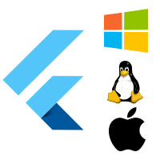
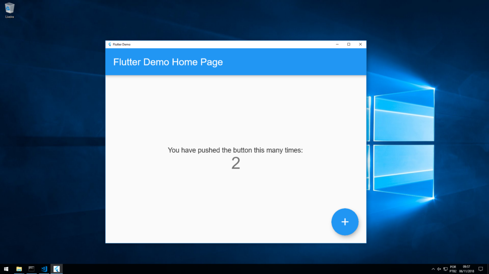
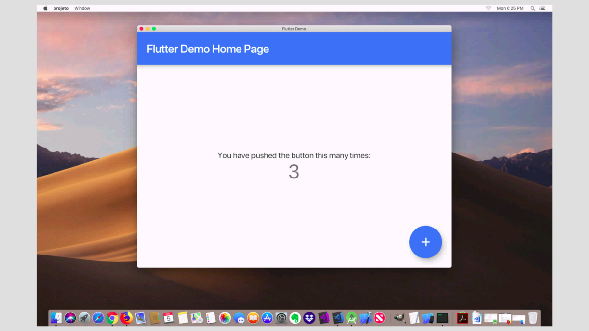
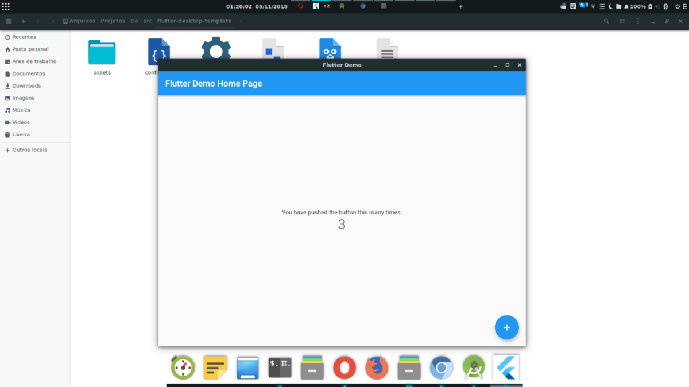

# Flutter: from Mobile to Desktop

원문: [Flutter: from Mobile to Desktop](https://medium.com/flutter-community/flutter-from-mobile-to-desktop-93635e8de64e)

Building applications for smartphones and desktops with the Google framework.


[베트남어로 작성된 글을 보려면 이곳을 보세요](https://medium.com/@marceloneppel/flutter-do-mobile-para-o-desktop-aa50558c0fe6)

---

역자주: 데스크탑 개발을 위한 환경은 더 시간을 기다려야 할 것으로 보입니다.

---

### Introduction

스마트폰용 애플리케이션을 개발한다면 아마도 새로운 개발 프레임워크인 Google의 플러터에 대해 들어봤을 것입니다. 다트 언어와 Google의 단일 코드 기반으로 애플리케이션을 개발하고 Android 및 iOS 플랫폼 용으로 게시 할 수 있는 프레임워크입니다.

이 프레임워크는 아직 1.0 버전에 이르지 않았지만, 올해 5 월에 출시된 베타 3 버전 이후로 Google에서 제작 준비를 마친 상태로 발표 되었습니다. 또한 이 글에서 다루는 주제인 데스크톱 환경 (Windows, macOS 및 Linux) 용 플러터로 응용 프로그램을 개발 할 수도 있습니다.

데스크톱 플랫폼에 대한 지원은 현재 개발중인 두 가지 프로젝트를 통해 제공됩니다. 그 중 하나는 Google에 의해 개발되었지만 회사에서 지원하지 않는다는 표시가 있습니다. 프로젝트는 다음 Github 저장소에서 찾을 수 있습니다.

[github: google/flutter-desktop-embedding](https://github.com/google/flutter-desktop-embedding)

[github: Drakirus/flutter-desktop-embedder](https://github.com/Drakirus/go-flutter-desktop-embedder)

두 프로젝트 모두 사용자 정의 플러터 엔진 임베더로 분류 됩니다. 즉, Flutter API의 구현이므로 이 프레임워크에서 개발 된 프로젝트는 플러터 프로젝트에서 공식적으로 지원되는 것 이외의 운영 체제에서 실행할 수 있습니다 (Android, [Fuchsia](https://en.wikipedia.org/wiki/Google_Fuchsia) 및 iOS).




이들은 OpenGL을 GLFW 라이브러리 (Google 프로젝트의 macOS 버전 제외)를 통해 OpenGL을 사용합니다. 이 API는 데스크톱 플랫폼에서 창을 만들고 키보드 및 마우스 입력을 처리하는 API를 제공합니다. 따라서 개발중인 응용 프로그램이 실행되는 플랫폼에는 OpenGL 용 드라이버가 설치되어 있어야 합니다.

---

### 플러터 설치

플러터를 설치하려면 운영 체제에 따라 공식 설치 페이지에 나열된 단계를 따르세요. [이곳](https://flutter.io/get-started/install/)를 클릭하여 설치 페이지에 액세스 하세요. 이 글의 뒷부분에서 프로젝트를 실행 할 것입니다. `PATH` 환경 변수에 플러터를 포함시키는 것을 잊지 마세요.

---

### 프로젝트 1: [Desktop Embedding for Flutter (Google)](https://github.com/google/flutter-desktop-embedding)

이 프로젝트는 현재 리포지토리 설명서의 [주의 사항](https://github.com/google/flutter-desktop-embedding/blob/master/README.md#caveats) 섹션에 명시된 몇 가지 제한 사항이 있습니다.

이 기사의 뒷부분에 나오는 두 번째 프로젝트와 달리 이 프로젝트에는 샘플 프로젝트를 빠르게 실행하거나 데스크톱 플랫폼에서 플러터 프로젝트를 실행할 수 있는 바이너리 파일이 없습니다. 운영 체제에서 이 프로젝트의 소스 코드를 컴파일 한 다음 생성된 라이브러리를 응용 프로그램의 일부가 될 실행 파일에 포함시켜야합니다. 앞으로 이 프로세스는 현재 저장소 문서에 설명 된대로 단순화 될 것입니다.

이 프로젝트를 통해 프로젝트 소스 코드를 컴파일하고 플러터로 데스크톱 응용 프로그램을 만들려면 [이곳](https://github.com/google/flutter-desktop-embedding/blob/master/README.md) 및 [이곳](https://github.com/google/flutter-desktop-embedding/blob/master/library/README.md) 의 소개를 따라 하세요.

---

### 프로젝트 2: [Go Flutter desktop embedder (Drakirus)](https://github.com/Drakirus/go-flutter-desktop-embedder)

두 번째 프로젝트는 Google의 Go(Golang) 프로그래밍 언어를 통해 개발되었습니다.

프로젝트 저장소에는 이미 컴파일 된 실행 파일을 통해 데스크톱 응용 프로그램의 예제를 테스트 할 수있는 다운로드 릴리스가 있습니다. 또한 새로운 플러터 데스크톱 응용 프로그램을 만드는 것은 매우 간단합니다.

다음 항목은 프로젝트 저장소에서 기존 샘플 프로젝트를 실행하는 방법과 현재 플러터에서 개발한 자체 프로젝트를 데스크톱 응용 프로그램으로 실행하는 방법을 보여줍니다.

#### 예제 프로젝트 실행 하기:

1. 프로젝트 릴리즈를 [이곳](https://github.com/Drakirus/go-flutter-desktop-embedder/releases)에서 액세스 할 수 있습니다.
2. [Prebuilt Binaries example for Linux, Windows and MacOS](https://github.com/Drakirus/go-flutter-desktop-embedder/releases/tag/v0.2.1-alpha)에서 플랫폼에 따른 섹션 이름을 보고 예제 파일을 다운로드 받으세요.
3. 선택한 위치에 다운로드한 파일의 압축을 푸세요.
4. 압축 해제한 파일의 루트 디렉토리에서 stocks executable (macOS and Linux) 이나 **socks.exe**  (Windows) 를 실행하세요. 이것은 독자가 사용하는 운영체제에 따라 실행 됩니다 (디음은 실행 예제 이미지 입니다.).


Windows 10 데스톱에서 플러터 예제 앱이 구동되고 있습니다.


macOS 모하비에서 플러터 예제 앱이 구동되고 있습니다.


Ubuntu 18.04 LTS에서 플러터 예제 앱이 구동되고 있습니다.

NOTE : 다음 가이드에서 데스크탑 응용 프로그램의 macOS 버전은 검정색 화면으로 시작하지만 화면을 최대화 한 후에 응용 프로그램이 정상적으로 로드됩니다. 이 문제에 대한 해결책을 찾으면 이 글을 업데이트 할 것입니다.

#### 독자의 프로젝트 실행하기 (사전 컴파일된 파일을 사용):

1. 독자의 운영체제에 따라 [이곳](https://github.com/katutz/flutter-desktop-template/releases/tag/1.1.0) 에서 사전 컴파일된 파일을 다운로드 하세요.
2. 선택한 디렉토리에 압축 파일 내용을 푸세요.
3. 템플리트 디렉토리의 `config.json` 파일을 편집하여 환경 및 응용 프로그램의 정보에 따라 매개 변수의 값을 변경하세요. 
   1. `FlutterPath`: 플러터 설치 디렉토리.
   2. `FlutterProjectPath`: 플러터에서 개발된 독자의 프로젝트 디렉토리.
   3. `IconPath`: 데스크탑 응용 프로그램 아이콘 파일의 경로 (기본값은 유지 해도 됩니다.).
   4. `ScreenHeight`: 데스크톱 응용 프로그램의 초기 화면 높이.
   5. `ScreenWidth`: 데스크톱 응용 프로그램의 초기 화면 너비.
   6. Windows를 사용하는 경우 디렉토리 경로에서 단일 백슬래시 `\` 대신 이중 백 슬래시 `\\`를 사용하세요.
4. macOS 또는 Linux에서 `flutter-desktop-template` 실행 파일을 실행하거나 Windows에서 `flutter-desktop-template.exe` 실행 파일을 실행하면 응용 프로그램이 시작됩니다. 사용하는 운영 체제의 다른 응용 프로그램처럼 실행됩니다.

#### 독자의 프로젝트를 실행 (Go desktop 프로젝트 컴파일하기):

1. [여기 다운로드 페이지](https://golang.org/dl/)를 통해 Go 프로그래밍 언어를 다운로드하고 설치하십시오 (PATH 환경 변수에있는 도구의 설치 및 구성에 대한 지시 사항은 다운로드 페이지에서 제공됨).

2. 컴퓨터에서 Go에 데스크탑 프로젝트의 일부 코드 파일을 컴파일하기 위한 `gcc`가 설치되어 있지 않으면 설치해야 합니다. Windows의 경우 [tdm64-gcc](http://tdm-gcc.tdragon.net/download)를 제안합니다. macOS의 경우 Xcode 명령행 도구가 제공하는 것을 사용합니다. 리눅스의 경우 이미 시스템에 gcc가 설치되어 있을 것입니다.

3. 시스템에 Git이 설치되어 있지 않으면 [여기](https://git-scm.com/downloads)에서 Git을 다운로드하여 설치 하세요.

4. `flutter create` 명령 또는 IDE를 통해 플러터 프로젝트를 정상적으로 생성하십시오.

5. Include the following import in the main.dart file of your Flutter project:`import 'package:flutter/foundation.dart' show debugDefaultTargetPlatformOverride;`

6. 플러터 프로젝트의 `main.dart` 파일에 다음 `import`를 포함하세요:

   ```dart
   import 'package : flutter / foundation.dart'show debugDefaultTargetPlatformOverride;
   ```

7. 플러터 프로젝트의 `main.dart` 파일에서 `main` 메소드의 시작 부분 (`runApp` 메소드를 호출하기 전에)에 다음 코드를 포함 하세요 (데스크탑 플랫폼이 플러터 프로젝트에서 공식적으로 지원되지 않기 때문에 이 코드가 필요합니다)

   ```dart
   debugDefaultTargetPlatformOverride = TargetPlatform.fuchsia;
   ```

8. In a terminal, run the `flutter build bundle`  command in the directory of your Flutter project (a directory will be  created with the files needed to run the application in Flutter by the  template that will be downloaded and configured in the following steps).

9. 터미널에서, 플러터 프로젝트의 디렉토리에서

   ```
   flutter build bundle
   ```

   을 실행하세요. (다음 단계에서 다운로드하고 구성 할 템플릿에 의해 플러터 응용 프로그램을 실행하는 데 필요한 파일들이 포함된 디렉토리가 하나가 생성됩니다.).

10. 계속 터미널에서, go 언어에 대한 GLFW 라이브러리를 다운로드하려면

    ```sh
    go get -u github.com/go-gl/glfw/v3.2/glfw
    ```

    명령을 실행하세요 (문제가 있는 경우 이 문서 끝의 **문제 해결** 항목을 확인하세요). 설치하기 전에 이 [링크](https://github.com/go-gl/glfw/#installation)에 명시된 모든 의존성을 확인해야합니다.

11. [이곳](https://github.com/Drakirus/go-flutter-desktop-embedder/archive/v0.2.1-alpha.zip)에서 데스크탑 프로젝트를 다운로드하세요. (현재 Windows, macOS, Linux를 지원합니다.)

12. 다운로드 한 파일의 내용을 운영 체제의 모든 디렉토리에 압축을 풉니다.

13. `go-flutter-desktop-embedder-0.2.1-alpha` 에서 압축 해제한 디렉토리의 이름을 `go-flutter-desktop-embedder`로 바꾸세요.

14. 압축을 풀고 이름이 바뀐 이 디렉토리를 `src\github.com\Drakirus` 디렉토리 (또는 Windows의 경우 `src/github.com/Drakirus`)로 복사 하세요. 이 디렉토리는 `GOPATH` 디렉토리에 만들어야 합니다. (`GOPATH`는 Go 언어용으로 다운로드되는 라이브러리가 설치된 위치를 나타내는 환경 변수이며, Windows 및 macOS에서는 일반적으로 사용자의 개인 폴더 내부에 있는 Go 디렉토리입니다).

15. Download or clone the template repository needed for this walkthrough [here](https://github.com/katutz/flutter-desktop-template)  (it will be used to make it easier to run the application without  having to program in the Go language). Unzip the downloaded file to a  directory of your preference if you have chosen to download it instead  of cloning the repository.

16. 이 연습을 위해 필요한 템플릿 저장소를 다운로드하거나 복제하십시오 (https://github.com/katutz/flutter-desktop-template) (이동 중에 프로그래밍하지 않고도 응용 프로그램을 실행하기 쉽게 만듭니다.) 언어). 다운로드 한 파일을 저장소를 복제하는 대신 다운로드하도록 선택한 경우 원하는 디렉토리에 압축을 풉니 다.

17. Download the Flutter library (required for template operation) by using the [https://storage.googleapis.com/flutter_infra/flutter/**74625aed323d04f2add0410e84038d250f51b616**/linux-x64/linux-x64-embedder](https://storage.googleapis.com/flutter_infra/flutter/74625aed323d04f2add0410e84038d250f51b616/linux-x64/linux-x64-embedder) link on Linux, [https://storage.googleapis.com/flutter_infra/flutter/**74625aed323d04f2add0410e84038d250f51b616**/darwin-x64/FlutterEmbedder.framework.zip](https://storage.googleapis.com/flutter_infra/flutter/74625aed323d04f2add0410e84038d250f51b616/darwin-x64/FlutterEmbedder.framework.zip) on macOS or [https://storage.googleapis.com/flutter_infra/flutter/**74625aed323d04f2add0410e84038d250f51b616**/windows-x64/windows-x64-embedder.zip](https://storage.googleapis.com/flutter_infra/flutter/74625aed323d04f2add0410e84038d250f51b616/windows-x64/windows-x64-embedder.zip)  on Windows (replacing bold text, which is the hash of beta version  0.9.4, with the hash corresponding to the version of Flutter you are  using in your project, what you can get by looking at the file **bin\internal\engine.version** inside your Flutter install path).

18. Unzip the downloaded file and copy the **libflutter_engine.so** file in Linux, FlutterEmbedder.framework (the contents of the **FlutterEmbedder.framework.zip** file as a directory with the name **FlutterEmbedder.framework**) on macOS or **flutter_engine.dll** on Windows into the directory template, where the main.go file is located, and also into the **go-flutter-desktop-embedder directory**, which was previously copied to your GOPATH.

19. On a terminal, go to the **go-flutter-desktop-embedder** directory and run the `export CGO_LDFLAGS="-L${PWD}"` command on Linux, the `set CGO_LDFLAGS=-L%cd%` command on Windows or `export CGO_LDFLAGS="-F${PWD} -Wl,-rpath,@executable_path"` command on macOS. Keep the terminal open.

20. On the same terminal, run the `go install` command inside the **go-flutter-desktop-embedder** directory. Still keep the terminal open.

21. Edit the **config.json**  file of the template directory by changing the value of the parameters  according to the information of your environment and application. **FlutterPath:** directory of your Flutter installation. **FlutterProjectPath:** your project (developed in Flutter) directory. **IconPath:** path to the desktop application icon file (default value can be maintained). **ScreenHeight:** initial screen height of the desktop application. **ScreenWidth:** initial screen width of the desktop application. **Use double backslashes (\\) instead of simple ones (\) in directory paths if you are using Windows.**

22. Still in the same terminal, repeat step 16 and execute the `go build` command, but now in the directory where you unzipped the template, where the main.go file is located. On Windows, use the `go build -ldflags -H=windowsgui` command instead of `go build`  so that a terminal is not displayed along with the application when  running it. On macOS, it may be necessary to package the directory  according to the platform standards so that a terminal is not shown  along with the application.

23. An executable file will be created (it will have the same name as the project directory, **flutter-desktop-template** on Linux and Mac or **flutter-desktop-template.exe** on Windows if the template directory is **flutter-desktop-template**).

24. Run  the created executable file and the application will start. It will run  like any other operating system application that you use (examples in  the images below).



Application developed in Flutter running in the Windows 10 desktop environment.



Application developed in Flutter running in the macOS Mojave desktop environment.



Application developed in Flutter running in the Ubuntu Budgie 18.04 desktop environment.

- **Whenever  any changes are made to the Flutter project, repeat step 7 (running the  flutter build bundle command in the project directory) again.**
- **The version of Flutter used in the project should be the same as that downloaded in step 14.**
- **Whenever you make any changes to the config.json file of the template, repeat steps 16 and 19.**

---

### **Packaging your application for distribution**


To  distribute your desktop application developed in Flutter so that it can  run on computers that do not have Flutter installed, follow the steps  below after running one of the above guides to run your own project.

1. Make sure you are using the current version of the template, which is version **1.1.0**.
2. Create  a directory to store all the files needed to run your application. In  the following steps, this directory will be called as application  directory.
3. Include in the application directory the **flutter-desktop-template** executable (on Linux and macOS) or **flutter-desktop-template.exe** (on Windows). Rename the executable according to the name of your application.
4. Also include the Flutter library in the application directory. This library is the **libflutter_engine.so** file on Linux, the **FlutterEmbedder.framework** directory on macOS, or the **flutter_engine.dll** file on Windows.
5. Copy the **config.json** file to the application directory. Edit this file by changing the value of **FlutterPath** and **FlutterProjectPath** to blank (leave the values empty).
6. Include the **assets** directory with the **icon**  image in the application directory. If you have chosen another image,  copy that image to the application directory and correct its path in the  **IconPath** value in the **config.json** file.
7. Copy to the application directory the **flutter_assets** directory, located in the **build** directory of your Flutter project.
8. Finally, copy the **icudtl.dat** file located in the **bin\cache\artifacts\engine\windows-x64** (on Windows), **bin/cache/artifacts/engine/linux-x64** (on Linux) or **bin/cache/artifacts/engine/darwin-x64** (on macOS) path from your Flutter installation to the application directory.
9. On  macOS, it may be necessary to package the directory according to the  platform standards so that a terminal is not shown along with the  application.

Now you can distribute your application and install it in environments without installing Flutter along with it.

---

### **Troubleshooting**

#### **If  you experience some problem while performing step 8 of running your own  project guide (Go GLFW library) in a Linux environment, resulting in a  message similar to the one below, you can ignore it. These are only  warnings that do not cause any problem.**

\# github.com/go-gl/glfw/v3.2/glfw
In file included from ../../go-gl/glfw/v3.2/glfw/c_glfw_linbsd.go:24:0:
../../go-gl/glfw/v3.2/glfw/glfw/src/linux_joystick.c: In function ‘_glfwInitJoysticksLinux’:
../../go-gl/glfw/v3.2/glfw/glfw/src/linux_joystick.c:224:42:  warning: ‘%s’ directive output may be truncated writing up to 255 bytes  into a region of size 9 [-Wformat-truncation=]
 snprintf(path, sizeof(path), “%s/%s”, dirname, entry->d_name);
 ^~~~~~~
In file included from /usr/include/stdio.h:862:0,
 from /usr/include/X11/Xcursor/Xcursor.h:26,
 from ../../go-gl/glfw/v3.2/glfw/glfw/src/x11_platform.h:39,
 from ../../go-gl/glfw/v3.2/glfw/glfw/src/internal.h:169,
 from ../../go-gl/glfw/v3.2/glfw/glfw/src/x11_init.c:28,
 from ../../go-gl/glfw/v3.2/glfw/c_glfw_linbsd.go:19:
/usr/include/x86_64-linux-gnu/bits/stdio2.h:64:10:  note: ‘__builtin___snprintf_chk’ output between 12 and 267 bytes into a  destination of size 20
 return __builtin___snprintf_chk (__s, __n, __USE_FORTIFY_LEVEL — 1,
 ^~~~~~~~~~~~~~~~~~~~~~~~~~~~~~~~~~~~~~~~~~~~~~~~~~~~~~~~~~~~
 __bos (__s), __fmt, __va_arg_pack ());
 \~~~~~~~~~~~~~~~~~~~~~~~~~~~~~~~~~~~~~

---

### Conclusion

The  two projects presented in this article allow applications developed  with the Flutter framework to be run in desktop environments. The first  is developed by Google itself, but does not offer support. The second  allows for both greater ease in running applications built on Flutter  and desktop applications as well as greater familiarity for developers  working with the Go (Golang) programming language, also made by Google.

For  cases where an application should be developed for desktop and mobile  environments, so that the code can be reused, the two projects presented  in this article are great solutions.

For questions, leave your comment. I will answer as soon as possible.

Thanks for reading!

---

### Useful links

[My website](https://neppel.com.br)

[Flutter framework](https://flutter.io/)

[Dart programming language](https://www.dartlang.org/)

[Go programming language](https://golang.org/)

[Desktop Embedding for Flutter (Google)](https://github.com/google/flutter-desktop-embedding)

[Go Flutter desktop embedder (Drakirus)](https://github.com/Drakirus/go-flutter-desktop-embedder)

[Template to make it easy to run Flutter projects on the desktop](https://github.com/katutz/flutter-desktop-template)

---

## 참조

- [Flutter: from Mobile to Desktop](https://medium.com/flutter-community/flutter-from-mobile-to-desktop-93635e8de64e)


