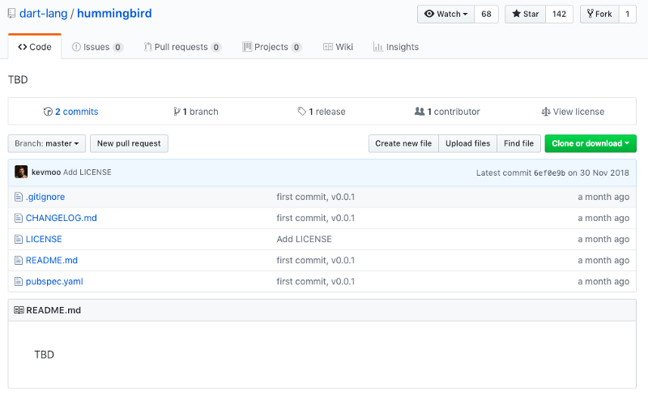
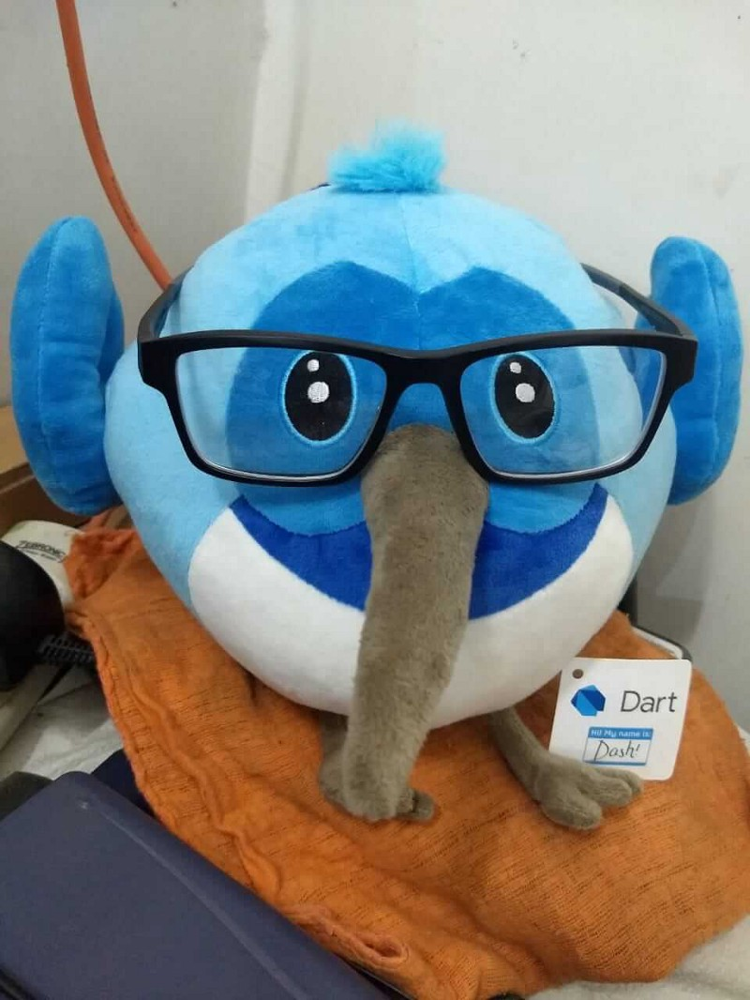

# Hummingbird vs Angular Dart

원문: [Hummingbird vs Angular Dart](https://medium.com/flutter-community/hummingbird-vs-angular-dart-b636b7147099)

Written by Raveesh Agarwal

Jan 6 6

---

업데이트 (2019년 5월 10일): Hummingbird는 이제 Flutter for the Web입니다. 이제 출시 되었고 우리는 테크니컬 프리뷰를 사용할 수 있습니다.

---

Hummingbird  was announced at the Dec 4 flutter launch event. A project that will  allow us to compile our flutter applications into full fledged  Progressive Web Apps. So… is Angular Dart still worth it?

I will try to share how much I’ve gathered so far, hoping that my findings help others as well.

Hummingbird는 12월 4일 Flutter 출시 행사에서 발표되었습니다. 우리가 Flutter 애플리케이션을 본격적인 프로그레시브 웹 앱으로 컴파일 할 수 있게 해주는 프로젝트입니다. 그래서 ... Angular Dart는 여전히 가치가 있습니까?

나는 내 연구 결과가 다른 사람들에게도 도움이 되기를 바라며, 지금까지 얼마나 깊이 파고 들었는지 이야기하려고 합니다.

### 그들은 얼마나 준비가 되었을까요?

첫 번째 질문은 두 가지를 실제로 사용할 수 있는지 여부입니다.

**Angular Dart**: AngularDart의 현재 버전은 5.2.0입니다. Google의 영향력이 큰 프로젝트 및 전 세계 프로젝트에서 안정적으로 사용되었습니다. (몇 년 전부터 있습니다.)

**Hummingbird**: Some  would claim that hummingbird is currently in its alpha. However, all we  have is a technical overview. More of a proposition than anything else  where the team thoroughly discussed the technical directions that they  are contemplating. 

어떤 사람들은 Hummingbird가 현재 알파에 있다고 주장 할 것입니다. 그러나 우리가 가지고 있는 것은 기술 개요입니다. 팀의 기술적 방향을 논의한 제안들. [여기](https://medium.com/flutter-io/hummingbird-building-flutter-for-the-web-e687c2a023a8)

2019년 1월 5일 현재 테스트 할 것이 없습니다.

### 그들은 실제로 무엇을 합니까?

이 글에서 무엇을 얻을까요?

걱정하지 말고 물어보세요. 우리는 Single Page Application(SPA)이 무엇인지, Progressive Web Applications(PWAs)이 무엇인지, 그리고 Angular와 Hummingbird의 예상 출력을 살펴볼 것입니다. 이것은 우리가 해결하고자하는 문제를 이해하는 데 도움이 될 것입니다.

**SPAs vs PWAs**

**단일 페이지 애플리케이션 (Single Page Applications)**

> **단일 페이지 애플리케이션 (SPA)**은 서버의 전체 페이지를 새로 로드하지 않고 동적으로 현재 페이지를 다시 작성하여 사용자와 상호 작용하는 웹 애플리케이션 또는 웹 사이트입니다. - 위키피디아

The character `#`  when included in URLs, instead of causing the page to reload, will  cause some interaction within the page. SPAs make use of this browser  feature.

For  example, in Wikipedia, if we click on a heading in the index, instead  of the page reloading, browser takes us to that section of the page.

'#'문자를 URL에 포함 시키면 페이지가 다시 로드 되는 대신 페이지에서 일부 상호 작용이 발생합니다. SPA는이 브라우저 기능을 사용합니다.

예를 들어 Wikipedia에서 색인에서 제목을 클릭하면 페이지를 다시 로드하는 대신 브라우저에서 페이지의 해당 섹션으로 이동합니다.

- <https://www.wikiwand.com/en/Single-page_application#/Ajax>를 방문하세요.
- `Ajax`를 `Websockets`으로 변경하고 엔터를 누르세요.
- 페이지가 다시 로드 됩니까? 아니요, 간단한 구성 변경이 가능합니다.

SPA는 이것을 다음 단계로 옮깁니다. 전체 애플리케이션과 모든 화면은 모든 기능에 대해 '#'기반 URL을 사용하여 단일 페이지에서 작동합니다.

**PWAs**

> 프로그레시브 웹 앱은 웹의 도달 범위(reach)를 가지며 신뢰할 수 있고 빠르며 매력적인 사이트입니다.
>
> — developers.google.com

PWA는 특정 방식으로 최적화 된 웹 사이트 (일반 웹 사이트 또는 단일 페이지 응용 프로그램 일 수 있음)입니다.

- Work reliably both offline and with unreliable internet (Lie-Fi)
- Are fast, optimised for high perceived performance
- Engaging — Feel like a native application and no less.

**What does AngularDart do?**
AngularDart  or Angular in general is a framework for writing SPAs. It provides  developers with a way to write the SPAs with features like:

- Bidirectional Data Binding
- Routing
- Templating
- Directives

And  much more. The actual UI is still written with HTML + CSS. Angular  merely provides everything else that enables web developers to develop  their SPAs. Main point is:

- Angular Dart는 UI 프레임워크가 아닙니다.
- Angular Dart는 PWAs 일 수도 있고, 아닐 수도 있습니다.

**What are Angular Web Components then?** 이들은 `angular_components` 패키지가 제공하는 Material 디자인 구성 요소들로, 애플리케이션을 구축하기위한 템플릿 역할을합니다.

- Internet Explorer에서 지원되지 않습니다.
- They are still written in HTML + CSS + Dart

**What will Hummingbird do?** So  far it’s just speculations. It will aim to convert any flutter  application into a PWA. It could or could not be a SPA(it most probably  will). Yet it will try to do everything that flutter does.

With  it we could use the Flutter UI Framework, use all the flutter SDK  features like state management widgets and all… and with one click,  produce a PWA alongside the Android and iOS apps that we already have!

There are many challenges along the way but if Google realises this, it will be the be all of SDKs.

### The state of All-Dart Apps

Dash is rocking it right now

웹과 네이티브를 위한 Dart 응용 프로그램을 작성한다면 Flutter + AngularDart 와 Flutter + Hummingbird 조합의 차이를 이해할 수 있습니다.

**THE PRESENT: Flutter + Angular Dart** For writing such an application we will need to:

- 모든 비즈니스 로직을 포함하는 코어 패키지를 작성하여 Angular 또는 Flutter 종속성이 없는지 확인하고 모든 의존성을 외부에서 주입합니다.
- Write the Angular PWA subscribing to the core for all functionalities
  \* UI with HTML + CSS or composing angular components
  \* Routing, state management with the Angular way of doing things
- Write a Flutter Application subscribing to the same core for all functionalities
  \* UI with the flutter UI framework
  \* Routing, State Management etc with the flutter way of doing things
- Compile to iOS and Android from the flutter project
- Compile to Web from the Angular Project

**Does code sharing reduce the amount of work?**While  code sharing definitely reduces the “amount of code”, in my experience  it hasn’t really reduced the amount of work that needs to be done. It  requires me to be much more thoughtful through the process.

**What are the benefits then?**

- Code is cleaner and the architecture is better
- I am forced to, and it is easier for me to maintain feature parity across platforms now.

**THE FUTURE: Flutter + Hummingbird**For writing such an application we will need to:

- Write a flutter application
  \* UI with the flutter framework
  \* Routing, State Management etc the flutte way
- Compile on three different platforms
- Done.

**Is it less work?**Hell yeah!

### Conclusion

the supreme verdict

There it is. A breakdown of what we know about flutter, angular dart, hummingbird and sharing code with each other.

**If you are developing something right now…**Go for flutter + angular dart. It is not as easy as the hummingbird dream, but still is the best way to go.

**Hummingbird**  as of now is a distant dream. A project that we should definitely hope  on coming to fruition some day and support with all our efforts, but `Dilli abhi door hai` (that future is distant).