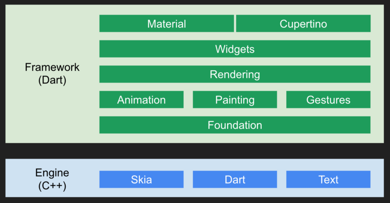
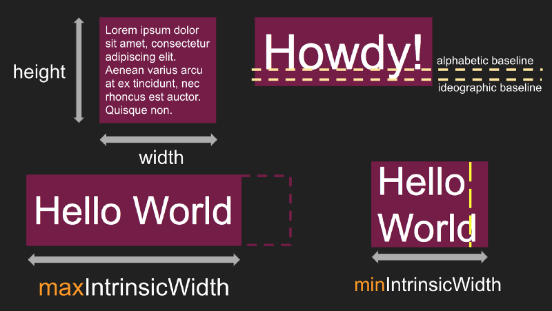
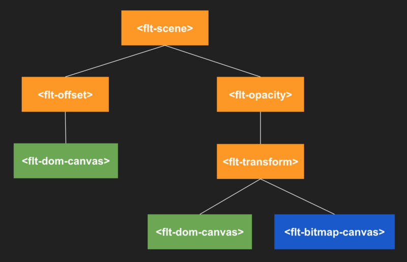
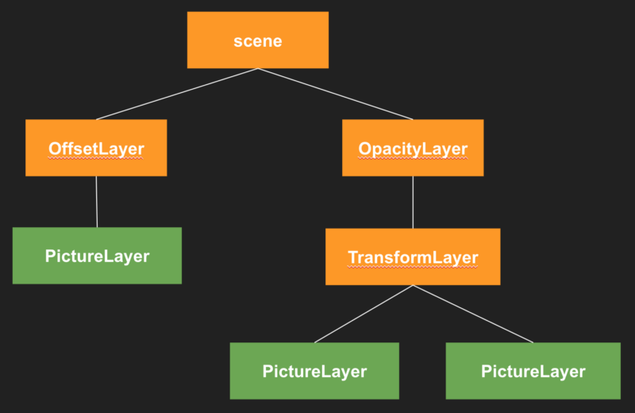

[Up](index.md)

# 번역: 허밍버드: Flutter for the Web를 개발하기 까지

원문: [Hummingbird: Building Flutter for the Web](https://medium.com/flutter/hummingbird-building-flutter-for-the-web-e687c2a023a8)

Written by Yegor Jbanov

Dec 5, 2018

---

오늘 Flutter Live에서 Flutter on the Web을 실험하고 있다고 발표했습니다. 이 글에서는 도전 과제에 접근하는 방법과 현재의 기술 상태에 대해 설명합니다. 게시물 끝에는 interop 및 embedding에 대한 질문에 대한 답을 찾을 수 있습니다.

Flutter의 아키텍처에 대해 간단히 살펴 보겠습니다. Flutter는, 상위 계층이 사용하기 쉽고 작은 코드로 많은 것을 표현할 수 있고, 하위 계층은 복잡성을 처리 해야 하는 대신 더 많은 콘트롤을 제공하는 다중 계층 시스템입니다. 상위 계층(higher layer)이 개발자가 원하는 것을 수행하지 않으면, 하위 계층(lower layer)으로 떨어질(drop) 수 있습니다. 개발자는 Flutter Engine 위의 모든 계층에 액세스 할 수 있습니다.

모바일용 플러터 아키텍쳐

Flutter Engine은 Flutter의 가장 낮은 레벨의 라이브러리 dart:ui를 노출합니다. 위젯, 물리, 애니메이션 또는 레이아웃 (텍스트 레이아웃 제외)에 대해서는 아무것도 모릅니다. 알고 있는 것은 [그림](https://docs.flutter.io/flutter/dart-ui/Picture-class.html)을 화면에 구성하여 픽셀로 변환하는 방법입니다. dart::ui 위에 애플리케이션을 직접 작성하는 것은 어려울 것입니다. 이것이 상위 계층이 생성 된 이유입니다.

우리는 dart::ui 위의 모든 것을 "프레임워크"라고 부르는 것을 좋아합니다. 그 아래 모든 것은 "엔진"입니다. 이 프레임워크는 Dart 프로그래밍 언어를 사용하여 작성되었습니다. 대부분의 엔진은 C++로 작성되었으며 Android 관련 파트는 Java로 작성되었으며 iOS 전용 파트는 Objective-C로 작성되었습니다. dart:ui의 몇 가지 기본 클래스와 함수는 Dart로 작성되었으며 대부분 Dart와 C++ 사이의 다리 역할을합니다.

Flutter는 또한 플러그인 시스템을 제공합니다. 플러그인은 모바일 생태계가 축적한 OEM 라이브러리 및 타사 라이브러리에 직접 액세스 할 수있는 언어로 작성된 코드입니다. Android 용 플러그인은 Java 또는 Kotlin을 사용하여 작성됩니다. iOS 플러그인은 Objective-C 또는 Swift를 사용하여 작성됩니다.

### Hello, The Web

웹 플랫폼은 수십 년 동안 진화 해 왔으며 수많은 기술과 사양을 포함하고 있습니다. HTML, CSS, SVG, JavaScript, WebGL과 같은 관련 기능의 대규모 모음을 설명하는 데 사용되는 용어가 있습니다. 웹에서 Flutter를 실행하려면 다음을 수행해야합니다.

- **Dart 코드 컴파일:** Flutter는 Dart로 작성되었으며 Web에서 Dart를 실행해야합니다..
- **웹에서 실행할 Flutter의 서브세트를 선택.**:  Flutter 코드를 웹에서 실행하는 것은 실용적이지 않거나 유용하지 않습니다. 그 중 일부는 Android 및 iOS bitcode와 같이 플랫폼에 따라 다릅니다.
- **웹 기능의 서브세트를 선택**:  웹 플랫폼은 시간이 흐르면서 중복되는 기능들이 축적 되었습니다. 예컨데, 그래픽을 그리자면 HTML+CSS, SVG, Canvas 및 WebGL를 사용할 수 있습니다.

Dart는 언어가 존재하는 한 JavaScript로 컴파일하고 있습니다. 많은 중요한 애플리케이션들이 Dart에서 Javascript로 컴파일되고 현재 프로덕션에서 실행됩니다. Flutter의 컴파일 전략은 이와 동일한 인프라를 사용합니다.

우리가 탐구를 시작할 때 우리는 UI 렌더링을 위한 몇 가지 선택에 직면했습니다. 우리는 지원하고자하는 특정 Flutter 레이어가 구현에 사용할 웹 기술을 지정한다는 것을 빨리 알게 되었습니다. 우리는 세 가지 **프로토타입을 만들었습니다** :

1. **widgets**: 이 프로토타입은 Flutter의 위젯 프레임워크를 구현하고 사용자 정의 위젯을 빌드하기 위한 토대로 일련의 코어 레이아웃 위젯을 제공했습니다. 레이아웃과 포지셔닝을 위해서는 flexbox, grid layout, overflow:scroll을 통한 브라우저 스크롤링 등과 같은 웹의 내장 기능에 의존했습니다.
2. **Widgets + custom layout**: 이 프로토타입은 Flutter의 레이아웃 시스템 (`RenderObject`에 의해 제공됨)을 포함하고 있지만 `RenderObject`를 HTML 요소에 직접 매핑합니다.
3. **Flutter Web Engine**: 이 프로토타입은 Dart 위의 모든 레이어를 유지했으며 브라우저에서 실행되는 dart:ui 구현을 제공했습니다.

Flutter의 가장 중요한 기능 중 하나는 플랫폼간에 호환이 가능하다는 것입니다. 사용자 정의 플랫폼 특정 코드를 작성할 수 있지만 (때로는 이를 권장), 플랫폼간에 다를 필요가 없는 코드를 공유 할 수 있습니다. 이것에 의해, 단일의 코드베이스로 복수의 플랫폼을 타겟으로하는 어플리케이션을 작성할 수가 있습니다.

몇 가지 샘플 애플리케이션을 웹에 이식하려고 시도한 후에 프로토 타입 #1과 #2는 Flutter 개발자가 즐길 수 있는 수준의 이식성을 제공하지 않는다는 것을 알게되었습니다. 따라서 Flutter Web Engine 디자인인 프로토 타입 #3을 사용하기로 결정했습니다. 플랫폼 간의 코드 재사용이 가능하기 때문입니다.

플러터용 웹 아키텍쳐 (Hummingbird)

이제 우리는 dart:ui API 전체를 구현하기를 원했기 때문에 위에 구축 할 일련의 웹 기술을 선택 해야 합니다. Flutter는 UI를 한 번에 한 프레임 씩 렌더링합니다. 각 프레임 내에서 Flutter는 위젯을 만들고, 레이아웃을 수행하고, 마지막으로 화면에 페인트 합니다.

### Building widgets

위젯 빌드 메커니즘은 앱이 실행되는 환경에 의존하지 않습니다. 프로세스는 메모리 내 개체를 인스턴스화하고 상태를 추적하며 상태 변경이 시스템, 레이아웃 및 페인팅의 하위 수준에 필요한 최소한의 업데이트를 계산할 때만 수행됩니다. 이 부분을 웹에 이식하는 것은 간단했습니다. Dart 팀이 dart2js에서 super-mixin 지원을 구현 한 후 컴파일러는 모든 위젯과 위젯 프레임워크를 거의 문제없이 JavaScript로 컴파일했습니다.

### Layout

레이아웃 시스템은 조금 까다 롭습니다. 가장 큰 도전은 텍스트 레이아웃이었습니다. 그 밖의 모든 것 (센터, 행, 열, 스택, 스크롤 가능, 패딩, 랩 등)은 프레임워크에 의해 레이아웃되어 있으므로 수정 없이 웹에 컴파일됩니다.

Flutter에서 [Paragraph](https://docs.flutter.io/flutter/dart-ui/Paragraph-class.html) 객체를 만들고 [layout()](https : //docs.flutter.io/flutter/dart-ui/Paragraph/layout.html) 메소드를 참조하세요. 불행히도 웹에는 직접 텍스트 레이아웃 API가 없습니다. 텍스트의 레이아웃 속성을 측정하는 데 사용한 트릭은 브라우저에서 레이아웃을 설정 한 다음 DOM 요소에서 관련 속성을 다시 읽는 것입니다.

단락을 배치 할 때 Flutter는 단락의 높이, 너비, 최대 고유 폭, 최소 고유 폭 및 알파벳 및 표의 문자(ideographic)를 기준으로 측정합니다. 이 속성은 아래에 나와 있습니다.

*Paragraph layout attributes*

Flutter의 [Paragraph documentation](https://docs.flutter.io/flutter/dart-ui/Paragraph-class.html)에서 자세한 내용을 확인할 수 있습니다.

이러한 속성을 측정하기 위해 먼저 HTML DOM 요소에 단락을 넣은 다음 요소의 크기를 읽습니다. 이렇게 하면 브라우저가 레이아웃을 지정합니다. 예를 들어, 요소의 너비와 높이를 가져 오려면 [offsetWidth](https://developer.mozilla.org/en-US/docs/Web/API/HTMLElement/offsetWidth)와 해당 형제 인 [offsetHeight](https://developer.mozilla.org/en-US/docs/Web/API/HTMLElement/offsetHeight)을 호출합니다. 기준선을 측정하기 위해 flex row를 사용하여 자체적으로 레이아웃되도록 구성된 요소에 단락을 배치합니다. 문단 옆에 "probe"라는 또 다른 요소를 놓습니다. prob가 텍스트의 기준선과 정렬되기 때문에 [getBoundingClientRect](https://developer.mozilla.org/en-US/docs/Web/API/Element/getBoundingClientRect)를 호출하면 기준선이 됩니다. 유사한 트릭을 사용하여 최소 및 최대 고유 폭을 측정합니다.

### Painting

마지막으로 위젯을 페인트 해야 합니다. 이 부분은 탐구 중에 가장 큰 혼란을 겪었으며 여전히 우리에게 가장 활발한 연구 분야 중 하나입니다. 프레임이 끝날 때까지 모든 위젯을 화면의 픽셀로 변환해야 합니다. 브라우저에서 이것은 HTML/CSS, Canvas, SVG 및 WebGL을 레시피로 삶아야 한다는 것을 의미합니다.

우리는 WebGL을 아직 보지 못했는데, 그 이유는 주로 낮은 레벨이기 때문에 텍스트 레이아웃과 2D 그래픽 래스터 화와 같이 브라우저가 이미 수행 할 수 있는 작업을 다시 구현해야 한다는 것뿐 아니라 접근성, 텍스트 선택, 비 Flutter 구성 요소가 있는 구성은 WebGL에서 작동 할 수 있습니다.

초기 프로토타입 중 하나는 모든 `RenderObject`에 대해 HTML 요소를 생성했습니다. 그러나 우리는 유망한 결과를 얻었지만 너무 많은 API 변경을 초래했습니다. 우리는 높은 수준으로 Flutter와 코드 공유를 유지해야 하므로 아이디어를 포기했습니다.

우리는 현재 두 가지 접근 방식을 동시에 탐색하고 있습니다.

- HTML+CSS+Canvas
- CSS Paint API

#### HTML+CSS+Canvas

이 접근 방식을 통해 프레임워크에서 생성 된 그림을 HTML+CSS를 사용하여 표현 가능한 그림과 Canvas 2D를 사용하여 표현 가능한 그림으로 분류합니다. 그런 다음 HTML, CSS 및 2D 캔버스를 결합한 HTML DOM을 출력합니다.

브라우저의 [display list](https://en.wikipedia.org/wiki/Display_list)이 지원하기 때문에 HTML + CSS를 선호합니다. 즉, 그림의 래스터화(rasterize)를 브라우저의 렌더링 엔진에 최적화 할 수 있습니다. 이것은 또한 픽셀 화에 대한 걱정없이 임의의 변환, 특히 회전 및 크기 조절을 적용 할 수 있음을 의미합니다. 이 캔버스 구현을 *DomCanvas*라고합니다.

HTML+CSS를 사용하여 그림을 표현할 수 없으면 캔버스로 돌아갑니다. Canvas 2D를 사용하면 거의 모든 Flutter 드로잉 명령을 그릴 수 있습니다. Flutter의 [Canvas](https://docs.flutter.io/flutter/dart-ui/Canvas-class.html)와 웹의 [CanvasRenderingContext2D](https://developer.mozilla.org/en-US/docs/Web/API/CanvasRenderingContext2D)를 비교하면 많은 유사점을 찾을 수 있습니다. 캔버스에 그림을 그리는 것은 HTML DOM이나 SVG do와 같이 시간이 지남에 따라 유지되어야 하는 노드의 변경 가능한 트리를 생성하지 않기 때문에 효율적입니다.

2D Canvas의 한 가지 문제점은 브라우저가 이를 *Width* x *Height* 픽셀을 저장하는 메모리 버퍼 인 비트맵으로 표현한다는 점입니다. 결과적으로 Canvas 크기를 조정하면 픽셀화(pixelation)가 발생합니다. 크기를 조정하면 그림의 크기가 조정되므로 Canvas의 크기를 조정해야 합니다. 우리는 Canvas를 할당하는 것이 상당히 비싸고 크기를 조정한다는 것을 발견했습니다. 또한 동일한 페이지에 여러 Canvas를 합성 할 때 브라우저는 래스터 컴포지션을 수행해야 하며 이는 또한 우리 프로파일에 나타납니다. 합성 래스터(Compositing resters)는 display list와 다르게 작동합니다. 여러 display list을 동일한 메모리 버퍼에 페인트 할 수 있습니다. 우리는 Canvas 2D-baked canvas를 *BitmapCanvas*라고 부릅니다. 우리는 Bitmap canvas를보다 효율적으로 만드는 방법을 연구하고 있습니다.

Flutter의 opacity, transform, offset, clip rect 및 기타 [layers](https://docs.flutter.io/flutter/rendering/Layer-class.html)를 표현하기 위해 plain HTML elements를 사용합니다. 예를 들어 opacity 레이어는 CSS 속성이 `opacity` 인 `<flt-opacity>` 요소가 되고 transfrom 레이어는 `transform` CSS 속성이 있는 `<flt-transform>` 요소가 되고 clip rect는 `overflow:hidden`으로 `<flt-clip-rect>`가 됩니다.

모든 것이 끝나고 완료되면 프레임은 HTML 요소의 트리로 페이지에 렌더링되고 DomCanvas 및 BitmapCanvas는 leaf node로 사용됩니다. 예 :

*Sample HTML DOM structure of a frame*

Flutter Engine의 해당 플러터 레이어 트리 ([flow layer](https://github.com/flutter/engine/tree/master/flow/layers)라 부름)는 다음과 같습니다:

구조적으로 그들은 매우 유사합니다. 가장 큰 차이점은 웹에서는 그 내용을 기반으로 사진에 대해 다른 구현을 선택해야한다는 것입니다.

HTML + CSS + Canvas는 모든 최신 브라우저에서 작동합니다. 그러나 우리는 이미 미래를 내다보고 있습니다.

#### CSS Paint API

[CSS Paint](https://developers.google.com/web/updates/2018/01/paintapi)는 새로운 웹 API이자 더 큰 노력의 일부인 [Houdini](https://developers.google.com/web/updates/2016/05/houdini) 입니다. 후디니(Houdini)는 CSS 엔진의 특정 부분을 개발자에게 노출시키는 많은 브라우저 공급 업체 간의 공동 작업입니다. 특히 CSS Paint API를 사용하면 개발자가 그리기를 요청할 때 개발자가 맞춤 그래픽을 HTML 요소에 그릴 수 있습니다. 예를 들어, 요소의`background`의 그림을 커스텀 CSS 페인터에 할당 할 수 있습니다. 캔버스와 매우 비슷하지만 다음과 같은 중요한 차이점이 있습니다.

- 그리기는 JavaScript 격리(isolate)로 이루어지지 않고 페인트 워크렛(paint worklet)으로 수행됩니다. 자체 메모리 공간을 가지고 있다는 점에서 웹 워커(web worker)와 조금 다릅니다. 페인트 워크렛은 DOM 변경이 커밋 된 후 브라우저의 페인트 단계에서 실행됩니다.
- CSS 페인트는 비트맵이 아닌 display list에 의해 뒷받침 됩니다. 이것은 2D 캔버스와 같은 painting efficiency과 pixelation이 아닌 두 월드의 장점을 제공합니다.
- 현재 CSS 페인트는 그림 텍스트를 지원하지 않습니다.

이 글을 쓰는 시점에서 Chrome과 Opera는 프로덕션 환경에서 CSS Paint를 지원하는 유일한 브라우저입니다. 그러나 다른 브라우저에서는 다른 여러 단계로 [ishoudinireadyyet.com/](https://ishoudinireadyyet.com/) 구현되었습니다.

Google은 Flutter for Web에서 CSS Paint API에 대한 실험적 지원을 제공하고 있으며 특히 성능면에서 이미 우수한 결과를 보여줍니다. 우리의 구현은 단순히 페인트 명령을 사용자 정의 CSS 속성으로 직렬화합니다. Paint worklet은 해당 명령을 읽고 실행합니다. 우리는 일반적인 `
`와 ``HTML 요소를 사용하여 텍스트를 렌더링합니다.

현재의 직렬화 메커니즘은 특별히 효율적이지는 않습니다 - 중첩 목록이 JSON으로 변환 된 트리입니다. 하지만 Houdini 프로젝트의 일부는 [typed array](https://developer.mozilla.org/en-US/docs/Web/JavaScript/Typed_arrays)에 대한 지원을 추가하는 것입니다. 사용 가능 해지면 JSON 문자열 대신 입력 된 배열로 페인트 명령을 인코딩합니다. 형식이 지정된 배열은 [transferable](https://developer.mozilla.org/en-US/docs/Web/API/Transferable)입니다. 즉, 기본 격리에서 참조로 페인트 작업 영역으로 전달 될 수 있습니다. 메모리를 복사하지 않습니다.

### Interop and embedding

#### Flutter에서 Dart 라이브러리 호출하기

Flutter 웹 애플리케이션은 오늘날 웹에서 실행되는 모든 기존 Dart 라이브러리에 대한 모든 액세스 권한을 갖습니다.

#### Flutter에서 JavaScript 라이브러리 호출하기

Flutter 웹 앱은 Dart의 JS-interop 패키지 인 `package:js`와 `dart:js`를 완벽하게 지원합니다.

#### Flutter 웹 앱에서 CSS 사용하기

현재 Flutter는 정확성과 성능을 위해 웹 페이지를 완전히 제어한다고 가정합니다. 예를 들어, 특정 성능 지침 (예 : <https://csstriggers.com/>)을 따르는 CSS의 작은 서브셋만 사용합니다. 페이지에 임의의 CSS를 넣으면 Flutter가 예기치 않게 작동합니다.

웹 앱용 Flutter에서 CSS를 피할 수 있는 또 다른 이유는 설계 상 Flutter가 프레임을 렌더링 할 때 모든 레이아웃 속성을 알아야 하기 때문입니다. CSS는 블랙 박스의 역할을합니다. 예를 들어 위젯의 스크롤 가능한 목록을 표시하려면 모든 요소에 대해 HTML을 인스턴스화하고 생성해야 하며 필요한 CSS 속성 (예 : flex-diection row 및 overflow: scroll)을 적용해야 합니다. 그런 다음 브라우저는 모든 것을 출력하고 다음 화면에 렌더링합니다. 애플리케이션 코드는 레이아웃 프로세스에 참여하지 않습니다.

마지막으로 Flutter 코드를 플랫폼간에 이식성 있게 유지하는 정신으로 CSS를 피하기 위해 Android 및 iOS에서 동일한 코드를 기본적으로 실행할 수 있습니다.

#### Embedding Flutter in existing web-apps

우리는 아직 이에 대한 적절한 지원을 추가하지는 않았지만, 앞으로는 그것을 탐구 할 생각입니다. 우리가 고려하고있는 몇 가지 접근법은 `<iframe>`과 shadow DOM입니다.

#### Embedding non-Flutter components in Flutter

Flutter 웹 앱에서 Custom Elements, React component, Angular component와 같은 Flutter가 아닌 elment를 포함하는 기능에 대한 지원은 아직 추가하지 않았지만 앞으로이 기능을 탐구 할 계획입니다. 한 가지 가능한 방법은 외부 콘텐츠를 Flutter 웹 앱에 드롭하기 위해 [flatform view](https://master-docs-flutter-io.firebaseapp.com/flutter/dart-ui/SceneBuilder/addPlatformView.html)를 사용하는 것입니다. 고려해야 할 한 가지 중요한 점은 외래 콘텐츠가 앱의 성능과 정확성에 어떤 영향을 미칠 수 있는지입니다. 위에서 언급했듯이 비 Flutter 구성 요소에는 임의의 CSS가 포함될 가능성이 있으므로 문제가 될 수 있습니다. 더 많은 연구가 필요합니다.

### 이식성 (Portability)

우리의 목표는 최대한 많은 웹프레임워크를 이식성있게 만드는 것입니다. 그러나 이것이 임의의 Flutter 앱이 코드 변경없이 웹에서 실행된다는 것을 의미하지는 않습니다. Flutter 웹 앱은 여전히 웹 앱입니다. 브라우저에서 샌드 박스 처리되며 웹 브라우저에서 허용하는 작업 만 수행 할 수 있습니다. 예를 들어 Flutter 앱에서 ARCore와 같은 웹 구현이 없는 기본 플러그인을 사용하는 경우 웹에서 앱을 실행할 수 없습니다. 마찬가지로, 파일 시스템이나 하위 레벨 네트워크에 직접 액세스 할 수 없습니다.

### 현황 (Current status)

Flutter Gallery의 대부분을 렌더링하기에 충분한 웹 엔진을 구축했습니다. 우리는 Cupertino 위젯을 포팅하지 않았지만 Material 위젯, Material Theming, Shrine 및 Contact Profile 데모 애플리케이션은 모두 웹에서 실행됩니다.

<iframe width="560" height="315" src="https://www.youtube.com/embed/5IrPi2Eo-xM" frameborder="0" allow="accelerometer; autoplay; encrypted-media; gyroscope; picture-in-picture" allowfullscreen></iframe>

### 소스코드는 어디에 있습니까? (Where is the source code?)

우리는 이 프로젝트를 곧 오픈 소스로 계획하고 오픈 소스 커뮤니티와 공유하는 것에 대해 기쁘게 생각합니다. 이 프로젝트는 Google의 내부 소스 트리에서 시작 되었습니다. 우리는 코드가 안정화되는 대로 개발을 GitHub으로 옮기려 하고 내부 인프라에서 이를 풀어 낼 기회를 얻었습니다. 그 동안 github.com/flutter 조직에서 웹 관련 풀 요청을 볼 경우 놀랄 필요가 없습니다!

### Conclusion

이 글에서는 Flutter를 웹에서 잘 실행하기 위해 해결해야 할 과제에 대한 아이디어를 제공하기를 바랍니다. 우리는 당신의 생각과 아이디어를 환영합니다.

Google I / O 2019에 계속 주목하십시오!

---

## 참조

- [Hummingbird: Building Flutter for the Web](https://medium.com/flutter/hummingbird-building-flutter-for-the-web-e687c2a023a8)