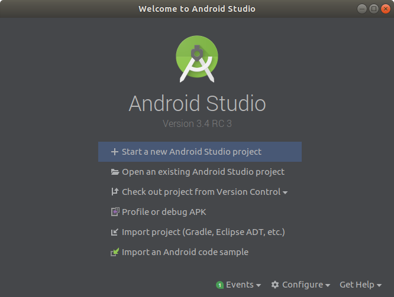
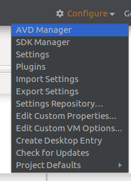
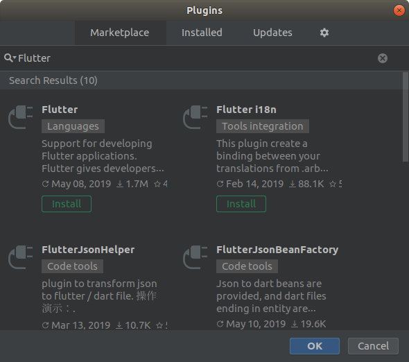
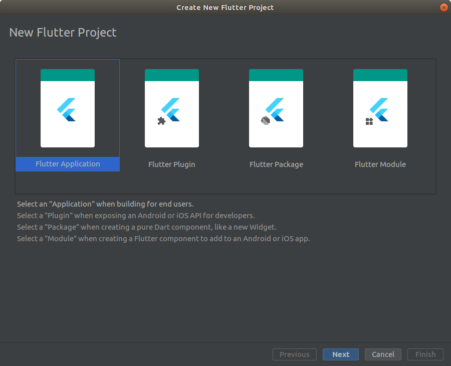
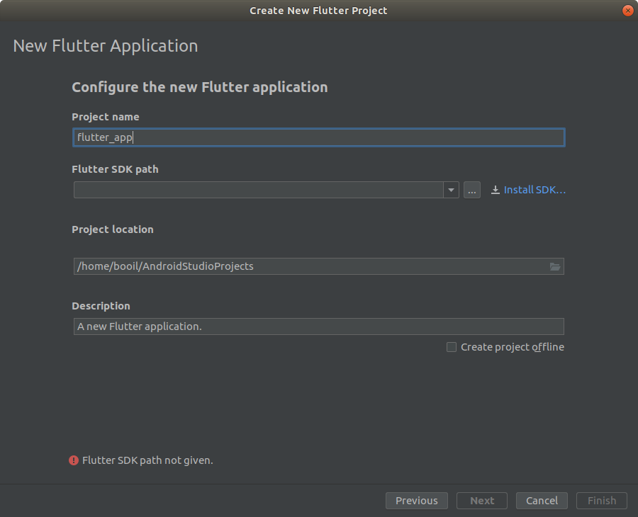
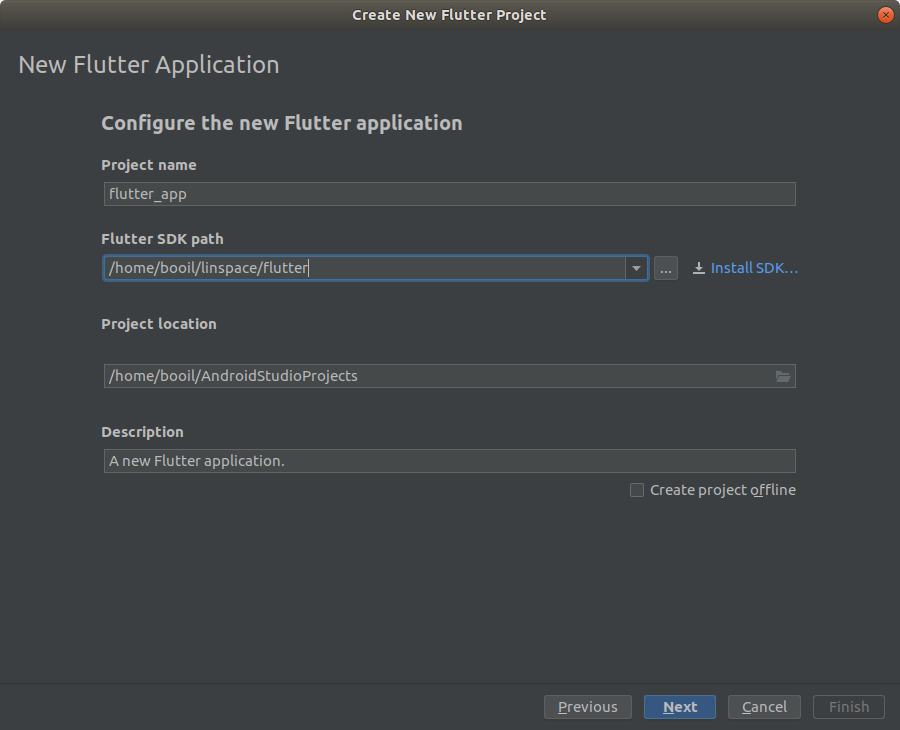
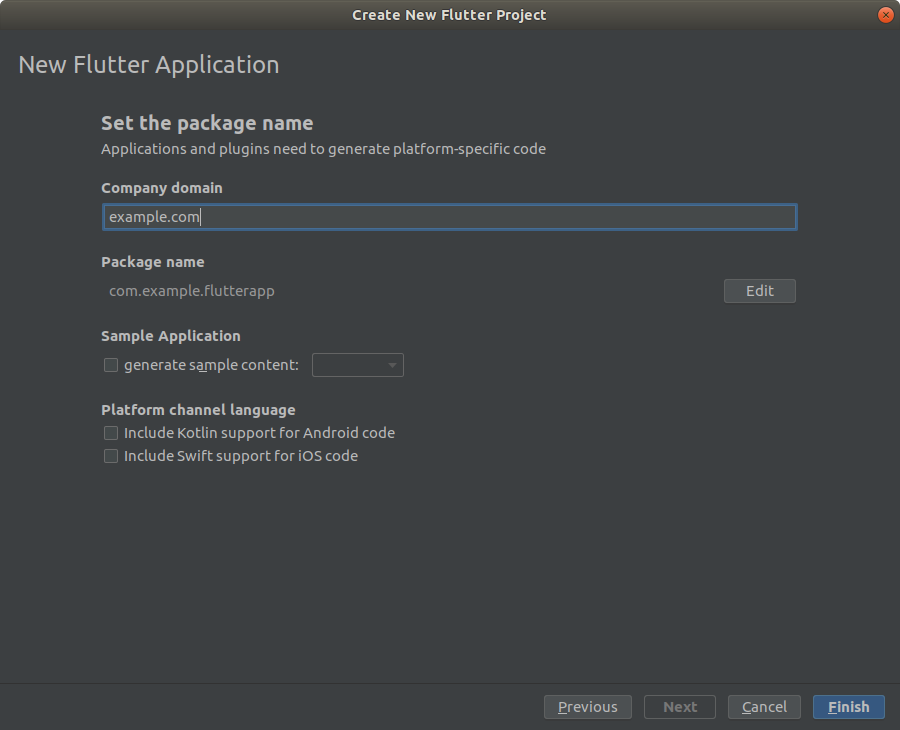
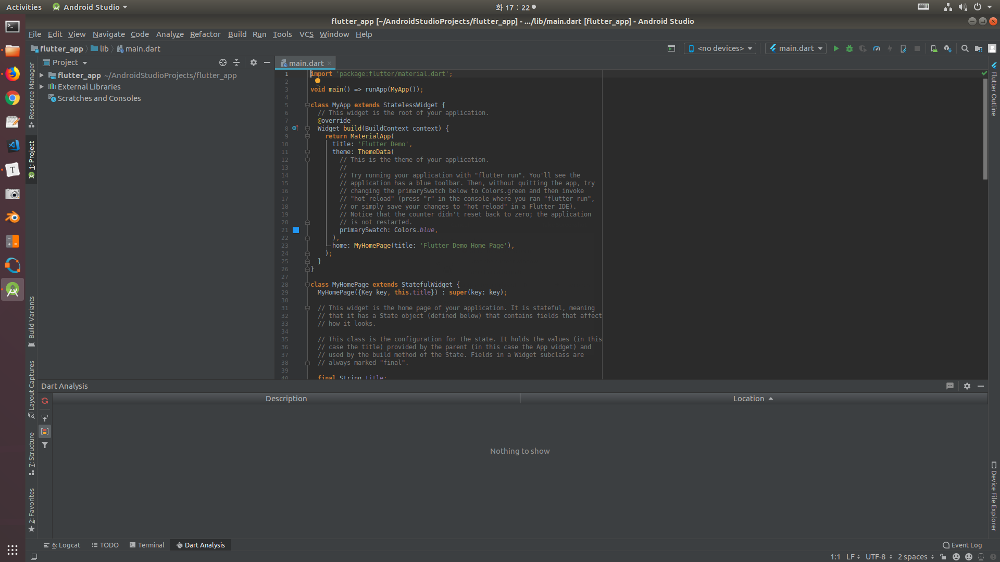

[Up](./index.md)

# Installation of Flutter on Ubuntu

2019년 5월 14일

Flutter 개발 환경을 구축하는 과정에서 참조한 안내서들에 오류가 있어 정리하였습니다.

## 안드로이드 스튜디오에서 설치

대부분의 안내서들이 Flutter SDK를 설치하기를 안내합니다. 이를 다시 정리합니다.

##### 안드로이드 스튜디오 설치

먼저 이 [안내서](../android/installation_of_android_studio_on_ubuntu.md)에 따라 안드로이드 스튜디오를 설치합니다.

##### Flutter Plugin 설치

안드로이드가 설치되면 'Welcome to Android Studio' 창이 표시됩니다.

 이 창의 아래를 보면 'Configure' 드롭다운 버튼이 있습니다. 이 드롭다운 버튼을 눌러서 'Plugins' 항목을 선택합니다. 

Marketplace 탭에서 Flutter를 검색합니다.

Flutter 플러그인을 설치하면 의존하는 플러그인들도 함께 설치 됩니다. 플러그인이 설치되면 'Restart IDE' 버튼을 눌러서 IDE를 다시 시작 합니다.

이제 'Welcome to Android Studio'에 'Start a new Flutter project' 메뉴가 추가 됩니다. 아직 Flutter 개발 환경이 준비 되지 않았으니 계속 진행합니다.

새 Flutter 프로젝트를 시작해 봅니다.

'New Flutter Application'에서 새 프로젝트를 시작 할 수 있게 표시 됩니다.

두번째 항목 Flutter SDK path가 있습니다. Flutter SDK가 이미 설치되어 있다면 `...` 버튼을 눌러서 지정하거나 설치되지 않았다면 우측에 'Installation SDK...' 버튼을 눌러 경로를 지정하고 설치하면 됩니다.

계속하여 앱 설정 값을 지정합니다.

'Finish' 버튼을 누르면 새 프로젝트 편집 상태가 됩니다.

Flutter 개발 환경이 준비 되었습니다.

## VSCode에서 Flutter 개발 환경 구성

다음에 작성 예정입니다.

## 참조

- [Installation of Flutter on Linux](https://flutter.dev/docs/get-started/install/linux)

