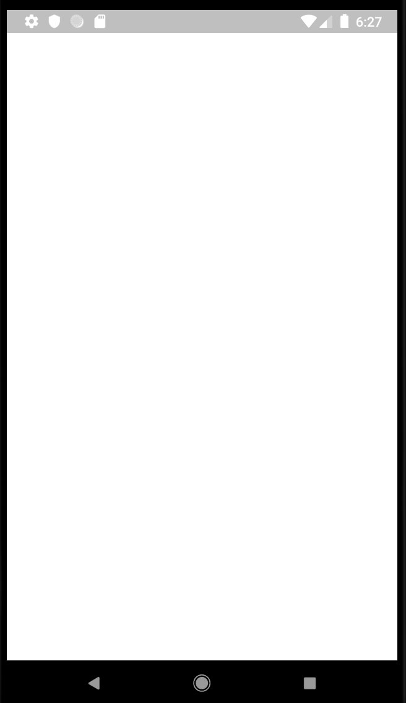

# Flutter Unit Test

[Flutter 공식문서는 3가지 테스트를 소개](https://flutter.dev/docs/testing) 합니다.

1. `pub run`을 사용한 Dart 유닛 테스트.
2. `flutter run`을 사용한 Flutter Widget 유닛 테스트.
3. `flutter drive`를 사용한 Flutter Driver 통합 테스트.

## Dart 유닛 테스트

Dart 유닛 테스트는 [이 문서](https://flutter.dev/docs/cookbook/testing/unit/introduction)에서 참조 할 수 있습니다. 자세한 내용은 문서에 나와 있습니다.

`pubspec.yaml`를 편집하여

```yaml
    dev_dependencies:
        test: any
```

패키지를 추가하고 `test/` 폴더에 

```dart
import 'package:test/test.dart';

void main() {
 	test('Test', () {
   		expect(actural_value, expected_value);
 	});
}
```

테스트 코드를 작성하고, 터미널에서

```
$ pub run test
```

를 하면 전체 유닛 테스트가 테스트되고

```
$ pub run test/특정파일.dart
```

를 하면 지정한 특정 파일만 테스트 됩니다.

각 유닛 테스트는 

```dart
 	test('설명', () {
        // 이 안에 위치
 	});
```

`test()`에 유닛 테스트 함수를 전달하여 진행합니다.

## Flutter Widget Unit Test

Flutter Widget 유닛테스트는 [이 문서](https://flutter.dev/docs/cookbook/testing/widget/introduction)에서 참조 할 수 있습니다.

`pubspec.yaml`를 편집하여

```yaml
    dev_dependencies:
        flutter_test: any
        test: any
```

패키지를 추가하고 `test/` 폴더에 

```dart
import 'package:flutter_test/flutter_test.dart';

void main() {
 	testWidgets('MyWidget test', (WidgetTester tester) async {
		// 위젯을 생성하고
		await tester.pumpWidget(MyWidget(title: 'T', message: 'M'))
          
		final titleFinder = find.text('T');
		final messageFinder = find.text('M'); 
		expect(titleFinder, findsOneWidget);
		expect(messageFinder, findsOneWidget)        
  	});
}
```

테스트 코드를 작성하고, 터미널에서

```
$ flutter run test/특정파일.dart
```

를 하면 지정한 특정 파일이 테스트 되는데, Dart 유니 테스트처럼

```
$ flutter run test
```

를 하면 `test가 없다`는 오류를 표시하면서 테스트가 되지 않습니다. 

전체 테스트를 하려고,

```
$ flutter run test/*
```

를 하면 되지 않습니다.

각 Flutter 위젯 유닛 테스트는 

```dart
 	testWidgets('설명', (WidgetTester tester) async {
        // 이 안에 위치
 	});
```

`testWidgets()`에 유닛 테스트 함수를 전달하여 진행합니다.

## Flutter 통합 테스트

Flutter 통합 테스트는 [이 공식 문서]($ flutter run test/특정파일.dart)를 보시고, 제가 작성한 [Flutter 통합 테스트, 주의사항](integrated_test.md) 을 보시면 되겠습니다.

## Flutter 단위 테스트

이 내용은 이 글의 주제입니다. 통합 테스트에서처럼 문서화 되지 않은 내용을 전파하기 위해서 입니다. 별도의 경로에 있어서 제가 발견하지 못했을 수도 있는데, Flutter 공식 Test 문서에는 내용이 없습니다.

위에서 언급했다시피 공식 문서에는 

1. Dart 단위 테스트.
2. Flutter 위젯 테스트.
3. Flutter 통합 테스트.

이렇게 3가지 테스트가 있습니다. 빠진 내용이 하나 있습니다. 위젯이 아닌 Flutter 코드는 어떻게 테스트를 해야 할까요?

테스트 코드를 작성하고,

```
$ pub run test
```

를 하면 

```
The Flutter SDK is not available.
```

이라는 오류를 표시하고 진행이 되지 않습니다.

만일 위젯이 아닌 단말단에서 SQLite를 테스트 한다거나, 파일 I/O, 블루투스 등을 유닛 테스트로 해야 할 필요가 있습니다. 통합 테스트로도 가능하지만, 통합 테스트는 앱이 올라오는 시간도 길고, 핫 리로드도 되지 않습니다. 작성할 코드 내용도 많죠.

다른 앱들의 Flutter Unit 테스트 방법을 확인하기 위해, sqflite를 소스 코드를 살펴 봤습니다.

이 `sqflite`는 `flutter_test` 패키지를 사용하고 있었고, 테스트 코드도 

```dart
import 'package:test/test.dart';
import 'package:flutter_test/flutter_test.dart';

void main() {
 	test('Test', () {
   		expect(actural_value, expected_value);
 	});
}
```

로 dart 유닛 테스트와 동일 했습니다. 그런데 `pub run test`로는 Flutter SDK가 없다는 오류를 내며 진행되지 않습니다.

혹시 문서화가 되어 있지 않는게 아닐까 하여, 위젯이 아닌 `sqflite` 테스트 코드를 작성하고,

```
$ flutter run test
```

했더니,

```
Target file "test" not found.
```

를 표시하며 진행되지 않습니다. 그래서,

```
$ flutter run test/*
```

를 해보았습니다. 단말기에 빈 위젯이 올라오며,



테스트 파일이 하나일때만 테스트가 진행됩니다.

```
Using hardware rendering with device Android SDK built for x86. If you get graphics artifacts, consider enabling
software rendering with "--enable-software-rendering".
Launching test/유닛테스트파일.dart on Android SDK built for x86 in debug mode...
Initializing gradle...                                              4.6s
Resolving dependencies...                                           4.9s
Running Gradle task 'assembleDebug'...                                  
Running Gradle task 'assembleDebug'... Done                        14.2s
Built build/app/outputs/apk/debug/app-debug.apk.
Installing build/app/outputs/apk/app.apk...                         2.3s
D/EGL_emulation( 7549): eglMakeCurrent: 0xb28646a0: ver 2 0 (tinfo 0x9413c2f0)
I/flutter ( 7549): 00:00 +0: SQLite test, Create tables
I/flutter ( 7549): 00:00 +1: SQLite test, Drop tables
I/flutter ( 7549): inserting key1 into table documents                  
I/flutter ( 7549): 00:00 +2: All tests passed!                          
Syncing files to device Android SDK built for x86...                    
 2,161ms (!)                                       

🔥  To hot reload changes while running, press "r". To hot restart (and rebuild state), press "R".
An Observatory debugger and profiler on Android SDK built for x86 is available at: http://127.0.0.1:46347/z1INJK6FX_k=/
For a more detailed help message, press "h". To detach, press "d"; to quit, press "q".
```

핫 리로드가 지원되는 단위 테스트입니다. 통합 테스트의 불편함을 덜어 줄 수 있습니다. 단축키는 아래와 같습니다.

- `r`: 변경사항 리로드.
- `R`: 다시 시작.
- `h`: 도움말.
- `d`: 단말기에서 테스트 앱은 실행 상태로 유지하고, 데스크탑의 테스트 프로세스  종료.
- `q`: 단말기 테스트 앱과 데스크탑의 테스트 프로세스 둘 다 종료.

정리를 하자면

1. Dart `test`  와 동일하게 위젯외에 Flutter SDK를 사용하는 테스트 코드를 작성 할 수 있다.
2. `flutter run test/*` 또는 `flutter run test/특정파일.dart`로 테스트 할 수 있다.
3. Flutter Widget 테스트와 마찬가지로 핫 리로드를 사용할 수 있다.

도움이 되셨기를 바랍니다.

## 참조

- [Testing Flutter apps](https://flutter.dev/docs/testing)

