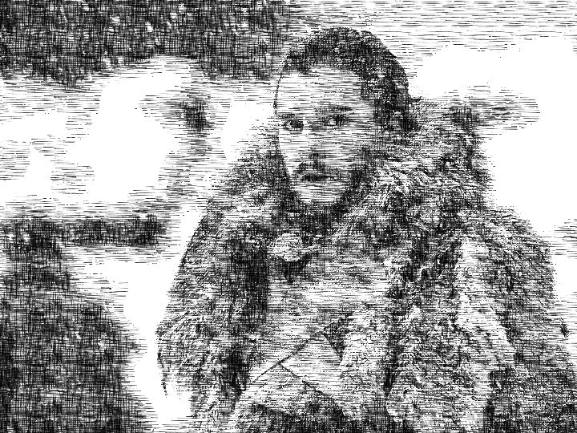

# Convert Photos to Sketches

토이 프로젝트입니다. 게임 카메라 셰이더에 사용되는 기법을 C++, OpenCV로 구현해 보았습니다. OpenCV에서 지원하는 함수가 없어서 오랫만에 C++로 코딩했습니다.

##### 1차 작업

OpenCV로 이미지를 읽어서, 그레이 스케일로 변환하고, 명도에 따라 텍스쳐를 가져와서 대체하는 코드를 작성하였습니다.

원본 이미지는 [이곳]() 에서 가져왔습니다.

##### 2차 작업

외곽선 추출 및 변환.

##### 3차 작업

질감을 얻고 질감에 따른 텍스쳐 및 회전.

