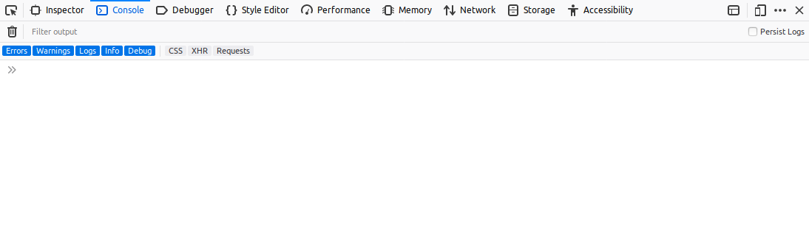

# JavaScript

### HTML 안에서의 Hello world

```html
<!DOCTYPE html>
<html>
    <head>
        <meta character="utf-8"/>
    </head>
    <body>
        <script type="text/javascript">
            alert('Hello world');
        </script>
    </body>
</html>
```

### 주석

주석의 내용은 인터프리터나 컴파일러가 무시합니다.

```javascript
// 한줄 주석
주석 아님 // 이곳은 주석
```

### 개발자 콘솔

웹브라우저들은 개발자를 위한 개발자 모드를 지원합니다.

Firefox는 `메뉴 / WebDeveloper / Web Console` 을 선택하면 부라우저 하단에 콘솔이 표시됩니다.



Chrome Browser는 `메뉴 /  More tools / Developer tools `을 선택하면 개발자 도구가 활성화 되고, Console 탭을 선택하면 콘솔창을 볼 수 있습니다.

### 데이터 타입

JavaScript 타입은 5가지가 있습니다.

- 숫자 (number)
- 문자열 (string)
- 부울 (boolean)
- 심볼 (symbol)
- undefined
- 객체 (object)

심볼 타입은 ECMASCript 6 부터 제공됩니다. 자세한 설명은 러닝 커브에 따라 설명합니다.

##### undefined

`undefined`는 타입이 정해지지 않은 것을 의미합니다.

### 리터럴

리터럴은 소스코드에서 고정된  값을 말합니다.

##### Number

자바스크립트는 수를 한가지만 지원합니다. IEEE 754 에서 정의한 64비트 부동소수점 하나만을 지원 합니다.

```javascript
1
-3
1.2
22.5
```

그래서 정수부는 15자리, 소수부는 17자리까지만 유효합니다.

16진수 리터럴를 표현하는 경우 앞에 `0x`를 붙입니다. 다음은 16진수 리터럴 입니다.

```
0x100 // 십진수 256
0xB // 십진수 11 
```

##### 문자열 리터럴

문자열 리터럴은 `'`나 `"`로 둘러 싸면 문자열 리털입니다.

```javascript
'Hello world'
"Hello world"
```

둘러싸는 문자는 동일해야 합니다. 다음은 문자열 리털이 아닙니다.

```javascript
"Hello world' // 오류
'Hello world" // 오류
```

문자열 리털럴 안의 작은 따옴표는 

```javascript
'He said \'Hello\''
```

또는 

```javascript
"He said 'Hello'"
```

로 할 수 있습니다.

문자열 리터럴 안의 큰 따옴표는

```javascript
"He said \"Hello\""
```

로 하거나

```javascript
'He said "Hello"'
```

로 할 수 있습니다.

줄바꿈 문자는 `\n`으로 나타냅니다.

```javascript
'First line\nSeocnd line\nThird line\n'
```

위 문자열 리터럴은

```
First line
Sencond line
Third line
```

과 같습니다.

탭문자는 `\t`로 나타냅니다.

```javascript
1st\t2nd\t3rd
```

위 문자열 리터럴은 

```
1st		2nd		3rd
```

와 같습니다. 여기서 터미널이나 콘솔의 tab 길이가 8이라고 가정하였습니다.

`console.log(인자)`는 지정한 인자를 개발자 도구를 통해 콘솔에 출력합니다.

다음 새 예제는 개발자 콘솔에 `Hello world`를 출력합니다.

```javascript
console.log('Hello world'); // Hello world
```

개발자 콘솔에 

```
Hello world
```

가 표시됩니다.

##### null

`null`은 값이 정해지지 않은 것을 의미합니다.

### 연산자

#### 가산

가산 연산자는 이항 연산자로 좌측과 우측의 수를 더 합니다.

```javascript
console.log(1 + 2); // 3
```

#### 문자열 연결

`+` 연산자의 양쪽 항이 문자열이면 두 문자열을 연결합니다.

다음 새 에제는 두개의 문자열을 `+`를 사용하여 연결하고:

```javascript
console.log('Hello' + ' world')
```

 개발자 콘솔에 출력합니다.

```
Hello world
```

### 변수

변수의 종류는 많습니다. `var`키워드를 사용하여 변수 식별자를 지정하고 값을 담을 수 있습니다.

#### 수 (Number)

```javascript
var a = 1;
```

a라는 식별자를 가진 변수에 1을 보관 하였습니다. `a`는 숫자형 변수 입니다. 계속하여

```javascript
console.log(a); // 1
```

하면 개발자 콘솔에 1이 표시 됩니다.

다음은

```javascript
var a = 1.0;
console.log(a + 2.0); // 3.0
```

개발자 콘솔에 3.0을 표시합니다.

#### 문자열

문자열은 `+` 연산자를 사용하여 연결 할 수 있습니다.

```javascript
var a = 'Hello';
console.log(a + ' world');
```

```javascript
var a = 'Hello', b = ' world';
console.log(a);
console.log(b);
console.log(a + b);
```

#### 배열

배열은 순차적으로 데이터를 저장하는 자료구조이며 리터럴은 `[]`로 둘러쌉니다. 다음 새 예제:

```javascript
var s = ['Alice', 'Bob']
```

에서 `s`는 `'Alice'`와 `'Bob'` 두개의 원소를 가지는 배열 입니다.

배열의 원소는 0번부터 시작하여 순차적으로 증가 합니다. `'Alice'`의 인덱스는 0이고, `'Bob'`의 인덱스는 1입니다.

인덱스를 지정하려면 `[]` 연산자를 사용하며 `배열명[]`으로 사용 합니다. 인덱스가 0인 `'Alice'`는 `'s[0]'`으로 액세스 할 수 있고, 인덱스가 1인 `'Bob'`은 `s[1]`으로 액세스 할 수 있습니다.

계속하여 다음은 인덱스를 지정하여 개발자 콘솔에 표시합니다.

```javascript
console.log(s[0]); // Alice
console.log(s[1]); // Bob
```


```javascript
s[0] = 'Charlie';
console.log(s[0]); // Charlie
console.log(s[1]); // Bob
```

##### null

변수의 값이 `null`이면  값이 정해지지 않은 것을 의미 합니다.

```javascript
var s = null;
```

#### 객체

기본적으로 객체는 key-value pair 사전입니다. 아래 개체 `o`를 선언했습니다.

```javascript
var o = {
	name: 'Alice';
    id: 12345;
};
```

`o`는 2개의 key와 2개의 값을 가지고 있습니다.

`name`의 값은 `'Alice'`이고, `id`의 값는 `12345` 입니다. 

개체의 key는 프로퍼티라고도 부르며 아래처럼 액세스 할 수 있습니다. 계속합니다.

```javascript
console.log(o.name); // Alice
console.log(o.id); // 12345
```

### 함수

`f`라는 이름을 가진 함수를 선언합니다. 함수란 실행하는 문의 집합의 한 단위입니다.

```javascript
function f() {
}
```

계속하여 위에서 선언된 함수 `f()`를 호출 합니다.

```javascript
f();
```

호출된 함수는 그것을 실행 합니다.

아래 함수 `f()`는 `'Hello world'`를 개발자 콘솔에 실행하는 함수입니다.

```javascript
function f() {
	console.log('Hello world');
}
f(); // Hello world
f(); // Hello world
```

위 코드에서 함수 `f()`는 매개변수가 없습니다.

#### 매개변수

함수는 매개변수를 통해 인자를 전달 받을 수 있습니다.

```javascript
function f(a) {
	console.log('Hello ' + a); // 인자를 전달 받아 'Hello '와 연결 합니다.
}
```

함수 `f()`는 하나의 매개변수 `a`를 받습니다. 계속하여

```javascript
f('world'); // Hello world
```

함수 `f()`의 매개변수 `a`에 대한 인자로 `'world'`를 전달하였습니다.

함수 `f()`내부에는 문자열 리터럴 `'Hello '`와 매개변수 `a`를 `+`로 연결하여 `console.log()`로 출력합니다.

```javascript
	console.log('Hello ' + a);
```

그래서 

```javascript
f('world');
```

는  개발자 콘솔에

```
Hello world
```

를 출력하게 됩니다. 계속하여

```javascript
f('Alice'); // Hello Alice
f('Bob'); // Hello Bob
```

전달하는 인자를 바꾸면 바뀐 문자열을 출력합니다. 계속하여

```javascript
f(); // 오류. 반드시 인자를 전달해야 합니다.
```

인자를 지정하지 않고 호출하면 오류가 발생합니다.

함수의 매개변수는 `,`로 구분하여 여러개의 매개변수를 전달 할 수 있습니다.

```javascript
function f(a, b) {
	return a * b;
}
console.log(1, 2); // 2
console.log(3, 4); // 12
console.log(5, 6); // 30
console.log(7); // 오류. 반드시 2개의 인자를 전달해야 합니다.
console.log(); // 오류. 반드시 2개의 인자를 전달해야 합니다.
```

### 연산자

#### 감산

```javascript
a = 1;
b = 2;
console.log(a - b); // -1
```

#### 승산

```javascript
a = 2;
b = 3;
console.log(a * b); // 6
```

#### 제산

```javascript
a = 6;
b = 3;
console.log(a / b); // 2 
```

### 변수

`var`, `let`, `const`

|         | 스코프 | 재할당 (Reassignable) | Mutable | Temporal Dead Zone |
| ------- | ------ | --------------------- | ------- | ------------------ |
| `const` | 블록   | 불가능                | 가능    | 있음               |
| `let`   | 블록   | 가능                  | 가능    | 있음               |
| `var`   | 함수   | 가능                  | 가능    | 없음               |

#### 재할당 예제

```javascript
const a = 'Alice';
a = 'Bob'; // Error
```

```javascript
let a = 'Alice';
a = 'Bob'; // Ok
```

#### var

`var`는 함수 스코프를 가진다. 함수 내부 어느 블록에 위치하더라도 함수 어느 블록에서라도 액세스 할 수 있다. 함수 안의 `var` 변수는 함수 밖에서 액세스 할 수 없다.

```javascript
function f() {
    var a = 'Alice';
    console.log(a); // Ok
};
f();
console.log(a); // undefined (not error)
```

다음 두번째 `a`는 첫번째 `a`입니다. 블록 안에서 두번째 `a`를 변경하면  첫번째 `a`가 변경됩니다.

```javascript
function f() {
    var a = 'Alice';
    if (true) {
    	var a = 'Bob'; // 2번째 라인의 a는 삭제되었고 7번쨰 라인을 보면 계속 유지됩니다.
        console.log(a); // Bob
    }
    console.log(a); // Bob
}
f();
```

다음 예제에서 변수가 선언되기 전에 사용하면 `undefined`가 됩니다.

```javascript
console.log(a); // undefined (not error)
var a = 'Alice';
```

다음 예제에서 변수가 선언되고 초기화 되지 않으면 `undefined`가 됩니다.

```javascript
var a;
console.log(a); // undefined (not error)
a = 2;
```

#### let

`let`은 변수를 선언 합니다.

- 블록 스코프를 가집니다.
- 할당하기 전에 액세스 할 수 없슴니다.
- 동일 스코프에서 재선언을 할 수 없습니다.


```javascript
function f() {
    let a = 'Alice';
    if (true) {
        let a = 'Bob';
        console.log(a); // Bob
    }
    console.log(a); // 'Alice';
}
f();
console.log(a); // undefined (not error)
```

```javascript
console.log(a); // ReferenceError
let a = 2;
```

```javascript
let a = 'Alice';
let a = 'Bob'; // SyntaxError
```

#### const

`let`와 거의 비슷한데 재할당을 할 수 없습니다.

- 블록 스코프를 가집니다.
- 할당하기 전에 액세스 할 수 없습니다.
- 동일 스코프에서 재선언을 할 수 없습니다.
- 재할당을 할 수 없습니다.

```javascript
const a = 'Alice';
a = 'Bob'; // 에러. 재할당을 할 수 없습니다.
```

```javascript
const a = 'Alice';
const a = 'Bob'; // 에러. 재선언을 할 수 없습니다.
```

`const`는 불변성(imumtable)이 아니라는 점에 주의해야 합니다. `const object`나 `const array`등의 멤버는 가변성(mutable)입니다.

`object` 예제

```javascript
const o = {
    name: 'Alice';
};
console.log(o.name); // Alice
o.name = 'Bob';
console.log(o.name); // Bob
o = 'Charlie'; // 에러가 발생합니다. 재할당을 할 수 없습니다.
```

`array` 예제

```javascript
const r = [];
r.push('Alice'); // 동작합니다.
console.log(r[0]); // Alice
r = ['Bob']; // 에러가 발생합니다. 재할당을 할 수 없습니다.
```

### 함수

#### 매개변수 기본값

매개변수는 기본값을 지정하여 호출시 기본값을 인수로 전달 할 수 있습니다.

```javascript
function f(p = 5) {
	return 5 * p;
}
console.log(f(1)) // 5
console.log(f(2)) // 10
console.log(f()) // 25
```

```javascript
function f(p, q = 5) {
	return p * q;
}
console.log(f(1, 3)); // 3
console.log(f(2, 10)); // 20
console.log(f(3)); // q = 5 이므로 15를 반환합니다.
console.log(f()); // rest 매개변수에서 설명합니다.
```

매개변수 기본값은 뒤에서 부터 지정할 수 있습니다.

```javascript
function f(p = 5, q) { // 오류
	return p * q;
}
```

두개 이상의 매개변수 기본값을 지정할 수 있습니다.

```javascript
function f(p = 5, q = 6) {
	return p * q;
}
console.log(f(1, 2)); // 2
console.log(f(1)); // q = 6이므로 1 * 6으로 6을 반환 합니다.
console.log(f()); // p = 5, q = 6이므로 30을 반환 합니다.
```

#### 반환값

함수는 매개변수를 받아서 처리하고 결과를 명시적으로  `return` 문을 통해 반환 할 수 있습니다.

```javascript
function f(p) {
    return p * 2; // return 문으로 명식적으로 반환합니다.
}
console.log(f(2)) // 4
```

##### 화살표 함수

화살표 함수는 화살표 `=>`로 표기하는 함수입니다. 이 함수는

- 간단 합니다.
- 암시적으로 결과를 리턴합니다.

입니다. 아래에 파라미터에 2를 곱하여 반환하는 함수입니다. 명시적으로 `return`문이 없으며 마지막 문인 `p*2`의 결과를 묵시적으로 반환합니다.

```javascript
const f = (p) => p * 2;
console.log(f(2)) // 4
```

화살표 함수에서도 `return`문을 사용하여 명시적으로 반환 할 수 있습니다. 블록으로 둘러싸고 명시적으로 반환 합니다.

```javascript
const f = (p) => {
	return p * 2;
}
console.log(f(2)) // 4
```

매개변수가 없으면 빈 괄호를 지정 해야 합니다.

```javascript
f = () => 8;
console.log(f()); // 8
```

다음은 매개변수가 없어서 빈괄호를 생략 했으므로 오류가 발생합니다.

```javascript
f = => 8; // 오류
console.log(f());
```

매개변수가 하나이면 괄호를 생략할 수 있습니다.

```javascript
const f = p => p * 2; // 괄호를 생략할 수 있습니다.
console.log(f(2)) // 4
```

매개변수가 여러개이면 괄호 안에 `,`로 구분합니다.

```javascript
const f = (p, q) => p * q;
console.log(f(1, 2)); // 2
console.log(f(3, 4)); // 12
console.log(f(5, 6)); // 30
```

### 연산자

#### == ===

`==` 연산자는 이항 연산자로 양항의 값이 같으면 참이고, 다르면 거짓입니다

`===`

다른 언어처럼 대부분 그렇습니다. 하지만 JavaScript는 다른 언어와 달리 함정이 있습니다. 자세한 내용은 러인 커브에 따라 제시합니다.

#### ||

좌측 값이 참이면 좌측값을 얻고, 아니면 우측 값을 얻습니다.

```javascript
var a = 1;
b = a || 2;
console.log(b); // 1
```

```javascript
var a;
b = a || 2;
console.log(b); // 2
```

### 함수

함수는 함수를 매개변수로 전달 할 수 있습니다.

```javascript
function f() {
	console.log('f called');
}

function g(p) {
	console.log('g called');
    p(); // 전달받은 p를 호출합니다.
}

g(f); // 함수 f를 함수 g에 전달합니다.
```

결과는

```javascript
g called
f called
```

입니다. 여기서 `g`를 콜백 함수라고 하며 JavaScript에서 함수형 프로그래밍의 구현이 됩니다.

호출시 아래와는 다릅니다.

```javascript
g(f());
```

이렇게 호출하면 `g()`의 결과가 `f()`에 전달되고, 이 값을 7번째 라인 `p()`에서 호출하여 오류가 발생합니다.

---

## 참조

- [Modern JavaScript Cheatsheet](https://github.com/mbeaudru/modern-js-cheatsheet)

- [Make your JavaScript code shide knockout old es5 hack](https://rainsoft.io/make-your-javascript-code-shide-knockout-old-es5-hack/)

- [Mozilla JavaScript](https://developer.mozilla.org/ko/docs/Web/JavaScript)