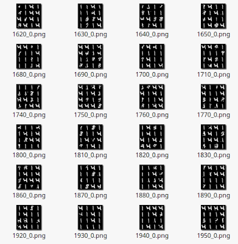
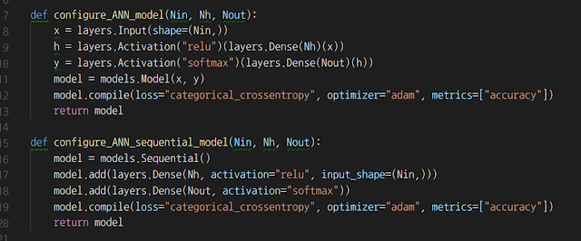
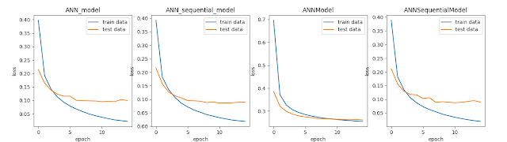
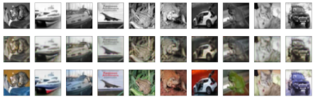

[Up](index.md)

# 케라스 맛보기

머신러닝 야학을 시작한지 5년, 딥러닝 야학을 시작한지 1년이 지났습니다. 그동안 4권의 머신러닝, 6권의 딥러닝 서적을 통해 경험을 했는데 2017년 1년에 걸쳐 NN, DNN, RNN, GAN, DQN,이라는 깔딱 고개를 넘었습니다. 깔딱 고개를 넘으니 다른 딥러닝 모델(AE, W2V, CNN 등) 들의 배움에 가속이 붙는것을 느낍니다. 머신러닝과 컴퓨터 비전이 본업이 아니다보니 망각으로 뒷걸음 쳐지기도 합니다. 망각하지 않고 배우는 과정을 정리하기 위해 인공지능에 기록을하려고 합니다. 

첫 글은 케라스 경험담 입니다.

작년말에 하버드대에서 연구에 몸담고 계시는 김성진(James Kim)님께서 저술중인 책을 소개 하셨고, 리뷰할 수 있는 기회를 주쎴고, 이번 주말에 UNET까지 모두 리뷰 하였습니다.

한국에서 머신러닝을 학습하기 위한 언어로 파이썬이 주로 활용 됩니다. numpy, scipy를 통해 직접 구현하거나 구글이 제공하는 Tensorflow를 활용 합니다.

opencv, menpo, numpy, scipy, tensorflow에 이어 김성진님의 소개로 처음으로 케라스를 경험하였습니다.

케라스는 텐서플로우 같은 머신러닝 백엔드 플랫폼 위에서 구동 됩니다. 왜 다른 백엔드 위에서 구동 되도록 만들었을까 궁금했었는데 그럴만한 가치가 있다는 것을 배웠습니다.

케라스를 경험해본 결과 장점은 이렇습니다.

**문서 같은 코드:**

텐서플로우는 텐서라는 노드들을 엣지라는 연산자로 연결하여 모델을 구성합니다. 케라스는 레이어별로 구성하는 방식을 제공합니다. 케라스는 흐름에 따라 자연스럽게 코드를 기술 할 수 있습니다. 마치 코드가 문서 같이 간결하여 작성과 읽기가 쉽습니다. (최근 텐서플로우도 레이어를 제공합니다.)

**데이터셋:**

케라스는 데이터셋 로더를 지원합니다. 별도의 다운로드 코드를 작성하거나 패키지를 추가하지 않고 제공하는 데이터셋으로 트레이닝과 테스트를 할 수 있습니다. 케라스가 제공하는 데이터셋은 아래와 같습니다.

- CIFAR10: 10카테고리 32x32 이미지.
- CIFAR100: 100카테고리 32x32 이미지.
- IMDB:&nbsp; 25,000 영화 리뷰
- MNIST: 28x28 손글씨.
- Fashion-MNIST: 10카테고리 28x28 패션 이미지.
- BOSTON HOUSING: 보스턴의 집 가격 추이.

케라스 데이터셋 레퍼런스 문서 링크: [https://keras.io/datasets](https://keras.io/datasets)

**시각화:**

컴퓨터 비전, 머신러닝에서와 같이 트레이닝이나 테스트 과정의 추이를 추적하기 위해 matplotlib를 사용합니다. 일반적으로 이 과정들을 그래프로 시각화 표시하기 위해서는 별도의 코드들을 작성해야 합니다. 케라스는 트레이닝이나 테스트시 히스토리를 반환하고 간단한 방법으로&nbsp; matplotlib에 표현할 수 있습니다.

아래 그림은 첫번째 예제 시각화를 제가 한꺼번에 돌려서 비교할 수 있도록 변경한 것입니다.

트레이닝 과정도 시각화를 통해 표시해 주므로, 따로 작성할 필요 없어 시간을 절약 할 수 있습니다.

백엔드로 텐서플로우를 사용하면 텐서보드를 통해 시각화를 함께 할 수 있습니다.
물론, 케라스도 단점이 없지는 않습니다만 저의 케라스 경험을 짧으니 김태영님의 [포스트](https://tykimos.github.io/2017/12/20/Keras_Drawback/)를 연결합니다.

1개월간의 경험을 종합한 결과 케라스는 입문이나 서비스나 제품 개발에 적합한 플랫폼이라는 결론을 얻었습니다. 빠르게 반복적으로 프로토타입을 만들오 실험하고 모델이 결정되면 벡엔드라면 케라스로 서비스를 하거나 프러덕트라면 C나 C++로 포팅할 수 있습니다. 

김성진님의 저서에는  원리를 표현한 그림과 실행해 볼 수 있는 예제로 케라스를 소개합니다. 모델은 ANN, 회귀, DNN, CNN, RNN(LSTM), AE, GAN, UNET, 응용편을 다룹니다. 리눅스, 맥, 윈도우에서 케라스를 설치하는 과정과 matplotlib를 통한 시각화도 다룹니다.

아래는 이 책에서 소개하는 흑백 이미지를 컬러로 바꾸는 UNET 예제입니다.

리뷰한 코드는 [이곳](https://github.com/booiljung/kerasbook) 깃헙에 올려 두었습니다. 시각화에서 몇가지 변경 사항이 있습니다.

이 책은 400페이지 이하로 입문자가 가볍게 경험해 볼 수 있도록 쉽게 작성 되어 있습니다. 케라스의 특징으로 어려운 수식이나 파이썬 코드를 작성하지 않고도 문서 같은 코드로 머신러닝의 과정을 경험 해 볼 수 있습니다. 책은 입문과 활용에 맞춰져 있으며, 딥러닝 플랫폼 엔진이 구현 수준까지는 담고 있지 않습니다. 플랫폼 구현 수준까지 파악하려면 탄탄한 수학을 배경에 깔고 깊이 파고드는 서적이나 논문을 보면 됩니다. 저의 경우 원리를 알아야 진실이라 받아들이는 성격이라 딥러닝을 깊이 파고 들었고 당시에 이런 안내서도 있지 않아 1년이 걸린것 같습니다.

끝으로 훌륭한 저서를 리뷰 할 기회를 주신 김성진님께 감사드립니다.

당분간 그동안 보았던 머신러닝, 컴퓨터 비전, 딥러닝, 수학 서적들에 대한 평을 정리해볼 계획입니다.