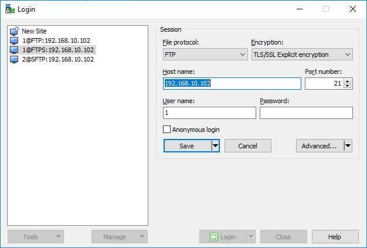

# Ubuntu 16.04 에 파일 서버 설치

2018년 10월 6일

먼저 설치하기 전에 설치하고자 하는 컴퓨터에 고정 IP 주서를 부여 해야 합니다.

## 1. vsftpd 패키지 설치

1.1. `vsftpd`를 설치합니다.

```sh
sudo apt update
sudo apt install vsftpd
```

1.2. `/etc/vsftpd.conf` 파일을 백업합니다.

```sh
sudo cp /etc/vsftpd.conf /etc/vsftpd.conf.bk
```

## 2. FTP 구성하기.

2.1. `/etc/vsftpd.conf` 파일을 수퍼유저 권한으로 편집하여 다음 라인들을 주석에서 해제합니다.

```
write_enable=YES
local_umask=022
chroot_local_user=YES
```

2.2. 다음을 가장 아래에 추가 합니다.

```
# to keep all non-chroot users jailed
allow_writeable_chroot=YES
# for the passive port range
pasv_min_port=40000
pasv_max_port=40100
```

2.3. `vsftpd` 서비스를 재시작 합니다.

```sh
sudo systemctl restart vsftpd
```

2.4. `vsftpd` 상태를 확인합니다.

```sh
sudo systemctl status vsftpd
```

```
vsftpd.service - vsftpd FTP server
   Loaded: loaded (/lib/systemd/system/vsftpd.service; enabled; vendor preset: e
   Active: active (running) since 월 2018-11-19 13:57:34 KST; 16min ago
 Main PID: 789 (vsftpd)
   CGroup: /system.slice/vsftpd.service
           └─789 /usr/sbin/vsftpd /etc/vsftpd.conf

11월 19 13:57:34 [컴퓨터이름] systemd[1]: Starting vsftpd FTP server...
11월 19 13:57:34 [컴퓨터이름] systemd[1]: Started vsftpd FTP server.
lines 1-9/9 (END)
```

액티브되고 돌고 있으면 상태가 표시됩니다. 서비스 시작에 실패하였으면 다시 `/etc/vsftpd.conf` 를 정확히 편집하여 저장하고, 서비스를 다시 시작해 보시기 바랍니다.

2.5. FTP 서버에 테스트 사용자를 추가해 보겠습니다. `/usr/sbin/nologin` 를 접근 제한용도으로 사용하겠습니다.

```sh
sudo useradd -m <username> -s /usr/sbin/nologin
sudo passwd <username>
```

비밀번호를 2회 입력하면 비밀번호가 설정됩니다.

2.6. `/ett/shells` 파일에 `/usr/sbin/nologin`을 추가하여 `nologin shell`을 사용하는 사용자에 대한 로그인 액세스를 활성화합니다.

```sh
echo "/usr/sbin/nologin" | sudo tee -a /etc/shells
```

FTP 클라이언트를 사용하여 테스트 합니다.

```sh
ftp 192.168.22.16
```

## 3. Secure FTP ( FTPS ) 구성하기

SSL 인증서를 사용하여 FTP 연결을 보호 할 수 있습니다. openssl 명령을 사용하여 자체 서명 된 SSL 인증서를 만들 수 있습니다.

3.1. 아래 명령을 사용하여 새 SSL 인증서를 만듭니다. 여기에 우리는 유효 기간이 365 일인 2048 비트 RSA 인증서를 만들 예정입니다.

```sh
sudo openssl req -x509 -nodes -days 365 -newkey rsa:2048 -keyout /etc/ssl/private/ftps_vsftpd.pem -out /etc/ssl/private/ftps_vsftpd.pem
```

3.2. SSL을 활성화하고 구성하기 위해 `/etc/vsftpd.conf` 파일을 변경 합니다. 인증서 위치에 따라 아래 라인을 찾아 수정하고 SSL을 활성화 합니다.

```ssh
rsa_cert_file=/etc/ssl/private/ftps_vsftpd.pem
rsa_private_key_file=/etc/ssl/private/ftps_vsftpd.pem
ssl_enable=YES
```

3.3. `vsftpd` 서비스를 재시작 합니다.

```sh
sudo systemctl restart vsftpd
```

3.4. WinSCP를 사용하여 `TLS/SSL explict encryption` 옵션으로 FTP에 연결을 테스트 합니다.



접속하면 경고가 표시될 것입니다. 'Yes'를 선택하여 접속합니다. 이제 암호화하여 파일을 전송할 수 있습니다.

## 4. SFTP 구성하기

SFTP는 다른 프로토콜을 사용합니다. 데이터 전송에 있어 ssh 포트를 사용한 FTP보다 보안에 강합니다.

4.1. OpenSSH 패키지를 설치합니다.

```sh
sudo apt install openssh-server
```

4.2. SFTP 유저 그룹을 생성합니다.

```sh
sudo addgroup ftpaccess
```

4.3. 수퍼유저 권한으로 `/etc/ssh/sshd_config` 파일을 편집하여 다음 라인을 주석으로 막습니다.

```
#Subsystem sftp /usr/lib/openssh/sftp-server
```

4.4. 다음 라인을 마지막에 추가합니다.

```sh
Subsystem sftp internal-sftp
Match group ftpaccess
ChrootDirectory %h
X11Forwarding no
AllowTcpForwarding no
ForceCommand internal-sftp
```

4.5. ssh 서비스를 다시 시작합니다. 서비스를 다시 시작하는 동안 SSH 연결을 느슨하게 할 수 있으므로 콘솔에서이 단계를 수행합니다.

```ssh
sudo systemctl restart ssh
```

4.6. `ftpaccess` 그룹에 새 사용자를 추가 합니다.

```sh
sudo useradd -m <username> -s /usr/sbin/nologin -G ftpaccess
sudo passwd <username>
```

4.7. 사용자를 홈 디렉토리로 chroot 합니다. 홈디렉토리 권한을 변경합니다.

```sh
sudo chown root:root /home/<username>
```

4.8. 홈 디렉토리에 `upload`디렉토리를 만들고 소유권을 수정합니다. 이 디렉토리는 파일을 서버에 업로드하는 데 사용할 수 있습니다.

```sh
sudo mkdir /home/<username>/<diectoryname>
sudo chown <username>:ftpaccess /home/<username>/<diectoryname>
```

4.9. SFTP 클라이언트에서 접속이 되는지 확인 합니다.

```sh
sftp <username>@192.168.22.16
```

완료 되었습니다.

---

참조: [Setup FTP server on ubuntu 16.04](https://www.krizna.com/ubuntu/setup-ftp-server-ubuntu-16-04/)

