# Ubuntu 16.04 LTS에서 한국어 입력기를 fcitx로 변경

2018년 10월 6일

우분투를 설치할 때마다 정확히 동작하는 레퍼런스를 찾기 어려워서 정리 하였습니다. 우분투 관련 레퍼런스로 한국어 문서가 많지 않기 때문에, 저는 영어로 설치합니다. 그렇지만, 한국어를 입력해야 할 경우도 있기 때문에 한국어 입력기를 설치합니다.

우분투 16.04를 설치하면 iBus 한국어 입력기가 디폴트로 설치됩니다. iBus 한국어 입력기가 제대로 동작하지 않는 윈도우 프레임워크들이 있기때문에 fcitx로 변경 합니다.

먼저 fcitx를 설치합니다.

```sh
sudo apt update
sudo apt upgrade
sudo apt install fcitx-hangul
```

'시스템 설정'을 실행하면 아래와 같습니다.

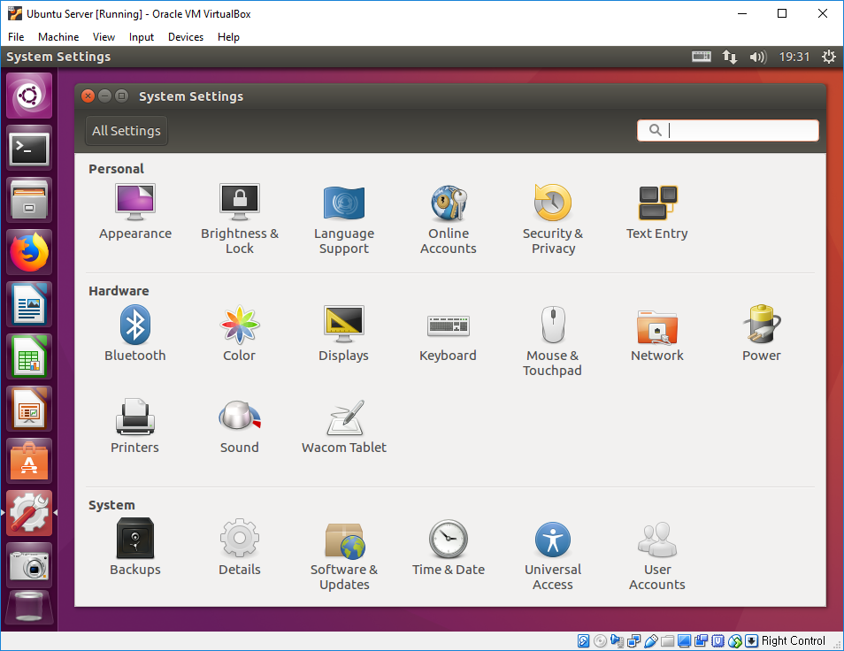

'시스템 설정'에서 '언어 지원'을 실행하면 '언어 지원'을 설치할 것인지 묻습니다. 설치하겠다고 선택합니다.

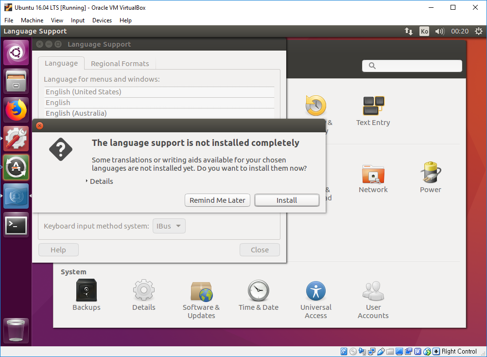

실치하겠다고 하면 수퍼유저 권한 비밀번호를 묻습니다.

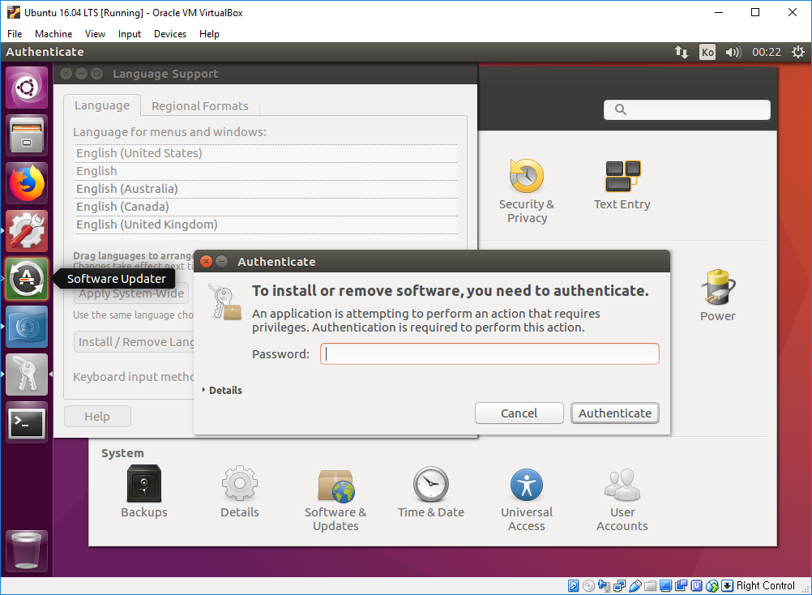

수퍼유저 권한을 부여하면 '언어 지원'이 설치됩니다. 설치 완료까지 기다립니다.


'Keyboard Input method system'이 iBus로 선택되어 있습니다.

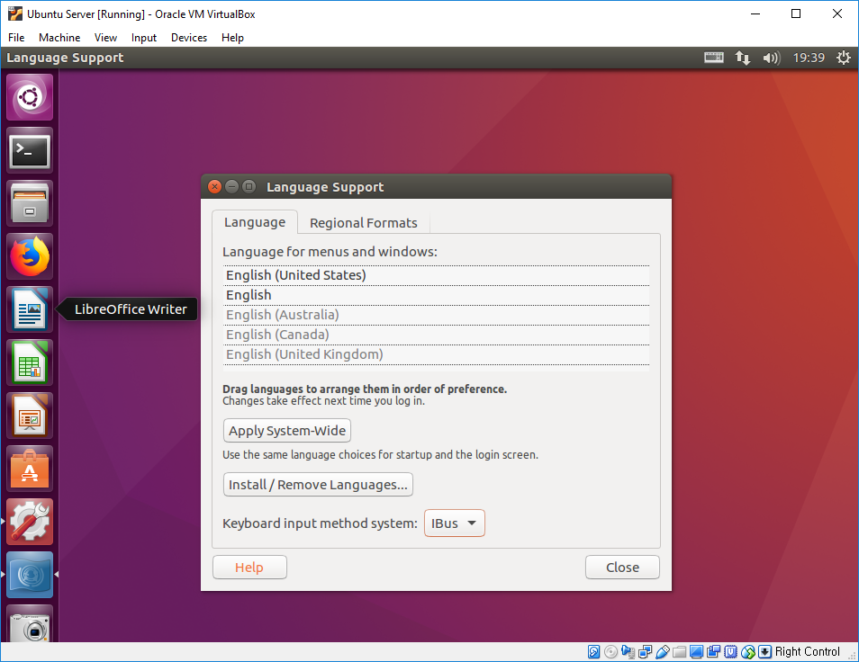

'Keyboard Input method system'을 fcitx으로 변경 합니다.

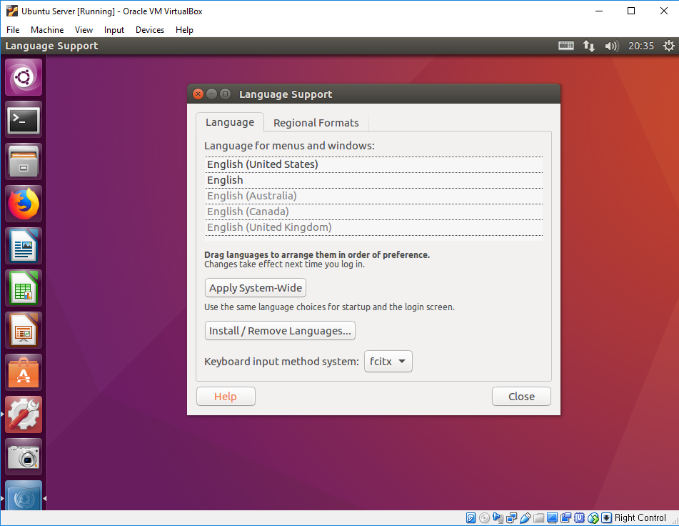

그리고 재부팅을 합니다.

재부팅이 완료되면 우측 상단의 키보드 모양의 아이콘에서 'Configure'를 실행 합니다.

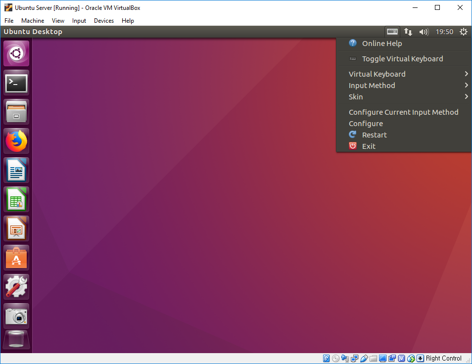

'Input Method Configuration'이 창이 표시되면

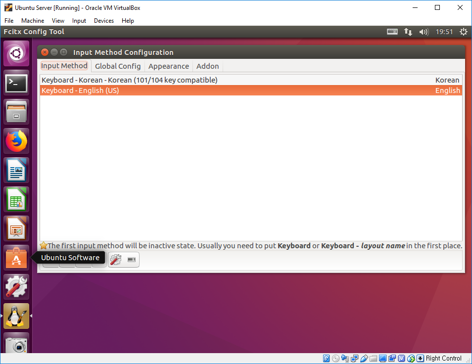

아래 + 버튼을 클릭하여, 

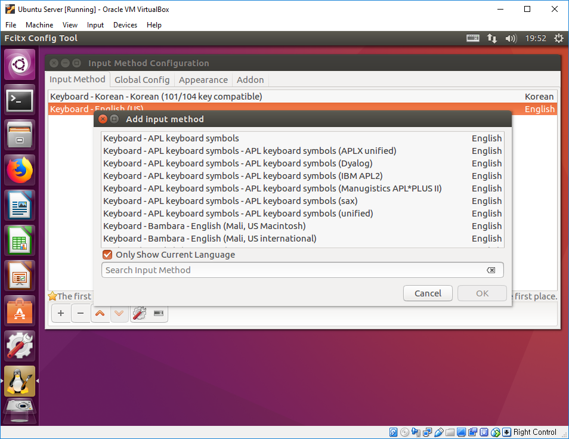

'Hangul'을 선택하여 추가합니다.

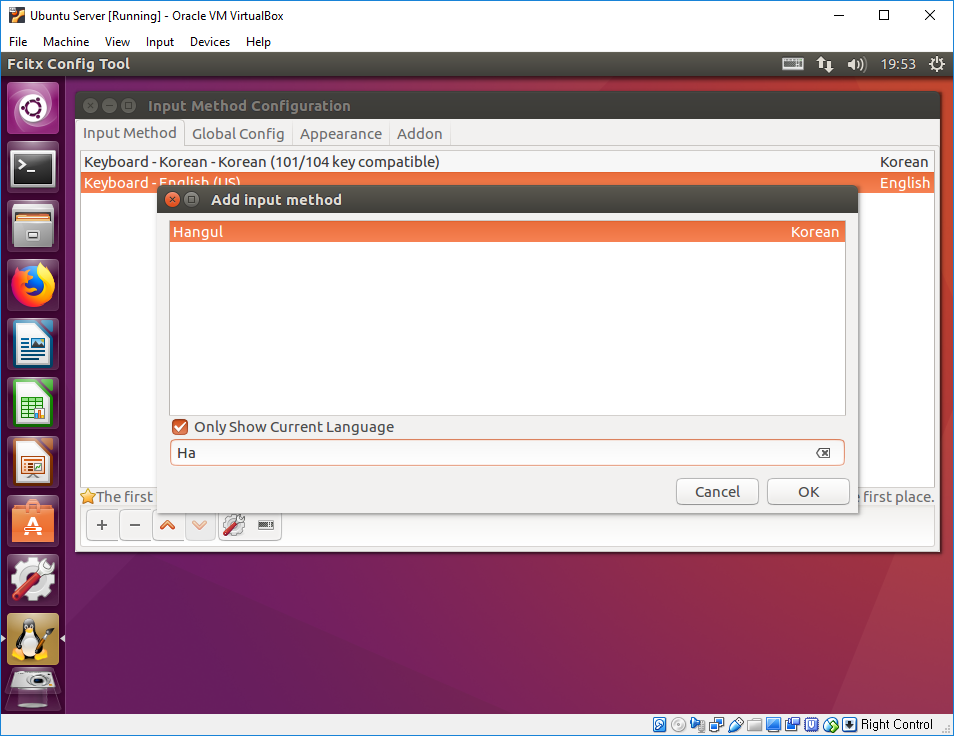

'Hangul'이 설치되면 다음과 같습니다.

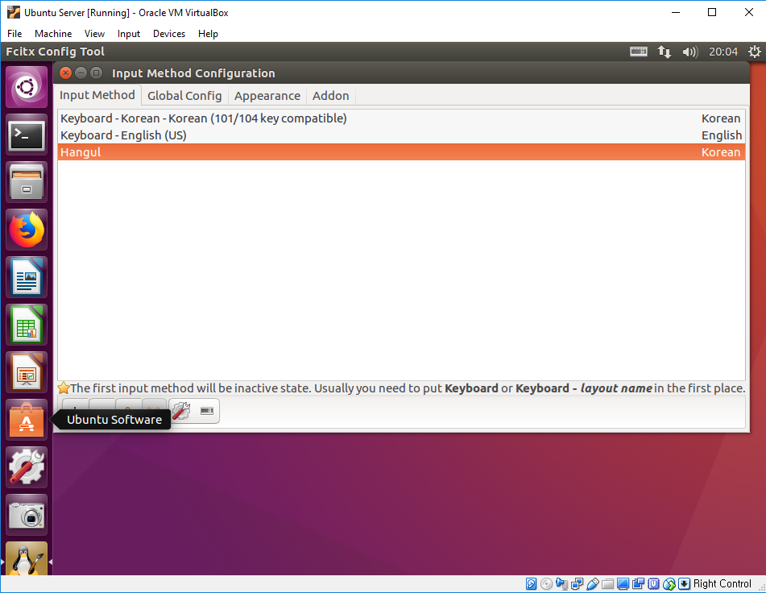

아래에서 ^ 버튼을 눌러서 'Hangul'의 우선 순위를 올립니다.

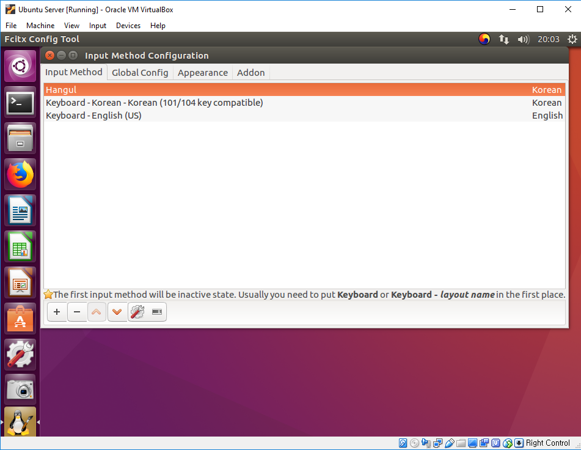

'Input Method Configuration' 창에서 'Global Config' 탭을 선택합니다.

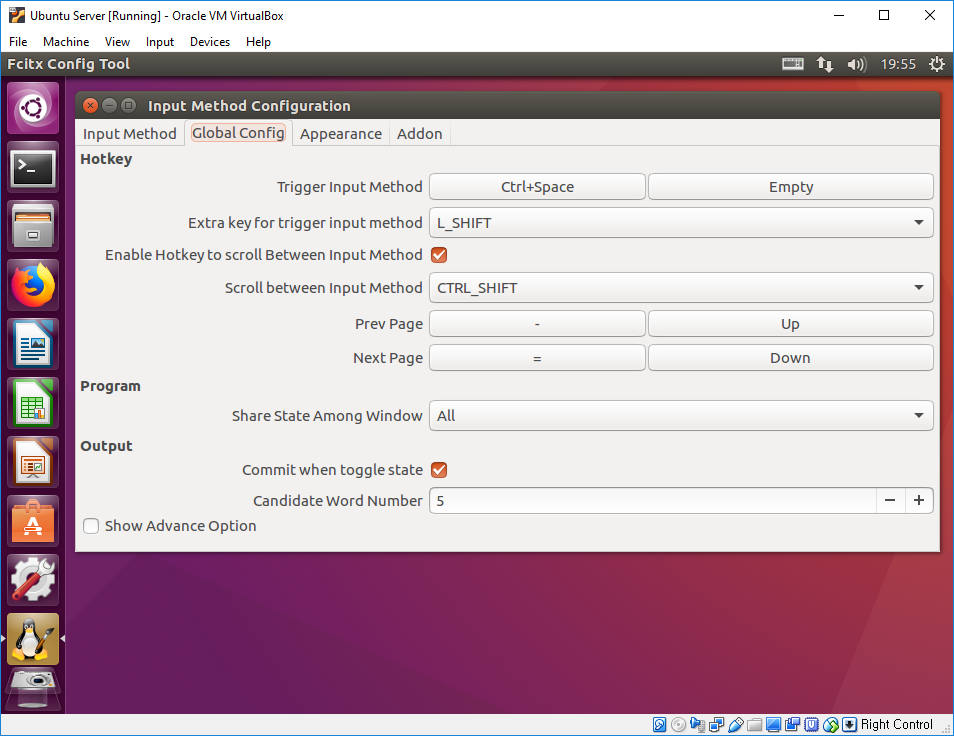

원하는 언어 전환키를 설정합니다. 저는 맥, 윈도우, 리눅스 모두 사용하기 때문에 모두 SHIFT-SPACE로 설정하여 사용합니다.

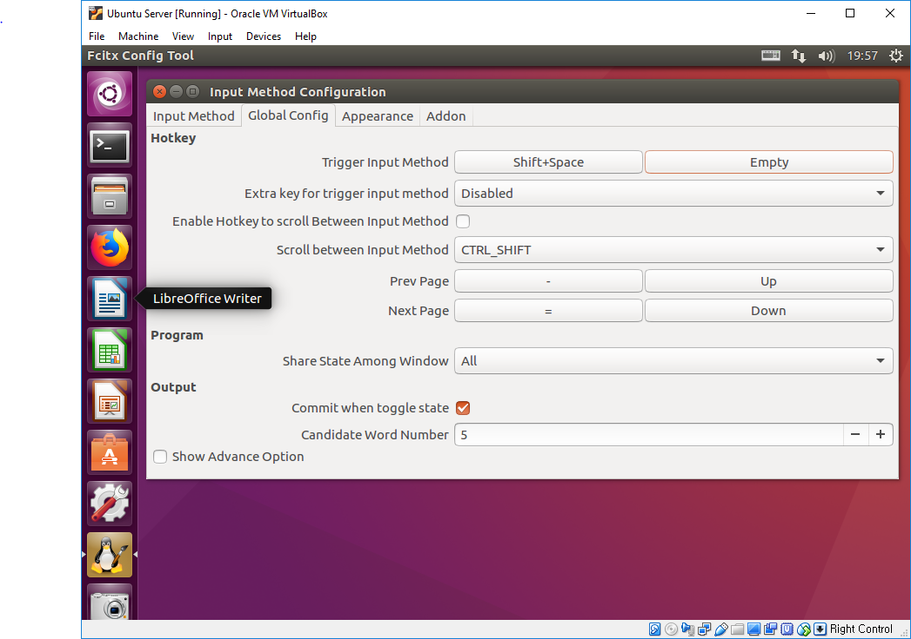

완료 되었습니다.

---

유형목님 말씀에 의하면 .config/fcitx 폴더를 백업해 두었다가 덮어 쓰는 방법이 있다고 합니다. 조언 감사합니다.

