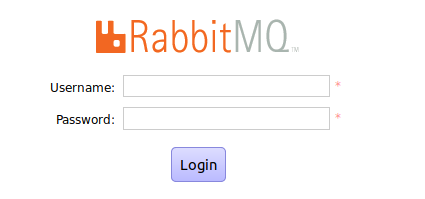

[Up](index.md)

# Installation of RabbitMQ on Ubuntu 18.04 LTS

## Erlang 설치

먼저 [Erlang](ubuntu_erlang.md)을 설치합니다.

## RabbitMQ를 설치합니다.

```sh
sudo apt update
sudo apt -y install rabbitmq-server
```

## 상태 모니터

```sh
sudo systemctl status  rabbitmq-server.service 
```

```
● rabbitmq-server.service - RabbitMQ Messaging Server
   Loaded: loaded (/lib/systemd/system/rabbitmq-server.service; enabled; vendor preset: enabled)
   Active: active (running) since Tue 2019-04-16 18:09:25 KST; 22s ago
 Main PID: 19276 (rabbitmq-server)
    Tasks: 92 (limit: 4915)
   CGroup: /system.slice/rabbitmq-server.service
           ├─19276 /bin/sh /usr/sbin/rabbitmq-server
           ├─19285 /bin/sh /usr/lib/rabbitmq/bin/rabbitmq-server
           ├─19496 /usr/lib/erlang/erts-9.2/bin/epmd -daemon
           ├─19580 /usr/lib/erlang/erts-9.2/bin/beam.smp -W w -A 64 -P 1048576 -t 5000000 -stbt db -zdbbl 32000 -K true -
           ├─19697 erl_child_setup 65536
           ├─19874 inet_gethost 4
           └─19875 inet_gethost 4

 4월 16 18:09:17 <computer-name> systemd[1]: Starting RabbitMQ Messaging Server...
 4월 16 18:09:20 <computer-name> rabbitmq[19277]: Waiting for rabbit@booil1804
 4월 16 18:09:20 <computer-name> rabbitmq[19277]: pid is 19285
 4월 16 18:09:25 <computer-name> systemd[1]: Started RabbitMQ Messaging Server.
```

다음 명령을 사용하여 부팅 할 때 서비스가 시작되도록 구성되었는지 확인할 수 있습니다.

```sh
systemctl is-enabled rabbitmq-server.service 
```

```
enabled
```

`disabled` 상태로 돌아 오면 다음을 실행하여 활성화하십시오.

```sh
sudo systemctl enable rabbitmq-server
```

## (선택) RabbitMQ 관리 대시보스 활성화

필요에 따라 RabbitMQ 관리 웹 대시 보드를 사용하면 쉽게 관리 할 수 있습니다.

```sh
sudo rabbitmq-plugins enable rabbitmq_management
```

여기에서 출력되는 플러그인 목록은 버전에 따라 다를 수 있습니다.

```
The following plugins have been enabled:
  amqp_client
  cowlib
  cowboy
  rabbitmq_web_dispatch
  rabbitmq_management_agent
  rabbitmq_management

Applying plugin configuration to rabbit@booil1804... started 6 plugins.
```

관리 대시보드 웹 서비스는 TCP 포트 15672에서 접속 해야 합니다. `ss` 를 사용하여 네트워크상태를 확인 합니다.

```sh
ss -tunelp | grep 15672
```

```
tcp    LISTEN   0        128               0.0.0.0:15672          0.0.0.0:*      uid:124 ino:1701345 sk:d <->
```

활성 UFW 방화벽이있는 경우 포트 5672와 15672를 모두 엽니다.

```sh
sudo ufw allow proto tcp from any to any port 5672,15672
```

웹브라우저에서 `http://[server IP|Hostname]:15672`에 접속합니다. 다음과 같이 관리 대시보드 접속 화면이 나타납니다.



기본적으로 `guest` 사용자는 존재하며 `localhost`에서만 연결할 수 있습니다. 이 `guest` 사용자와 로컬로 비밀번호 `guest`로 로그인 할 수 있습니다.

네트워크에 로그인하려면 다음과 같이 관리자를 만들 수 있습니다.

```sh
rabbitmqctl add_user <username> <password>
rabbitmqctl set_user_tags <username> administrator
```

## 사용자 계정 관리

사용자 계정 삭제:

```sh
rabbitmqctl delete_user <username>
```

사용자 계정 비밀번호 변경:

```sh
rabbitmqctl change_password <username> <password>
```

새 vhost 추가:

```sh
rabbitmqctl add_vhost /<new_vhost>
```

vhost 목록 보기:

```sh
rabbitmqctl list_vhosts
```

vhost 제거:

```sh
rabbitmqctl delete_vhost /<vhost>
```

vhost에 대한 사용자 권한 부여 :

```sh
rabbitmqctl set_permissions -p /<vhost> <username> ".*" ".*" ".*"
```

vhost 권한 목록:

```sh
rabbitmqctl list_permissions -p /<vhost>
```

사용자 계정의 권한 목록

```sh
rabbitmqctl list_user_permissions <username>
```

사용자 계정의 권한 제거

```sh
rabbitmqctl clear_permissions -p /<vhost> <username>
```

서비스 시작

```
$ sudo  service rabbitmq-server start
```

서비스 정지

```
$ sudo  service rabbitmq-server stop
```


## 참조

- [How to install Latest RabbitMQ Server on Ubuntu 18.04 LTS](https://computingforgeeks.com/how-to-install-latest-rabbitmq-server-on-ubuntu-18-04-lts/)

- [How to Setup RabbitMQ Cluster on Ubuntu 18.04 LTS](https://computingforgeeks.com/how-to-configure-rabbitmq-cluster-on-ubuntu-18-04-lts/)