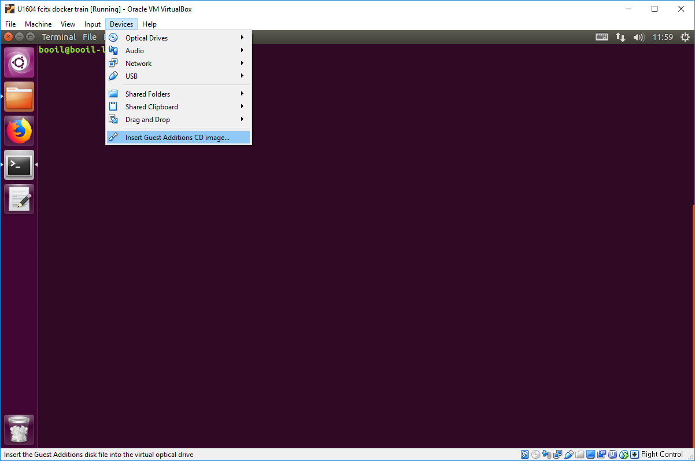
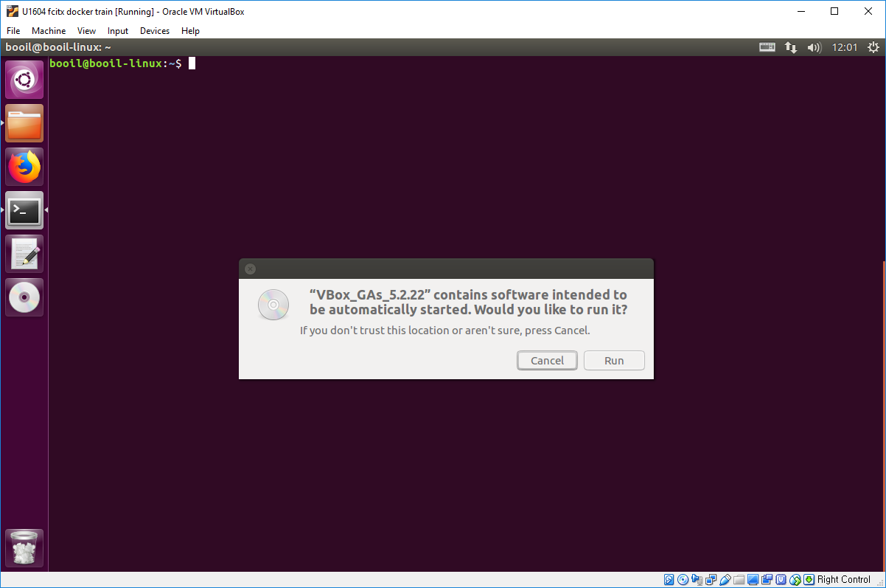
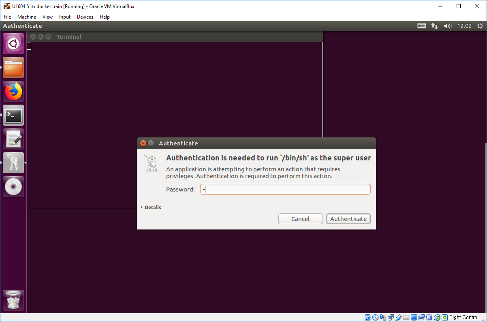
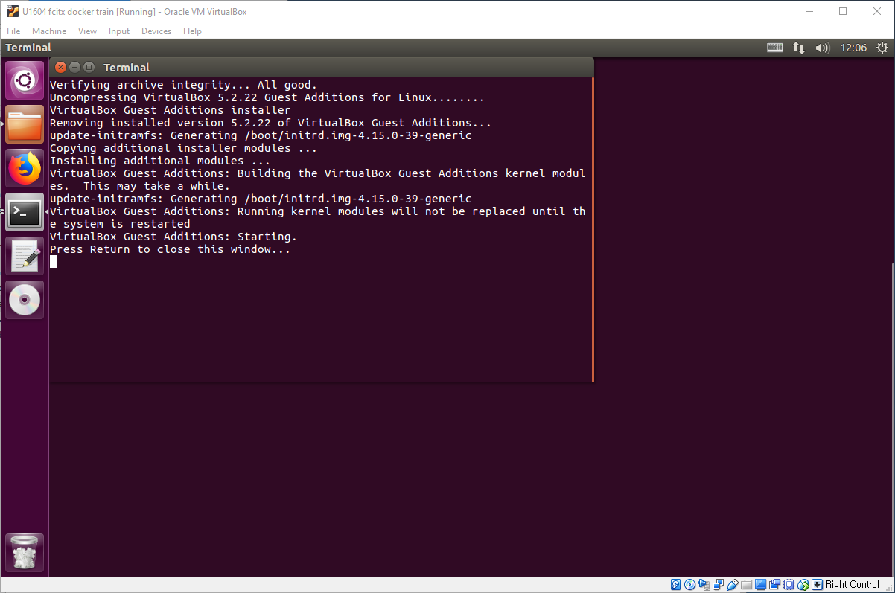

# VirtualBox: Guest Addition Installation for Ubuntu.

먼저 `가상머신> Devices > Insert Guest Additions CD Image`를 선택하여 Guest Addition을 설치합니다.

Guest Addition 설치 CD가 삽입되고 자동으로 실행할 것인지 묻습니다.

설치를 위해 수퍼유저 관한을 물으면 'Run'을 선택합니다.

설치가 완료되면 Enter를 눌러서 설치를 마칩니다.

설치가 되었으면 가상 머신을 재부팅 한 차례 해 줍니다.

