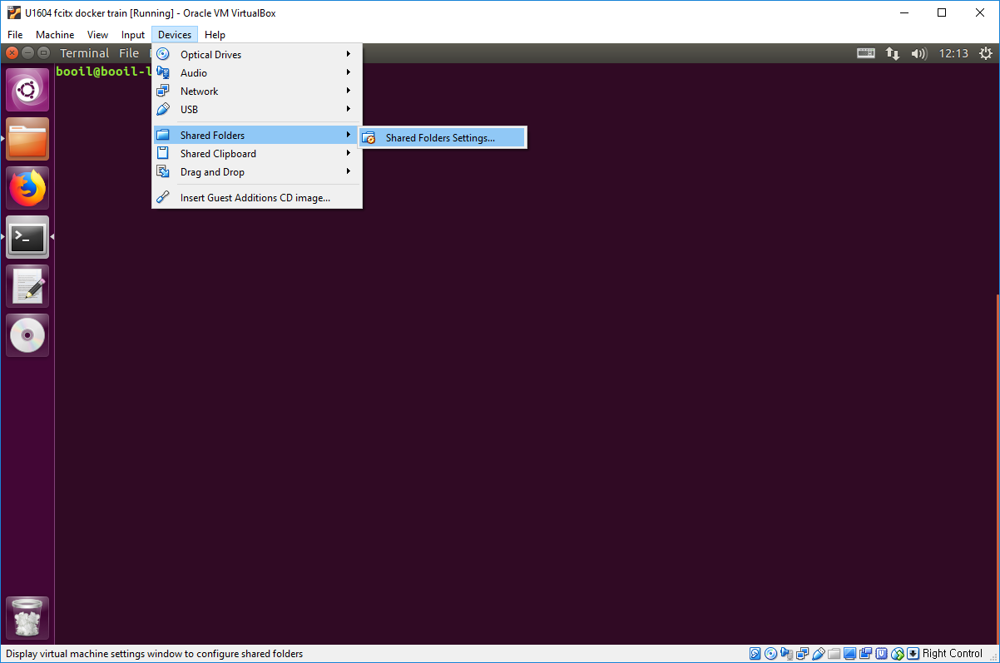
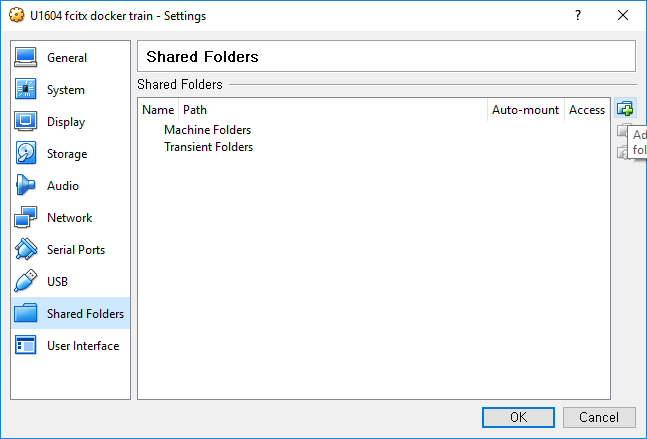
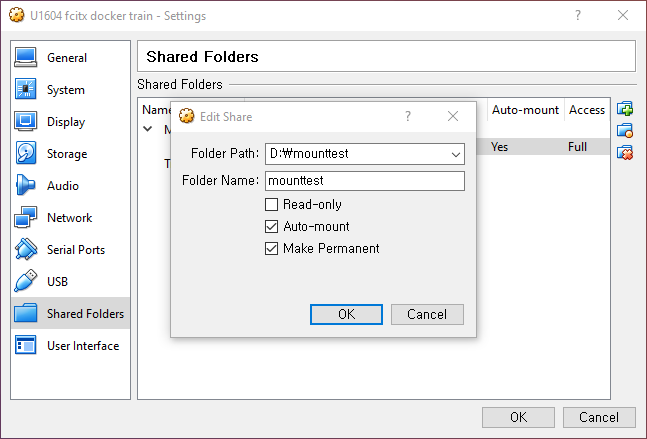
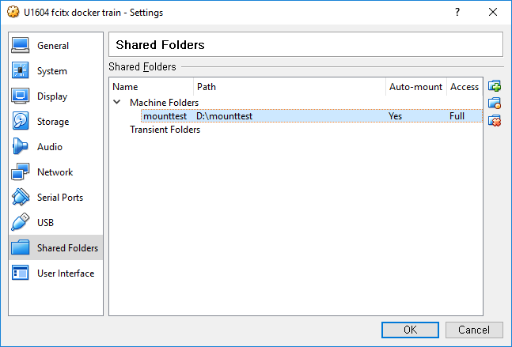
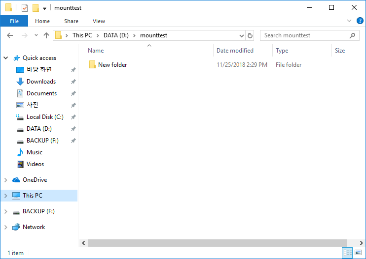
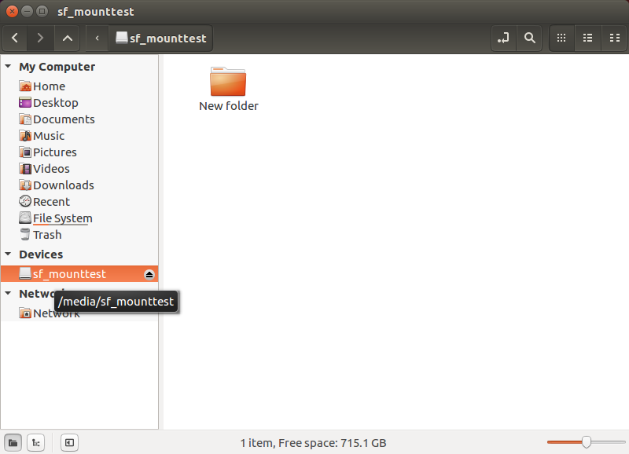

[Up](./index.md)

# VirtualBox: Mount host folder for guest Ubuntu 16.04

 먼저 [Guest Addition을 설치](./virtual_box_install_guest_additions.md) 합니다.

가상 머신의 `메뉴 > Devices > Shared Folders > Shared Folders Settings...`를 선택합니다.



`Shared Folders settgings..` 대화상자의 가장 오른쪽에 있는 폴더 + 모양의 아이콘을 클릭합니다.



호스트 폴더의 디렉토리와 가상 머신에서 사용할 폴더 이름과 다른 옵션들을 설정합니다. Auto Mount와 Make Permanent는 가상 머신을 다시 시작해도 다시 공유 폴더가 지정됩니다.




`OK`를 누르면

`Machine Folder`에 폴더가 추가되어 있습니다. 우분투에서 보이는 장치 이름은 `mounttest` 입니다.



VirtualBox 자동 마운트 공유 폴더는

```
/media/sf_<폴더이름>으로 마운트 됩니다.
```

우분트 파일 브라우저로 확인해보면 


`sf_<공유폴더이름>`으로 마운트 되어 있습니다.

그런데 `/media/sf_mounttest`폴더에 접근해보면 퍼미션 오류가 발생합니다.

기본적으로 VirtualBox 공유 폴더는 `vboxsf` 그룹에 접근 권한을 부여 합니다. 그래서 유저를 `vboxsf` 그룹에 추가해야 합니다.

한가지 방법은

```
sudo vi /etc/group
```

하여  `/etc/group`를 편집하여

`vboxsf:x:999:<username>`을 추가합니다.

다른 방법은

```
sudo adduser $USER vboxsf
```

명령을 사용하면 `/etc/group`파일에 유저를 추가해 줍니다.

그룹에 유저가 추가 되었으면 재부팅을 합니다.

재부팅이 끝나면, 확인을 위해, 호스트 폴더에 `New Folder`를 만들어 확인해 보겠습니다.



VM의 우분투 파일 브라우저에서도 확인해 봅니다.



완료 되었습니다.

---

##### 참조

- [stackoverflow: Virtualbox shared folder permissions](https://stackoverflow.com/questions/26740113/virtualbox-shared-folder-permissions)


