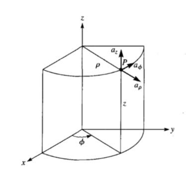
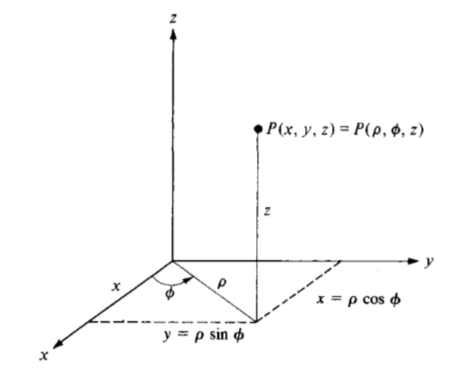
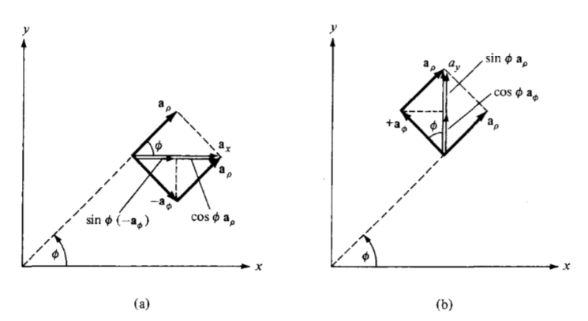
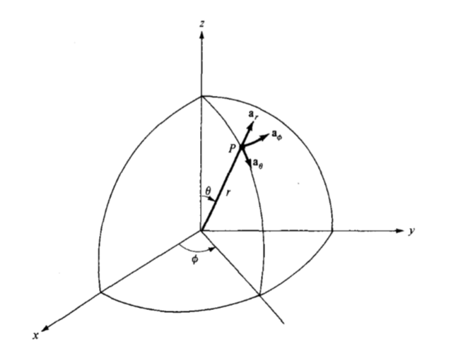
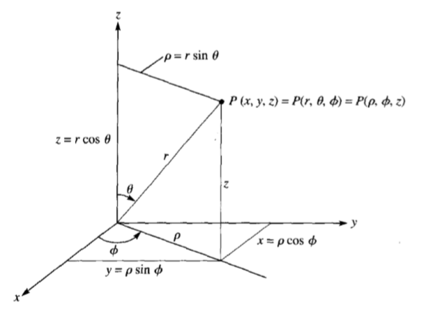
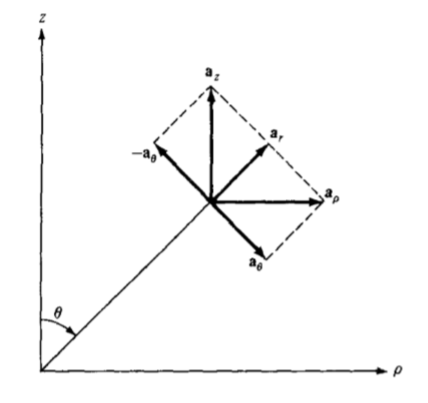
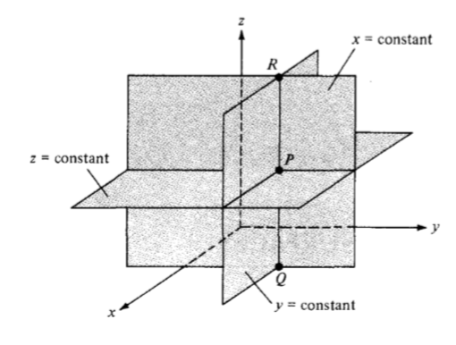
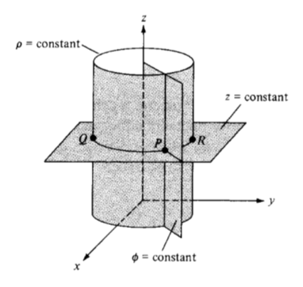
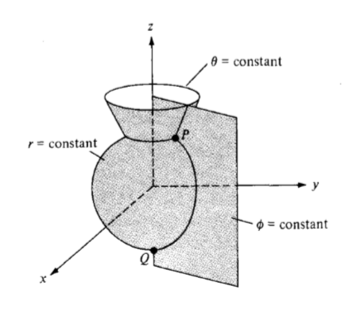

# Coordinate systems and transformation

## 2.1 Introduction

In general, the physical quantities we shall be dealing with in EM are functions of space and time. In order to describe the spatial variations of the quantities, we must be able to define all points uniquely in space in a suitable manner. This requires using an appropriate coordinate system.

A point or vector can be represented in any curvilinear coordinate system, which may be orthogonal or nonorthogonal.

> An **orthogonal system** is one in which the coordinates arc mutually perpendicular.

Nonorthogonal systems are hard to work with and they are of little or no practical use. Examples of orthogonal coordinate systems include the Cartesian (or rectangular), the circular cylindrical, the spherical, the elliptic cylindrical, the parabolic cylindrical, the conical, the prolate spheroidal, the oblate spheroidal, and the ellipsoidal. A considerable amount of work and time may be saved by choosing a coordinate system that best fits a given problem. A hard problem in one coordinate system may turn out to be easy in another system.

In this text, we shall restrict ourselves to the three best-known coordinate systems: the Cartesian, the circular cylindrical, and the spherical. Although we have considered the Cartesian system in Chapter 1, we shall consider it in detail in this chapter. We should bear in mind that the concepts covered in Chapter 1 and demonstrated in Cartesian coordinates are equally applicable to other systems of coordinates. For example, the procedure for finding dot or cross product of two vectors in a cylindrical system is the same as that used in the Cartesian system in Chapter 1.

Sometimes, it is necessary to transform points and vectors from one coordinate system to another. The techniques for doing this will be presented and illustrated with examples.

## 2.2 Cartesian coordinates $(x, y , z)$

As mentioned in Chapter 1, a point $P$ can be represented as $(x, y, z)$ as illustrated in Figure 1.1. The ranges of the coordinate variables $x$, $y$, and $z$ are
$$
\begin{aligned}
-\infty < x < \infty \\
-\infty < y < \infty \\
—\infty < z < \infty
\end{aligned}
\tag{2.1}
$$

A vector $\mathbf A$ in Cartesian (otherwise known as rectangular) coordinates can be written as
$$
\begin{aligned}
(A_x, A_y, A_z)
&&
\text{or}
&&
A_x \mathbf a_x + A_y \mathbf a_y + A_z \mathbf a_z
\end{aligned}
\tag{2.2}
$$
where $\mathbf a_x $, $\mathbf  a_y $, and $\mathbf  a_z $ are unit vectors along the $x$-, $y$-, and $z$-directions as shown in Figure 1.1.

## 2.3 Circular cylindrical coordinate $(\rho, \phi, z)$

The circular cylindrical coordinate system is very convenient whenever we are dealing with problems having cylindrical symmetry.

Figure 2.1 Point $P$ and unit vectors in the cylindrical coordinate system.

A point $P$ in cylindrical coordinates is represented as $( \rho, \phi, z) $ and is as shown in Figure 2.1. Observe Figure 2.1 closely and note how we define each space variable: $ \rho $ is the radius of the cylinder passing through $P$ or the radial distance from the $z$-axis: $ \phi $, called *azimuthal* angle, is measured from the $x$-axis in the $xy$-plane; and $z$ is the same as in the Cartesian system. The ranges of the variables are
$$
\begin{aligned}
0 \le \rho < \infty \\
0 \le \phi < 2 \pi \\
-\infty < z < \infty \\
\end{aligned}
\tag{2.3}
$$
A vector $ \mathbf A $ in cylindrical coordinates can be written as
$$
\begin{aligned}
(A_\rho, A_\phi, A_z)
&&
\text{or}
&&
A_\rho \mathbf a_\rho + A_\phi \mathbf a_\phi + A_z \mathbf a_z
\end{aligned}
\tag{2.4}
$$
where $\mathbf a_\rho$, $\mathbf a _\phi $ and $\mathbf a_z$ are unit vectors in the $\rho$-, $\phi$-, and $z$-directions as illustrated in Figure 2.1. Note that $\mathbf a _\phi$ is not in degrees; it assumes the unit vector of $\mathbf A$. For example, if a force of 10 N acts on a particle in a circular motion, the force may be represented as $ \mathbf F = 10 \mathbf a_\phi $ N. In this case, $\mathbf a_\phi$ is in newtons.

The magnitude of $ \mathbf A $ is
$$
\left|\mathbf A\right| = \sqrt{A_\rho^2 + A_\phi^2 + A_z^2}
$$
Notice that the unit vectors $\mathbf a _\rho$, $\mathbf a_\phi$, and $\mathbf a_z $ are mutually perpendicular because our coordinate system is orthogonal; $ \mathbf a_\rho $ points in the direction of increasing $\rho$, $\mathbf a_\phi $ in the direction of increasing $\phi$, and $ \mathbf a_z $ in the positive $z$-direction. Thus,
$$
\begin{aligned}
\mathbf a_\rho \cdot \mathbf a_\rho &=
\mathbf a_\phi \cdot \mathbf a_\phi =
\mathbf a_z \cdot \mathbf a_z = 1
\end{aligned}
\tag{2.6a}
$$

$$
\begin{aligned}
\mathbf a_\rho \cdot \mathbf a_\phi &=
\mathbf a_\phi \cdot \mathbf a_z =
\mathbf a_z \cdot \mathbf a_\rho = 0
\end{aligned}
\tag{2.6b}
$$

$$
\begin{aligned}
\mathbf a_\rho \times \mathbf a_\phi &=
\mathbf a_z
\end{aligned}
\tag{2.6c}
$$

$$
\begin{aligned}
\mathbf a_\phi \times \mathbf a_z &=
\mathbf a_\rho
\end{aligned}
\tag{2.6d}
$$

$$
\begin{aligned}
\mathbf a_z \times \mathbf a_\rho &=
\mathbf a_\phi
\end{aligned}
\tag{2.6e}
$$

where eqs. $\mathrm{(2.6c)}$ to $\mathrm{(2.6e})$ are obtained in cyclic permutation (see Figure 1.9). The relationships between the variables $(x, y, z)$ of the Cartesian coordinate system and those of the cylindrical system $(\rho, \phi, z)$ are easily obtained from Figure 2.2 
$$
\begin{aligned}
\rho = \sqrt{x^2 + y^2}, &&
\phi = \tan^{-1} \frac{y}{x}, &&
z = z
\end{aligned}
\tag{2.7}
$$
or
$$
\begin{aligned}
x = \rho \cos \phi, &&
y = \rho \sin \phi, &&
z = z
\end{aligned}
\tag{2.8}
$$
Whereas eq. $(2.7)$ is for transforming a point from Cartesian $(x, y, z)$ to cylindrical $(\rho, \phi, z)$ coordinates, eq. $(2.8)$ is for $(\rho, \phi, z) \rarr (x, y, z)$ transformation

Figure 2.2 Relationship between $(x, y, z)$ and $(\rho, \phi, z)$.

The relationships between $(\mathbf a_x, \mathbf a_y, \mathbf a_z)$ and $(\mathbf a_\rho, \mathbf a_\phi, \mathbf a_z)$ are obtained geometrically from Figure 2.3:
$$
\begin{aligned}
\mathbf a_x
&=
\cos \phi \space \mathbf a_\rho
-
\sin \phi \space \mathbf a_\phi
\\
\mathbf a_y
&=
\sin \phi \space \mathbf a_\rho
+
\cos \phi \space \mathbf a_\phi
\\
\mathbf a_z
&=
\mathbf a_z
\end{aligned}
\tag{2.9}
$$
or
$$
\begin{aligned}
\mathbf a_\rho
&=
\cos \phi \space \mathbf a_x
+
\sin \phi \space \mathbf a_y
\\
\mathbf a_\phi
&=
- \sin \phi \space \mathbf a_x
+ \cos \phi \space \mathbf a_y
\\
\mathbf a_z
&=
\mathbf a_z
\end{aligned}
\tag{2.10}
$$

Figure 2.3 Unit vector transformation: $(\mathrm a)$ cylindrical components of $\mathbf a_x$, $(\mathrmb)$ cylindrical components of $\mathbf a_y$.

Finally, the relationships between $(A_x, A_y, A_z)$ and $(A_\rho, A_\phi, A_z)$ are obtained by simply substituting eq. $(2.9)$ into eq. $(2.2)$ and collecting terms. Thus
$$
\begin{aligned}
\mathbf A
=
(A_x \cos \phi + A_y \sin \phi) \mathbf a_\rho
+
(-A_x \sin \phi + A_y \cos \phi) \mathbf a_\phi
+
A_z \mathbf a_z
\end{aligned}
\tag{2.11}
$$
or
$$
\begin{aligned}
A_\rho &= A_x \cos \phi + A_y \sin \phi \\
A_\phi &= -A_x \sin \phi + A_y \cos \phi \\
A_z &= A_z
\end{aligned}
\tag{2.12}
$$
In matrix form, we have the transformation of vector A from $(A_x,A_y,A_z)$ to $(A_\rho, A_\phi, A_z)$ as
$$
\begin{aligned}
\begin{bmatrix}
A_\rho \\
A_\phi \\
A_z
\end{bmatrix}
&=
\begin{bmatrix}
\cos \phi & \sin \phi & 0 \\
-\sin \phi & \cos \phi & 0 \\
0 & 0 & 1
\end{bmatrix}
\begin{bmatrix}
A_x \\
A_y \\
A_z
\end{bmatrix}
\end{aligned}
\tag{2.13}
$$
The inverse of the transformation $(A_\rho, A_\phi, A_z) \rarr (A_x, A_y, A_z)$ is obtained as
$$
\begin{aligned}
\begin{bmatrix}
A_x \\
A_y \\
A_z
\end{bmatrix}
&=
\begin{bmatrix}
\cos \phi & \sin \phi & 0 \\
-\sin \phi & \cos \phi & 0 \\
0 & 0 & 1
\end{bmatrix}
\begin{bmatrix}
A_\rho \\
A_\phi \\
A_z
\end{bmatrix}
\end{aligned}
\tag{2.14}
$$
or directly from eqs. $(2.4)$ and $(2.10)$. Thus
$$
\begin{aligned}
\begin{bmatrix}
A_x \\
A_y \\
A_z
\end{bmatrix}
&=
\begin{bmatrix}
\cos \phi & -\sin \phi & 0 \\
\sin \phi & \cos \phi & 0 \\
0 & 0 & 1
\end{bmatrix}
\begin{bmatrix}
A_\rho \\
A_\phi \\
A_z
\end{bmatrix}
\end{aligned}
\tag{2.15}
$$
An alternative way of obtaining eq. $(2.14)$ or $(2.15)$ is using the dot product. For example:
$$
\begin{aligned}
\begin{bmatrix}
A_x \\
A_y \\
A_z
\end{bmatrix}
&=
\begin{bmatrix}
\mathbf a_x \cdot \mathbf a_\rho & \mathbf a_x \cdot \mathbf a_\phi & \mathbf a_x \cdot \mathbf a_z \\
\mathbf a_y \cdot \mathbf a_\rho & \mathbf a_y \cdot \mathbf a_\phi & \mathbf a_y \cdot \mathbf a_z \\
\mathbf a_z \cdot \mathbf a_\rho & \mathbf a_z \cdot \mathbf a_\phi & \mathbf a_z \cdot \mathbf a_z \\
\end{bmatrix}
\begin{bmatrix}
A_\rho \\
A_\phi \\
A_z
\end{bmatrix}
\end{aligned}
\tag{2.16}
$$
The derivation of this is left as an exercise.

## 2.4 Spherical coordinates $(r, \theta, \phi)$

The spherical coordinate system is most appropriate when dealing with problems having a degree of spherical symmetry. A point $P$ can be represented as $(r, \theta, \phi)$ and is illustrated in Figure 2.4. From Figure 2.4, we notice that $r$ is defined as the distance from the origin to point $P$ or the radius of a sphere centered at the origin and passing through $P; \theta$ (called the colatitude) is the angle between the $z$-axis and the position vector of $P$; and $\phi$ is measured from the $x$-axis (the same azimuthal angle in cylindrical coordinates). According to these definitions, the ranges of the variables are
$$
\begin{aligned}
0 \le \space &r \lt \infty \\
0 \le \space &\theta \le \pi \\
0 \le \space &\phi \le 2\pi
\end{aligned}
\tag{2.17}
$$
A vector $\mathbf A$  in spherical coordinates may be written as
$$
\begin{aligned}
(A_r, A_\theta, A_\phi)
&& \text{or} &&
A_r \mathbf a_r +
A_\theta \mathbf a_\theta +
A_\phi \mathbf a_\phi
\end{aligned}
\tag{2.18}
$$
where an $\mathbf a_r$, $\mathbf a_\theta$ and $\mathbf a_\phi$ are unit vectors along the $r$-, $\theta$-, and $\phi$-directions. The magnitude of $\mathbf A$ is
$$
\begin{aligned}
\left| \mathbf A \right|
=
\sqrt{A_r^2 + A_\theta^2 + A_\theta^2}
\end{aligned}
\tag{2.19}
$$
The unit vectors  $\mathbf a_r$, $\mathbf a_\theta$ and $\mathbf a_\phi$ are mutually orthogonal;  $\mathbf a_r$ being directed along the radius or in the direction of increasing $r$,  $\mathbf a_\theta$  in the direction of increasing $\theta$, and $\mathbf a_\phi$ in the direction of increasing $\theta$. Thus
$$
\begin{aligned}
\mathbf a_r \cdot \mathbf a_r &=
\mathbf a_\theta \cdot \mathbf a_\theta =
\mathbf a_\phi \cdot \mathbf a_\phi =
1
\\
\mathbf a_r \cdot \mathbf a_\theta &=
\mathbf a_\theta \cdot \mathbf a_\phi =
\mathbf a_\phi \cdot \mathbf a_r =
0
\\
\mathbf a_r \times \mathbf a_\theta &=
\mathbf a_\phi
\\
\mathbf a_\theta \times \mathbf a_\phi &=
\mathbf a_r
\\
\mathbf a_\phi \times \mathbf a_r &=
\mathbf a_\theta
\end{aligned}
\tag{2.20}
$$

Figure 2.4 Point $P$ and unit vectors in spherical coordinates.

The space variables $(x, y, z)$ in Cartesian coordinates can be related to variables $(r, \theta, \phi)$ of a spherical coordinate system. From Figure 2.5 it is easy to notice that
$$
\begin{aligned}
r = \sqrt{x^2 + y^2 + z^2},
&&
\theta = \tan^{-1} \frac{\sqrt{x^2 + y^2}}{z},
&&
\phi = \tan^{-1} \frac{y}{x}
\end{aligned}
\tag{2.21}
$$
or
$$
\begin{aligned}
x = r \sin \theta \cos \phi,
&&
y = r \sin \theta \sin \phi,
&&
z = r \cos \phi
\end{aligned}
\tag{2.22}
$$
In eq. $(2.21)$, we have $(x, y, z) \rarr (r, \theta, \phi)$ point transformation and in eq. $(2.22)$, it is $(r, \theta, \phi) \rarr (x, y, z)$ point transformation.

The unit vectors $\mathbf a_x, \mathbf a_y, \mathbf a_z$ and $\mathbf a_r, \mathbf a_\theta, \mathbf a_\phi$ are related as follows:
$$
\begin{aligned}
\mathbf a_x
&=
\sin \theta \cos \phi \space \mathbf a_r
+
\cos \theta \cos \phi \space \mathbf a_\theta
-
\sin \theta \space\mathbf a_\phi
\\
\mathbf a_y
&=
\sin \theta \sin \phi \space \mathbf a_r
+
\cos \theta \sin \phi \space \mathbf a_\theta
+
\cos \theta \space\mathbf a_\phi
\\
\mathbf a_z
&=
\cos \theta \space \mathbf a_r
-
\sin \theta \space \mathbf a_\theta
\end{aligned}
\tag{2.23}
$$
or
$$
\begin{aligned}
\mathbf a_r
&=
\sin \theta \cos \phi \space \mathbf a_x
+
\sin \theta \sin \phi \space \mathbf a_y
+
\cos \theta \space\mathbf a_z
\\
\mathbf a_\theta
&=
\cos \theta \cos \phi \space \mathbf a_x
+
\cos \theta \sin \phi \space \mathbf a_y
-
\sin \theta \space\mathbf a_z
\\
\mathbf a_\phi
&=
-\sin \theta \space \mathbf a_x
+\cos \theta \space \mathbf a_y
\end{aligned}
\tag{2.23}
$$

Figure 2.5 Relationships between space variables $(x, y, z)$, $(r, \theta, \phi)$ and $(\rho, \phi, z)$.

The components of vector $\mathbf A = (A_x, A_y, A_z)$ and $\mathbf A = (A_r, A_\theta, A_\phi)$ are related by substituting eq. $(2.23)$ into eq. $(2.2)$ and collecting terms. Thus,
$$
\begin{aligned}
\mathbf A &=
( A_x \sin \theta \cos \phi +
A_y \sin \theta \cos \phi +
A_z \cos \theta) \space \mathbf a_r \\
& + ( A_x \cos \theta \cos \phi +
A_y \cos \theta \sin \phi -
A_z \sin \theta) \space \mathbf a_\theta \\
& + (-A_x \sin \phi +
A_y \cos \phi) \space \mathbf a_\phi
\end{aligned}
\tag{2.25}
$$
and from this, we obtain
$$
\begin{aligned}
A_r &=
A_x \sin \theta \cos \phi +
A_y \sin \theta \sin \phi +
A_z \cos \theta
\\
A_\theta &=
A_x \cos \theta \cos \phi +
A_y \cos \theta \sin \phi -
A_z \sin \theta
\\
A_\phi &=
-A_x \sin \phi +
A_y \cos \phi
\end{aligned}
\tag{2.26}
$$
In matrix form, the $(A_x, A_y, A_z) \rarr (A_r, A_\theta, A_\phi$)$ vector transformation is performed according to
$$
\begin{aligned}
\begin{bmatrix}
A_r \\
A_\theta \\
A_\phi
\end{bmatrix}
=
\begin{bmatrix}
\sin \theta \cos \phi & \sin \theta \cos \phi & \cos \theta \\
-\cos \theta \cos \phi & \cos \theta \sin \phi & -\sin \theta \\
-\sin \phi & \cos \phi & 0
\end{bmatrix}
\begin{bmatrix}
A_x\\
A_y\\
A_z
\end{bmatrix}
\end{aligned}
\tag{2.27}
$$
The inverse transformation $(A_r A_\theta, A_\phi) \rarr (A_x, A_y, A_z)$ is similarly obtained, or we obtain it from eq. $(2.23)$. Thus,
$$
\begin{aligned}
\begin{bmatrix}
A_x \\
A_y \\
A_z
\end{bmatrix}
=
\begin{bmatrix}
\sin \theta \cos \phi & \cos \theta \cos \phi & - \sin \phi \\
\sin \theta \sin \phi & \cos \theta \sin \phi & \cos \phi \\
\cos \theta & -\sin \theta & 0
\end{bmatrix}
\begin{bmatrix}
A_r \\
A_\theta \\
A_\phi
\end{bmatrix}
\end{aligned}
\tag{2.28}
$$

Alternatively, we may obtain eqs. $(2.27)$ and $(2.28)$ using the dot product. For example,

$$
\begin{aligned}
\begin{bmatrix}
A_r \\
A_\theta \\
A_\phi
\end{bmatrix}
=
\begin{bmatrix}
\mathbf a_r \cdot \mathbf a_x & \mathbf a_r \cdot \mathbf a_y & \mathbf a_r \cdot \mathbf a_z \\
\mathbf a_\theta \cdot \mathbf a_x & \mathbf a_\theta \cdot \mathbf a_y & \mathbf a_\theta \cdot \mathbf a_z \\
\mathbf a_\phi \cdot \mathbf a_x & \mathbf a_\phi \cdot \mathbf a_y & \mathbf a_\phi \cdot \mathbf a_z \\
\end{bmatrix}
\begin{bmatrix}
A_x \\
A_y \\
A_z
\end{bmatrix}
\end{aligned}
\tag{2.29}
$$

For the sake of completeness, it may be instructive to obtain the point or vector transformation relationships between cylindrical and spherical coordinates using Figures $2.5$ and $2.6$ (where $\phi$ is held constant since it is common to both systems). This will be left as an exercise (see Problem $2.9$). Note that in point or vector transformation the point or vector has not changed; it is only expressed differently. Thus, for example, the magnitude of a vector will remain the same after the transformation and this may serve as a way of checking the result of the transformation.

The distance between two points is usually necessary in EM theory. The distance d between two points with position vectors $\mathbf r_l$ and $\mathbf r_2$ is generally given by
$$
\begin{aligned}
d = \left| \mathbf r_2 - \mathbf r_1 \right|
\end{aligned}
\tag{2.30}
$$

Figure 2.6 Unit vector transformations for cylindrical and spherical coordinates.
$$
\begin{aligned}
d^2 = (x_2-x_1)^2 + (y_2-y_1)^2 + (z_2-z_1)^2
\end{aligned}
\tag{2.31 Cartesian}
$$

$$
\begin{aligned}
d^2 = \rho_2^2 + \rho_1^2 - 2\rho_1\rho_2\cos(\phi_2-\phi_1) + (z_2 - z_1)^2
\end{aligned}
\tag{2.32 cylindrical}
$$

$$
\begin{aligned}
d^2 = r_2^2 + r_1^2 - 2r_1 r_2 \cos \theta_2 \cos \theta_1 - 2r_1 r_2 \sin \theta_2 \sin \theta_1 cos(\phi_2-\phi_1)
\end{aligned}
\tag{2.33 spherical}
$$

## 2.5 Constant-coordinate surface

Surfaces in Cartesian, cylindrical, or spherical coordinate systems are easily generated by keeping one of the coordinate variables constant and allowing the other two to vary. In the Cartesian system, if we keep $x$ constant and allow $y$ and $z$ to vary, an infinite plane is generated. Thus we could have infinite planes
$$
\begin{aligned}
x &= \text{constant} \\
y &= \text{constant} \\
z &= \text{constant}
\end{aligned}
\tag{2.34}
$$

which are perpendicular to the $x$-, $y$-, and $z$-axes, respectively, as shown in Figure 2.7. The intersection of two planes is a line. For example,
$$
\begin{aligned}
x = \text{constant}, && y = \text{constant}
\end{aligned}
\tag{2.35}
$$

is the line $RPQ$ parallel to the $z$-axis. The intersection of three planes is a point. For example,
$$
\begin{aligned}
x = \text{constant}, && y = \text{constant}, && z = \text{constant}
\end{aligned}
\tag{2.36}
$$

is the point $P(x, y, z)$. Thus we may define point $P$ as the intersection of three orthogonal infinite planes. If $P$ is $(1, -5, 3)$, then $P$ is the intersection of planes $x = 1$, $y = -5$, and $z = 3$. Orthogonal surfaces in cylindrical coordinates can likewise be generated. The surfaces
$$
\begin{aligned}
\rho = \text{constant} \\
\phi = \text{constant} \\
z = \text{constant} \\
\end{aligned}
\tag{2.37}
$$

are illustrated in Figure 2.8, where it is easy to observe that $\rho = \text{constant}$ is a circular cylinder, $\phi = \text{constant}$ is a semiinfinite plane with its edge along the $z$-axis, and $z = \text{constant}$ is the same infinite plane as in a Cartesian system. Where two surfaces meet is either a line or a circle. Thus,
$$
\begin{aligned}
z = \text{constat}, &&
\rho = \text{constat}
\end{aligned}
\tag{2.38}
$$

Figure 2.7 Constant $x$, $y$, and $z$ surfaces.

Figure 2.8 Constant $\rho$, $\phi$, and $z$ surfaces.

is a circle $QPR$ of radius $\rho$, whereas $z = \text{constant}$, $\phi = \text{constant}$ is a semiinfinite line. A point is an intersection of the three surfaces in eq. $(2.37)$. Thus,
$$
\begin{aligned}
\rho = 2, && \phi = 60^\circ, && z=5
\end{aligned}
\tag{2.39}
$$

is the point $P(2, 60^\circ, 5)$.

Figure 2.9 Constant $r$, $\theta$ and $\phi$ surfaces.

The orthogonal nature of the spherical coordinate system is evident by considering the three surfaces
$$
\begin{aligned}
r = \text{constant} \\
\theta = \text{constant} \\
\phi = \text{constant} \\
\end{aligned}
\tag{2.40}
$$

which are shown in Figure 2.9, where we notice that $r = \text{constant}$ is a sphere with its center at the origin; $\theta = \text{constant}$ is a circular cone with the $z$-axis as its axis and the origin as its vertex; $\phi = \text{constant}$ is the semiinfinite plane as in a cylindrical system. A line is formed by the intersection of two surfaces. For example:
$$
\begin{aligned}
r = \text{constant}, &&
\theta = \text{constant} \\
\end{aligned}
\tag{2.41}
$$

is a semicircle passing through Q and P. The intersection of three surfaces gives a point. Thus,
$$
\begin{aligned}
r = 5, && \theta = 30^\circ, && \phi = 60^\circ
\end{aligned}
\tag{2.42}
$$

is the point $P(5, 30^\circ, 60^\circ)$. We notice that in general, a point in three-dimensional space can be identified as the intersection of three mutually orthogonal surfaces. Also, a unit normal vector to the surface $n = \text{constant}$ is $\pm\mathbf a_n$, where $n$ is $x$, $y$, $z$, $\rho$, $\phi$, $r$, or $\theta$. For example, to plane $x = 5$, a unit normal vector is $\pm\mathbf a_x$ and to planed $\phi= 20^\circ$, a unit normal vector is $\mathbf a_\phi $.
$$
\begin{aligned}
\end{aligned}
\tag{}
$$

