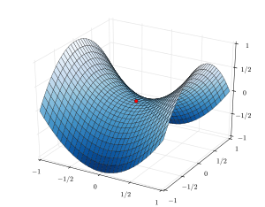

[Up](index.md)

# 헤시안 행렬(Hessian matrix)

주의: 이 글의 수학은 공학 분야 활용 중심이며 수학 전공자가 보기에 엄밀하지 않을 수 있습니다.

헤시안 행렬 또는 헤시안은 스칼라 변수가 주어진 함수의 2차 편미분 함수를 [정칙행렬](nonsingularc_matrix.md)로 표현한 행렬 입니다. 헤시안 행렬에서 헤시안은 독일(프로이센)의 수학자 루트비오 오토 헤세(Ludwig Otto Hesse, 1811년 4월 22일 ~ 1874년 8월 4일)의 이름입니다. 헤시안 행렬은 다변수 함수가 극값을 가질때, 그것이 극대인지, 극소인지, 안장점(saddle point)인지 판정할 때 사용합니다.

어떤 실함수 $f(x_1, x_2, x_3, \cdots , x_n)$ 에 대하여 헤시안 행렬은:

$$
H(f) = \begin{pmatrix}
\frac{\partial ^2 f}{\partial x_1^2} &
\frac{\partial ^2 f}{\partial x_1 \partial x_2} &
\cdots &
\frac{\partial ^2 f}{\partial x_1 \partial x_n} \\
\frac{\partial ^2 f}{\partial x_2 \partial x_1} &
\frac{\partial ^2 f}{\partial x_2 ^2} &
\cdots &
\frac{\partial ^2 f}{\partial x_2 \partial x_n} \\
\vdots &
\vdots &
\ddots &
\vdots \\
\frac{\partial ^2 f}{\partial x_n \partial x_1} &
\frac{\partial ^2 f}{\partial x_n \partial x_2} &
\cdots &
\frac{\partial ^2 f}{\partial x_n ^2} \\
\end{pmatrix}
$$

이며, 헤시안 행렬은 함수의 기울기 벡터 $\nabla f$에 대해 다음처럼 야코비안 행렬(Jacobian matrix):

$$
H = J^T J
=
\begin{pmatrix}
J_1^T & J_2^T
\end{pmatrix}
\begin{pmatrix}
J_1 \\
J_2
\end{pmatrix}
= J_1^T J_1 + J_2^T J_2
$$

로도 설명이 가능 합니다.

헤시안 행렬은 선형 근사에 사용 됩니다. 다음 $p$ 근처에서 $x$를 함수를 2차항까지 근사시킨 함수 $f$는:

$$
f(x) \simeq
f(p) + \nabla f(p)(x-p) + \frac{1}{2} (x-p)^T H(x)(x-p)
$$

로 표현 됩니다.

헤시안 행렬은 어떤 함수의 임계점(critical point)의 종류를 판별하는데 사용 됩니다.

어떤 함수의 일차미분이 0이 되는 지점을 임계점이라고 하는데, 함수의 극대, 극소와 같은 극점이나 안장점이 이에 해당 됩니다.  즉, $f'(x) = 0$을 찾았다면 이차미분을 통해 그 점이 극대인지 극소 또는 안장점인지 파악 할 수 있습니다.

안장점이란 다변수 함수에서 어느 방향에서 보면 극대값이지만 다른 방향에서 보면 극소값이 되는 점을 말합니다. 출처: <a href="https://en.wikipedia.org/wiki/Saddle_point">wikipedia.org</a>

어떤 함수의 임계점에서 계산한 헤시안 행렬의 모든 고유값(eigenvalue)이:

- 양수이면 극소,
- 음수이면 극대,
- 음의 고유값과 양의 고유값을 모두 가지면 안장점

으로 판단 합니다.

여기서 핵심은 헤시안 행렬의 고유벡터는 함수의 곡률이 큰 방향벡터를 나타내고, 고유값은 해당 고유벡터의 방향으로 함수의 곡률(curvature) 즉 2차미분값을 나타냅니다.

함수 $f$가 이차미분가능하고 이차미분된 함수가 연속이라면

$$
\frac{\partial x}{\partial} \frac{\partial y}{\partial f}
=
\frac{\partial y}{\partial} \frac{\partial x}{\partial f}
$$

가 성립하고, 헤시안 행렬이 대칭행렬이 되므로 대칭행렬의 특성대로 항상 고유값 분해가 가능하며 서로 일차독립인 $n$개의 고유벡터를 가지게 됩니다.

## 참조

- [wikipedia.org](https://en.wikipedia.org/wiki/Hessian_matrix)

