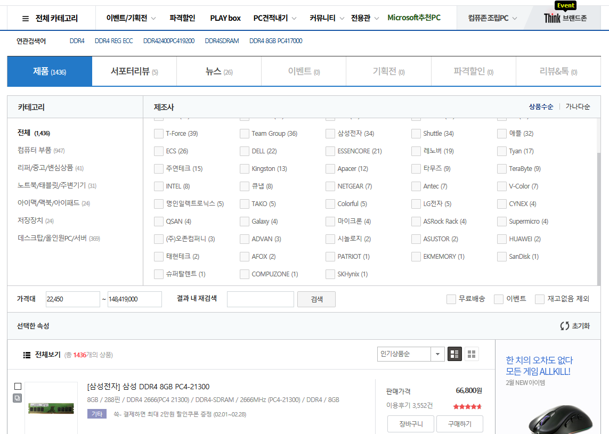
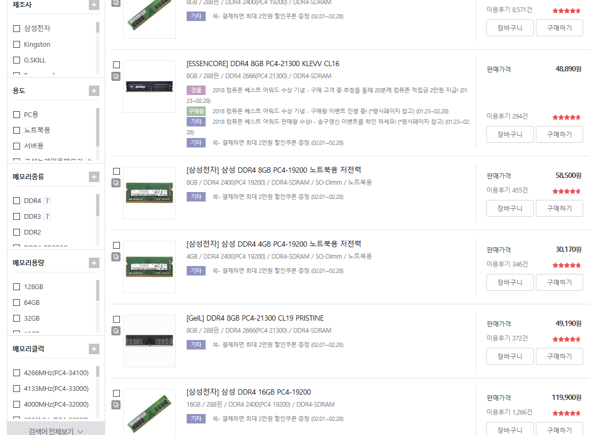
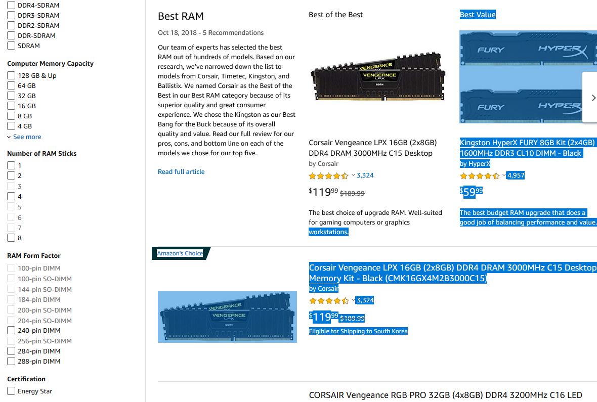
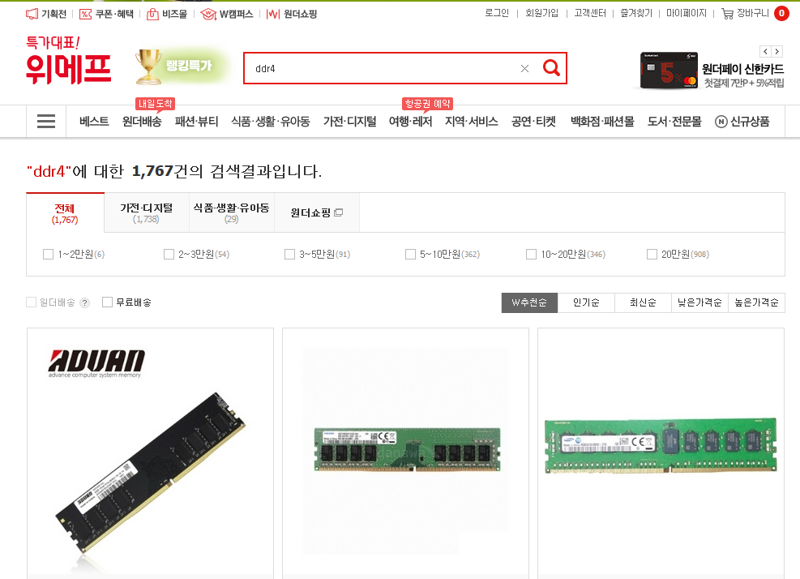
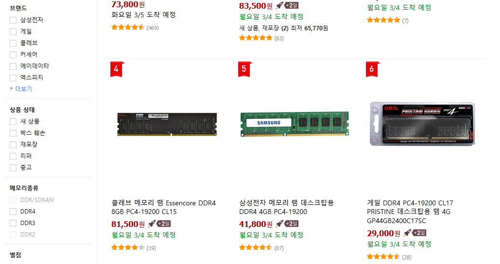
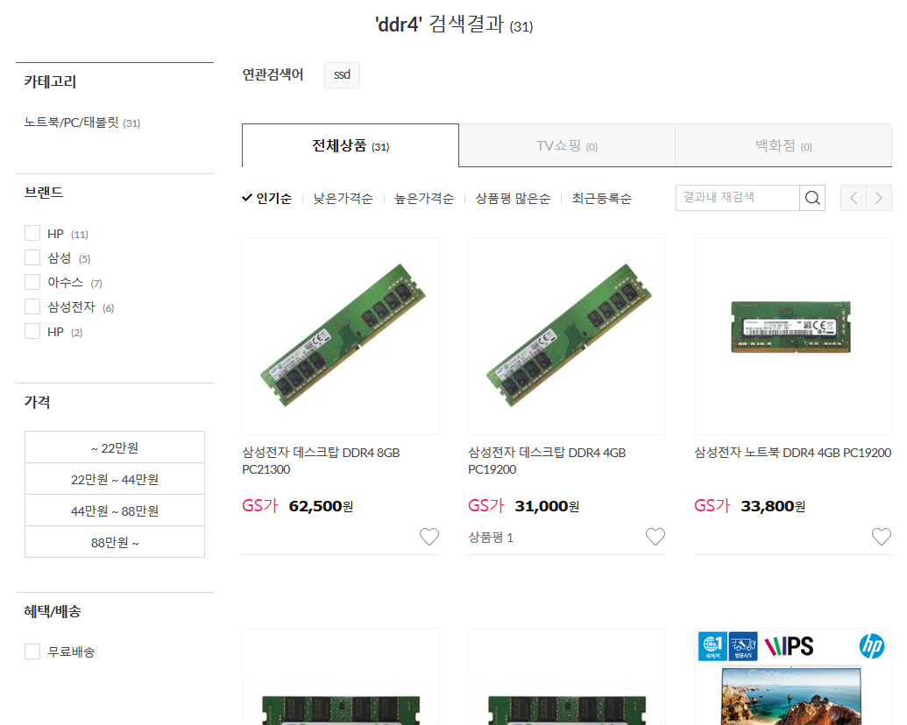
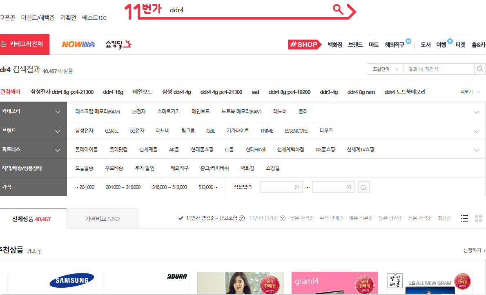
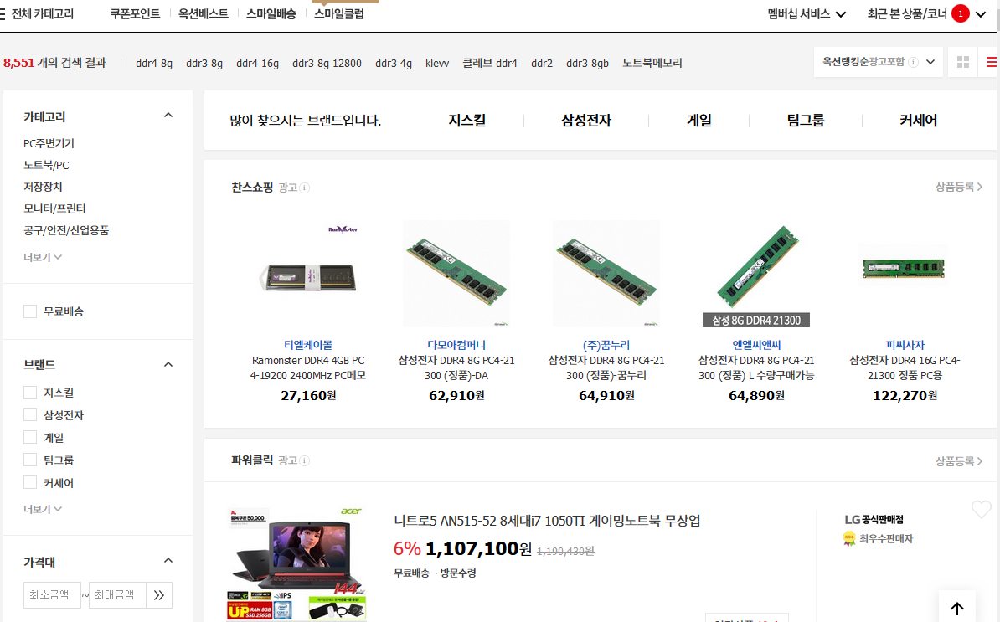
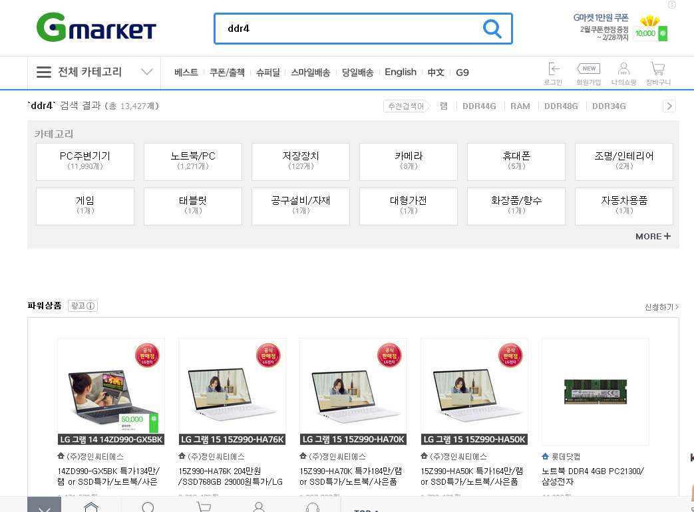
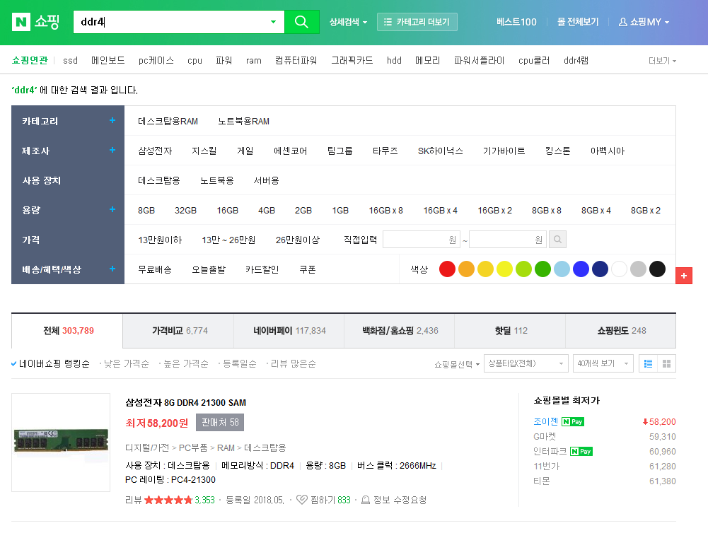

[Up](index.md)

# 온라인 쇼핑몰 키워드 검색과 옵션 비교

컴퓨터 비전과 머신러닝에 사용하는 개발용 PC의 메모리를 늘려야 할 필요를 느껴 DDR 메모리를 검색하였습니다. 새로운 PC 하드웨어 사양과 담을 쌓고 있었던지라 어떤 제품을 골라야 할지 검색을 하는데 불편함을 느끼고 각 온라인 쇼핑몰의 검색 기능을 비교해 보았습니다.

이 글은 길지 않으며 어떤 분석이나 해석을 기술하고 있지 않습니다. 독자께서는 비교하는 정도로 읽어 주시면 편하시겠습니다.

---

온라인 쇼핑몰에서 상품을 찾는 방법은 2가지가 있습니다. 하나가 키워드 검색이며 다른 하나는 카테고리 검색입니다.

컴퓨존에서 DDR4 메모리를 구입하기 위해 검색을 하면 다음과 같이 표시 됩니다.

검색 결과에서 관련 카테고리와 브랜드(제조사)를 선택할 수 있습니다.

다양한 DDR4 메모리에 대한 상세한 검색을 하려면 DDR4 종류를 구글링을 하여 키워드를 습득 하든지, 아래처럼 메인 메뉴에서 카테고리를 탐색하여 찾아야 합니다. 카테고리를 찾아 이동하는 눈으로 텍스트를 읽어야 하며, 몇개의 과정을 반복하기 때문에, 검색보다 시간이 걸리고 불편 합니다.

카테고리별 메뉴을 탐색하면, 좌측에 DDR 메모리에 대한 다양한 옵션들이 표시됩니다. 제조사, 용도, 메모리 종류, 용량, 클럭등 제품에 직접 관련이 있는 옵션이 표시 됩니다.

---

모든 쇼핑몰들이 메인 메뉴에서 카테고리를 탐색해야 상세한 옵션을 선택할 수 있을까요? 미국인들은 지식은 구글에서 검색하고, 상품은 아마존에서 검색한다고 하죠.

## Amazon

먼저, 아마존에서 DDR4를 키워드로 검색해 봤습니다.

키워드 검색만으로 DDR 메모리를 자세한 옵션을 선택할 수 있게 좌측에 표시해주고 있습니다.

## 위메프

위메프는 어떨까요?

안타깝게도 가격 옵션만 표시하고 있습니다.

## 쿠팡

많은 투자를 받고 있으며, 한국의 아마존이라는 쿠팡은 어떨까요?

브랜드나 상품 상태는 어느 카테고리 제품이라도 해당되니 언급할 필요는 없겠습니다. DDR4 만의 옵션은 **메모리 종류** 하나가 표시됩니다.

## GSSHOP

OO님께서 계시는 GSSHOP을 볼까요?

DDR4 만을 위한 특별한 옵션들이 표시 되지 않습니다.

## 11번가

그럼 OO님께서 계시는 SK의 11번가는 어떨까요?

DDR4만을 위한 옵션은 제공되지 않습니다. 카테고리, 브랜드, 파트너스, 가격 등은 다른 제품 카테고리 상품과 공통 옵션이죠.

## 옥션

옥션은 어떨까요?

옥션도 특별한 옵션을 보여주지 않습니다.

## GMARKET

GMARKET도 마찬가지 입니다.

## 네이버 쇼핑

마지막으로 네이버 쇼핑을 확인해 봤습니다. OO님께서 가격이나 적립금때문이라도 네이버 쇼핑을 적극 추천하시는데요. 아마존 수준은 아니지만, 제법 많은 DDR4 만의 옵션들을 표시해 주고 있습니다. 

---

이상 몇개의 온라인 쇼핑몰에서 DDR4 램을 검색하며 카테고리별 옵션을 확인해 보았습니다. 국내 쇼핑몰에서는 포털을 가지고 있는 네이버의 우위로 보입니다.

오픈 마켓은 다양한 카테고리의 제품을 판매하고, 판매자들이 카테고리 규칙을 잘 따라 주어야 카테고리별 옵션들이 표시되는 난점이 있기도 합니다. 오늘도 보다 나은 서비스를 위해 달리는 분들께 "가즈아!"를 외쳐 봅니다.

