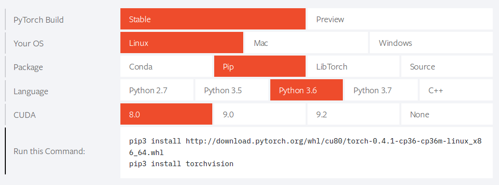

<<<<<<< HEAD
[Up](index.md)

# Google Colab에서 PyTorch 사용하기

이 글은 2018년 3월 28일 현재 유효합니다.

Google이 Colab이라는 개발자을 위한 엔비디아 K80, 주피터 노트북(Jupyter notebook),  iPython에 기반의 머신러닝 개발 환경을 무료로 제공하고 있습니다. CoLab의 가상 머신과 GPU는 최대 12시간 연속 사용 할 수 있다고 합니다.

구글의 머신러닝 엔진은 <a href="https://www.tensorflow.org/">Tensorflow</a>입니다. 그래서 Colab은 Tensorflow만 사용 가능 한 것으로 알려져 있죠. 그런데, Colab에서 <a href="http://pytorch.org">PyTorch</a>도 사용 가능합니다! 

먼저, Edit / Notbook Settings... 메뉴를 선택하고, 대화상자에서 Runtime을 Python로, Hardware accelerator를 GPU로 선택합니다.


그리고 Code 셀에서 다음 명령을 추가하고

```sh
!pip3 install http://download.pytorch.org/whl/cu80/torch-0.3.0.post4-cp36-cp36m-linux_x86_64.whl
!pip3 install torchvision
```

실행하면 설치가 됩니다.

```sh
Collecting torch==0.3.0.post4 from http://download.pytorch.org/whl/cu80/torch-0.3.0.post4-cp36-cp36m-linux_x86_64.whl
Downloading http://download.pytorch.org/whl/cu80/torch-0.3.0.post4-cp36-cp36m-linux_x86_64.whl (592.3MB)
100% |████████████████████████████████| 592.3MB 44.5MB/s
Requirement already satisfied: pyyaml in /usr/local/lib/python3.6/dist-packages (from torch==0.3.0.post4)
Requirement already satisfied: numpy in /usr/local/lib/python3.6/dist-packages (from torch==0.3.0.post4)
Installing collected packages: torch
Successfully installed torch-0.3.0.post4
Collecting torchvision
Downloading torchvision-0.2.0-py2.py3-none-any.whl (48kB)
100% |████████████████████████████████| 51kB 1.6MB/s 
Requirement already satisfied: torch in /usr/local/lib/python3.6/dist-packages (from torchvision)
Collecting pillow>=4.1.1 (from torchvision)
Downloading Pillow-5.0.0-cp36-cp36m-manylinux1_x86_64.whl (5.9MB)
100% |████████████████████████████████| 5.9MB 218kB/s 
Requirement already satisfied: six in /usr/local/lib/python3.6/dist-packages (from torchvision)
Requirement already satisfied: numpy in /usr/local/lib/python3.6/dist-packages (from torchvision)
Requirement already satisfied: pyyaml in /usr/local/lib/python3.6/dist-packages (from torch->torchvision)
Installing collected packages: pillow, torchvision
Found existing installation: Pillow 4.0.0
Uninstalling Pillow-4.0.0:
Successfully uninstalled Pillow-4.0.0
Successfully installed pillow-5.0.0 torchvision-0.2.0
```

PyTorch 공식 예제를 테스트 해 봅니다.

```python
import torch

dtype = torch.cuda.FloatTensor
N, D_in, H, D_out = 64, 1000, 100, 10
x = torch.randn(N, D_in).type(dtype)
y = torch.randn(N, D_out).type(dtype)
w1 = torch.randn(D_in, H).type(dtype)
w2 = torch.randn(H, D_out).type(dtype)
learning_rate = 1e-6

for t in range(500):
    h = x.mm(w1)
    h_relu = h.clamp(min=0)
    y_pred = h_relu.mm(w2)
    loss = (y_pred - y).pow(2).sum()
    print(t, loss)

    grad_y_pred = 2.0 * (y_pred - y)
    grad_w2 = h_relu.t().mm(grad_y_pred)
    grad_h_relu = grad_y_pred.mm(w2.t())
    grad_h = grad_h_relu.clone()
    grad_h[h < 0] = 0
    grad_w1 = x.t().mm(grad_h)

    w1 -= learning_rate * grad_w1
    w2 -= learning_rate * grad_w2
```

그럼 즐겁게 Colab 하시기 바랍니다.

## 같이보기

- [Google Colab의 GPU 정보를 확인해 봤습니다.](google_colab_gpu_with_pytorch.md)

##참조

=======
[Up](index.md)

# Google Colab에서 PyTorch 사용하기

이 글은 2018년 3월 28일 현재 유효합니다.

Google이 Colab이라는 개발자을 위한 엔비디아 K80, 주피터 노트북(Jupyter notebook),  iPython에 기반의 머신러닝 개발 환경을 무료로 제공하고 있습니다. CoLab의 가상 머신과 GPU는 최대 12시간 연속 사용 할 수 있다고 합니다.

구글의 머신러닝 엔진은 <a href="https://www.tensorflow.org/">Tensorflow</a>입니다. 그래서 Colab은 Tensorflow만 사용 가능 한 것으로 알려져 있죠. 그런데, Colab에서 <a href="http://pytorch.org">PyTorch</a>도 사용 가능합니다! 

먼저, Edit / Notbook Settings... 메뉴를 선택하고, 대화상자에서 Runtime을 Python로, Hardware accelerator를 GPU로 선택합니다.


3.0 을 설치하려면 Code 셀에서 다음 명령을 추가하고

```sh
!pip3 install http://download.pytorch.org/whl/cu80/torch-0.3.0.post4-cp36-cp36m-linux_x86_64.whl
!pip3 install torchvision
```

4.1을 설치하려면 아래 명령을 추가 합니다.

```sh
!pip3 install http://download.pytorch.org/whl/cu80/torch-0.4.1-cp36-cp36m-linux_x86_64.whl
!pip3 install torchvision
```

파이토치 버전을 선택하려면 [공식 홈페이지](https://pytorch.org/)에서 버전을 선택하면 링크를 얻을 수 있습니다.



실행하면 설치가 됩니다.

```sh
Collecting torch==0.3.0.post4 from http://download.pytorch.org/whl/cu80/torch-0.3.0.post4-cp36-cp36m-linux_x86_64.whl
Downloading http://download.pytorch.org/whl/cu80/torch-0.3.0.post4-cp36-cp36m-linux_x86_64.whl (592.3MB)
100% |████████████████████████████████| 592.3MB 44.5MB/s
Requirement already satisfied: pyyaml in /usr/local/lib/python3.6/dist-packages (from torch==0.3.0.post4)
Requirement already satisfied: numpy in /usr/local/lib/python3.6/dist-packages (from torch==0.3.0.post4)
Installing collected packages: torch
Successfully installed torch-0.3.0.post4
Collecting torchvision
Downloading torchvision-0.2.0-py2.py3-none-any.whl (48kB)
100% |████████████████████████████████| 51kB 1.6MB/s 
Requirement already satisfied: torch in /usr/local/lib/python3.6/dist-packages (from torchvision)
Collecting pillow>=4.1.1 (from torchvision)
Downloading Pillow-5.0.0-cp36-cp36m-manylinux1_x86_64.whl (5.9MB)
100% |████████████████████████████████| 5.9MB 218kB/s 
Requirement already satisfied: six in /usr/local/lib/python3.6/dist-packages (from torchvision)
Requirement already satisfied: numpy in /usr/local/lib/python3.6/dist-packages (from torchvision)
Requirement already satisfied: pyyaml in /usr/local/lib/python3.6/dist-packages (from torch->torchvision)
Installing collected packages: pillow, torchvision
Found existing installation: Pillow 4.0.0
Uninstalling Pillow-4.0.0:
Successfully uninstalled Pillow-4.0.0
Successfully installed pillow-5.0.0 torchvision-0.2.0
```

PyTorch 공식 예제를 테스트 해 봅니다.

```python
import torch

dtype = torch.cuda.FloatTensor
N, D_in, H, D_out = 64, 1000, 100, 10
x = torch.randn(N, D_in).type(dtype)
y = torch.randn(N, D_out).type(dtype)
w1 = torch.randn(D_in, H).type(dtype)
w2 = torch.randn(H, D_out).type(dtype)
learning_rate = 1e-6

for t in range(500):
    h = x.mm(w1)
    h_relu = h.clamp(min=0)
    y_pred = h_relu.mm(w2)
    loss = (y_pred - y).pow(2).sum()
    print(t, loss)

    grad_y_pred = 2.0 * (y_pred - y)
    grad_w2 = h_relu.t().mm(grad_y_pred)
    grad_h_relu = grad_y_pred.mm(w2.t())
    grad_h = grad_h_relu.clone()
    grad_h[h < 0] = 0
    grad_w1 = x.t().mm(grad_h)

    w1 -= learning_rate * grad_w1
    w2 -= learning_rate * grad_w2
```

그럼 즐겁게 Colab 하시기 바랍니다.

## 같이보기

- [Google Colab의 GPU 정보를 확인해 봤습니다.](google_colab_gpu_with_pytorch.md)

##참조

>>>>>>> 0f7f856a38d5338877e3042ab1f23c3374cceac1
- [Jovian Lin, Ph.D. blog](https://jovianlin.io/pytorch-with-gpu-in-google-colab/)