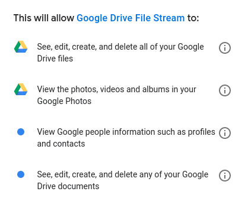

[Up](index.md)

# Google Colab의 파일 및 드라이브

구글 Colab은 무료로 강력한 컴퓨팅을 제공합니다. 로컬컴퓨터와 달리 불편한 점은 파일을 I/O하거나 다른 도구로 파일을 확인하거나 가공하는 것입니다. 많은 경우 직접 코딩을 하거나 업로드 또는 다운로드 해야 합니다.

### 파일 IO

#### 로컬 컴퓨터와 파일 IO

로컬컴퓨터와의 파일 IO는 데이터가 대양을 건너오느라 느리다는 문제가 있습니다.

##### 로컬 컴퓨터에서 원격 컴퓨터로 파일 업로드 `files.upload()`

```python
from google.colab import files

uploaded = files.upload()

for fn in uploaded.keys():
  print('User uploaded file "{name}" with length {length} bytes'.format(
      name=fn, length=len(uploaded[fn])))
```

`files.upload()`를 실행하면 실행 셀에 파일업로드가 표시되며 로컬 파일을 선택하여 업로드 할 수 있습니다.


##### 원격 컴퓨터에서 로컬 컴퓨터로 파일 다운로드`files.download(...)`

```python
from google.colab import files

with open('example.txt', 'w') as f:
  f.write('some content')

files.download('example.txt')
```

`files.download(파일명)`을 실행하면 파일을 다운로드 합니다.

### Google Drive 사용하기

구글 드라이브를 사용하는 방법은 3가지가 있습니다.

- Google Drive [Native REST API](https://developers.google.com/drive/api/v3/about-sdk)를 사용하는 방법.
- 위 API를 Python으로 감싼 PyDrive를 사용하는 방법.
- Google Drive를 가상머신에 마운트하는 방법

##### Google Drive를 Colab에 마운트

Google Drive를 마운트하는 방법을 보겠습니다. 

먼저 다음 Colab 셀에서 다음을 실행합니다.

```python
from google.colab import drive
drive.mount('/content/gdrive')
```

그러면 다음처럼 링크가 표시되고 인증 코드를 요구합니다.


링크를 클릭하면 권한이 표시 됩니다.



아래에서 Allow 버튼을 클릭하면 


인증 코드가 표시됩니다.

이 인증 코드를 붙여 넣기를 하고 엔터를 누릅니다. 성공했다면 다음 메시지가 표시됩니다.

```
Enter your authorization code:
··········
Mounted at /content/gdrive
```

테스트 파일을 생성하고 표시해 보겠습니다.

```python
with open('/content/gdrive/My Drive/foo.txt', 'w') as f:
  f.write('Hello Google Drive!')
!cat /content/gdrive/My\ Drive/foo.txt
```

```
Hello Google Drive!
```

참 쉽죠?


## 참조

- [External data: Drive, Sheets and Cloud Storage](https://colab.research.google.com/notebooks/io.ipynb#scrollTo=vz-jH8T_Uk2c)