[Up](../index.md)

# 던전입구

## 새 프로젝트 시작

조히비는 견습 마법사입니다. 레벨이 이제 1이라 새 던전에서 모험을 하며 마법을 배우고 싶습니다. 때마침 우히모가 추천한 던전을 수색하기로 했습니다. 자! 그럼 조히비와 함께 Unity라는 던전에서 마법을 배워 볼까요? 먼저 Unity를 실행합니다. 작업 컴퓨터에서 Unity를 처음 실행하면 아래와 같은 시작창을 볼 수 있습니다. 

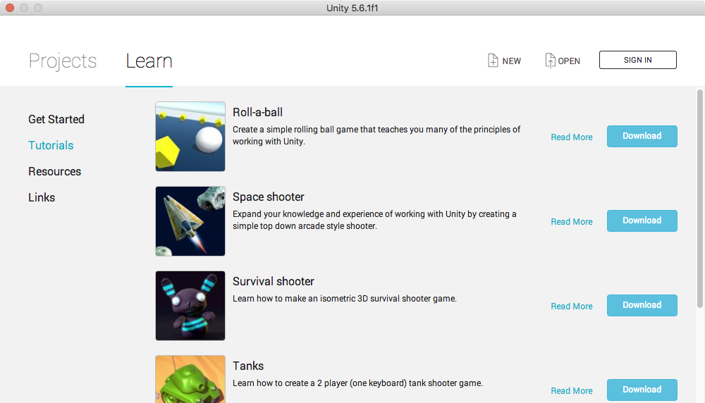

이미 작업 컴퓨터에서 프로젝트를 사용한 흔적이 남아 있으면 프로젝트 목록이 보이고 목록에서 클릭하여 열 수 있습니다.

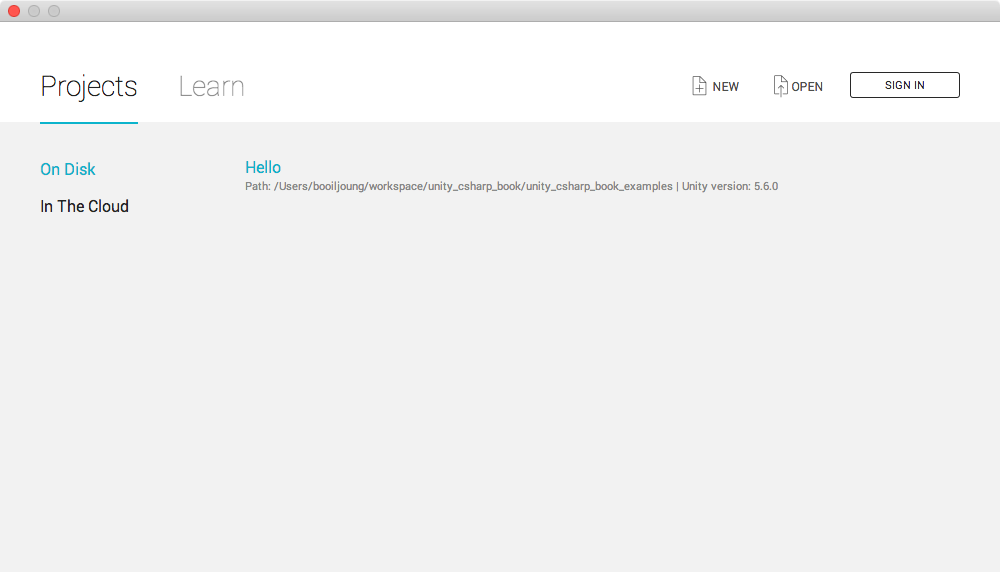

시작 창에서 ‘Learn’ 페이지가 선택 되어 있다면 ‘Projects‘ 페이지를 활성화 합니다. 이 시작 창은 Unity 버전에 따라 모양새가 다를 수 있습니다. ‘Projects‘ 페이지의 중간에 하늘색의 ‘New Project‘ 버튼이 있습니다. 새 프로젝트를 시작하기 위해 ‘New Project’ 버튼을 클릭합니다.

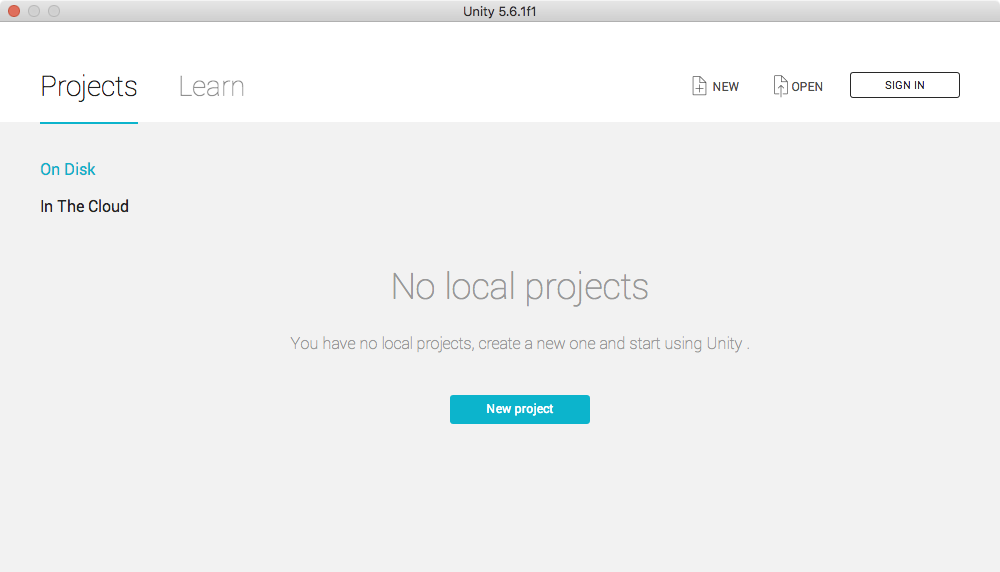

‘Project name’에 ‘Hello’를 입력하고 아래의 하늘색 ‘Create project’ 버튼을 클릭하면 새 'Hello' 프로젝트가  생성됩니다.

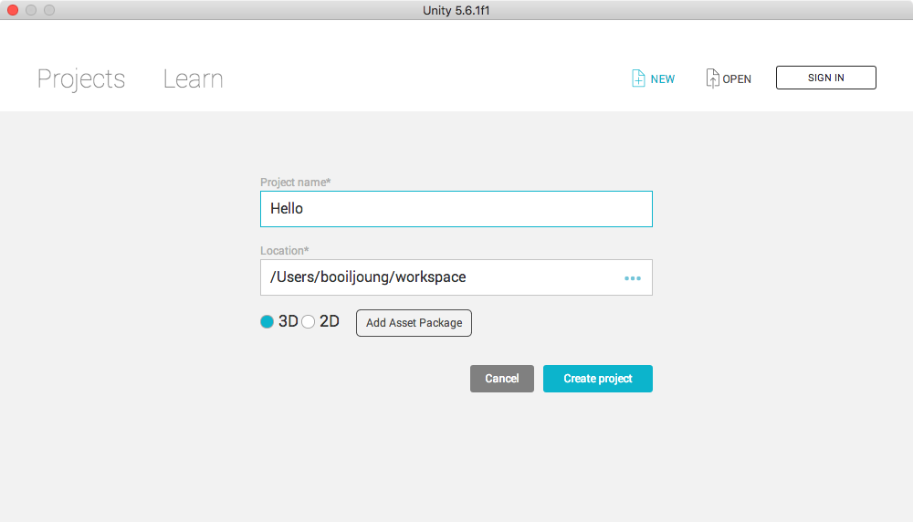

새 프로젝트가 생성되려면 컴퓨터의 성능에 따라 몇초 걸릴 수 있습니다. Unity Editor가 실행되었습니까? Unity가 실행되면 아래와 같이 창을 볼 수 있습니다. 이 앱은 Unity Editor 입니다.

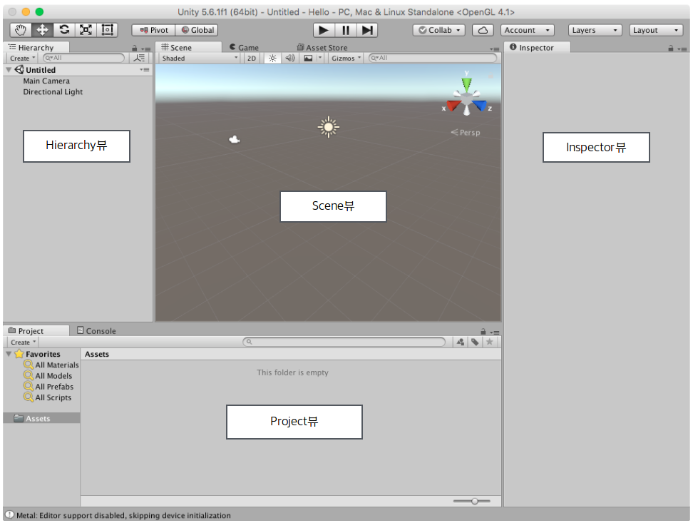

Unity Editor가 처음 시작되면 몇개의 뷰를 활성화하여 보여줍니다. 뷰들은 좌측부터 시계방향으로

- Hierarchy뷰
- Scene뷰 (Game뷰, AssetStore뷰)
- Inspector뷰
- Project뷰 (Console뷰)

입니다. 이 뷰들에 대해 간략히 설명 하겠습니다.

## Toolbar

상단에 Toolbar가 있습니다.

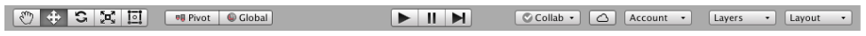

Toolbar는 기본적인 작업을 제공합니다. 학습단계에 따라 Toolbar의 메뉴들을 소개할 것입니다.

## Scene뷰

Unity Editor 의 중앙에 Scene뷰가 있습니다.

Scene뷰는 씬의 정보를 3D 혹은 2D로 렌더링하여 표시 합니다. 이 Hello 프로젝트가 시작되고 Untitled라는 씬이 디폴트로 만들어 집니다. 새로 생성된 씬에는 카메라와 조명이 준비되고 아이콘이 표시됩니다. Scene뷰의 우측상단에는 Scene Gizmo가 방위를 표시하고 있습니다. Unity는 3차원을 지원하므로 x, y, z 방향을 표시하고 있습니다. 아래는 Unity가 제공하는 Tank 예제의 Scene뷰입니다. 씬의 실시간 렌더링을 통해 지형과 바위, 나무 등이 배치 되어 있는 것을 볼 수 있습니다. 이 Tank 예제는 이 절의 설명을 위한 것으로 지금 열어 볼 필요가 없습니다. 계속 읽어 주시기 바랍니다.

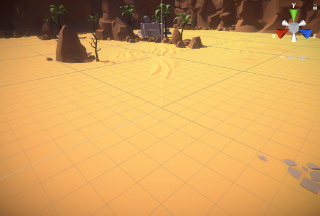

## 씬과 GameObject, 컴포넌트

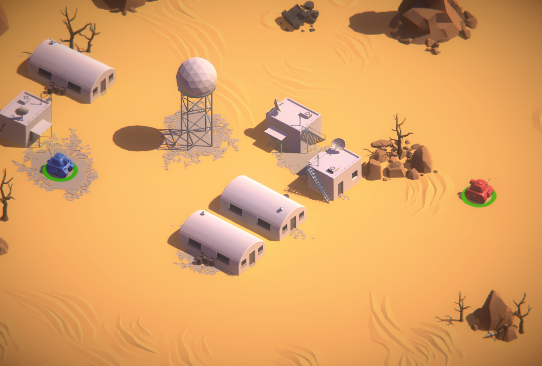

Unity가 제공하는 Tank 예제의 스크린샷입니다. 사막에 5개의 건물들, 돔형 레이더, 몇그루의 나무, 바위들 그리고 빨간 탱크와 파란 탱크가 있습니다.

게임의 씬에는 물체들이 배치되고 동작합니다. 건물이나 바위, 나무는 움직이지 않습니다. 두 대의 탱크는 움직이고 포탄을 쏩니다. 이 씬에 보이는 물체들은 부품들로 조립되어 있습니다. 마치 조립식 장난감처럼 구성되죠. 이 부품들을 ‘컴포넌트 (component)라고 합니다.

컴포넌트들은 어떤 컨테이너(container)들에 담겨집니다. 그 컨테이너를 GameObject라고 합니다. 

GameObject는 다른 GameObject와 종속적인 관계를 가질 수도 있고 독립적일 수도 있습니다. 컴포넌트들도 단독으로 사용되지 않습니다. 개발자의 의도에 따라 다른 컴포넌트나 애셋과 조립되어야 합니다.

새 프로젝트를 시작하면 ‘Untitled’라는 이름의 디폴트 씬이 만들어 집니다. 디폴트 씬은 두개의 GameObject를 가지고 있습니다. 이 GameObject 들은 이름을 가집니다. 하나는 ‘Main Camera’이고 다른 하나는 ‘Directional Light’ 입니다. 디폴트 씬의 구성을 다이어그램으로 표현하면 아래와 같습니다.

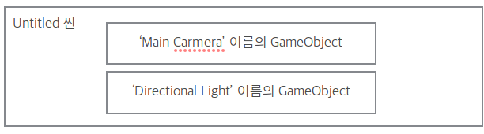

컴포넌트는 Unity 엔진이나 서드파트에서 제공하고, 직접 만들 수도 있습니다. 이 책은 이 컴포넌트를 만드는 길을 안내합니다.

씬, 컴포넌트, GameObject의 관계를 정리해 보겠습니다.

- 씬은 GameObject들을 담는다.
- GameObject는 서로 독립적이거나 종속적인 관계를 가진다.
- GameObject는 컴포넌트를 담는 컨테이너다.
- 컴포넌트는 애셋이나 다른 컴포넌트, GameObject와 조직화 된다.
- 프로그래밍을 통해 컴포넌트를 만들 수 있다.

*컨테이너란 ‘담을 수 있는 용기(그릇)’를 의미 합니다.*

## Hierarchy뷰

Unity Editor의 좌측에 Hierarchy뷰가 있습니다. Scene뷰가 씬의 정보를 렌더리하여 보여 주었다면, Hierarchy뷰는 씬을 종속관계로 보여 줍니다. 새 프로젝트를 시작하면 만들어지는 디폴트 씬의 Hierarchy뷰는 아래와 같습니다.

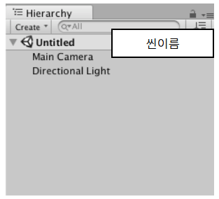

디폴트 씬의 이름은 “Untitled” 입니다. Unity 아이콘과 함께 “Unititled” 씬 이름이 보이죠? 그리고, 디폴트 씬은 ‘Main Camera‘와 ‘Directional Light‘ 라는 2개의 GameObject를 가지고 있습니다.

씬을 구성하면 많은 GameObject와 컴포넌트들이 생성됩니다. 아래는 Tank 예제의 Hierarchy와 Game뷰를 보여주고 있습니다. 좌측 Hierarchy에 GameObject 목록이 있고, Game뷰에 렌더링 가능한 GameObject들을 보여주고 있습니다.

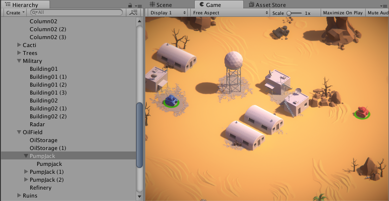

Hierachy뷰에 ‘Pumpplack’라는 GameObject가 있습니다. 바로 아래에 ‘Pumpjack’이라는 GameObject가 보입니다. ‘Pumpjack’은 ‘Pumpplack’에 종속 되어 있음을 확인할 수 있죠?

모든 GameObject들이 시각적인것은 아닙니다. GameObject 단지 컨테이너일 뿐입니다. GameObject가 시각적이 되려면 시각적 컴포넌트를 가지고 있어야 합니다. 시각적이지 않은 GameObject 들은 Hierarchy에서 찾고 변경할 수 있습니다. 자세한 내용은 학습 단계에 따라 설명합니다.

## Project뷰와 애셋

Unity Editor 아래에는 Project뷰가 있습니다. Project뷰는 애셋(Asset)을 표시하고 관리합니다.

애셋은 그림 이미지, 3D 모델, 오디오 파일, 스크립트 소스 같은 파일들 입니다. 아래는 새로 만든 ‘Hello’ 프로젝트의 애셋들을 보여주고 있습니다. 처음 시작하면 ‘Assets‘ 폴더를 하나만 가지고 있습니다.

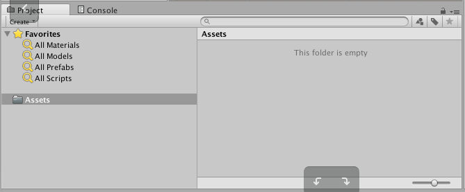

다음 그림은 Tank 예제의 Project뷰를 보여주고 있습니다. 많은 애셋들이 들어 있죠?

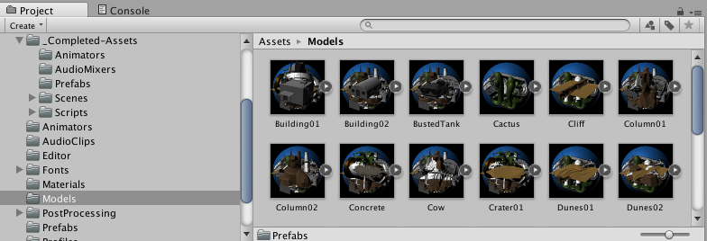

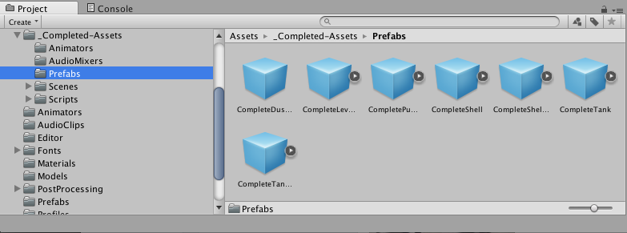

## Inspector뷰

Unity Editor 우측에 Inspector뷰가 있습니다. 처음 시작하면 다음 그림처럼 Inspector뷰에는 아무것도 표시되지 않습니다.

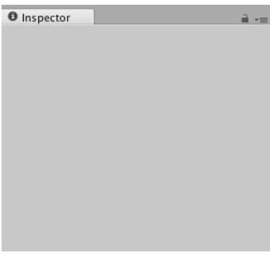

Inspector 뷰는 GameObject들이나 애셋의 프로퍼티들을 표시하고 변경할 수 있게 합니다. 프로퍼티들을 표시하는 방법은 다양합니다.

- Scene뷰에서 GameObject를 선택하면 프로퍼티들을 표시합니다.
- Hierarchy뷰에서 GameObject를 선택하면 프로퍼티들을 표시합니다.
- Project뷰에서 애셋을 선택하면 프로퍼티들을 표시합니다.

확인을 위해 Hierarch뷰에서 ‘Main Camera’을 클릭하여 선택합니다. Inspector뷰에 ‘Main Camera’의 프로퍼티들을 표시하고 있습니다.

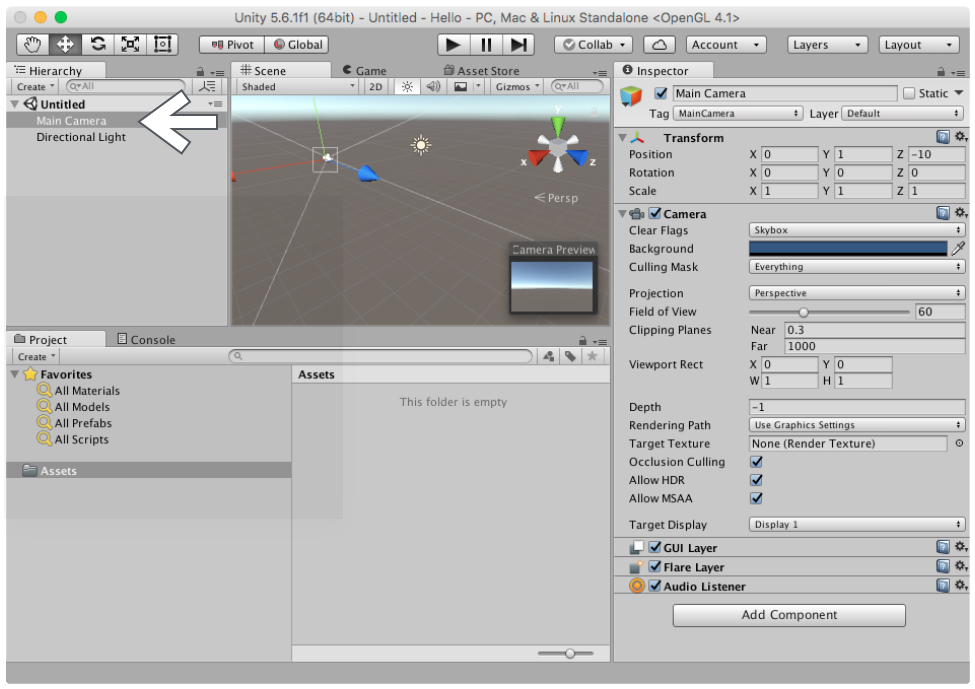

Inspector뷰를 자세히 볼까요?

- Transform
- Camera
- GUI Layer
- Flare Layer
- Audio Listener

이렇게 ‘Main Camera’는 5개의 컴포넌트를 가지고 있고 프로퍼티들을 표시하고 있습니다.

## 디폴트 씬

새 프로젝트를 시작하면 디폴트 씬이 만들어 지죠? 디폴트 씬은 ‘Main Camera’와 ‘Directional Light’라는 두개의 GameObject를 가지고 있었죠? ‘Main Camera’는 5개의 컴포넌트, ‘Directional Light’ 2개의 컴포넌트를 가지고 있습니다. 다이어그램으로 볼까요? 새 프로젝트를 시작하면 이 디폴트 씬이 구성됩니다.

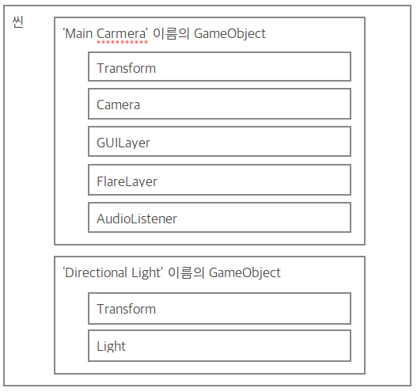

이 디폴트 씬을 시작으로 GameObject와 컴포넌트를 추가하며 씬을 구성해 나가게 됩니다.

## 저장된 프로젝트 불러오기

이 예제를 위해 생성한 ‘Hello’ 프로젝트는 ‘Hello’ 폴더에 있습니다. Unity의 프로젝트는 폴더 구조 입니다. 작업을 하다가 다른 용무로 Unity 프로젝트를 저장하거나 불러 올 필요가 있습니다. Unity Editor가 실행중이라면 프로젝트를 ‘메인 메뉴 / Open Project’에서 불러 올 수 있습니다.

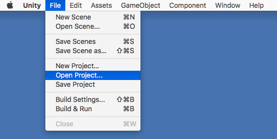

Unity Editor가 실행중이 아니라면 Unity Editor 시작 창의 우측 위의 ‘Open’ 버튼을 클릭하여 불러 올 수 있습니다.

‘Assets’, ‘Library’, ‘Project Settings’이 포함된 폴더를 열면 프로젝트를 불러 올 수 있습니다.

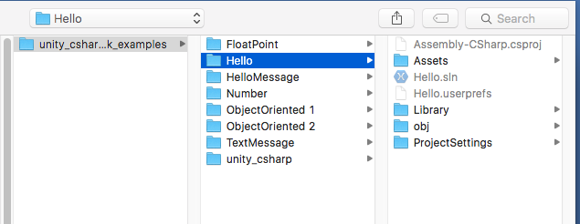

이 섹션에서

- 새 프로젝트를 시작하는 방법
- 씬과 GameObject, 컴포넌트
- Unity Editor 뷰의 명칭과 간단한 역할
- 기존 프로젝트를 Unity Editor에 로드하는 방법

을 확인 하였습니다.

