[Up](../index.md)

# 던전과 인사하기

우리는 유니티의 던전을 탐험할 계획입니다. 먼저, 던전과 인사를 하며 첫 유니티 프로그램을 경험해보도록 하겠습니다.

우리가 만들 Unity 스크립트의 실행은 조히비의 마법처럼 빠릅니다. 조히비가 화염구를 쏜다면 우리의 눈은 화염구를 움직임을 따라가지 못합니다. 괴물을 소환하는 명령을 입력 했는데 소환이 안되는 경우도 있죠. 클라이언트 프로그램이 서버로 소환 메시지를 보낸건지, 서버가 소환 메시지를 놓친건지… 알 수 없는 문제들이 발생합니다. 화염구를 앞으로 쏘았는데 화염구가 뒤로 나가는 경우도 있습니다. 게이머들은 그런 걸 버그라고 하고, 버그를 해결해야 하는 개발자들은 괴롭습니다. 화염구가 뒤로 나가는 원인을 찾아야 버그를 고칠 수 있는데, 화염구를 움직이는 프로그램은 초당 30프레임 만큼 빨라 우리의 눈은 화염구의 상태가 어떻게 변하는지 알 수 없습니다. 그래서 화염구의 기록을 남기면 화염구가 날아가는 상황을 알 수 있습니다. 화염구의 속도, 방향, 무게 여러 정보들을 표시하여 화염구 프로그램이 가진 버그를 발견 할 수 있을 것입니다.

우선, 우리는 이 섹션에서 첫 프로그래밍을 하여 Unity에 ‘Hello, Dungeon’ 메시지를 표시할 것입니다. 메시지는 Console뷰에 표시됩니다. Unity Editor를 처음 시작하면 Console뷰는 기본적으로 Project뷰 뒤에 가려져 있습니다. 뒤에 숨은 Console뷰의 탭을 클릭하면 아래 그림처럼 활성화 됩니다. *아래 그림은 아무것도 표시하지 않고 있지만 Unity 버전이나 운영체제 차이로 특정 표시가 있을 수도 있음을 염두합니다.*

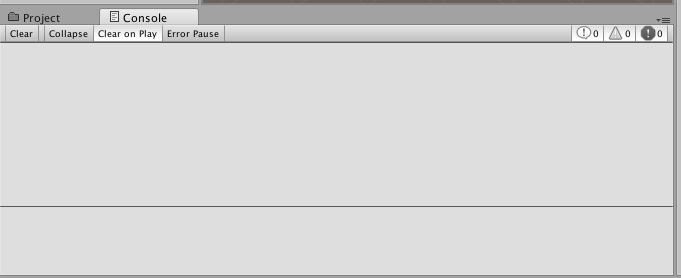

첫 프로그램, ‘Hello, Dungeon’을 시작합니다. 

---

#### 프로그래밍과 스크립팅:

프로그래밍과 스크립팅에 대해 알아볼까요? 스크립팅을 설명하려면 프로그래밍을 설명할 수 있어야 하고, 프로그래밍을 설명하려면, 알고리즘을 설명해야 합니다. 먼저 알고리즘에 대해 보겠습니다. 알고리즘의 예를 들어 보죠.

조히비는 입구와 출구가 있는 불빛도 없는 던전을 통과해야 합니다. 조히비는 견습 마법사라 아직 매직 랜턴을 밝히는 마법을 모릅니다. 던전의 지도도 가지고 있지 않습니다. 어두운 던전을 어떻게 빠져 나가야 할까요? 여러가지 방법이 있지만 가장 간단하고 쉬운 우수법이나 좌수법 알고리즘을 보겠습니다. 자신의 오른쪽에 벽을 두고 벽을 따라 계속 걸으면 언젠가 출구에 도달할 수 있습니다. 만일 출구가 없다면 다시 입구로 되돌아 오죠.


던전 그림을 보고 우측 손으로 벽을 짚으며 간다고 상상해보세요. 우측 벽 하나만 따라가도 출구에 도착할 수 있습니다. 아무것도 보이지 않은 미로 같은 던전이라 할지라도 한쪽 벽만 짚고 따라가면 다른 출구로 나가거나 출구가 없다면 다시 되돌아 올 수 있습니다. 단순하게 오른 손으로 벽을 짚고 따라 가면 됩니다. 앞이 막히면 벽을 따라 왼쪽으로 돌고, 벽이 끊기면 오른쪽으로 벽을 따라 돌면 꺽인 벽이 있고 그 벽을 계속 따라가면 됩니다. 단순하게 규칙을 반복하면 됩니다.

오른손으로 벽을 짚고 따라가는 경우 우수법이라고 하고, 왼손으로 벽을 짚고 따라가는 경우 좌수법이라고 합니다. 감이 오시죠? 알고리즘은 우수법이나 좌수법처럼 동작들의 집합이라고 할 수 있습니다. 조건에 따라 어떤 동작을 해야할지 명확하고, 언젠가 그 문제를 끝낼 수 있으면 **알고리즘**이라고 할 수 있습니다.

알고리즘을 컴퓨터에서 실행 될 수 있도록 구현하면 **프로그램**입니다. 하나의 프로그램은 1개 이상의 알고리즘으로 구현되어 있습니다. **프로그래밍**이란 프로그램을 만드는 과정입니다. 컴퓨터는 프로그램을 통해 알고리즘을 수행합니다.

그럼 요즘 코딩 교육이라며 유행하는 **코딩**이라는  단어는 무엇일까요? 100년전 처음 컴퓨터가 등장하던 시절에는 알고리즘을 연구하는 사람, 알고리즘을 프로그램으로 쓰는 사람, 프로그램을 코드로 옮기는 사람, 코드를 컴퓨터에 입력하여 실행하는 사람이 각기 달랐습니다. 알고리즘을 연구하는 사람은 많은 훈련을 받아야 했고, 프로그램을 하는 사람은 적은 훈련으로도 할 수 있었고요. 코딩은 더 적은 훈련으로도 할 수 있었고, 실행은 더 적은 훈련으로도 가능했습니다. 훈련에는 많은 비용이 들어가기 때문에 역할들을 두었습니다. 당시에는 알고리즘을 표현하는 언어가 따로 있었고, 프로그램을 표현하는 언어가 따로 있었습니다. 초기에 코딩은 컴퓨터의 배선을 바꾸는 것이었고, 중간시대의 코딩은 기계어로 바꾸는 것이었고, 근래에는 프로그래밍 언어로 바꾸는 것입니다. 그런데 기술이 발전하며 코딩을 따로 할 필요가 없게 되었습니다. 고급 프로그래밍 언어와 키보드, CRT가 프로그래밍과 코딩이 하나로 통합해 버렸습니다. 심지어 보편적을 알려진 알고리즘은 따로 쓰지 않고 알고리즘, 프로그램, 코드를 한번에 작성하기도 합니다. 지금은 프로그래밍과 코딩이 거의 같은 의미로 사용되고 있습니다. (지금도 여전히 새롭고 유용한 알고리즘들이 공학자나 과학자들에 의해 연구되고 있습니다.)

컴퓨터 프로그램은 시스템 프로그램, 응용 프로그램, 임베디드 프로그램 처럼 의미의 범위가 넓습니다. 프로그램은 운영체제의 일부일 수도 있고, 제품의 일부일 수도 있으며, 스마티폰 앱일 수도 있죠. **스크립트**도 프로그램의 일종입니다. 스크립트는 컴퓨터의 특정 환경에서 제한적으로 사용되고 특정한 절차 없이 즉시 사용할 수 있습니다. 우리는 Unity라는 환경을 사용하고 Unity에 사용되는 프로그램을 만들 것입니다. Unity에서 프로그램이 만들어지고  즉시 Unity에서 실행하고 시험 해볼 수 있습니다. 그래서 Unity 환경에서 실행하는 것을 목표로 만들었으므로, 유니티에서 돌아가는 프로그램 소스 코드를 **스크립트**라고 합니다. 스크립트를 만드는 과정이 **스크립팅**입니다.

---

## C# 스크립트 생성

Unity에서 스크립트를 작성할 수 있는 언어는 여러가지가 있었습니다. 자바스크립트(JavaScript)를 변형한 UnityScript, 파이썬(Python)을 변형한 BooScript, 그리고 C# Script가 있었습니다. Unity는 UnityScript와 BooScirpt를 제외 하였고, 현재 C# 스크립트만을 지원하고 있습니다.

C#이라는 프로그래밍 언어는 마이크로소프트에서 개발한 프로그래밍 언어로 자바(Java)와 비슷한 문법을 가지고 있습니다. C#은 기본적으로 닷넷이라는 플랫폼 위에서 구동됩니다. 닷넷 플랫폼은 다양한 운영체제에서 구동 할 수 있으며, 따라서 Unity로 만든 프로그램도 다양한 환경에서 구동할 수 있습니다.

Unity에서 C# 스크립트를 작성하려면 C# 스크립트 애셋 파일을 생성해야 합니다. C# 스크립트 애셋 파일을 생성할 수 있는 방법은 많지만 이 학습단계에서는 Project뷰를 통해 생성하겠습니다. Project뷰를 볼까요?

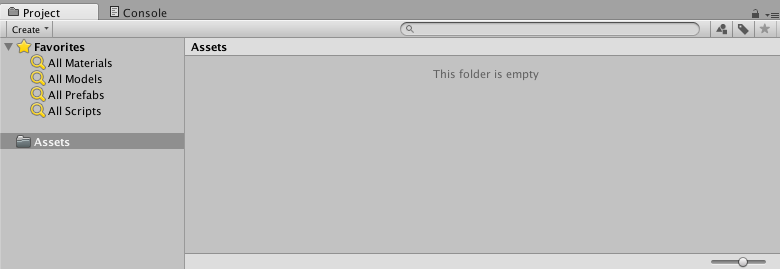

새 프로젝트에는 어떠한 애셋 파일도 없습니다. 좌측에 폴더 패널이 있고, 우측에 Assets 패널로 나뉘어 있죠.

새 C# 스크립트 파일을 생성하려면, 우측의 Assets 패널에서 마우스 오른쪽 버튼을 눌러 팝업 메뉴를 표시합니다. 팝업 메뉴에서 ‘Create / C# Script‘를 선택하면 새 C# 스크립트 파일이 생성됩니다.

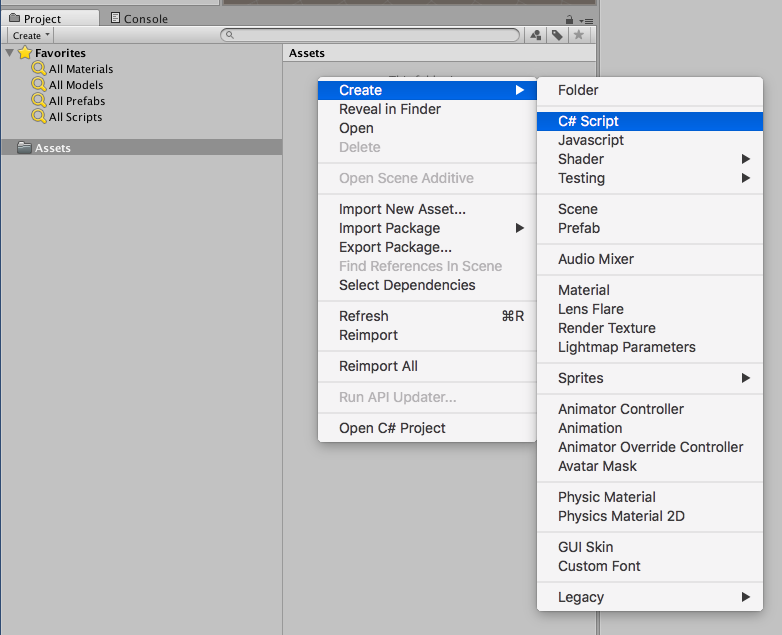

새 C# 스크립트 애셋 파일은 기본적으로  ’NewBehaviourScript‘으로 이름이 주어지고, 이름 편집 상태로 생성 됩니다.

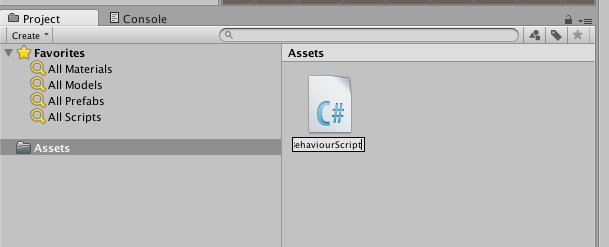

우리는 Unity가 기본적으로 정해주는 ‘NewBehaviourScript’라는 이름을 사용하지 않습니다. 우리가 만드는 C# 스크립트 파일은 명확한 목적이 있고 그 목적에 맞는 이름을 지정하면 이해하기 쉽기 때문입니다. “Hello, World”라는 메시지를 표시할 계획이므로 ‘MyHello’라는 이름을 주겠습니다. 애셋 이름을 편집하여 ‘MyHello’로 변경합니다. 중요합니다. **애셋 파일 이름은 대소문자를 구분해야 합니다!!!**

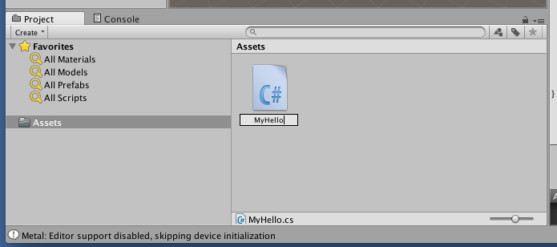

애셋의 이름을 변경하여 지정하고 키보드의 엔터를 누르면 이름이 확정 됩니다. 이 일련의 작업은 한 스텝에 진행해야 합니다. 중간에 다른 창을 선택하거나 중단하면 원하지 않는 이름이 소스 코드에 삽입되어 오류가 발생할 위험이 있습니다. 제대로 이름이 입력 되었는지 다음 단계에서 확인 할 것입니다!!! **오류가 발생하지 않도록 한 스텝에 만들어야 합니다!**

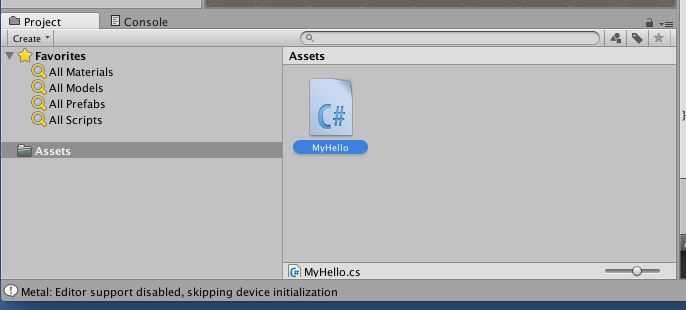

## 운영체제 브라우저에서 애셋 파일 확인

C# 파일의 확장자는 ‘cs’지만 Project뷰는 확장자를 표시하지 않습니다. 실제 드라이브의 어느 폴더에 위치하는지도 아직 모릅니다. 드라이브의 어느 위치에 있는지 알아야 백업이나 복사를 할 수 있겠죠. 운영체제의 파일 브라우저상에서 애셋 파일의 위치와 주의점을 확인해 보겠습니다.

Unity Editor에서 애셋의 실제 파일을 찾아가 보겠습니다. 먼저, Project뷰에서 ‘MyHello’ 애셋 파일을 선택하세요. 애셋 파일에 마우스 포인터를 두고 마우스 오른쪽 버튼을 클릭하면 팝업 메뉴가 표시됩니다.

#### macos 사용자

macos 사용자는 아래 그림처럼 ‘Reveal in Finder’ 메뉴를 볼 수 있습니다. 마우스로 이 메뉴를 선택합니다.

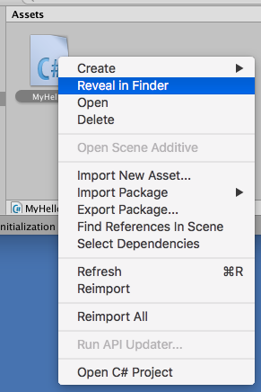

macos 사용자는 아래처럼 Finder에서 ‘MyHello.cs’, ‘MyHello.cs.meta’파일을 발견 할 수 있을 것입니다.

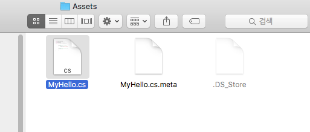

macos의 설정에 따라 확장자가 보이지 않을 수도 있습니다. macos는 기본적으로 확장자를 표시하지 않습니다. 프로그래머들은 실수를 줄이기 위해 확장자를 표시하게 합니다. Finder 메인메뉴의 ‘Finder / 환경설정’을 선택하고 고급 탭에서 확장자 보기를 선택할 수 있습니다. macos에서 ’.DS_Store’ 파일은 운영체제에서 생성한 파일로 Unity와 관계 없습니다.

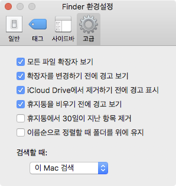

#### 윈도우 사용자

윈도우 사용자는 Project뷰의 팝업 메뉴에서 ‘Reveal in Explorer’ 메뉴를 볼 수 있습니다.

---

파일 브라우저에서 ‘MyHello.cs’ 파일을 확인 하셨죠? 이 파일이 Project뷰에서 생성한 C# 스크립트 애셋 파일입니다.

’MyHello.cs.meta’ 파일은 메타파일입니다. 메타파일은 애셋 파일을 설정하기 위해 Unity Editor가 생성하고 관리합니다. 메타파일에는 애셋 파일의 식별번호나 옵션들이 들어 있습니다. 애셋 파일이 삭제되면 Unity Editor가 메타파일을 삭제하므로 별도로 삭제할 필요가 없습니다. **직접 메타파일을 삭제하면 프로젝트가 손상 될 수 있습니다.**

---

**애셋 파일 관리와 주의사항:**

Unity Editor가 아닌 파일 브라우저에서 애셋 파일을 삭제하거나 이름을 변경하면 프로젝트가 손상될 위험이 있습니다. 메타파일에는 식별번호가 부여되어 있고, 이 식별번호를 통해 다른 애셋들이 참조합니다. 애셋 파일이나 메타 파일을 직접 삭제하면 프로젝트의 파일들이 손상되고 복구하기 어렵습니다. 그리고 복구에는 많은 노력이 들어가게 됩니다. 손상이 심한 경우 프로젝트 복구를 포기해야 할 수도 있습니다. **애셋 파일은 반드시 Unity Editor에서 이름을 변경하거나 삭제해야 합니다.**

---

Project뷰에서 애셋 파일을 삭제하려면, 먼저 애셋 파일을 선택하고, 마우스 오른쪽 버튼을 클릭하여 표시되는 팝업 메뉴를 선택하여 삭제할 수 있습니다. (지금 삭제하자는게 아닙니다. 삭제 방법만 알려 드렸습니다.)

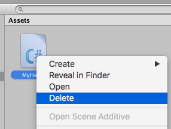

Project뷰에서 애셋 파일 이름을 변경하려면 애셋 파일을 선택하고 키보드의 엔터를 누르면 이름을 변경할 수 있습니다.  (지금 이름을 변경하자는게 아닙니다. 변경 방법만 알려 드렸습니다.)

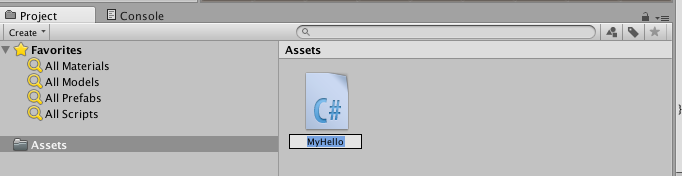

### Inspector뷰에서 애셋 정보 보기

이전 섹션에서 GameObject를 선택하면 Inspector뷰에 컴포넌트와 프로퍼티들을 표시했었죠. Project뷰에서 애셋 파일을 선택하면 Inspector뷰에 애셋 파일들의 정보를 표시합니다.

다음 그림 처럼 ‘MyHello.cs’ 애셋 파일을 선택 하세요.

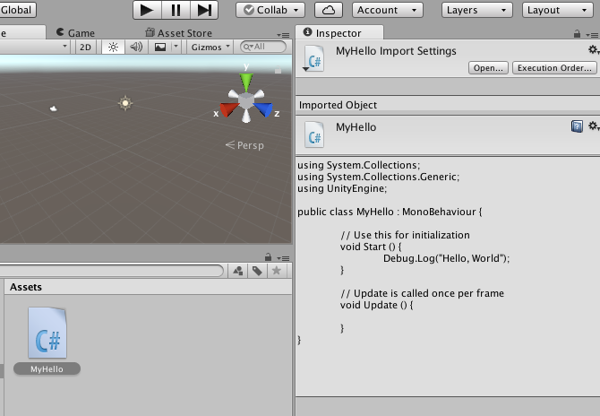

Project뷰에서 ‘MyHello.cs’ 애셋 파일을 선택하니 우측의 Inspector뷰에 ‘MyHello.cs’의 소스 코드가 표시되었죠?

## MonoDevelop에서 C# 스크립트 편집

이제 프로그램에 첫 마법을 불어 넣을 스크립팅을 시작 하겠습니다. Project뷰에서 ‘MyHello.cs‘를 선택하고 마우스 오른쪽 버튼을 클릭하세요. 팝업 메뉴가 표시됩니다.

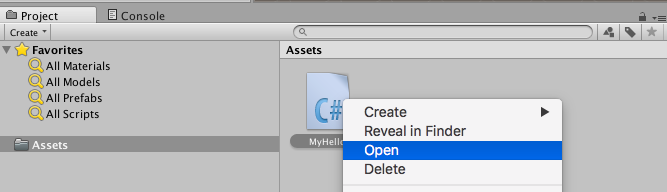

팝업 메뉴에서‘Open‘을 선택하면 ‘MonoDevlop’가 시작되고 소스 코드를 편집 할 수 있습니다.

작업 컴픂터의 성능에 따라 MonoDevelop이 올라오는데 몇초가 걸릴 수 있습니다. ‘MyHello.cs‘를 마우스 왼쪽 버튼으로 더블 클릭해도 ‘MonoDevelop‘에서 소스 코드를 편집할 수 있습니다.

MonoDevelop 우리의 화면에 올라오면 아래처럼 ‘MyHello.cs’를 편집할 수 있도록 준비가 될 것입닌다.

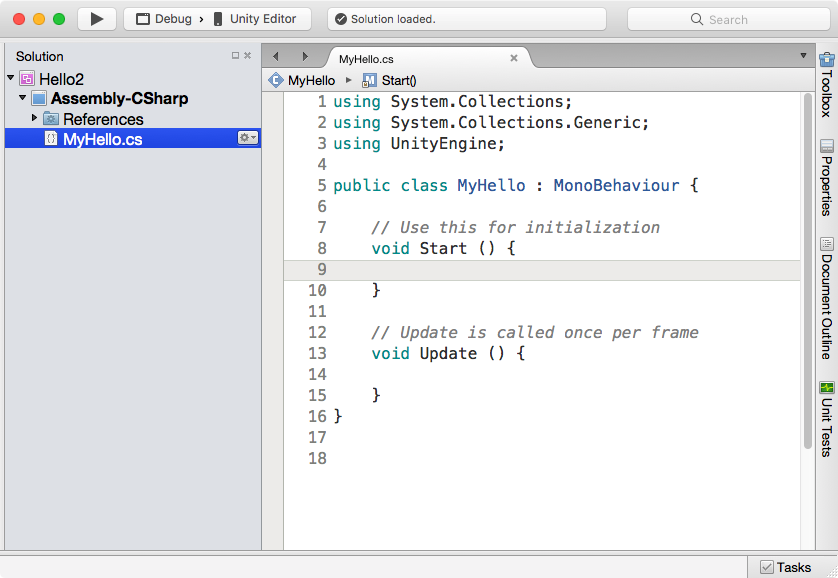

## Unity 컴포넌트 구문

우리의 첫 컴포넌트를 만들 것입니다. Unity가 기본 컴포넌트 구문을 만들어 줍니다. 이 소스 코드를 읽어서 알아 보도록 하겠습니다.

---

**코드를 읽고 상상이나 종이로 실행해야 합니다:**

처음 몇개 예제는 코드 하나씩 설명해 드릴 것입니다. 그런데, 프로그래밍에 익숙해지려면 코드를 읽고 상상으로 실행하는 훈련을 해야 합니다. 상상으로 코드를 읽는 능력은 매우 중요합니다. 알고리즘이 복잡하면 종이에 그려서라도 상상으로 실행해야 합니다.

---

```C#
01	using System.Collections;
02	using System.Collections.Generic;
03	using UnityEngine;
04
05	public class MyHello : MonoBehaviour {
06    
07	    // Use this for initialization
08		void Start () {
09
10		}
11
12		// Update is called once per frame
13		void Update () {
14        
15		}
16	}
```

‘MyHello.cs’ 의 5번째 라인을 확인해보겠습니다.

```c#
05	public class MyHello : MonoBehaviour {
```

5번째 라인의 3번째 단어가 ‘MyHello’를 보겠습니다. ‘MyHello’는 C# 스크립트 애셋 파일의 이름이고 동시에 컴포넌트 이름입니다.

`MyHello`가 맞습니까? 다시 주의할 점을 말씀 드립니다. 대문자와 소문자를 구별해야 합니다. `Myhello`이거나 `mYhEllo`라면 제대로 되지 않습니다. C# 스크립트 애셋 파일을 생성할때 (다른 창이 선택되거나 중단되어) ‘한 방’에 완료하지 못하면 `MyHello`가 아닐 수도 있습니다. C# 스트립트 애셋 파일 생성중에 방해를 받아 중단되면 `NewBehaviourScript`일 수도 있습니다. Project뷰의 ‘MyHello.cs’ 애셋 파일 이름과 이 C# 스크립트 내의 `MyHello` 이름은 반드시 일치해야 합니다. 이 이름이 다르면 Unity Editor가 컴포넌트를 찾을 수 없으며 컴포넌트가 제대로 작동하지 않게 됩니다. (중요합니다!)


만일 `MyHello`가 아니라면 Project뷰에서 `MyHello.cs`를 삭제하고 다시 생성을 반복해야 합니다. (C# 애셋 파일에서 잘못된 이름을 수정하는 방법도 있지만 이 단계에서는 하지 않습니다.)

## 씬에 GameObject와 컴포넌트 추가

MyHello 컴포넌트가 만들어 졌습니다. 새 컴포넌트를 씬에 적용되어야 동작합니다.

이 섹션에서 ‘MyGameObject’라는 이름의 GameObject를 씬에 추가하고 이 GameObject에 MyHello 컴포넌트를 추가할 계획입니다. 이 작업이 완료되면 씬은 아래 그림처럼 구성 될것입니다.

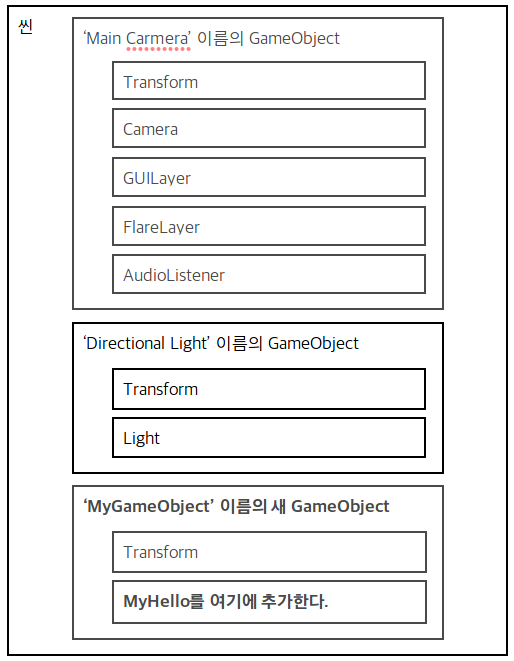

먼저 Hierarchy뷰에서 GameObject를 생성하겠습니다. 이름은 ‘MyGameObject’로 하겠습니다. 마우스 오른쪽 버튼을 클릭하면 팝업 메뉴가 표시될 것입니다.

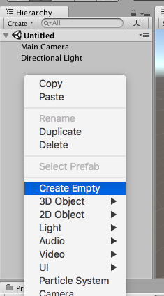

팝업 메뉴에서 ‘Create Empty’를 클릭하여 새 GameObject를 생성합니다.

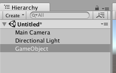

씬에 새 GameObject가 추가 되었고 디폴트 이름은 ‘GameObject’ 입니다. 이름은 목적을 정확하게 구분해주어야 한다고 했죠? 그래서 새 GameObject의 이름을 ‘MyGameObject’로 하겠습니다.

macos 사용자는 키보드의 엔터를 쳐서 이름을 편집 모드로 바꿀 수 있습니다. 윈도우 사용자는 F2를 눌러서 변경합니다.

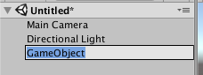

GameObject가 이름 편집 모드로 바뀌면 ‘MyGameObject‘라는 이름으로 변경하고 키보드의 엔터를 칩니다.

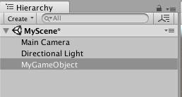

‘MyGameObject‘로 이름이 변경 되었었습니다.

Hierarchy 뷰에서 ‘MyGameObject‘를 선택하고 Inspector뷰에서 컴포넌트와 프로퍼티를 확인해 볼까요?

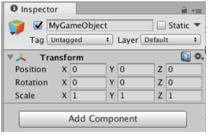

Inspector뷰의 가장 위에 ‘MyGameObject’가 보이죠? 아래에 Tag가 있습니다. 그 아래에 ‘Transform’ 컴포넌트 하나가 있습니다. 현재 씬의 상태는 아래와 같습니다.

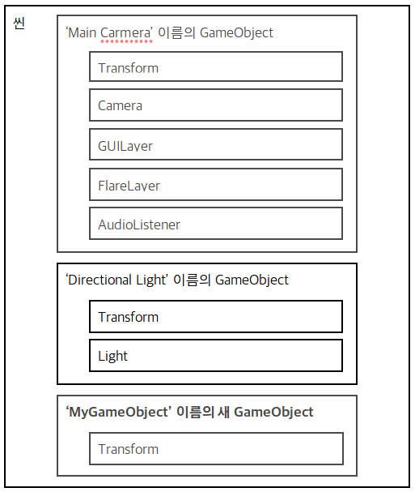

‘MyHello’ 컴포넌트를 MyGameObject에 붙여 보죠.  Inspector뷰에서 ‘Add Component’ 버튼을 클릭합니다.

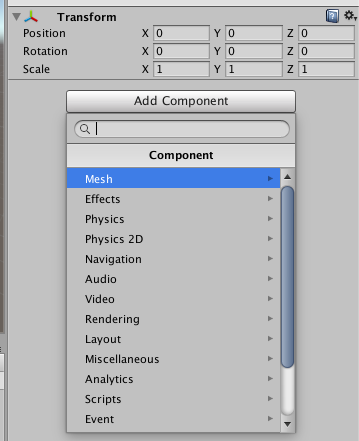

‘Add Component’ 아래에 컴포넌트를 선택할 수 있는 팝업 메뉴가 표시 되죠? 팝업 메뉴 위에 검색창이 있고 아래에 컴포넌트들의 목록이 표시됩니다. 이 프로젝트에서 사용할 수 있는 컴포넌트들의 목록입니다. 검색 창에 ‘MyHello’를 타이핑하여 우리가 만든 컴포넌트를 검색합니다.

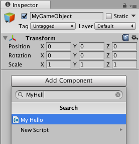

’MyHell’ 쯤 입력하면 컴포넌트 목록에서 ’MyHello’를 발견할 수 있습니다.  ’MyHello’를 선택하여 키보드의 엔터를 치면, ‘MyGameObject’ 에 ‘MyHello’가 추가 됩니다. 컴포넌트 목록에서 ‘MyHello’를 마우스로 더블 클릭해도 추가할 수 있습니다.

아래는 ‘MyHello’ 컴포넌트가 추가된 MyGameObject의 inspector뷰입니다.

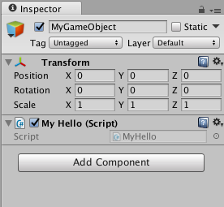

만일, 컴포넌트 목록에서 ‘MyHello’를 발견할 수 없다면 ‘MyHello.cs’ 스크립트 애셋 생성을 한 스텝에 해내지 못했기 때문일 가능성이 높습니다. 컴포넌트가 보이지 않는다면 ‘MyHello.cs’를 삭제하고 다시 반복 해보시죠.

## 씬을 저장하기

우리는 씬에 'MyGameObject' 추가하였고, 'MyGameObject'에 'MyHello' 컴포넌트를 추가하여 씬의 구성을 변경하였습니다. 씬의  구성을 변경되면, 씬의 보존을 위해 저장할 필요가 있습니다.

씬을 저장하기 위해 Unity Editor의 ‘메인메뉴 / File‘ 에서 ‘Save‘ 메뉴를 선택할 수 있습니다. 단축키로 저장할 경우 macos 사용자는 키보드에서 Command+S를, Windows 사용자는 Control+S를 사용해도 저장할 수 있습니다.

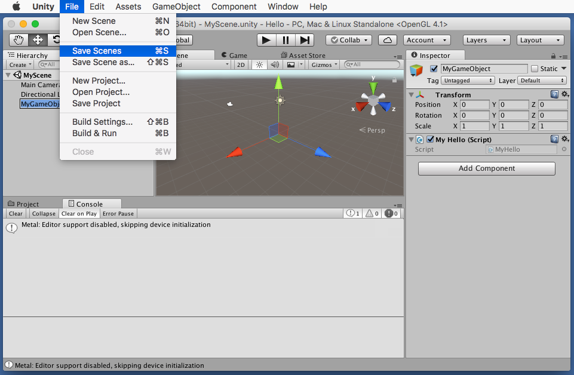

Hello 프로젝트의 폴더 구조는 아래와 같습니다.

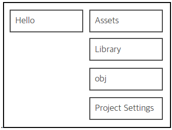

Project뷰는 Assets 폴더 아래의 파일만 표시합니다. 씬 파일도 Assets 폴더 아래에 저장해야 합니다. 이 프로젝트에서는 Assets 폴더에 저장하도록 하겠습니다.

우리는 씬에 ‘MyScene’이라는 이름을 줄것입니다. ’Save Scene’ 창이 나타나면 이름을 주고, 아래의 ‘Save’ 버튼을 클릭합니다.

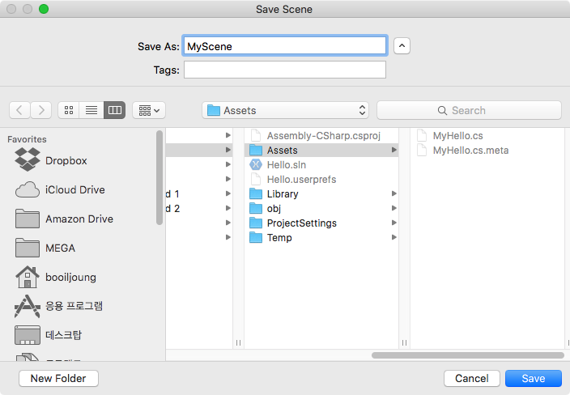

씬이 제대로 저장되면 Project뷰에 표시됩니다. 다음 그림 처럼 Assets 폴더 아래에 Unity 아이콘을 가진 ‘MyScene’ 씬 파일이 있습니까?

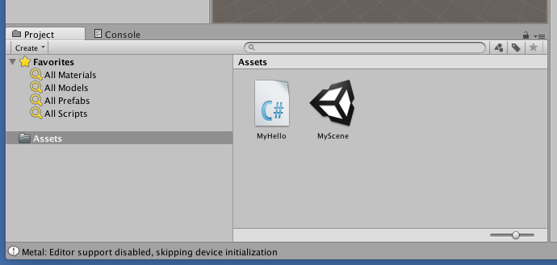

우리는 'Hello' 프로젝트를 만들었고, 이 프로젝트에 'MyHello' 컴포넌트 스크립트를 작성하였으며, 씬에 'MyGameObject'라는 게임오브젝트를 추가하였고, 이 게임오브젝트에 'MyHello'컴포넌트를 추가하였고, 변경된 씬을 저장하였습니다. 최소한으로 실행해 볼 수 있는 씬과 프로젝트를 구성 하였습니다.

그래서 이제 실행해 볼까요?

## 씬을 실행하기

Toolbar의 플레이 버튼을 클릭하여 씬을 실행합니다. 실행하지 않은 플레이 버튼은 아래와 같습니다.  (다음 줄에 주의사항이 있습니다. 주의사항까지 읽으세요.)


플레이 버튼을 누르면 음각되고 파란색으로 표시되어 실행중이라는 상태를 나타냅니다.


<주의!!!> 아래 그림처럼 MonoDevelop에서 플레이 버튼이 아닙니다. 처음에 혼란스럽습니다. Unity Editor의 플레이 버튼을 눌러야 합니다.

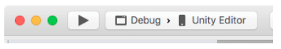

실행을 하면 Game뷰가 활성화 됩니다. Game뷰에 파란 하늘과 회색 땅이 렌더링 되죠?

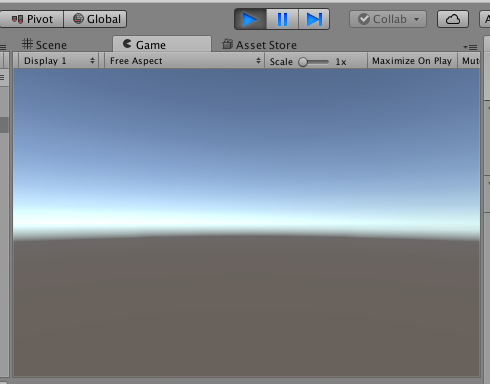

어떤 메시지가 표시되는지 Console 뷰를 확인해 보죠. 아무것도 표시되지 않았습니다.


왜 아무런 메시지도 표시 되지 않은걸까요? 우리는 ‘MyHello’ 컴포넌트를 만들었을 뿐 어떠한 코드도 추가하지 않았기 때문입니다. 다시 Toolbar의 플레이 버튼을 클릭하여 실행을 중단합니다. 플레이 버튼을 한번 누르면 실행되고 다시 플레이 버튼을 누르면 실행이 중단됩니다. 실행을 중단하면 아래처럼 되죠.


다음 단계에서 Console뷰를 출력하는 메시지를 작성하도록 합니다.

---

**주의:**

Unity의 씬이 실행중일때 코드를 수정할 수 있지만 Unity가 크래시 되는 경우들이 있습니다. 코드를 수정할때 실행을 중단하는 것이 좋습니다.

## Console뷰와 로그 메시지 표시

‘MyHello.cs’를 편집하여“Hello, World”라는 메시지를 표시하도록 하겠습니다.

다시 MonoDevelop을 선택하여 ‘MyHello.cs’를 봅니다.  MonoDevelop이 실행중이 아니라면 이 책의 이전 섹션을 참고하여 Project뷰에서 ‘Hello.cs’ 애셋 파일을 편집 할 수 있습니다.

‘MyHello.cs’ 파일의 가장 위 3개의 라인을 보겠습니다.

```c#
01	using System.Collections;
02	using System.Collections.Generic;
03	using UnityEngine;
```

첫 3개 라인은 `using` 이라는 단어로 시작합니다. 이후의 단어들은 각각 다르죠. 이 구문은 `using` 지시문입니다. 이 학습 단계에서는 새 C# 스크립트 애셋 파일이 생성되면 3개의 `using` 지시문이 자동으로 삽입된다는 정도만 알아 두겠습니다.

8번째 라인은

```c#
08	void Start () {
09
10	}
```

`void Start () { 중괄호 }` 로 둘러싸인 빈 라인이 있습니다. 아래 코드를 따라 `void Start () { 와 }` 사이에 아래 코드를

```c#
08	void Start () {
09		Debug.Log("Hello, Dungeon")
10	}
```

추가 합니다. C#은 대문자와 소문자를 구분합니다. 대소문자를 정확히 구분하여 입력 해야 합니다. 오타에 주의해야 합니다. 공백은 스페이스바를 누르면 됩니다. 추가할 코드는 굵게 표시 하였습니다.

MonoDevelop에서 코드를 타이핑하면 자동완성 기능을 보죠. `Debug`를 입력하면 아래처럼 `Debug`에 대한 정보가 표시됩니다.

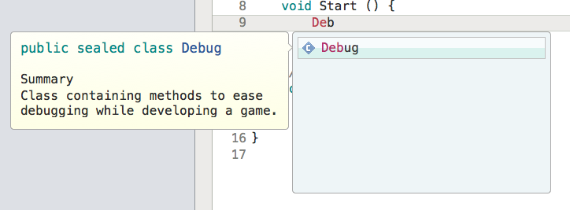

`Debug.`까지 입력하면 `Debug`에 소속된 멤버들이 표시됩니다. (멤버들에 대한 설명은 나중에 다루겠습니다.). 계속하여 `Debug.L`까지 입력하면 `L`로 시작하는 멤버들이 표시됩니다. 계속 입력합니다.


다음에 `Debug.Log(` 괄호까지 입력하면 괄호 안에 삽입해야 할 인수(argument)들이 표시됩니다. (인수들에 대한 설명은 나중에 다룹니다.)

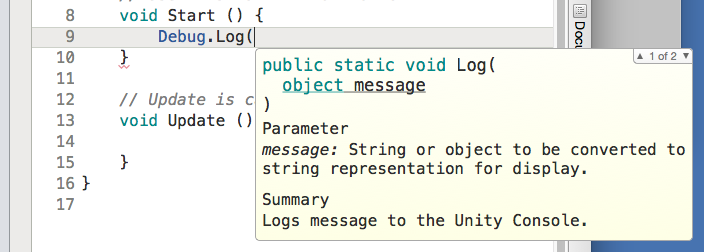

계속 입력하여 완성합니다. 완성하면 아래 그림과 같습니다.

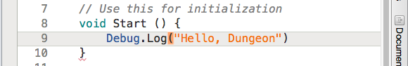

완성된 ‘Hello.cs’의 최종 코드는 아래와 같습니다. 대소문자를 구분하여 정확히 타이핑 했는지 비교하여 확인합니다.

```C#
01	using System.Collections;
02	using System.Collections.Generic;
03	using UnityEngine;
04
05	public class MyHello : MonoBehaviour {
06    
07		// Use this for initialization
08		void Start () {
09			Debug.Log("Hello, Dungeon")
10		}
11
12		// Update is called once per frame
13		void Update () {
14
15		}
16	}
```

**주의! 새로 추가한 코드에 일부러 오류를 넣어 두었습니다. 오류 때문에 실행되지 않으니 계속 읽습니다.**

새로 입력한 부분을 크게 확대하여 보겠습니다.


정확히 타이핑 하였으면 메인 메뉴의 ‘File / Save’를 선택하여 저장합니다.

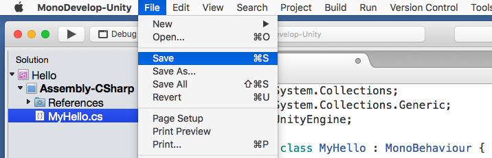

MonoDevelop에서 소스 코드 저장 단축키는 macos에서 Command+S, 윈도우에서 Control+S 입니다.

---

**주의:**

기본적으로 MonoDevelop에서 단축키 사용시 문자 입력기(IME)가 ’한국어’ 모드이면 단축기가 입력되지 않습니다. ‘영어’ 모드로 저장해야 해야 단축기가 동작 합니다.

---

MonoDevelop에서 변경한 소스코드가 제대로 동작해야 변경 사항이 Unity에서 적용 됩니다. MonoDevelop에서 소스코드의 탭 우측에 있는 닫기 버튼을 보면 저장 상태를 확인할 수 있습니다.

아래는 파일이 변경되고 저장되지 않은 상태를 나타냅니다. 

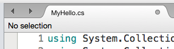

다음은 파일이 변경되지 않았거나 저장되지 않은 상태를 나타냅니다.

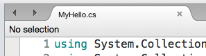

## 소스코드 오류와 해결

스크립트의 소스코드를 수정하여 저장하였으면 아래 그림처럼 Unity Editor에서 플레이 버튼을 눌러 실행합니다.


 Unity Editor에서 실행 버튼을 누르면…

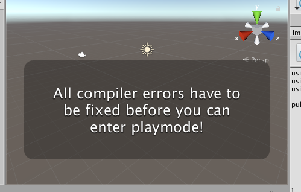

어? 위 그림처럼 Game뷰에 "All compiler errors have to be fixed before you can enter playmode!” 에러 메시지를 표시하고 실행이 되지 않습니다! 왜 안될까요? 필자가 일부러 오류를 넣었기 때문이죠! 오류를 경험하고 해결할 방법을 경험을 드리기 위해서입니다. 이 Game뷰에 오버레이로 표시된 오류메시지를 번역하여 확인해 볼까요? “플레이 모드에 들어가려면 모든 컴파일러 오류를 고쳐야 합니다”라는 메시지입니다.

---

**“컴파일러 오류”라니? 컴파일러가 뭡니까?**

예제 "Hello" 프로그램 소스코드는 우리가 아는 단어들이 사용 되었습니다. `using`이나 `MyClass`, `Start`, `Debug`, `Log` 처럼 우리가 일상으로 사용하는 단어들입니다. 그런데, 컴퓨터는 직접 인간의 언어를 이해하고 실행하지 못합니다. 컴퓨터가 알아보는 언어는 숫자입니다. 예를 들면…

- 명령이 1이면: 더해라
- 명령이 2이면: 빼라
- 명령이 3이면: 곱해라
- 명령이 4이면: 옮겨라

등 입니다.

이렇게 컴퓨터가 이해하는 언어를 기계어(machine language)라고 합니다.  컴퓨터가 알아 듣는 명령어로 소스 코드를 만들면

​	120		134		254		134		30		181		30

​	204		194		24		105		1		87		15

이런 프로그램들이 만들어지죠. 암호 같죠? 어떤 명령이고 어떤 지시하는지 이해하기 어렵습니다.

그리고 기계어로 프로그래밍을 하게되면

​	‘빼기가 2였던가? 아니 3인가?’

기억하기도 어렵고 실수도 잦게 되죠.

더군다나 기종마다 명령어 체계가 다르다는 문제가 있습니다.

- A기종 컴퓨터는 코드가 1이면 더하라는 명령이고,
- X기종 컴퓨터는 코드가 100이면 더하라고, 1이면 비교하라는 명령으로 기종간에 다릅니다.

그래서 A기종에서 사용하던 프로그램을 X기종에서 사용하면 오작동을 합니다. 오동작을 하지 않으려면 B기종용 소스코드를 다시 만들어야 합니다. 애써 만든 A기종용 소스코드가 버려지고 새로 만들어야 하는 상황이 발생합니다. 성능이 좋은 신기종 컴퓨터가 나와도 소스코드를 다시 만들어야 하기때문에 새 기종에 적용하는 것은 엄두도 내지 못하게 됩니다.

인간이 이해할 수 있는 언어로 소스코드를 만들면 인간이 이해하기 쉽고 이기종간에 이식하기도 쉽습니다. 이렇게 인간이 이해 할 수 있는 프로그래밍 언어를 고급언어라고 합니다. 우리가 사용하는 C#도 고급언어입니다.

인간은 고급언어를 쉽게 이해하지만, 컴퓨터는 고급 언어를 이해하고 실행하지 못합니다. 그래서 컴파일러의 역할이 필요합니다. 컴파일러는 고급 언어로 만들어진 소스코드를 기계가 이해할 수 있는 기계어로 번역합니다. 컴파일러는 일종의 번역기죠. Unity는 C# 컴파일러를 내장하고 있습니다. C# 컴파일러가 C# 소스코드를 기계어로 번역해 줍니다. 다이어그램으로 표현하면 아래와 같습니다.

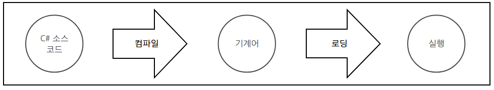

(정확히 C# 컴파일러가 C# 소스 코드를 IL로 변환하고, Mono CLR의 JIT 컴파일러가 기계어로 변환하여 실행 합니다만, 이 섹션에서는 여기까지만 확인해도 던전을 탐험 할 수 있습니다. 더 많은 경험치를 모으고 나중에 자세히 파악해도 됩니다.)

---

Unity에 내장된 C# 컴파일러가 우리가 만든 소스코드에서 오류를 감지 했습니다. 대체 어떤 오류일까요? Unity Editor는 오류가 발생한 위치와 이유를 알려 줍니다. 창의 가장 아래에 있는 Statusbar를 보죠.

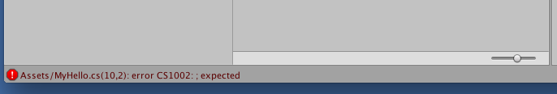

붉은 색으로

```
01	Assets/MyHello.cs(10, 2): error C51002: ; expected
```

라는 메시지가 표시되어 있습니다.

Statusbar에 붉은색으로 오류 메시지는 Console뷰에서 자세한 내용을 확인할 수 있습니다. Console뷰의 탭을 눌러서 확인해 볼까요?

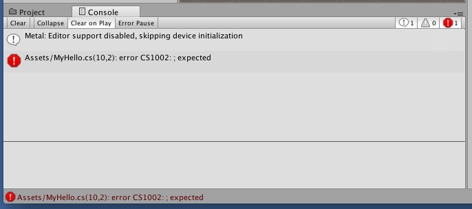

붉은색 오류 메시지가 보이죠? 이 오류 메시지를 마우스로 더블클릭하면 오류가 발생한 소스코드 위치로 이동 시켜 줍니다. 자, 오류 메시지를 더블 크릭해보세요! 아래처럼 MonoDevelop으로 이동할 것입니다.

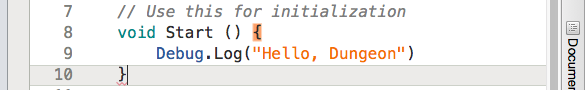

오류 위치를 볼까요? 입력 캐럿이 ‘MyHello.cs’의 10번째 라인을 가리키고 있습니다. 그런데, 10번째 라인은 중괄호 하나 뿐입니다. 중괄호에 오류가 있는 걸까요? 다시 오류 메시지를 확인해 보죠.

```
01	“Assets/MyHello.cs(10, 2): error C51002: ; expected
```

이 오류 메시지를 번역하면 ‘Assets/MyHello.cs (10번째 라인 2번 컬럼) 세미콜론이 있어야 한다’ 또는 ‘Assets/MyHello.cs (10번째 라인 2번 컬럼) ; 이 예상되다’라는 의미입니다. 세미콜론이 있어야 한다는 메시지 입니다. 중괄호는 영역의 끝을 나타낼 뿐인데요.  소스코드에서 중괄호가 문제인지 확인해 볼까요?

```C#
01	using System.Collections;
02	using System.Collections.Generic;
03	using UnityEngine;
04
05	public class MyHello : MonoBehaviour {	// 중괄호 1 시작
06    
07		// Use this for initialization
08		void Start () {						// 중괄호 1-1 시작
09			Debug.Log("Hello, World")
10		}									// 중괄호 1-1 끝
11
12		// Update is called once per frame
13		void Update () {					// 중괄호 1-2 시작
14
15		}									// 중괄호 1-2 끝
16	}										// 중괄호 1 끝
```

시작 중괄호는 3개, 종료 중괄호도 3개 짝이 맞습니다. 중괄호 2쌍은 중괄호1 안에 있죠. 도대체 대체 무엇이 문제일까요? 사실 문제는 우리가 추가한 9번째 라인에 있습니다.

```C#
09			Debug.Log("Hello, World”)
```

9번째 라인이 세미콜론 `;`으로 끝나야 하는데 세미콜론이 빠졌습니다.

---

**C#의 중요한 규칙!**

C#의 문은 세미콜론으로 마쳐야 합니다!!!

---

세미콜론이 발견되지 않고 코드 블럭의 끝을 지정하는 중괄호 `}`가 나오니 “세미콜론을 빠뜨린게 아니냐?”는 오류가 발생한것입니다.

**C# 소스코드에서 구문(syntax)을 지키지 않으면 오류 메시지를 표시하고 씬을 실행하지 않습니다.**

## 컴파일러 오류의 수정


‘MyHello.cs’의 최종 코드는 아래와 같습니다.

```c#
01	using System.Collections;
02	using System.Collections.Generic;
03	using UnityEngine;
04
05	public class MyHello : MonoBehaviour {
06 
07		// Use this for initialization
08		void Start () {
09			Debug.Log("Hello, Dungeon");
10		}
11          
12		// Update is called once per frame
13		void Update () {
14
15		}
16	}
```

대소문자가 일치하는지, 오타가 없는지, 공백 문자를 빠뜨렸는지, 소스코드 전체를 비교해 보세요. 완벽하게 수정하였으면 소스 코드를 저장 합니다. 저장 방법은 Command+S 또는 Control+S였죠? 소스 코드를 저장하였으면  다시 Unity Editor의 Console뷰에서 에러 메시지를 확인해 보죠.


정확히 오류를 수정하였으면 Console뷰에서 오류 메시지가 사라집니다. Unity Editor의 플레이 버튼을 클릭하여 실행해 볼까요?  작업 컴퓨터가 느리다면 몇초 걸릴 수도 있습니다.


Game뷰에는 여전히 푸른 하늘과 회색 땅만 보일 것입니다. Console뷰를 확인해 보면

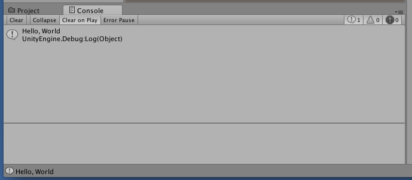

“Hello, Dungeon”라는 메시지가 표시되었습니다.

소스코드에 오류가 있으면 컴파일과 실행이 되지 않기 때문에 이 예제를 통해 일부러 틀린 코드를 작성하게 하여 오류를 발생시키고 바로 잡도록 하였습니다. 소스 코드에 오타를 넣거나 대소문자를 바꾸거나 언어 스펙에 벗어나는 코드를 작성하는 실수는 자주 발생 합니다. Unity Editor는 Scene뷰,  Statusbar,  Console뷰에 에러를 표시하여 오류를 발견할 수 있도록 돕습니다.

오류는 아래와 같은 방법으로 해결합니다.

- 오류 메시지를 면밀히 읽고 검토 합니다.
- 오류 메시지는 에러가 발생한 소스코드와 위치를 표시합니다. 오류가 발생한 소스 코드의 위치를 확인합니다.
- 오류 발생 위치의 라인부터 시작하여 윗 라인이나 중괄호의 범위를 넓혀가며 오류를 찾습니다.
- 해결 안되면 인터넷 검색엔진에서 ‘Unity + 오류 메시지’를 키워드로 넣어 검색하여 찾습니다.
- 해결 안되면 인터넷 검색 엔진에 ‘C# + 오류 코드’를 키워드로 검색하여 찾습니다.
- Unity 커뮤니티에 오류 메시지 질문을 올립니다. (답변을 얻기까지 시간이 많이 걸립니다.)

---

**컴파일러의 오류코드:**

다시 한번 오류 메시지를 볼까요?

```
01	Assets/MyHello.cs(10, 2): error C51002: ; expected
```

이 오류 메시지에 오류 코드가 있습니다. C51002 이죠.

이 오류 코드를 인터넷 검색 엔진에서 오류 코드를 검색해 보죠.

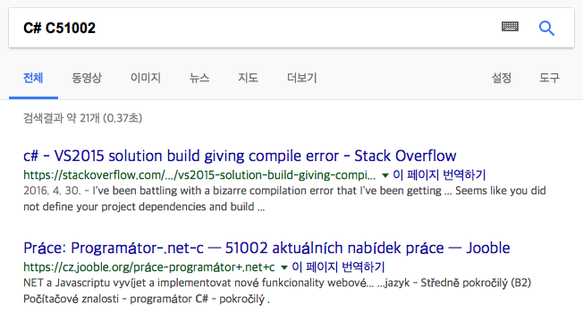

검색 결과를 볼까요? 첫번째 검색 결과가 [stackoverflow.com](stackoverflow.com)에 있죠?

---

**단어우월효과:**

아래 문장을 읽어 볼까요?

Aoccdrnig to a rseearch taem at Cmabrigde Uinervtisy, it deosn't mttaer in waht oredr the ltteers in a wrod are, the olny iprmoatnt tihng is taht the frist and lsat ltteer be in the rghit pclae. The rset can be a taotl mses and you can sitll raed it wouthit a porbelm. Tihs is bcuseae the huamn mnid deos not raed ervey lteter by istlef, but the wrod as a wlohe.

캠릿브지 대학의 연결구과에 따르면, 한 단어 안에서 글자가 어떤 순서로 배되열어 있는가 하것는은 중하요지 않고, 첫째번와 마지막 글자가 올바른 위치에 있것는이 중하요다고 한다. 나머지 글들자은 완전히 엉진창망의 순서로 되어 있지을라도 당신은 아무 문없제이 이것을 읽을 수 있다. 왜하냐면 인간의 두뇌는 모든 글자를 하나 하나 읽것는이 아니라 단어 하나를 전체로 인하식기 때이문다.

오타가 보니입까? 오타가 보이지 않으면 한자글씩 또박 또박 다시 한번 읽어 볼까요? 오타가 보이죠? 이 현상은 단어 우월 효과(word superiority effect)라고도 하고 오타불내증(Typoglycemia)라고도 합니다. 오타불내증(Typoglycemia)은 혈당감소증(Hypoglycemia)에서 가져온 용어로 생각 됩니다.

사람은 한 단어 내에서 가장 첫 문자와 마지막 문자가 일치하고 중간의 문자들이 뒤섞이더라도 인식을 하지 못한다고 합니다. 프로그래밍을 할때도 이로 인해 오타를 발견하지 못해 오류를 해결하지 못할 가능성이 있습니다. Unity Editor가 오타를 표시하고, MonoDevelop이 오타를 적색으로 표시하기도 합니다. 오류를 표시하면 오류 표시를 면밀히 살피고 원인을 찾아야 합니다.

이 연구는 1999년 그레이엄 롤린슨(Graham Rawlinson)이 뉴 사이언티스트(New Scientist) 학술지에 1976년 작성한 본인의 박사학위 논문을 언급하면서 보낸 편지의 일부라고 합니다. 그는 노팅엄 대학에서 박사 학위 논문을 단어 인식에 있어서 글자 위치의 중요성이라는 주제로 작성였하고 영어 기준으로 처음과 끝 2글자를 남기고 섞어도 이해가 가능하다고 언급했습니다. (마지막에 단락에 오타 보이나요?)

---

## C#의 주석 구문

```c#
01	using System.Collections;
02	using System.Collections.Generic;
03	using UnityEngine;
04
05	public class MyHello : MonoBehaviour {
06    
07		// Use this for initialization
08		void Start () {
09			Debug.Log("Hello, Dungeon”);
10		}
11          
12		// Update is called once per frame
13		void Update () {
14
15		}
16	}
```

7번째 라인을 볼까요? 

```c#
07		// Use this for initialization
```

소스 코드에 설명(주석)이 필요한 경우가 있습니다. 그렇다고 소스 코드에 직접 주석을 쓰면 오류가 발생합니다. 소스코드와 주석을 구분하고 컴파일러에게 ‘이것은 주석이다’를 알려줄 필요가 있으며 컴파일러는 주석을 기계어로 번역하지 않습니다. C#은 주석을 알리는 구문을 2가지 지원합니다. 하나는 한 라인을 주석으로 표시하고, 다른 하나는 여러 라인을 주석을 표시합니다.

한줄을 주석으로 표시하는 구문은 `//` 입니다. `//`부터 주석이 됩니다. `//` 이전은 주석이 아닙니다.

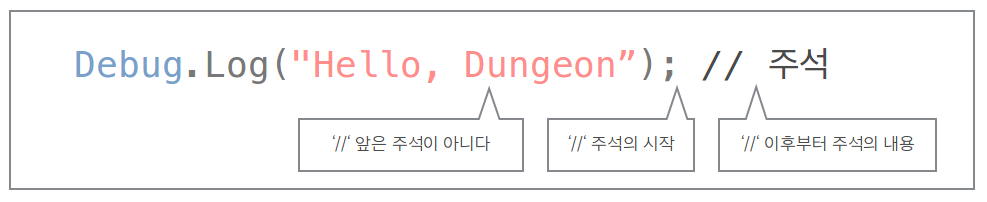

여러 라인을 주석으로 사용하기 위해서는 구간 주석 `/* … */`  사용합니다.

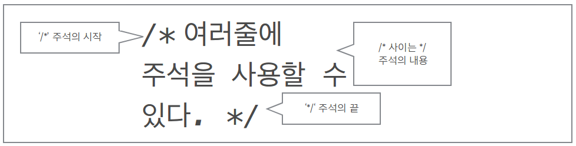

여러가지 주석의 예를 들어 볼까요?

```c#
	// 이곳부터 라인 주석입니다.
	//이곳도 주석입니다.				물론 이곳도 주석입니다. 라인이 끝나지 않았으니까요.
		/////// 여러개 있어도 라인 주석입니다.
			/// 세개 있어도 라인 주석입니다.
	앞은 주석이 아닙니다. // 이곳부터 라인 주석입니다.
//라인 주석입니다.			/// 주석 이후도 주석입니다.
	/* 구간 주석입니다. */
주석이 아닙니다. /* 구간 주석입니다.
	구간 주석이 끝날때까지 주석입니다.
			여전히 구간 주석입니다. */ 구간 주석이 아닙니다.
	주석이 아닙니다 /* 구간 주석이 입니다. */ 구간 주석이 아닙니다.
			주석이 아닙니다.
	  /*  구간 주석입니다.
주석입니다. *  구간 주석입니다.
	   */ 구간 주석이 아닙니다.
```

## 메서드

초등학교 산수 수업에서 아래와 같은

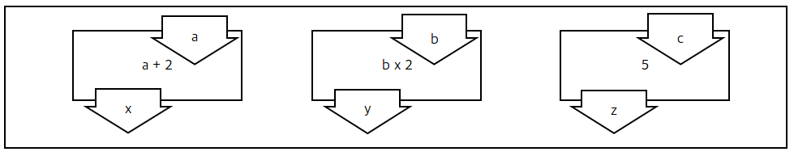

상자 문제들을 배웁니다. 위에 숫자를 넣으면 아래에 결과가 나옵니다. $a$에 5를 넣으면 $x$는 7이 나오고, $b$에 4를 넣으면 $y$는 8이 나오고, $c$에 3을 넣으면 $z$에 -2가 나옵니다.

상자 문제의 형태는 다양 할 수 있습니다. 아래처럼


입력이 여러개를 가질 수도 있습니다. 입력 5, 3, 1, 5를 주면
$$
(5 \times 3) + (1 \times 5)
$$
로 출력 $y$는 $20$입니다.

다음처럼


 입력이 없을 수도 있습니다. 이 상자 문제는 항상 $12$만을 내놓습니다.

저장된 값을 가져올 수도 있죠. 아래 상자 문제를 볼까요?

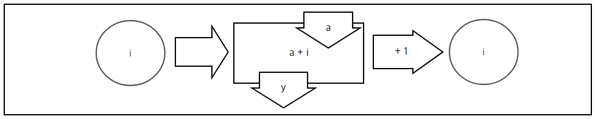

이 상자 문제는 별도로 저장된 값 $i$를 가져와서 입력 값 $a$와 더해서 $y$로 출력하고, $i$에 $1$을 더해서 다시 $i$에 저장합니다. $a$에 $1, 1, 1, 1, 1$을 연속으로 넣으면, $y$값이 $2, 3, 4, 5, 6 \dots$ 이 출력됩니다.

아래처럼

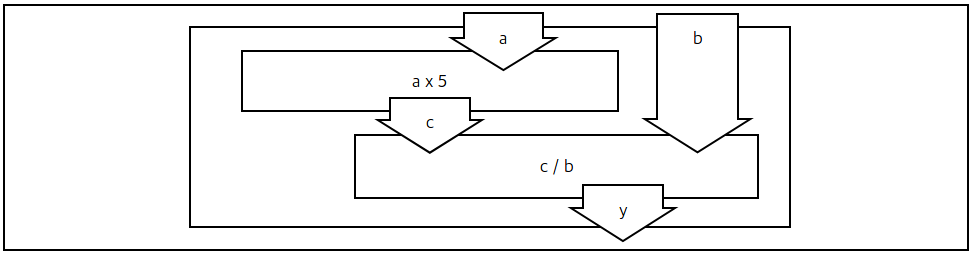

상자 문제는 재활용 될 수도 있고 상자 문제는 다른 상자 문제 안에서 사용될 수도 있습니다. 바깥 상자 문제 안에는 두개의 상자 문제가 들어 있습니다. $a$는 첫 상자에 넣어지고 $5$가 곱해져 아래 상자에 입력 됩니다. $b$는 아래 상자에 전달됩니다.

첫번째 문제 상자는
$$
c = a \times 5
$$
이고 $c$로 출력됩니다. 두번째 문제 상자가 첫번째의 출력 $c$를 받아서 $b$로 나누어 $y$로 출력합니다.

두번째 문제 상자가 첫번째의 출력 $c$를 받아서 $b$로 나누어 $y$로 출력합니다.
$$
y = c / b
$$
입니다. $c$를 $a x 5$로 치환하면 최종 결과는
$$
y = (a x 5) / b
$$
가 됩니다. 그래서 $a$에 $1$ 그리고 $b$에 $2$를 넣으면 $2.5$가 출력 됩니다.

프로그램 언어에도 상자 문제와 비슷한 개념이 있습니다. 프로그래밍 언어에서 이것을 함수(function)라고 합니다. 함수(函數)는 상자 숫자라는 뜻입니다. 프로그래밍 언어에 따라 서브루틴(subroutine), 루틴(routine), 프로시저(procedure)라고도 하죠. 우리가 배우는 C#은 메서드(method)라고 합니다.

우리가 작성한 메서드는

```c#
08		void Start () {
09			Debug.Log("Hello, Dungeon”);
10		}
```

입니다. 우리가 추가한 코드를 제외하고 보면

```c#
08		void Start () {
09
10		}
```

입니다. 그리고 ’MyClass.cs’에는

```c#
08		void Update () {
09
10		}
```

도 있습니다. `Start`, `Update`만 다르고 구문(syntax)는 동일합니다. 메서드의 기본 구문은

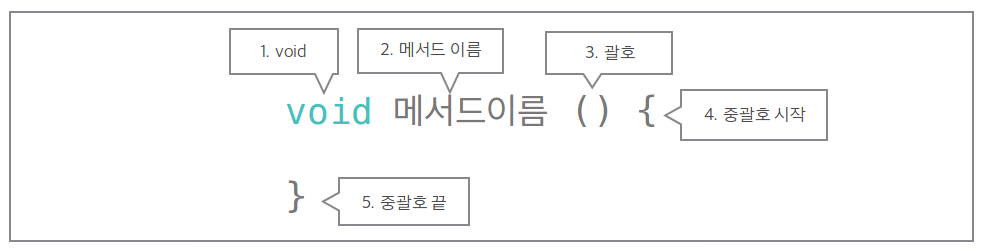

입니다.

1.  `void`가 있습니다. `Start` 메서드, `Update` 메서드 앞에 모두 `void`가 있습니다. `void` 뿐만 아니라 다양한 것을 둘 수 있는데 학습 단계에 따라 소개하겠습니다.
2. 메서드 이름이 있습니다. 메서드 이름으로 각각의 메서드를 구별할 수 있습니다. 이 소스코드에서 `Start`와 `Update`라는 이름을 주어 서로 구별하고 있습니다.
3.  비어 있는 괄호가 있습니다. C#의 메서드는 반드시 괄호를 가집니다. 이 괄호 안에는 메서드에 전달 될 내용을 표시하게 됩니다. 상자  문제에도 상자에 전달되는 값이 있었었습니다.
4.  중괄호가 시작하고, 몇줄 지나서 중괄호가 끝납니다.

우리가 추가한 코드를 보면

```c#
08		void Start () {
09			Debug.Log("Hello, Dungeon”);
10		}
```

우리는 이 중괄호 구간 안에 코드를 추가 했습니다. 이 중괄호 구간을 코드블록이라고 합니다. 컴퓨터는 명령어를 실행합니다. 이 명령어들은 프로그래밍 언어에서 문(statement)이나 식(expression)입니다. 문과 식은 이 코드블럭 안에 포함 됩니다.

이 프로젝트의 실행 결과는


입니다. `Debug.Log` 괄호안의 “Hello, World”가 Console뷰에 그대로 출력 되었습니다. 추가한 식을 자세히 살펴 보면

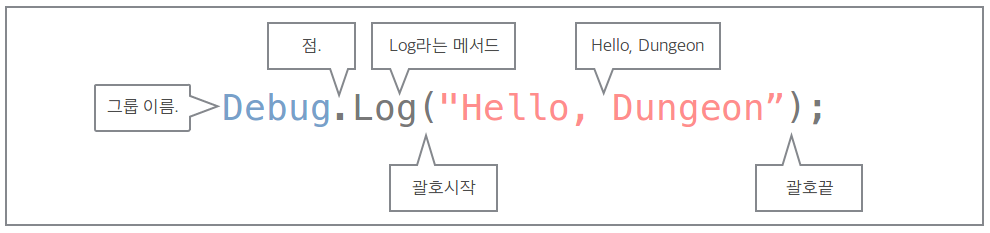

`Debug.Log`라는 다른 메서드를 호출합니다. `Debug.Log`라는 상자 문제를 사용 합니다.  `Start` 메서드를 상자 문제로 그려 보면


입니다. `Start` 상자 문제는 `Debug.Log` 상자 문제를 호출하며 “Hello, Dungeon”를 전달합니다. `Debug.Log`는 전달 받은 “Hello, Dungeon”를 Console뷰에 표시하는 역할을 합니다.

우리는 이 세상에 인사를 보낸 우리의 첫 프로젝트를 마쳤습니다. 이 Hello 프로젝트 파일들은 ‘Hello’ 폴더에 있습니다.이 섹션에서 던전의 생물들에게 인사를 하며 많은 경험치를 올렸습니다.

