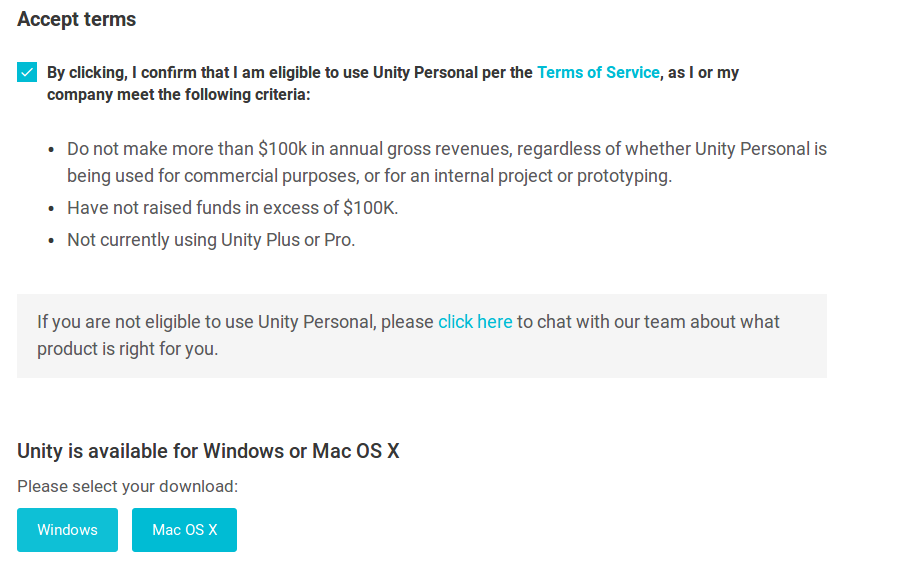
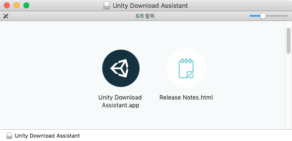
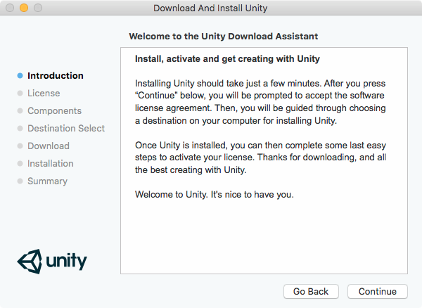
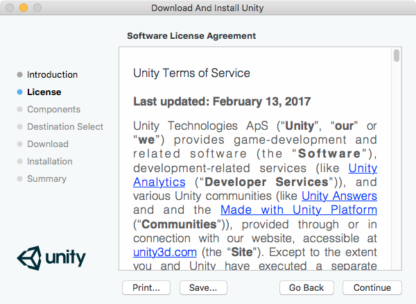
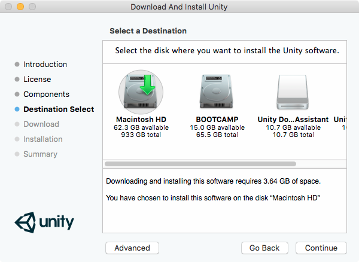
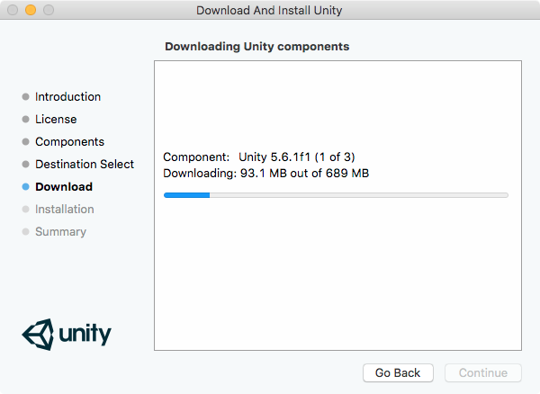
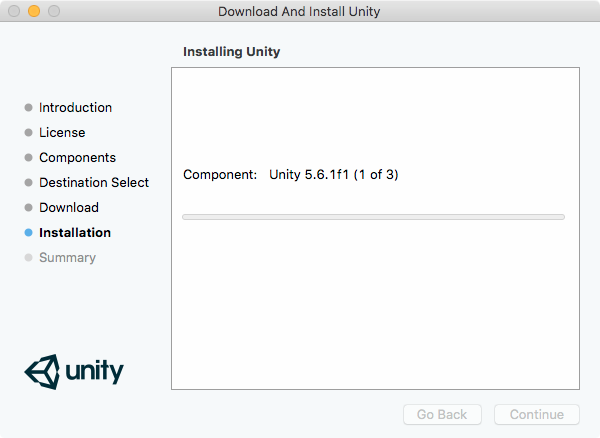
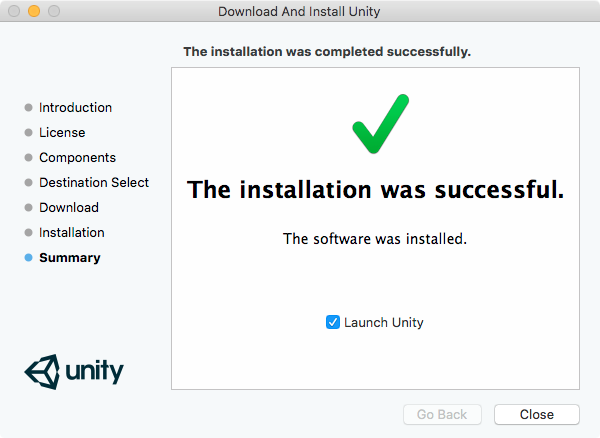
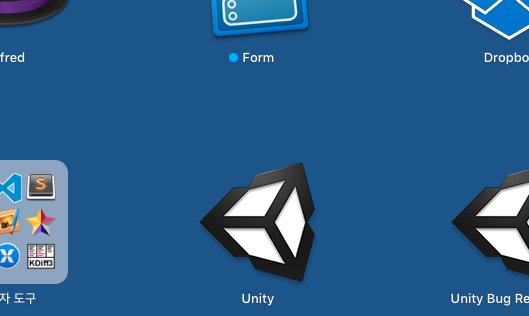

[Up](../index.md)

# 유니티 설치

## 유니티 다운로드

유니티를 사용하기 위해서는 바다와 얼음의 땅을 지나 먼 대륙에서 Unity Download Assistant를 소환해야 합니다. 이 Assistant는 빛을 타고 오며 800kb 이상의 공간을 필요로 하며 윈도우나 macOS에서 설치 할 수 있습니다. Assistant 다운로드는 사파리(Safari)나 익스플로러, 불여우(Firefox), 엣지(Edge), 크롬(Chrome) 같은 웹브라우저를 필요로 합니다.

웹브라우저를 실행하고 주소창에 `unity3d.com`을 입력하고 키보드의 엔터를 누릅니다.

Unity Technologies의 홈페이지가 열리면 ‘Get Unity’를 클릭합니다. 이 책을 쓸 당시에는 이 그림들처럼 보입니다. (유니티의 웹페이지가 변경될  수도 있습니다.)

손가락을 움직여 스크롤하면 Personal 카드에서 ‘Try Personal’ 버튼을 발견할 수 있을 것입니다. 클릭하여 다운로드 페이지로 갑니다.

'Terms of Service'에 서명을 하면, Windows용이나 Mac OS X용을 다운로드 받을 수 있습니다.

웹브라우저의 다운로드 허용을 묻는 대화상자가 표시되고 저장이나 실행을 누르면 다운로드가 시작됩니다.

## 유니티 설치

### macOS 사용자

‘다운로드’ 폴더에서 ‘UnityDownloadAssistant<버전>.dmg‘ 파일을 클릭하여 가상 드라이브를 열어야 합니다.

설치 프로그램이 실행되면 ‘Continue’ 버튼을 반복 클릭하여 설치를 계속 진행 합니다.

macOS에서 설치가 완료되면 Unity Editor가 자동으로 소환 됩니다! 만일 그가 소환되지 않거든 Launchpad에서 ‘Unity’ 앱을 클릭하여 소환하도록 합니다.

