[Up](../index.md)

# 체력 int 타입

## 체력

‘조히비’는 던전의 통로를 걷고 있습니다. 그녀의 체력은 6,252 입니다. 30보쯤 걸으니 어둠속에 거대한 문이 나타났습니다. 막다른 문입니다. 다른 통로는 보이지 않습니다. 조히비는 문의 손잡이를 잡고 밀었습니다.

“크르르르!!!”

거대하고 오싹한 숨결 소리가 들립니다. 어둠속에 거대하고 푸른 형체가 드러냅니다. 드래곤입니다.

“크아악~~~”

드래곤의 입에서 불타 오르는 숨이 조히비를 향해 뿜어져 나옵니다.

“퍽”

아! 조히비는 드래곤의 숨결을 정면으로 맞고 말았습니다. 드래곤의 숨결은 조히비에게 1,200의 데미지를 주었습니다. 불행 중 다행으로 로시의 옷이 데미지를 반으로 줄여 주었습니다. 이제 조히비의 남은 체력은 5,652 입니다.

독자 여러분이 미래에 만드시게 될 게임의 한 장면입니다. 게임 프로그램은 조히비의 체력에서 600을 빼고 5,651를 보관할 수 있어야 합니다.

수 체력은 수(number)로 표시합니다. 그래서 체력을 다룰려면 수(number)를 다룰 수 있어야 합니다. 먼저, 초, 중, 고에서 배운 수의 체계를 되돌아 볼까요?

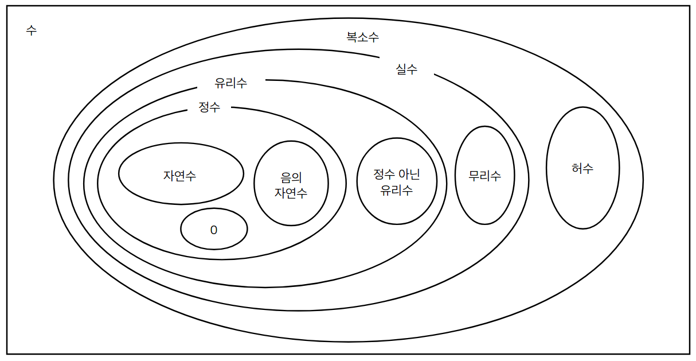

수학…? 다이어그램을 보니 머리가 아픈가요? 많지 않습니다. 이중에서 2가지만 다룰 것입니다.

수에는 복소수(complex number),  허수(imaginary number), 실수(real number), 무리수(irrational number), 유리수(rational number), 정수가 아닌 유리수, 정수(integer), 범자연수(whole number), 자연수(natural number), 0, 음의 자연수… 이런 카테고리가 있습니다. 아마도, 허수와 복소수는 고등학교 과정이고, 나머지가 중학교 과정일 것입니다.

다행하게도 우리는 정수와 실수만을 사용 할것입니다. 자연수, 0, 음의 자연수는 정수로 다룰 수 있고, 유리수, 무리수는 실수로 다룰 수 있죠. 실수, 허수는 복소수(Complex)로 다루는데 이 책에서는 다루지 않습니다. 대부분의 게임 시나리오는 정수와 실수만으로도 충분하니까요. (정확히 C#이 제공하는 기본 수는 무리수를 다룰 수 없습니다. 게임 엔진은 내부적으로 허수를 다룹니다.)

## 데이터 타입

구무친괴 미지인은 주사위 놀이를 하려고 합니다. 각각 10번씩 던지고 나온 점수를 더해서 가장 높은 점수가 나오는 사람이 이기는 놀이 입니다. 주사위는 $\{ 1, 2, 3, 4, 5, 6 \}$ 범위의 데이터가 발생합니다. 10번 던져 모두 더하면 $\{ 10, 11, 12, 13 … 58, 59, 60 \}$ 범위의 데이터를 얻을 수 있습니다. 주사위를 던져 1.5나 3.353 같은 데이터는 나오지 않습니다. 주사위 데이터는 값의 거리가 일정하게 떨어진 이산형(discrete)입니다.

미키언과 히서크는 100미터 달리기를 합니다. 각각 두번 달려서 가장 짧은 시간을 기록한 사람이 이기는 경기이고 기록은 밀리초단위로 재기로 했습니다. 이때 시간 데이터는 12.53, 40.23 처럼 소수점이 필요합니다. 더 정밀하게 초를 잴 수 있다면 13.0304109 처럼 기록하죠. 달리기 기록을 잴때 시간 단위는 연속형(continuous) 데이터 입니다.

이산형 수 데이터를 표현하려면 정수(integer)를 사용할 수 있습니다. 연속형 수 데이터를 표현하려면 실수(real number)를 사용해야 합니다. 만일, 달리기 시간을 정수로 취급하면 초 단위 아래의 정보를 잃어 버리게 됩니다. 미키언의 달리기 기록이 12.3이고, 히서크의 달리기 기록이 12.8인데 이 기록을 정수로 다루면 둘다 12초로 구별이 되지 않게 됩니다. 데이터는 데이터의 의미에 따라 다르게 구별하여 다뤄야 합니다. 이것을 데이터 타입(date type)이라고 합니다.

C#은 여러가지 데이터 타입을 지원합니다. 정수를 다루기 위해 int 타입을 지원하고, 실수를 다루기 위해 float 타입을 지원합니다. 그 밖에 bool 타입, string 타입, long 타입, double 타입, decimal 타입들도 지원합니다. 또한 코드를 작성하여 데이터 타입을 만들 수도 있습니다. 천리 던전도 한 걸음부터죠. 여러분의 레벨에 따라 데이터 타입들을 소개 하겠습니다. 먼저 int 타입을 보겠습니다.

## int 타입

첫번째 수의 종류! 정수를 소개합니다. 정수는 { … -4, -3, -2, -1, 0, 1, 2, 3, 4 … } 처럼 이산형 수 데이터를 표현합니다. 영어로 integer이고 C#에서는 int로 표현 합니다.

그럼 C#에서 정수가 어떻게 사용되는지 프로젝트를 통해 확인해 보겠습니다. 새 프로젝트를 시작합니다. 이전 섹션에서 새 프로젝트를 시작하는 방법을 배우셨죠? 다시 한번 확인해 볼까요? Unity Editor가 실행중이라면 메인 메뉴에서 새 프로젝트를 시작할 수 있도 있고, 아니라면 Unity Editor 앱을 실행하여 시작 할 수 있습니다.

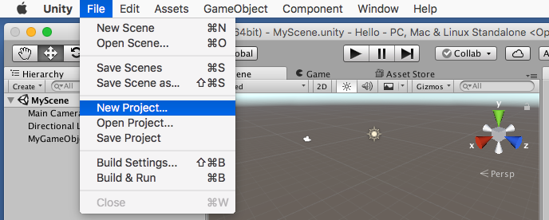

새 프로젝트 이름은 ‘Number‘ 라고 주고 ‘Create project’ 버튼을 눌러 Number 프로젝트를 생성합니다.

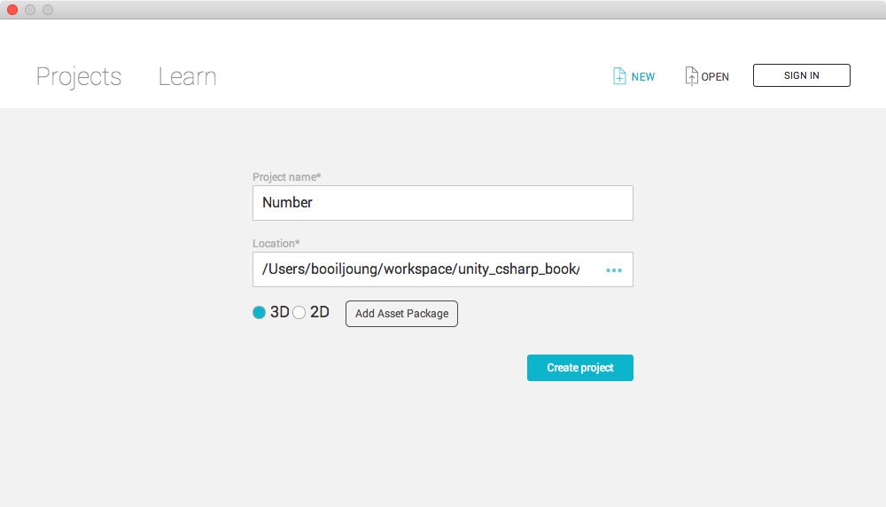

프로젝트가 생성되면 Poject뷰를 통해 ‘MyNumber.cs‘ 라는 이름을 가진 C# 스크립트 애셋을 생성 합니다. Project뷰의 오른쪽 부분 Assets패널에서 마우스 오른쪽 버튼을 클릭하면 팝업 메뉴가 뜨고, 팝업 메뉴에서 ‘Create / C# Script‘를 선택하면 됩니다. C# 스크립트 애셋 파일 생성 방법이 기억나지 않으면 기억나지 않으면 ‘Unity와 인사하기’ 섹션을 참고하세요.

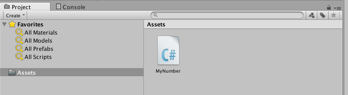

Hierarchy뷰를 통해 씬에 ‘MyGameObject’를 성생합니다. 마우스 오른쪽 버튼을 클릭하면 팝업 메뉴가 나타나고 ‘Create Empty’를 선택하면 ‘GameObject’가 생성되고 키보드 엔터를 쳐서 이름을 변경하면 됩니다.

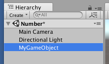

MyNumber 컴포넌트를 ‘MyGameObject’에 추가하겠습니다. Hierarchy뷰에서 ‘MyGameObject‘를 선택합니다. Inspector뷰에서 ‘Add Component ‘버튼을 클릭하여 ‘MyNumber‘ 컴포넌트를 검색하여 추가 합니다.

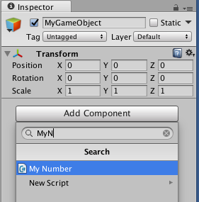

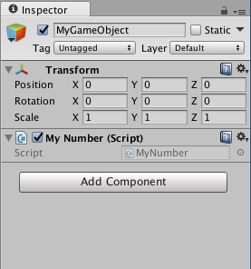

새 프로젝트를 만들었고, 새 씬이 기본으로 추가되었고, 씬이 변경되었습니다. 씬이 변경되면 씬을 저장을 해야 안전합니다. 씬의 저장은 ‘Unity Editor / 메인 메뉴 / File / Save Scenes’에서 선택할 수 있고, 운영체제에 따라 Command+S 또는 Control+S 키보드의 단축키를 누르면 저장할 수 있습니다. ‘Assets’ 폴더에 저장하시면 됩니다. 이렇게 자세히 새 프로젝트 생성을 안내하는 것은 마지막입니다. 다음 예제부터는 짧게 안내하도록 하겠습니다.

새 프로젝트를 연습할 준비가 되었습니다. Project 뷰에서 ‘MyNumber.cs’ C# 스크립트 에셋 파일을 마우스로 더블클릭하면 MonoDevelop 에서 편집할 수 있습니다. 새 소스코드는 아래와 같습니다.

```c#
01	using System.Collections;
02	using System.Collections.Generic;
03	using UnityEngine;
04
05	public class MyNumber : MonoBehaviour {
06    
07	    // Use this for initialization
08	    void Start () {
09        
10		}
11
12		// Update is called once per frame
13		void Update () {
14    
15		}
16	}
```

이전 섹션에서 생성했던 ‘MyHello.cs‘와 비슷하죠?  다만, 5번째 라인의 3번째 단어가 ‘MyNumber’입니다.  이전 예제의 컴포넌트 이름은 ‘MyHello‘였고 이 예제의 컴포넌트의 이름은 ‘MyNumber‘ 입니다.  다시 한번 강조하겠습니다.  C# 스크립트 애셋 파일 이름과 C# 코드 내의 컴포넌트 이름은 반드시 일치해야 합니다! 대소문자까지 일치해야 합니다!

MyNumber 컴포넌트 이름 아래에 Start 메서드가 있습니다.

```c#
08		void Start () {
09        
10		}
```

Start 메서드에 새 코드를 추가하겠습니다. 최종 소스 코드는 아래와 같습니다.

```c#
01	using System.Collections;
02	using System.Collections.Generic;
03	using UnityEngine;
04
05	public class MyNumber : MonoBehaviour {
06    
07		// Use this for initialization
08		void Start () {
09			int a;
10			a = 100;
11			Debug.Log(a);      
12		}
13
14		// Update is called once per frame
15		void Update () {
16
17		}
18	}
```

9, 10 , 11번 라인이 새로 삽입되었습니다.

정확히 타이핑 했는지 확인하세요. 대문자, 소문자, 공백, 기호, 모두 일치해야 합니다. 문의 끝은 세미콜론으로 마쳐야 합니다. 정확히 타이핑 했으면 저장을 합니다. macOS에서 저장 단축키는 Command+S기고 윈도우에서는 Control+S 입니다. 문자 입력기가 한국어 모드이면 단축키가 반응하지 않습니다. 반드시 영어 모드로 바꾸고 단축키를 눌러 저장해야 합니다!

다시 Unity Editor로 돌아가서 Statusbar를 확인할까요? Statusbar에 에러 메시지가 있습니까? 붉은색으로 에러 메시자가 있으면 이전 섹션에서 학습한 내용에 따라 Console뷰를 확인하여 에러의 원인을 찾아 정확히 고쳐야 합니다. Statusbar에 에러 메시지가 없으면 Toolbar에서 플레이 버튼을 클릭하여 실행하고 Console뷰를 확인합니다.

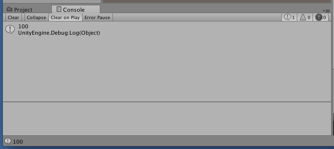

Console뷰에 숫자 ‘100‘이 표시되었으면 성공입니다. 표시되지 않았다면 오류가 있거나 MonoDevelop에서 저장이 되지 않은 것입니다. C# 스크립트가 변경되면 반드시 저장해야 Unity Editor에 반영 됩니다.

이전 섹션에서 우리는 “Hello, Dungeon”를 표시하여습니다. 이번 섹션에서는 숫자 100을 표시하고 있습니다. 우리가 추가한 코드는 아래 코드가 아닙니다.

```c#
			Debug.Log("100");
```

아래 코드처럼 3개 라인입니다.

```c#
09			int a;
10			a = 100;
11			Debug.Log(a);
```

여러 줄의 코드는 위에서 아래 방향으로 순서대로 실행 됩니다.

```c#
09			int a;			// 1st
10			a = 100;		// 2nd
11			Debug.Log(a);	// 3rd
```

이전 섹션에서 프로그램 소스코드는 머리로 읽고 실행해 볼 수 있어야 한다고 했죠? 1개 라인씩 읽고 추적하며 소스코드의 동작을 읽어 보겠습니다.

---

#### 자연어의 형태소, 프로그래밍 언어의 토큰:

우리가 일상에서 사용하는 언어를 자연어라고 합니다. 자연어 문장 하나를 볼까요?

“To be or not to be, that is question”

영국의 대문호 세익스피어의 햄릿 제3장에 나오는 유명한 대사입니다. 이 대사에는 9개의 형태소가 문법(syntax)에 따라 조합되어 햄릿의 의사를 전달하고 있습니다.

프로그래밍 언어로 작성된 소스 코드도 마찬가지 입니다. 여러개의 형태소가 조합되어 하나의 문(statement)이나 식(expression)을 이룹니다. 자연어의 형태소를 프로그래밍 언어에서는 토큰(token)이라 합니다. 프로그래밍 언어의 토큰들이 약속에 의해 조합되며, 그 약속을 구문(syntax)라고 합니다.

---

## int 타입 변수

Start 메서드의 첫번째 라인을 보겠습니다.

```c#
09			int a;
```

첫번째 토큰은 int 입니다. 이 int는 C#에서 정수(integer)를 나타내는 데이터 타입 입니다. 수학에서 정수란 자연수, 0, 그리고 음의 자연수로 이루어진 수라고 했죠?  C#에서 정수를 나타내는 int 타입도 자연수, 0, 음의 자연수를 표현합니다. 다만,  컴퓨터는 물리적 제약으로 범위가 제한되어 있습니다. 수학은 음수와 양수 방향이 무한이지만, C#의 int 타입은 -2,147,483,648 ~ 2,147,483,647 범위입니다.

int 타입 다음에 a 가 있습니다.  이 a 는 이름(식별자)입니다. 이름은 누군가 정하죠. 이 a는 제가 정한 이름입니다. b 로 정할 수 도 있고, c로 정할 수도 있는데 a로 정했습니다.

첫번째 라인을 자세히 볼까요?

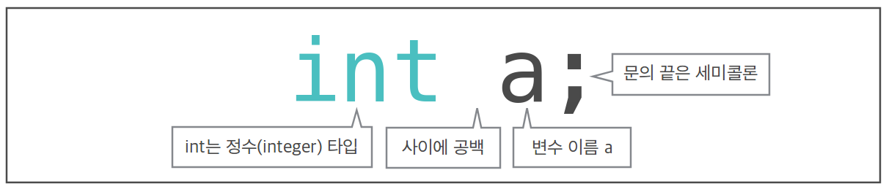

이 문은 int 타입을 담는 변수(variable) a를 만듭니다.

---

#### 변수가 무엇인가요?:

히서크는 마을 은행의 창구에서 일합니다. 어느 날 던전에서 돌아온 미키언이 히서크의 은행에 찾아와 계좌를 만들어 달라고 합니다. 히서크는 창고에서 유리상자 하나를 꺼냈습니다. 히서크는 유리상자 겉에 “mikian”라는 이름을 주고, 다른 유리상자가 가득한 선반에 올려둡니다.

다음날 미키언이 다시 왔습니다. 미키언은 1,000뮤을 입금하려고 합니다. 히서크는 “mikian” 이름이 있는 유리상자에 미키언을 안내합니다. 미키언은 쪽지에 ‘1,000뮤’를 써서 다시 유리상자에 넣었습니다.

다음날 미키언이 또 왔습니다. 미키언은 잔고가 궁금했던거죠. 유리상자 안의 쪽지는 밖에서 볼 수 있습니다. 미키언은 “mikian”이 있는 유리상자 속의 쪽지를 읽고 잔고 1,000뮤가 있다는 것을 알았습니다. 미키언이 200뮤를 꺼내기 위해 쪽지을 800으로 고치고 다시 유리상자에 넣었습니다.

예. 변수는 이 유리상자와 같습니다. 어떤 값을 넣을 수 있고, 쪽지를 꺼내지 않고 들여다 볼 수 있고, 쪽지를 꺼내 내용을 변경하고 다시 보관 할 수 있습니다.

이 섹션의 첫 이야기에서 조히비의 체력은 6,252 로 시작하였습니다. 드래곤의 파이어 브레스에 공격 당해 체력이 5,652로 떨여졌죠. 처음에 조히비의 체력 변수는 6,252을 가지고 있었습니다. 드래곤 파이어 브레스에 공격 받아 체력이 떨어지면, 변수를 읽어서 데미지 만큼 600을 빼고 , 다시 변수에 보관합니다. 변수에 보관된 체력가 0이 되면 패배 판정을 합니다.

변수는 변경 할 수 있는 데이터를 보관하기 위해 사용됩니다. 변수의 다른 개념으로 변경할 수 없는 상수(constant)가 있습니다. 상수는 레벨에 따라 나중에 보겠습니다.

---

숫자가 적힌 유리상자는 컴퓨터의 메모리에 위치합니다.

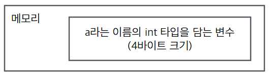

메모리에 a라는 이름(식별자)의 int 타입을 담을 수 있는 변수가 만들어졌습니다. 변수를 만드는 구문(syntax)를 일반화하여 볼까요?

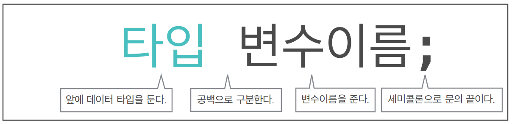

이 구문만 따르면 컴퓨터 메모리에 변수를 만들게 됩니다. 예를 들어 보겠습니다.

```c#
int c;			// 메모리에 c라는 이름(식별자)을 가진 int 타입 변수를 알립니다.
int digit;		// 메모리에 digit라는 이름(식별자)을 가진 int 타입 변수를 알립니다.
int network;	// 메모리에 network라는 이름(식별자)을 가진 int 타입 변수를 알립니다.
```

변수를 만드는 구문(syntax) 순서와 토큰만 지키면 됩니다. 토큰 사이의 공백은 1개 이상이면 됩니다. 아래 예제 코드는 모두 동일하게 a라는 이름의 int 타입 변수를 만듭니다.

```C#
	int		a;	// 여러개의 공백이 있어도 문제 없다. 다만 알아보기 어렵다.
		int      a      ;	// 세미콜론 이전에 공백이 있어도 문제 없다. 다만 알아보기 어렵다.
	int				// 여러줄에 써도 문제 없다. 다만 알아보기 어렵다.
			a
	;
```

이상, int 타입 변수 a를 선언(declaration)하는 첫 라인을 읽어 보았습니다.

---

## 대입문

두번째 라인을 보겠습니다.


이 라인은 대입문입니다. 대입이란 쪽지에 숫자를 적어 유리상자에 넣는 동작입니다.

첫번째 토큰 a는 첫 라인에서 정의된 변수 이름(식별자)입니다.

두번째 토큰은 ‘=‘ 입니다. 대입연산자(assign operator)죠. 대입연산자는 연산자의 우측에 있는 것을 연산자 좌측에 넣습니다. 그래서 대입연산자 ‘=‘ 의 좌측에는 반드시 데이터를 담을 수 있는 변수를 두어야 합니다. 이 식의 좌측에는 a라는 변수를 두었습니다. 대입 연산자의 우측에는 반드시 식(expression)이 와야 합니다.

---

#### 주의

대입연산자는 같음 연산자(equality operator)와 표기법이 다릅니다! C# 에서 같음 연산자는 ‘==‘ 로 두개를 붙여서 표현합니다.

---

세번째 토큰을 볼까요? 고정된 값 100 입니다. 정수 100을 표현하고 있습니다. 이 문은 ‘변수 a 에 100을 담아라‘는 동작입니다.  실행되면 아래와 같이 됩니다.

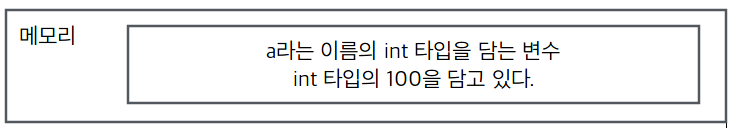

대입문에서 대입연산자 주변의 공백은 있으나 없으나 같습니다. 아래의 대입문은 모두 같은 동작을 합니다. 보기 편하고 팀이 기준을 함께 작업하면 기준을 정하면 좋습니다.

```c#
	a = 100;	// 공백이 양쪽에 모두 있어도 됩니다.
	a=100;		// 공백이 없어도 동일합니다.
	a  =100;	// 앞에 공백을 2개씩 두어도 동일합니다.
	a			// 여러 라인에 걸쳐도 잘 동일합니다. 다만 사람이 읽기가 어렵습니다.
		=
	100;
```

세번째 라인을 확인해 보겠습니다.

```c#
11			Debug.Log(a);
```

‘Hello 프로젝트‘에서 비슷한 코드를 보았죠?

```c#
09		Debug.Log(”Hello, World”);
```

Hello프로젝트는 “Hello, World”라는 메시지를 표시했습니다. 이 Number 프로젝트는 변수 a를 Console 뷰에 표시합니다.

```c#
11		Debug.Log(a);
```

그래서 Console뷰에 변수 a가 가지고 있는 값 100을 표시하게 됩니다.


## 식

Start 메서드의 두번째 라인 대입문을 다시 보겠습니다.

```c#
10			a = 100;
```

대입연산자(assign operator)의 좌측에 반드시 변수가 있어야 한다고 했죠? 대입식의 우측은 반드시 식(expression)이 와야 합니다.

왜 우측에 식이 와야할까요?

대입(assign)은 좌측의 변수에 우측의 ‘값’을 넣는 동작입니다. 그래서 우측의 실행 결과는 반드시 값입니다.

실행 결과가 값인 것을 식(expression)이라고 합니다. 이 코드의 우측에는 100이라는 값 하나 뿐인데 식일까요? 식은 식의 구성이 어떻든 결과 값이 있으면 식입니다. C#의 식이란 결과적으로 값을 만들어 낼 수 있는 코드 조각입니다. 100이라는 리터럴 하나도 100이라는 값을 만들어 내고 있으므로 식입니다.

## 예약어

Start 메서드의 첫번째 라인 변수정의문을 다시 볼까요?

```c#
09			int a;
```

첫번째 토큰 int는 C#에서 정수 타입 데이터를 사용할 수 있도록 합니다. C# 언어를 만든 연구자들과 엔지니어들이 미리 int라는 이름을 정해 두었죠. 이들이 미리 만들어 둔 이름들을 예약어(keyword)라고 합니다. C#의 예약어는 아래와 같습니다. 한번 읽어 보세요.

```
abstract	as			base		bool		break
byte		case		catch		char		checked
class		const		continue	decimal		default
delegate	do			double		else		enum
event		explicit	extern		false		finally
fixed		float		for			foreach		goto
if			implicit	in			int			interface
internal	is			lock		long		namespace
new			null		object		operator	out
override	params		private		protected	public
readonly	ref			return		sbyte 		sealed
short		sizeof		stackalloc	static		string
struct		switch		this		throw		true
try			typeof		uint		ulong		unchecked
unsafe		ushort		using		virtual		void
volatile	while

```

MonoDevelop에서 예약어는 하늘색으로 표시되고 예약어가 아닌 것과 구분할 수 있습니다.

## 식별자

다시 코드를 보겠습니다.

```c#
09			int a;
```

두번째 토큰 a 는 제가 변수의 이름을 위해 임의로 정했습니다. b나 c로 정할 수 있는데 a로 정했다고 했죠?  독자도 변수 이름을 임으로 정할 수 있습니다. 이것을 식별자(identifier)라고 합니다.  식별자는 소스코드 내에서 다른 식별자나 예약어를 구별하는 역할을 합니다. 식별자의 이름은 임으로 정하되 목적에 맞게 다른 식별자나 예약어를 구분할 수 있게 중복되지 않은 이름을 주어야 합니다. 식별자의 이름을 정하는 규칙이 있습니다.

- 예약어가 아니어야 한다.
- 언더스코어(underscore)
- _나 영어 알파벳, 숫자, 유니코드를 사용할 수 있다.
- 첫 문자는 반드시 언더스코어나 영어 알파벳으로 시작해야 한다.
- 두번째 문자부터 숫자를 사용할 수 있다.
- 영어 알파벳, 숫자, 언더스코어를 혼합하여 사용할 수 있다.

사실 이 제약 표현은 정확하지 않습니다.  스코프나 유니코드, 축자 식별자를 사용할 수 있지만 지금 학습 레벨은 이 제약만으로도 충분 합니다.

바른 식별자의 예시들을 들어 보겠습니다.

```c#
a			a25			A			Camel		_bus
WorldMouse	C_205__		my_book		int_group	_k_25_b_26
world_mouse	vector		matrix		identity	multiply
```

잘못된 식별자에 대한 예시들을 들어 보겠습니다.

```
25a			숫자로 시작할 수 없습니다.
36			숫자는 식별자가 아닙니다. 이것은 정수 리터럴입니다.
int			C#의 예약어입니다. 정수 타입이죠.
foreach		C#의 예약어입니다.
four=5		연산자는 사용할 수 없습니다. four라는 변수에 5를 대입하라는 식이 되어 버립니다.
three+two	연산자는 사용할 수 없습니다. three라는 변수와 two라는 변수를 더하라는 식이 되죠.
rainy day	공백(whitespace)을 사용할 수 없습니다. 두개의 다른 식별자인데 에러가 발생합니다.
```

잘못된 식별자를 사용하면 컴파일러 오류를 발생하거나 오동작을 하게 됩니다.

식별자는 그 의미이나 역할, 동작, 상태를 정확히 나타낼 수 있으면 좋습니다.

```
sum			합계.
Person		개인.
students	학생들(집합).
account		계정.
Fire		발사.
Remove		제거하다.
Vector3		3차원 벡터.
Matrix44	4x4 행렬.
rotation	회전
alive		살아있는
broken		깨진
rainy_day	비오는 날
Debug		디버그. Unity에 포함된 식별자와 중복됩니다. 식별자 중복 문제에 대해 별도로 다루게 됩니다.
```

이 섹션에서는 int 형식과 변수, 리터럴 변수 정의문과 대입식 예약어와 식별자 에 대해 배웠습니다. 여기까지 프로젝트 파일은 Number 폴더에 있습니다.

